# [HackTheBox - TrueSecrets](https://app.hackthebox.com/challenges/TrueSecrets)
Created: 21/07/2024 18:31
Last Updated: 21/07/2024 21:42
***
**DIFFICULTY**: Easy
**CATEGORY**: Forensics
**CHALLENGE DESCRIPTION** 
Our cybercrime unit has been investigating a well-known APT group for several months. The group has been responsible for several high-profile attacks on corporate organizations. However, what is interesting about that case, is that they have developed a custom command & control server of their own. Fortunately, our unit was able to raid the home of the leader of the APT group and take a memory capture of his computer while it was still powered on. Analyze the capture to try to find the source code of the server.
***
## Volatility Time
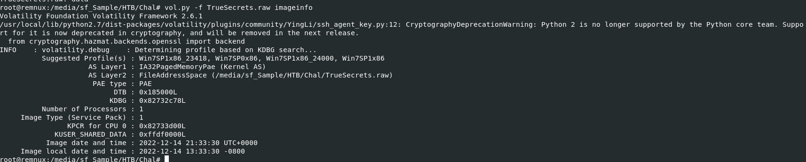

We already know that we got a memory capture of C2 server so lets determine which volatility profile to use with `vol.py -f TrueSecrets.raw imageinfo`

And the result show us that this C2 was running on Windows

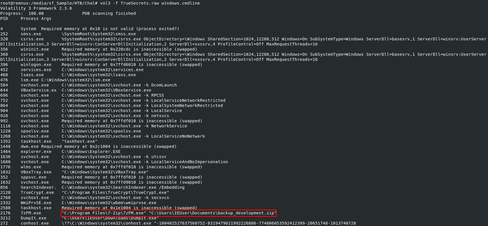

So I used `vol3 -f TrueSecrets.raw windows.cmdline` to display all command line arguments of each process that were running on that machine when this memory image was taken and we can see that `7zFM.exe` was compressed `backup_development.zip` which should be a file that we are after

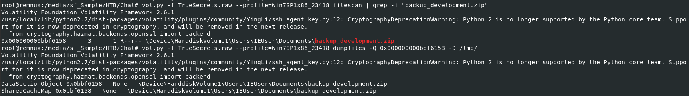

So I used `vol.py -f TrueSecrets.raw --profile=Win7SP1x86_23418 filescan | grep -i "backup_development.zip"` to determine if a file can be dumped from this memory dump and we can also see physical address of this file on this memory image which we can dump it with `vol.py -f TrueSecrets.raw --profile=Win7SP1x86_23418 dumpfiles -Q 0x000000000bbf6158 -D /tmp/`

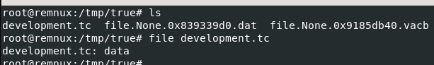

After unzip a file, we will have this TrueCrypt volume file before we get into an actual script of this C2 server

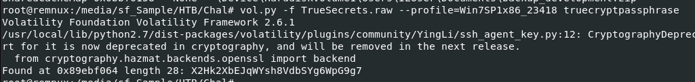

But we also have to get TrueCrypt password from this memory image first with `vol.py -f TrueSecrets.raw --profile=Win7SP1x86_23418 truecryptpassphrase` and now, we are ready to recover files

## Truecrypt File Recovery
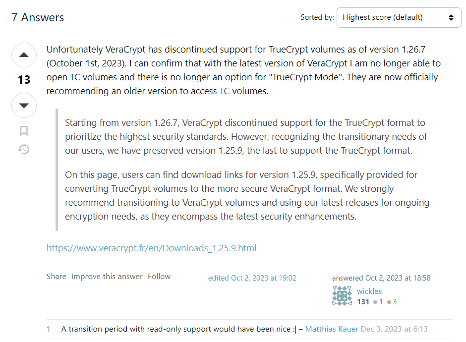
We can use Veracrypt to decrypt and mount TrueCrypt but there is a problem here, if you are using [Veracrypt version 1.26.7 or above then TrueCrypt decryption will not be there](https://superuser.com/questions/1210798/can-veracrypt-open-an-old-truecrypt-container) so we have to use [VeraCrypt 1.25.9](https://www.veracrypt.fr/en/Downloads_1.25.9.html) or below when TrueCrypt was still supported

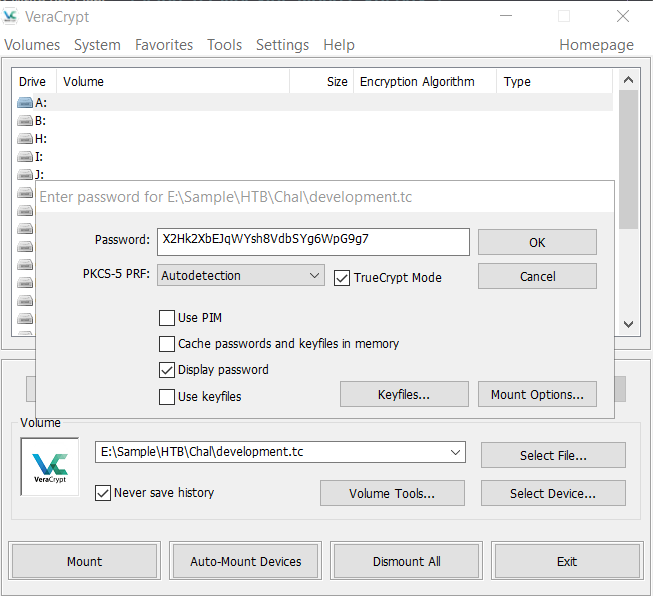

Using passphrase we got to mount it to our local drive

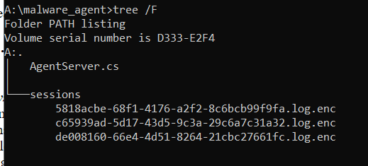

After mounting, we finally have a script that running on C2 server and log file that was encrypted in `sessions` folder 

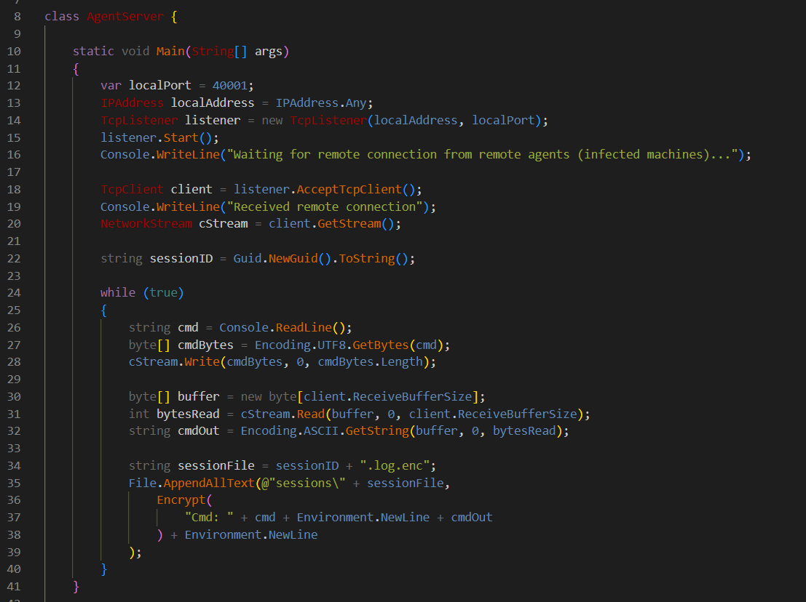

Lets examine `AgenServer.cs`, it will receive a connection on port 40001 and if there is any infected machine successfully connected to this server then `sessionID` will be generated and it will wait for command on console to send to infected system, then infected system will also send response of that command back to this server and will be logged to log file respectively created for each `sessionID` and this log file will also be encrypted so a flag might be in 1 of 3 log files that we found earlier

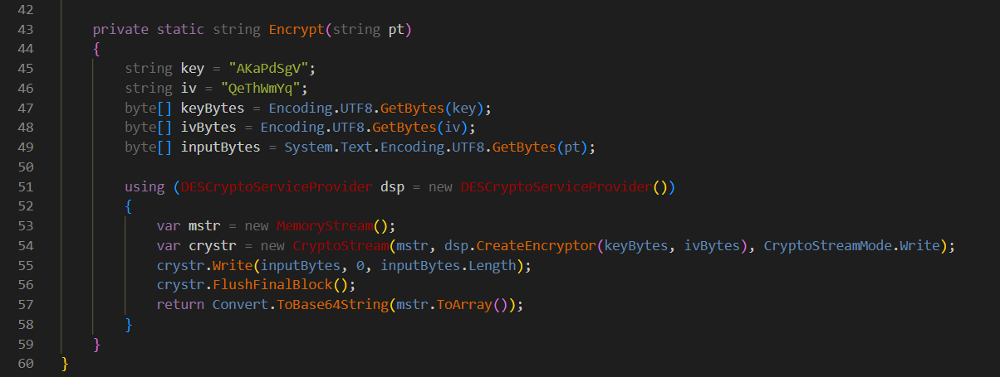

Now lets take a look at `Encrypt` function, it seems like this server is using DES to encrypt message then encode with base64 which luckily for us that we can get `key` and `iv` here so lets use CyberChef to get a flag

- `5818acbe-68f1-4176-a2f2-8c6bcb99f9fa.log.enc`
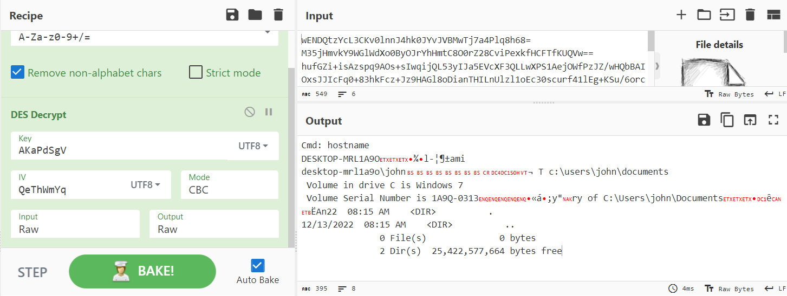
- `c65939ad-5d17-43d5-9c3a-29c6a7c31a32.log.enc`
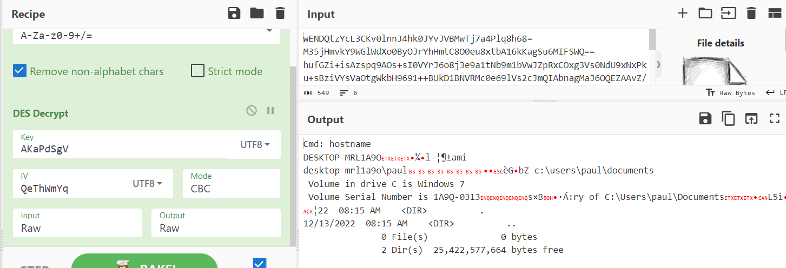
- `de008160-66e4-4d51-8264-21cbc27661fc.log.enc`
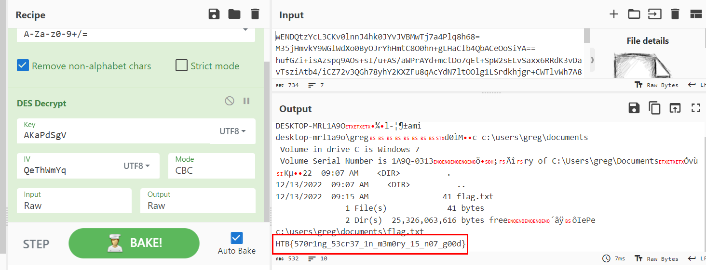

## Submit the flag

```
HTB{570r1ng_53cr37_1n_m3m0ry_15_n07_g00d}
```

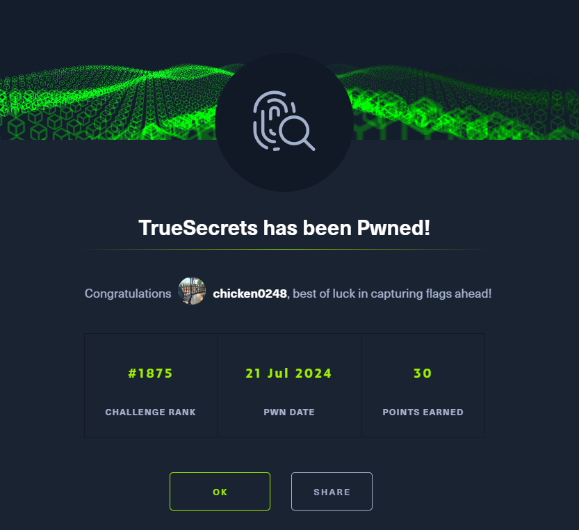
***

