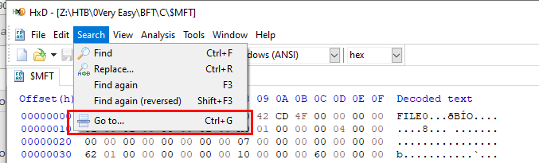

# [HackTheBox Sherlocks - BFT](https://app.hackthebox.com/sherlocks/BFT)
Created: 19/05/2024 16:42
Last Updated: 19/05/2024 17:44
* * *


**Scenario:**
In this Sherlock, you will become acquainted with MFT (Master File Table) forensics. You will be introduced to well-known tools and methodologies for analyzing MFT artifacts to identify malicious activity. During our analysis, you will utilize the MFTECmd tool to parse the provided MFT file, TimeLine Explorer to open and analyze the results from the parsed MFT, and a Hex editor to recover file contents from the MFT.

* * *
>Task 1: Simon Stark was targeted by attackers on February 13. He downloaded a ZIP file from a link received in an email. What was the name of the ZIP file he downloaded from the link?


Open cmd or terminal with administrator privilege `MFTECmd.exe -f $MFT --csv Output` then use Timeline Explorer or CSV Viewer to open an output file

Search for either ".zip" extention or "Downloads" folder then you will find it on simon's Download folder
```
Stage-20240213T093324Z-001.zip
```

>Task 2: Examine the Zone Identifier contents for the initially downloaded ZIP file. This field reveals the HostUrl from where the file was downloaded, serving as a valuable Indicator of Compromise (IOC) in our investigation/analysis. What is the full Host URL from where this ZIP file was downloaded?


Read content inside Zone Identifier which can be read directly from an output file, there you can see its from googleapis
```
https://storage.googleapis.com/drive-bulk-export-anonymous/20240213T093324.039Z/4133399871716478688/a40aecd0-1cf3-4f88-b55a-e188d5c1c04f/1/c277a8b4-afa9-4d34-b8ca-e1eb5e5f983c?authuser
```

>Task 3: What is the full path and name of the malicious file that executed malicious code and connected to a C2 server?


You can see that there is a folder under "Stage-20240213T093324Z-001" which should be a folder after extracting zip file and inside of it also have a second zip file but in that file contain `invoice.bat` file which totally look out of place here
```
C:\Users\simon.stark\Downloads\Stage-20240213T093324Z-001\Stage\invoice\invoices\invoice.bat
```

>Task 4: Analyze the $Created0x30 timestamp for the previously identified file. When was this file created on disk?


```
2024-02-13 16:38:39
```

>Task 5: Finding the hex offset of an MFT record is beneficial in many investigative scenarios. Find the hex offset of the stager file from Question 3.


To calculate hex offset we need to multiply entry number with 1024 (byte) then change it to hexademical

use your calculator, its has a built-in programmer calculator for this kind of job.
```
16E3000
```

>Task 6: Each MFT record is 1024 bytes in size. If a file on disk has smaller size than 1024 bytes, they can be stored directly on MFT File itself. These are called MFT Resident files. During Windows File system Investigation, its crucial to look for any malicious/suspicious files that may be resident in MFT. This way we can find contents of malicious files/scripts. Find the contents of The malicious stager identified in Question3 and answer with the C2 IP and port.


Open `$MFT` file using your prefered Hex Editor, mine is HxD then Go to an offset that we just calculated from previous question

Scroll down for a bit then you will see content of this malicious script
```
43.204.110.203:6666
```


* * *
