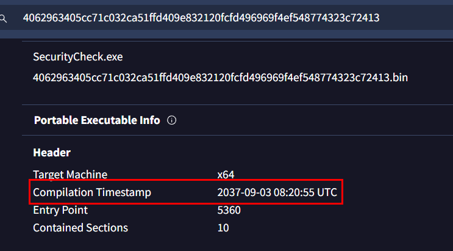

# [HackTheBox Sherlocks - BOughT](https://app.hackthebox.com/sherlocks/BOughT)
Created: 27/07/2024 13:21
Last Updated: 27/07/2024 21:34
* * *

**Scenario:**
A non-technical client recently purchased a used computer for personal use from a stranger they encountered online. Since acquiring the computer, the client has been using it without making any changes, specifically not installing or uninstalling any software. However, they have begun experiencing issues related to internet connectivity. This includes receiving error messages such as "Server Not Found" and encountering difficulties with video streaming. Despite these problems, checks with the Windows Network Troubleshooter indicate no issues with the internet connection itself. The client has provided a memory image and disk artifacts for investigation to determine if there are any underlying issues causing these problems.

* * *
>Task 1: What is the best volatility profile match for the memory image?


We can use `vol.py -f memdump.mem imageinfo` to let volatility suggest which profile is the best for this memory image and with this plugin, we can also get an answer of second task too (date and time when this memory image was captured)

```
Win10x64_19041
```

>Task 2: When was the image captured in UTC?
```
2023-08-07 21:28:13
```

>Task 3: Check running processes and confirm the name of the suspicious running process.

From the scenario, we would expect something from Startup folder, Schedule task or something like that.


After examined the result of `vol.py -f memdump.mem --profile=Win10x64_19041 pstree`, we can see that there is a suspicious process called `SecurityCheck.exe` that under `explorer.exe`.


We can use `vol.py -f memdump.mem --profile=Win10x64_19041 cmdline` to see all command line arguments of each running processes at the time which we can see that this file / process is the one we are looking for since its in start up folder 

```
SecurityCheck.exe
```

>Task 4: What is the full path of malicious process?
```
C:\ProgramData\Microsoft\Windows\Start Menu\Programs\StartUp\SecurityCheck.exe
```

>Task 5: What is the sha256 value of the malware?


We do not need to dump that file from memory image since we have disk image of this system so lets go to that path, export it out and use your favorite way to get sha256 hash

```
4062963405cc71c032ca51ffd409e832120fcfd496969f4ef548774323c72413
```

>Task 6: What is the compilation timestamp for the malware?



We got the hash, so lets search it on VirusTotal and get an answer from this section

Then we can see it right away that whoever compiled this file is also messed with compilation timestamp since there is no way that this file is compiled on 2037

```
2037-09-03 08:20:55
```

>Task 7: What is the name of the mutex that the malware creates?


An easy way to answer this task is to go to "Behavior" tab and go to "Mutexes Created" then we will have an answer of right there

```
config_m2
```

***Note***: Another way to solve this one is to decompile an executable file and find `CreateMutexA` function called

>Task 8: At the top of main function which anti-debugging function is being used?


From Behavior tab, we can see that `IsDebuggerPresent` was called so it might be the one we are looking for but lets confirm it when decompiled this executable file 


Then we can see it that inside this function (I think this function should be a `main` function so I'll call this one `main` from now on), it initializes and hides the console window then creates a mutex as we found earlier 

Then it will sleep for 15 minutes before checking if a debugger is presented and it will exit if `IsDebuggerPresent` returns `true`

```
IsDebuggerPresent
```

>Task 9: How many minutes does the malware sleep before calling above anti- debugging function?
```
15
```

>Task 10: This malware uses DGA, how many unique C2 domains in total is this DGA capable of generating?

After reviewing the code for a while, we will eventually found that `FUN_0040254e()` is the one responsible for domain generation and here is the code I asked ChatGPT to convert it to python


We can see that it will initialize constants consist of 9 unique characters then it will use `seed` (which will derive from  `srand` and `time`) before loop to generate 6 characters string (which will be domain concatenate with `http://` and `.xyz`) but the index 2 is 0 so it will randomly generate just 5 characters 

So the combination of all unique domains will be 9 Power of 5 which is 9 x 9 x 9 x 9 x 9 = 59049
```
59049
```

>Task 11: How many unique C2 domains start with “rb”?

In this case, we already got 3 characters from domain (`rb0___.xyz`) which left us with 3 characters to be randomized

The answer of this task is 9 Power of 3 = 9 x 9 x 9 = 729

```
729
```

>Task 12: How many unique C2 domains end with “rla”?

On this one, we only have 2 characters to be randomized (`__0rla.xyz`)
Which mean its just 9 x 9 = 81
```
81
```

>Task 13: Which file is being used to store active C2 domain?


Inside `main`, you can see that there are 2 files that are opened and created if not exists so lets inspect each of them first before come back to know how this malware gonna do to them


`win.ini` stored a single domain


While `config.ini` stored base64 string


Then after coming back to `main` function, there is a function called `FUN_004016f4()` (which I will named it `connectC2`) that check internet connection to domain in `win.ini` then it will decode base64 from `config.ini` as pass it to another function which will handle decoded output and proceed with another operation

***NOTE***: `connectC2` function image was captured after I'm done renaming all function that making sense for me so you might find some functions does not have the same name as you decompiled in on Ghidra

```
C:\Users\Public\Documents\win.ini
```

>Task 14: Which file is being used to store commands from the C2 server?


We know that base64 string inside `config.ini` will be decoded and processed but lets decode it ourselves first 


We can see that this output consists of 3 different values
- the first one is an url
- the second one is an integer
- and the final one is UNIX timestamp


So if we get into a function that will decode this base64 and follow it, we will eventually see that `local_40` stores returns values of `base64decode` function then if its not null then it will send that values to `FUN_00402265` (lets call it `process_base64_output`)


And then it will separate value into 3 parts then proceed to call another function with is `FUN_0040211d` (which i will name it `ddos_attack` because it is a function that designed to do this kind of attack)

```
C:\Users\Public\config.ini
```

>Task 15: What was the active C2 FQDN at the time of artifact collection?
```
http://cl0lr8.xyz
```

>Task 16: How many kinds of DDoS attacks can this malware perform?


Inside `FUN_0040211d` or `ddos_attack` function, we can see that it will check for parameter 2 (integer) and parameter 3 (UNIX timestamp)

first condition will check if UNIX timestamp is lower than `local_18` and if its lower then this function will return with `local_18` (this condition is checking for expiration date of an attack)


While the other 2 conditions will check if parameter 2 is `1` or `2`, if its `1` then it will execute system command but if its `2` then it will send request to targeted URL (parameter 1) for 20 times before sleeping then send requests again until parameter 2 is no longer be a `2`


Here is a function that will send request to targeted url


Here is the summary of this function

```
2
```

>Task 17: What is the FQDN of the target website.
```
http://nbscl231sdn.mnj
```

>Task 18: What was the expiration date for the active attack at the time of artifact collection in UTC?


We can convert UNIX timestamp with "From UNIX Timestamp" recipe on [CyberChef](https://cyberchef.org/) 


Or we can use [Epoch Converter](https://www.epochconverter.com/) that especially designed for this

```
2023-08-31 11:45:58
```

>Task 19: How many GET requests does the malware perform against target domain before sleeping for a while?
```
20
```

>Task 20: There seems to be another attack method with ICMP requests. How many of these requests can the malware send before sleeping for a while?


Inside `ddos_attack` function, we can see that if `parem_2==1`, then it will execute system command and after making some sense from it then we will have `ping -c 16 parem_1` which is a ping command that will send ICMP packets to target for 16 times

```
16
```

>Task 21: Is this malware prone to Botnet hijacking?
```
Yes
```


* * *
