# [HackTheBox Sherlocks - Bumblebee](https://app.hackthebox.com/sherlocks/Bumblebee)
Created: 21/05/2024 01:04
Last Updated: 21/05/2024 09:37
* * *

**Scenario:**
An external contractor has accessed the internal forum here at Forela via the Guest Wi-Fi, and they appear to have stolen credentials for the administrative user! We have attached some logs from the forum and a full database dump in sqlite3 format to help you in your investigation.

* * *
>Task 1: What was the username of the external contractor?

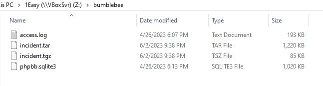
We got access.log and phpbb.sqlite3 which could be opened with DB Browser for SQLite

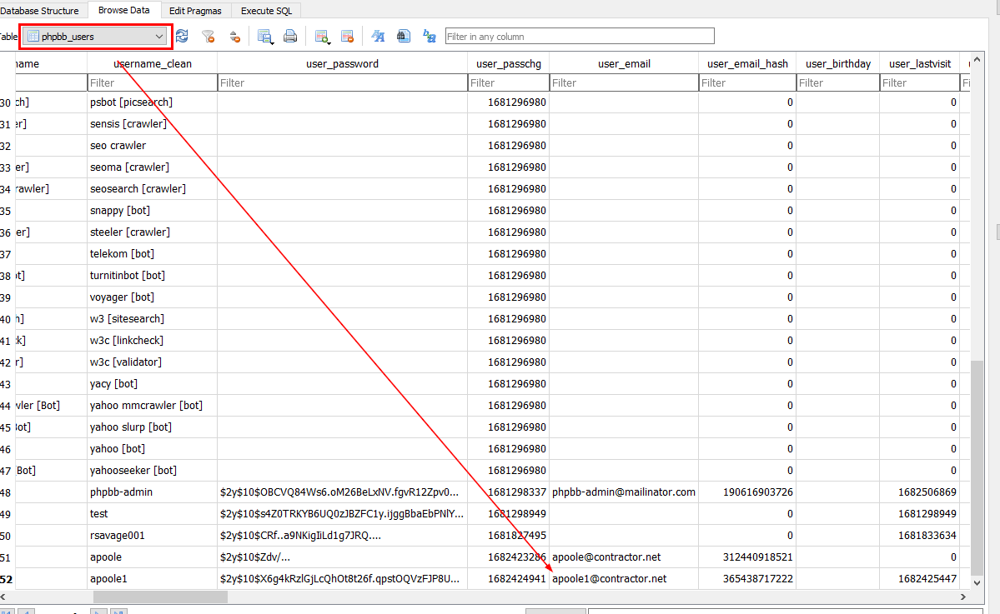
After opened database file, we can lookup the infomation about all users in "phpbb_users" table
```
apoole1
```

>Task 2: What IP address did the contractor use to create their account?

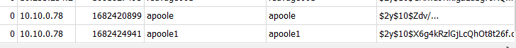
We can get this information from the same "phpbb_users" table too
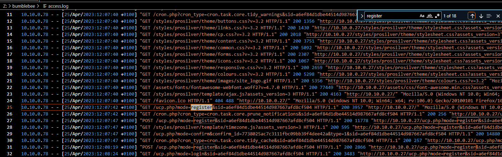
just in case, I searched for "register" on access.log and it still landed me with the right answer
```
10.10.0.78
```

>Task 3: What is the post_id of the malicious post that the contractor made?

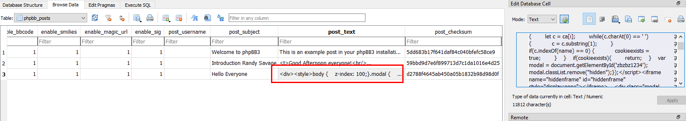
Go to "phpbb_posts" table, then you can see that this forum has only 3 posts

I didn't see any problem from first and second post but I found strange Javascript on the last one 
```
9
```

>Task 4: What is the full URI that the credential stealer sends its data to?

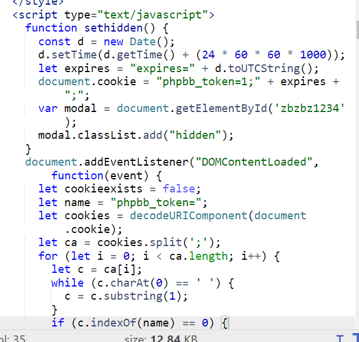
After beautify a script, I can finally see the problem here
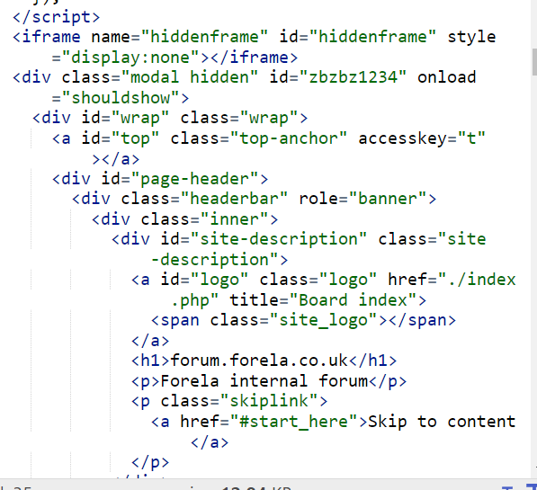
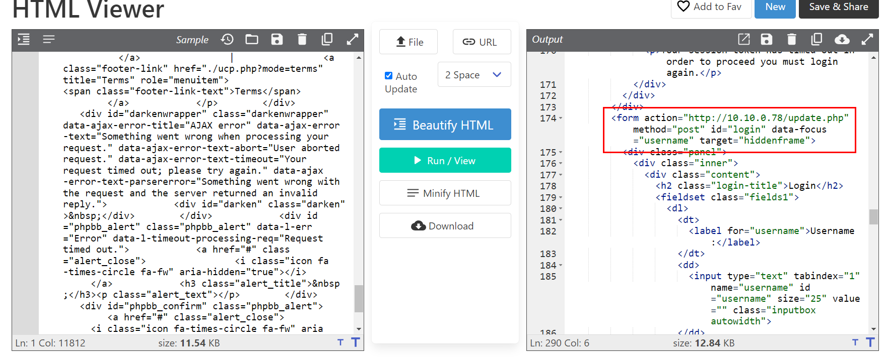

Its a script to steal user credentials by setting cookie, add event listener and hidden frame then when user submit that user cretential, it will use HTTP POST method and send them to /update.php which hosted on a contractor machine
```
http://10.10.0.78/update.php
```

>Task 5: When did the contractor log into the forum as the administrator? (UTC)

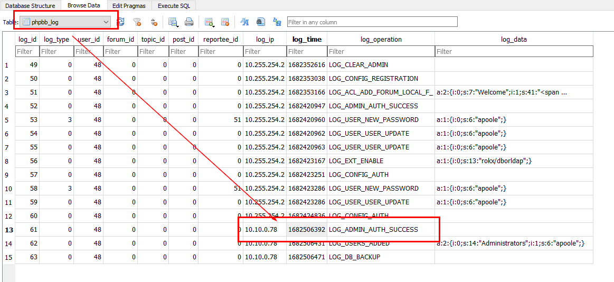
We can retrieve forum log in "phpbb_log" table then we will get those events associated with the contractor here started from Login as admin successfully to back up forum database
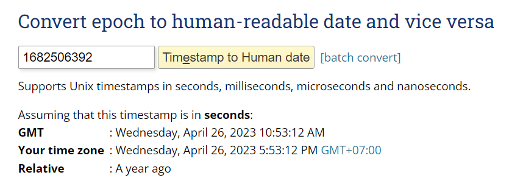
Use [epochconverter](https://www.epochconverter.com/) to convert UNIX timestamp to UTC/GMT
```
26/04/2023 10:53:12
```

>Task 6: In the forum there are plaintext credentials for the LDAP connection, what is the password?

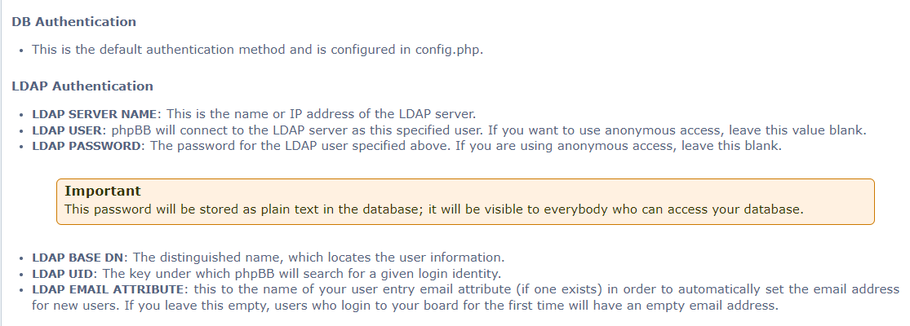
I did some research on how phpbb connect to LDAP then I found this [docs](https://www.phpbb.com/support/docs/en/3.1/ug/adminguide/general_client/) which tell us that it could be stored in plaintext in config file
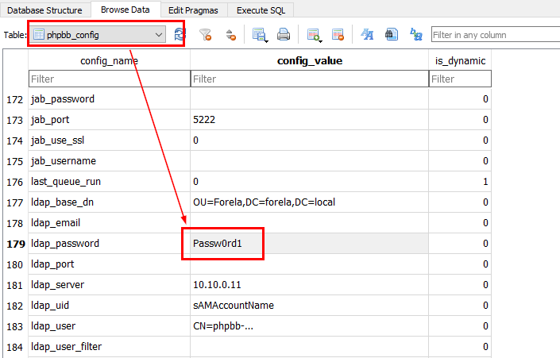
We didn't have config file but we still have "phpbb_config" table to cover us
```
Passw0rd1
```

>Task 7: What is the user agent of the Administrator user?

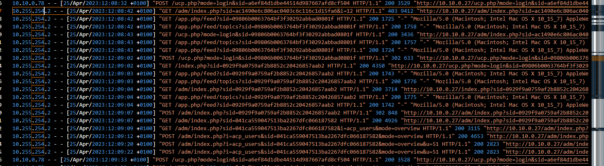
There are only 2 IP addresses found on this log file and we already know both IP address of Administrator and the contractor from phpbb database
```
Mozilla/5.0 (Macintosh; Intel Mac OS X 10_15_7) AppleWebKit/537.36 (KHTML, like Gecko) Chrome/112.0.0.0 Safari/537.36
```

>Task 8: What time did the contractor add themselves to the Administrator group? (UTC)

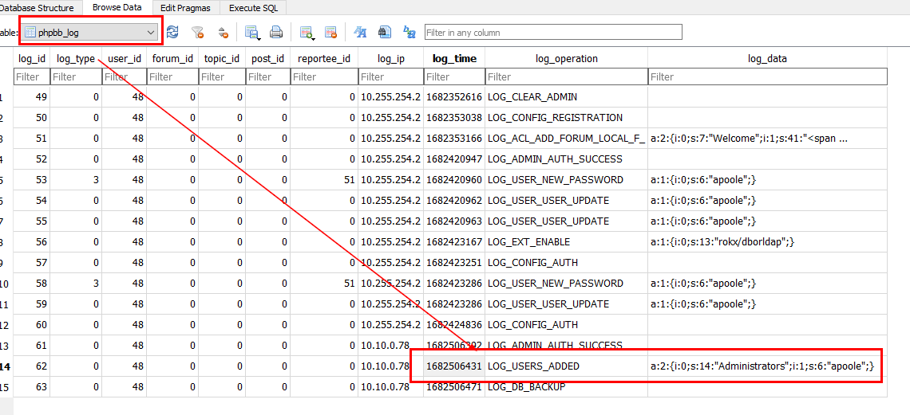
Go to "phpbb_log" again to grab UNIX timestamp
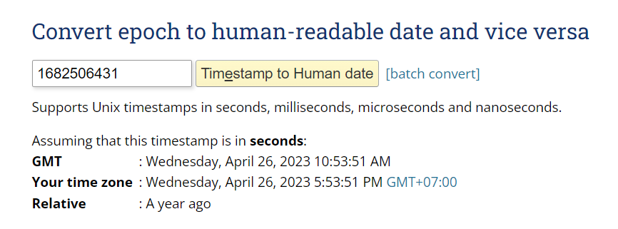
epoch converter should be added to our tool list at this point
```
26/04/2023 10:53:51
```

>Task 9: What time did the contractor download the database backup? (UTC)

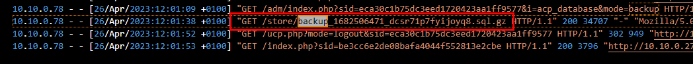
The contractor would send a request for a file to server which there is one sql file was requested right there
 and dont forget to subtract 1 hour off to make it UTC
```
26/04/2023 11:01:38
```

>Task 10: What was the size in bytes of the database backup as stated by access.log?
```
34707
```

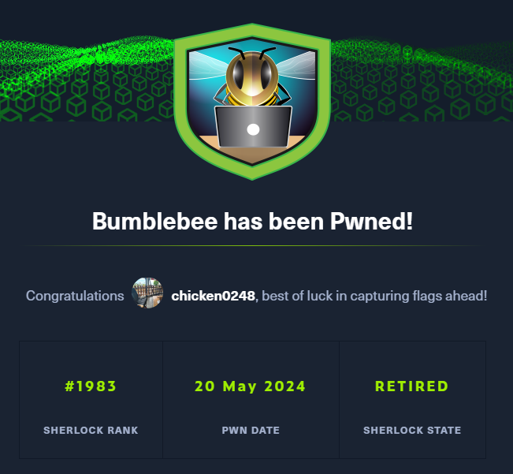
* * *
