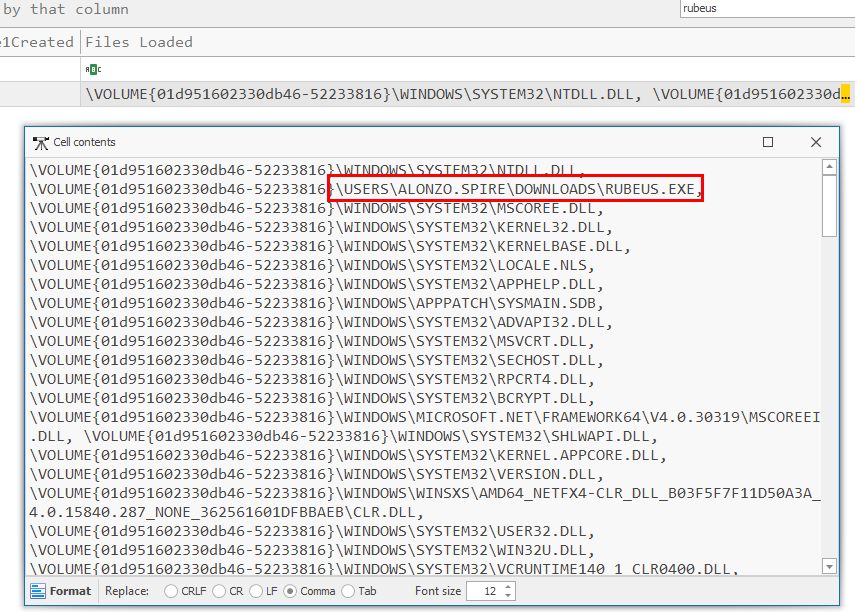

# [HackTheBox Sherlocks - Campfire-1](https://app.hackthebox.com/sherlocks/Campfire-1/play)
Created: 21/06/2024 17:23
Last Updated: 21/06/2024 19:08
* * *
This challenge was designed by Cyberjunkie which was published with this [blog](https://www.hackthebox.com/blog/kerberoasting-attack-detection) that talking about several AD attack investigations so be sure to give it a read before tackle this lab!

>Task 1: Analyzing Domain Controller Security Logs, can you confirm the date & time when the kerberoasting activity occurred?


First we have to investigate domain controller security event log first


Try to find "Ticker Encryption Type: 0x17" then we will have timestamp and information about service that was targeted along with host IP address of this event

And donot forget to convert this timestamp into UTC because event because an event log will convert all timestamp to your local time.

```
2024-05-21 03:18:09
```

>Task 2: What is the Service Name that was targeted?


```
MSSQLService
```

>Task 3: It is really important to identify the Workstation from which this activity occurred. What is the IP Address of the workstation?


```
172.17.79.129
```

>Task 4: Now that we have identified the workstation, a triage including PowerShell logs and Prefetch files are provided to you for some deeper insights so we can understand how this activity occurred on the endpoint. What is the name of the file used to Enumerate Active directory objects and possibly find Kerberoastable accounts in the network?


Switch to Powershell operation event log and we can focus on Event ID 4101 which is Execute a Remote Command event but Event ID 4100 can also be useful for some case too, you can see that it contains error message that telling us `powerview.ps1` cannot be loaded


Then after the threat actor bypass powershell restriction then powerview can be executed properly(?)

```
powerview.ps1 
```

>Task 5: When was this script executed?
```
2024-05-21 03:16:32
```

>Task 6: What is the full path of the tool used to perform the actual kerberoasting attack?


There are several tool that can be used to perform like [impacket](https://github.com/fortra/impacket), [Rubeus](https://github.com/GhostPack/Rubeus ), [PowerSploit (Invoke-Kerberoast)](https://powersploit.readthedocs.io/en/latest/Recon/Invoke-Kerberoast/) but when we given with prefetch mean its 90% Rubeus since impacket was written in python and PowerSploit is powershell script and to confirm this we will use  `PECmd.exe -d prefetch --csv . --csv prefetch.csv` to parse prefetch files, process them and output it in csv format


There it is, it is really Rubeus as expected



Go to Files Loads column and double click to find for full path

```
C:\USERS\ALONZO.SPIRE\DOWNLOADS\RUBEUS.EXE
```

>Task 7: When was the tool executed to dump credentials?
```
2024-05-21 03:18:08
```


* * *
