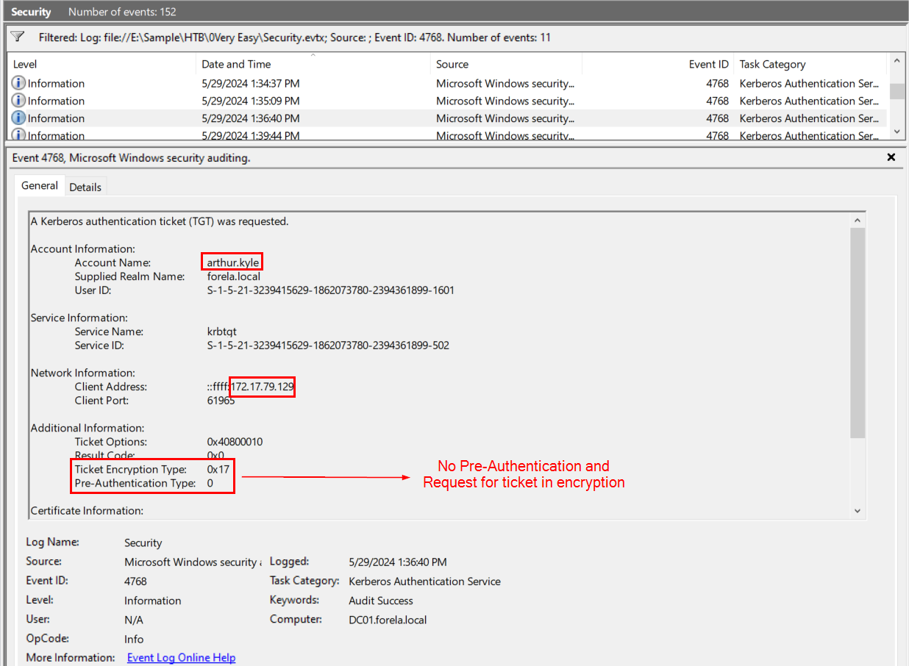
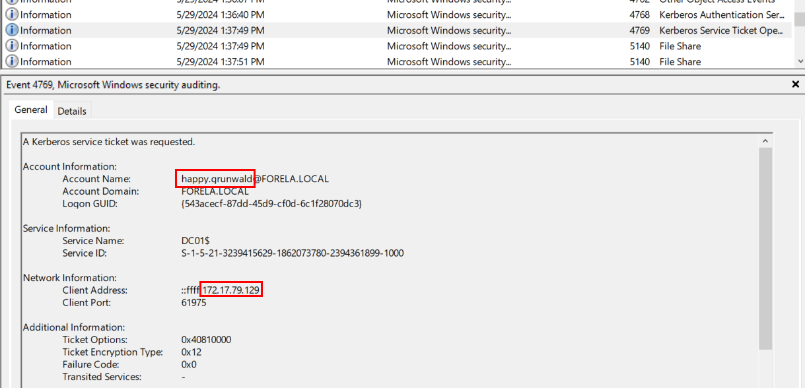
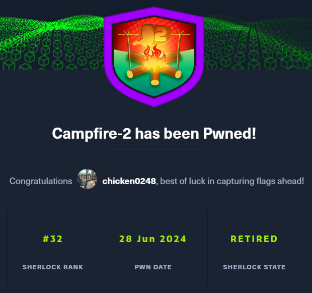

# [HackTheBox Sherlocks - Campfire-2](https://app.hackthebox.com/sherlocks/Campfire-2)
Created: 28/06/2024 16:47
Last Updated: 28/06/2024 17:33
* * *


**Scenario:**
Forela's Network is constantly under attack. The security system raised an alert about an old admin account requesting a ticket from KDC on a domain controller. Inventory shows that this user account is not used as of now so you are tasked to take a look at this. This may be an AsREP roasting attack as anyone can request any user's ticket which has preauthentication disabled.

* * *
First, we need to understand what is ASREP Roasting attack and how to detect them

So what is [ASREP Roasting](https://attack.mitre.org/techniques/T1558/004/) attack? to put it simply it is a type of attack that targets the Kerberos authentication, specifically its AS-REQ (Authentication Service Request) process. it exploits the fact that some user accounts may be configured to not require Kerberos pre-authentication which allow threat actor to request authentication for a user without needing the password.

**Kerberos Pre-Authentication**:
- Pre-authentication requires the client to prove its identity before the Kerberos Key Distribution Center will issue a ticket.
- This is done by having the client encrypt a timestamp with its password hash and send it to the KDC.
- The Kerberos Key Distribution Center verifies the timestamp, ensuring that the request is legitimate and recent.

**Lack of Pre-Authentication**:
- If pre-authentication is disabled for a user account, an attacker can request a ticket for that account without needing the password.
- The KDC will respond with a ticket that is encrypted with the user's password hash.
- Once the threat actor cracks the password hash, they can use the discovered password to authenticate themselves as the legitimate domain user.

>Task 1: When did the ASREP Roasting attack occur, and when did the attacker request the Kerberos ticket for the vulnerable user?

So we have to find event related to Kerberos Authentication Server and does not require pre-authentication



If we filtered for event id 4768 then we will come across this event which is totally suspicious in a lot of way 
- First, It requested for encrypted ticket, so threat actor can crack the password later
- Second, This operation does not request pre-authentication

So we have to find Kerberos authentication that happened after this timestamp to confirm that ASREP Roasting attack actually occurred



Which we can see that after another domain user was authenticated after quite some times which mean threat actor successfully cracked this password and legitimately authenticate as domain user.

```
2024-05-29 06:36:40
```

>Task 2: Please confirm the User Account that was targeted by the attacker.
```
arthur.kyle
```

>Task 3: What was the SID of the account?
```
S-1-5-21-3239415629-1862073780-2394361899-1601
```

>Task 4: It is crucial to identify the compromised user account and the workstation responsible for this attack. Please list the internal IP address of the compromised asset to assist our threat-hunting team.
```
172.17.79.129
```

>Task 5: We do not have any artifacts from the source machine yet. Using the same DC Security logs, can you confirm the user account used to perform the ASREP Roasting attack so we can contain the compromised account/s?
```
happy.grunwald
```


* * *
