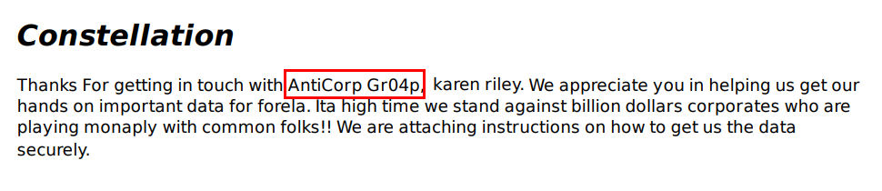
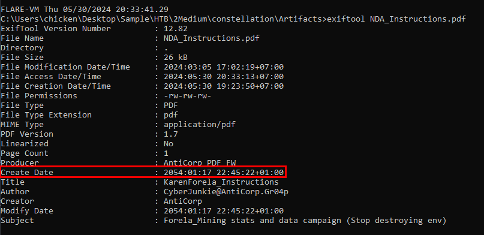

# [HackTheBox Sherlocks - Constellation](https://app.hackthebox.com/sherlocks/Constellation)
Created: 30/05/2024 20:11
Last Updated: 30/05/2024 20:55
* * *

**Scenario:**
The SOC team has recently been alerted to the potential existence of an insider threat. The suspect employee's workstation has been secured and examined. During the memory analysis, the Senior DFIR Analyst succeeded in extracting several intriguing URLs from the memory. These are now provided to you for further analysis to uncover any evidence, such as indications of data exfiltration or contact with malicious entities. Should you discover any information regarding the attacking group or individuals involved, you will collaborate closely with the threat intelligence team. Additionally, you will assist the Forensics team in creating a timeline. Warning : This Sherlock will require an element of OSINT and some answers can be found outside of the provided artifacts to complete fully.

* * *
>Task 1: When did the suspect first start Direct Message (DM) conversations with the external entity (A possible threat actor group which targets organizations by paying employees to leak sensitive data)? (UTC)


We got 2 urls and 1 unharmed pdf file to work with

To solve this we need to use [unfurl](https://dfir.blog/unfurl/) and let it extract timestamp for us, an answer is first timestamp that was extracted
```
2023-09-16 16:03:37
```

>Task 2: What was the name of the file sent to the suspected insider threat?


Its the same file we have

```
NDA_Instructions.pdf
```

>Task 3: When was the file sent to the suspected insider threat? (UTC)


The answer is second timestamp from unfurl
```
2023-09-27 05:27:02
```

>Task 4: The suspect utilised Google to search something after receiving the file. What was the search query?


put it on browser directly to solve this

But another way to solve this is to use unfurl 
```
how to zip a folder using tar in linux
```

>Task 5: The suspect originally typed something else in search tab, but found a Google search result suggestion which they clicked on. Can you confirm which words were written in search bar by the suspect originally?


```
How to archive a folder using tar i
```

>Task 6: When was this Google search made? (UTC)


```
2023-09-27 05:31:45
```

>Task 7: What is the name of the Hacker group responsible for bribing the insider threat?


Open a pdf file then we can read the content inside which starts with an introduction before telling karen riley (insider) to exfiltrate data of a company to AWS S3 bucket 
```
AntiCorp Gr04p
```

>Task 8: What is the name of the person suspected of being an Insider Threat?


```
karen riley
```

>Task 9: What is the anomalous stated creation date of the file sent to the insider threat? (UTC)


used exif tool to get a create date of this file
```
2054-01-17 22:45:22
```

>Task 10: The Forela threat intel team are working on uncovering this incident. Any OpSec mistakes made by the attackers are crucial for Forela's security team. Try to help the TI team and confirm the real name of the agent/handler from Anticorp.


We can see that an email was presented on metadata

Which lead to LinkedIn profile

This should be the one
```
Abdullah Al Sajjad
```

>Task 11: Which City does the threat actor belong to?


```
Bahawalpur
```


* * *
