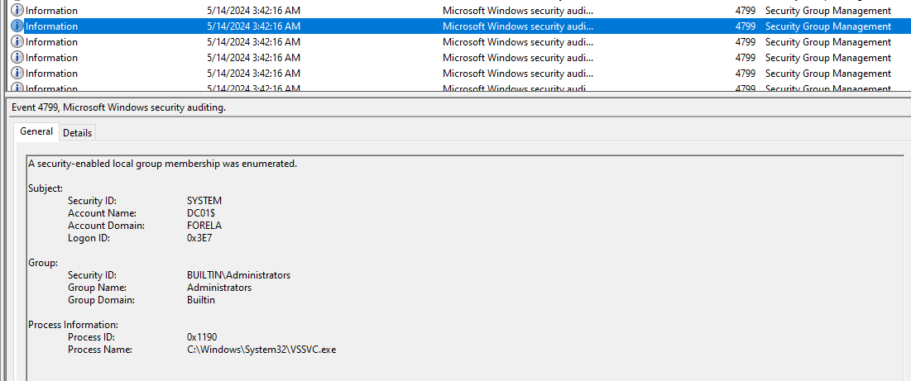
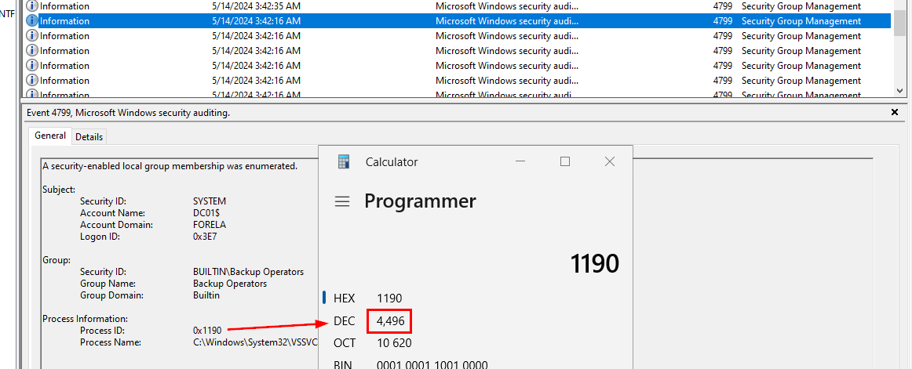

# [HackTheBox Sherlocks - CrownJewel-1](https://app.hackthebox.com/sherlocks/CrownJewel-1)
Created: 31/08/2024 10:43
Last Updated: 31/08/2024 13:19
* * *


**Scenario:**
Forela's domain controller is under attack. The Domain Administrator account is believed to be compromised, and it is suspected that the threat actor dumped the NTDS.dit database on the DC. We just received an alert of vssadmin being used on the DC, since this is not part of the routine schedule we have good reason to believe that the attacker abused this LOLBIN utility to get the Domain environment's crown jewel. Perform some analysis on provided artifacts for a quick triage and if possible kick the attacker as early as possible.

* * *
We're on the last part of AD investigation sherlocks series made by CyberJunkie & g4rg4m3l ! kudos to them that they did these for free!


[Here](https://www.hackthebox.com/blog/ntds-dumping-attack-detection) is the blog that they teach you about NTDS dumping attack detection so to fully understand what what happened on CrownJewel-1 and CrownJewel-2 sherlocks, you better read this and follow through every steps!

>Task 1: Attackers can abuse the vssadmin utility to create volume shadow snapshots and then extract sensitive files like NTDS.dit to bypass security mechanisms. Identify the time when the Volume Shadow Copy service entered a running state.


The volume shadow copy related services will be started before the creation of the NTDS.dit database and since we were not given Application log but System log then we could filter for Event ID 7036 and find for Volume Shadow Copy service 


After filtered with Event ID 7036 (**The service has entered the ... state**) with Event Source = ESENT, we can use "Find" to search for volume shadow copy service so we will not have to go through every one of these logs, and luckily for us that there is only 1 volume shadow copy log on this file and this is the timestamp of this service entered running state. 

```
2024-05-14 03:42:16
```

>Task 2: When a volume shadow snapshot is created, the Volume shadow copy service validates the privileges using the Machine account and enumerates User groups. Find the User groups it enumerates, the Subject Account name, and also identify the Process ID(in decimal) of the Volume shadow copy service process


For this task, we have to filter for Event ID 4799 (**A security-enabled local group membership was enumerated**) from Security log and try to find for `vssvc.exe` process which is a process of volume shadow copy service.


And then we can see that at the same timestamp, this process were enumerated "Backup Operators" group



And of course, "Administrators" group 

```
Administrators, Backup Operators, DC01$
```

>Task 3: Identify the Process ID (in Decimal) of the volume shadow copy service process.



From this log, it logged process ID in hex so we just need to convert it to decimal (easily done with built-in calculator in Programmer mode)

```
4496
```

>Task 4: Find the assigned Volume ID/GUID value to the Shadow copy snapshot when it was mounted.


Now we just have to open `Microsoft-Windows-NTFS.evtx` which stores events related to the NTFS (New Technology File System) file system and find for any event log 

```
{06c4a997-cca8-11ed-a90f-000c295644f9}
```

>Task 5: Identify the full path of the dumped NTDS database on disk.

For this one, we have to dig into provided `$MFT` and find any `ntds.dit` file that is not located in its original path (`%SystemRoot%\ntds\`)


And of course, there is a tool that could parse `$MFT` file for us which is [MFTECmd](https://github.com/EricZimmerman/MFTECmd) from EZ Tools, after csv output is saved then we can open in with Timeline Explorer


"Find" feature always come in handy on every tool so we can just use that and then we will see uncommon file path of `ntds.dit` file that is the answer of this task
 
```
C:\Users\Administrator\Documents\backup_sync_Dc\Ntds.dit
```

>Task 6: When was newly dumped ntds.dit created on disk?


Scrolled a little bit to the right until we found "Created0x10" column, this is a column store created timestamp of every file.

```
2024-05-14 03:44:22
```

>Task 7: A registry hive was also dumped alongside the NTDS database. Which registry hive was dumped and what is its file size in bytes?


We already know that to crack hashes from NTDS, we need SYSTEM registry hive but there will be too many results if we searched for "SYSTEM" so lets assume that registry hive would also be dumped to the same folder as `ntds.dit` file which there is one as expected right here.

```
SYSTEM, 17563648
```


* * *
