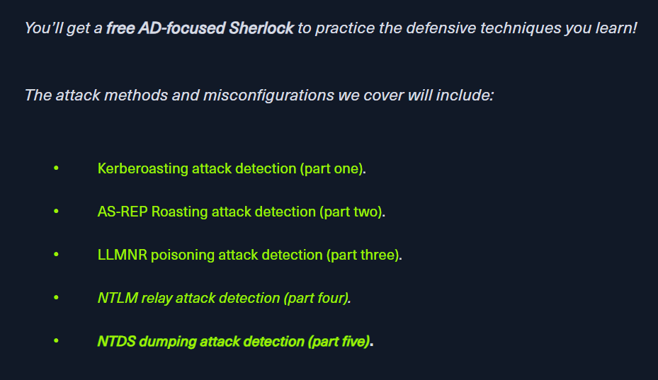
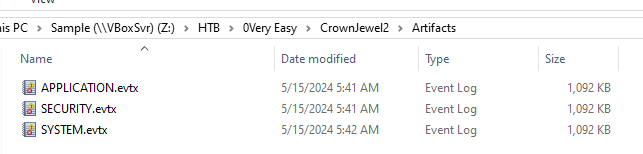
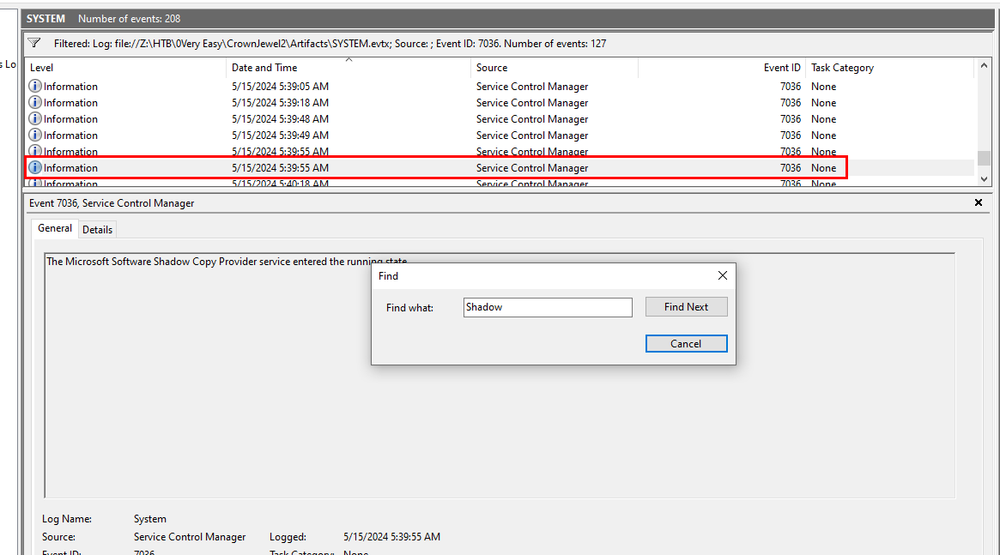
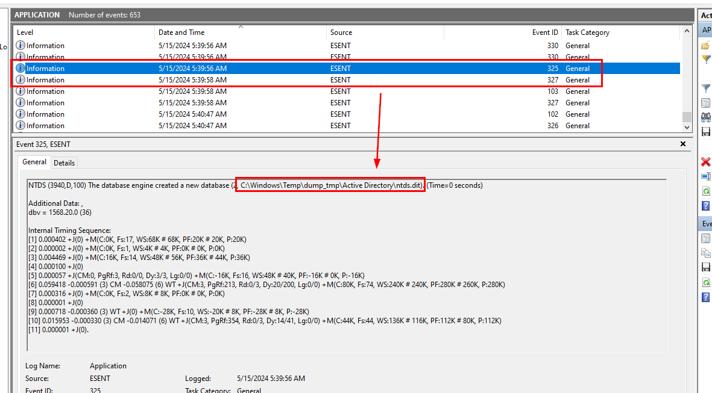
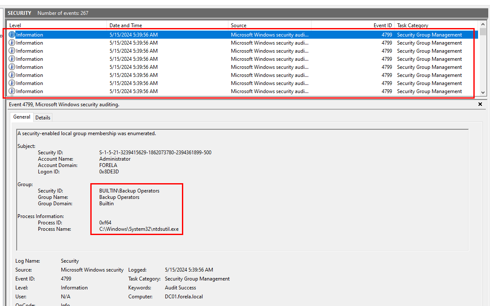
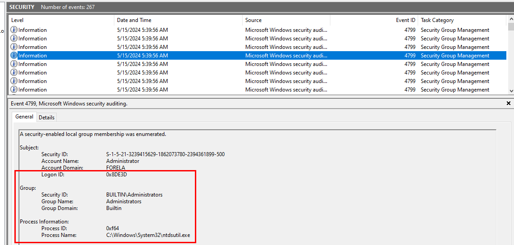
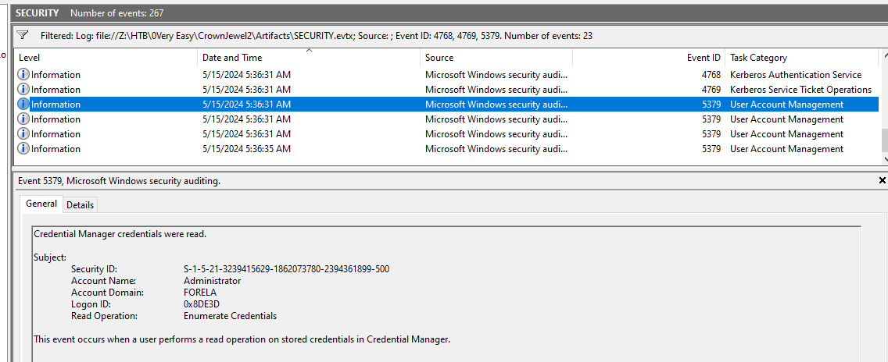
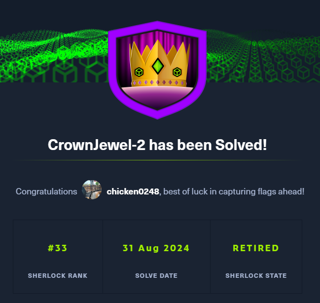

# [HackTheBox Sherlocks - CrownJewel-2](https://app.hackthebox.com/sherlocks/CrownJewel-2)
Created: 31/08/2024 13:29
Last Updated: 31/08/2024 15:07
* * *


**Scenario:**
Forela's Domain environment is pure chaos. Just got another alert from the Domain controller of NTDS.dit database being exfiltrated. Just one day prior you responded to an alert on the same domain controller where an attacker dumped NTDS.dit via vssadmin utility. However, you managed to delete the dumped files kick the attacker out of the DC, and restore a clean snapshot. Now they again managed to access DC with a domain admin account with their persistent access in the environment. This time they are abusing ntdsutil to dump the database. Help Forela in these chaotic times!!

* * *
We're on the last part of AD investigation sherlocks series made by CyberJunkie & g4rg4m3l ! kudos to them that they did these for free!



[Here](https://www.hackthebox.com/blog/ntds-dumping-attack-detection) is the blog that they teach you about NTDS dumping attack detection so to fully understand what what happened on CrownJewel-1 and CrownJewel-2 sherlocks, you better read this and follow through every steps!

>Task 1: When utilizing ntdsutil.exe to dump NTDS on disk, it simultaneously employs the Microsoft Shadow Copy Service. What is the most recent timestamp at which this service entered the running state, signifying the possible initiation of the NTDS dumping process?



We were provided with 3 event log files which are APPLICATION, SECURITY and SYSTEM logs.



If we want to find the most recent timestamp of shadow copy service, then we will have to filter for Event ID 7086 (**The service has entered the ... state**) and use built-in event viewer feature called "Find" then we will find total of 4 Shadow Copy service entered running state event and the event showed here is the most recent one.

```
2024-05-15 05:39:55
```

>Task 2: Identify the full path of the dumped NTDS file.



As we already know that Shadow Copy service will enter running state before NTDS file was dumped so we can filter for Event ID 325 (**The database engine created a new database**) and 327 (**The database engine detached a database**) 

Event ID 325 indicates new ntds file were created and will also logged location of a new file as you could see from an image above and Event ID 327 indicates that newly dumped NTDS file were detached from database and ready to be used.

```
C:\Windows\Temp\dump_tmp\Active Directory\ntds.dit
```

>Task 3: When was the database dump created on the disk?
```
2024-05-15 05:39:56
```

>Task 4: When was the newly dumped database considered complete and ready for use?
```
2024-05-15 05:39:58
```

>Task 5: Event logs use event sources to track events coming from different sources. Which event source provides database status data like creation and detachment?

Event ID 325 and 327 came from the same source which is ESENT (Extensible Storage Engine) and its associated with the Extensible Storage Engine (ESE) technology used by Windows (if you're curious about the details of this technology, you might need to do your own research since it will be too technical and digging ourselves into another rabbit hole).

```
ESENT
```

>Task 6: When ntdsutil.exe is used to dump the database, it enumerates certain user groups to validate the privileges of the account being used. Which two groups are enumerated by the ntdsutil.exe process? Also, find the Logon ID so we can easily track the malicious session in our hunt.

For this task, we need to open Security log and filter for Event ID 4799 (**A security-enabled local group membership was enumerated**) which should be happened second after NTDS file was dumped and ready to use.



And here, we can see that Backup Operators group is one of enumeration target of `ntdsutil.exe` process and this operation were performed by FORELA user that has Logon ID = `0x8DE3D`



The other group that was enumerated is Administrators group

```
Administrators, Backup Operators, 0x8DE3D
```

>Task 7: Now you are tasked to find the Login Time for the malicious Session. Using the Logon ID, find the Time when the user logon session started.



We're still on the System log, but this time we will have to filter for EventID 4768 (**A Kerberos authentication ticket (TGT) was requested**), 4769 (**A Kerberos service ticket was requested**) and 5379 (**Credential Manager credentials were read**) that happened after NTDS file was dumped and user groups were enumerated and with Logon ID we obtained from previous task, we can determine that user logon session started at this time.

```
2024-05-15 05:36:31
```



* * *
