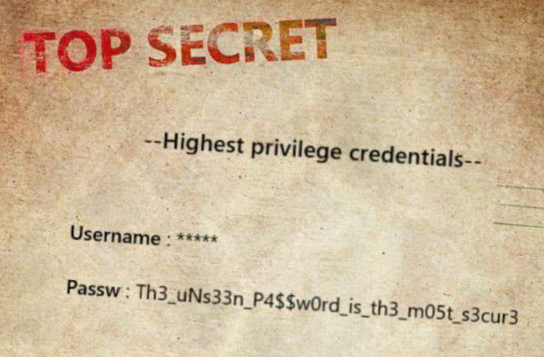

# [HackTheBox Sherlocks - Fragility](https://app.hackthebox.com/sherlocks/Fragility)
Created: 16/06/2024 14:19
Last Updated: 16/06/2024 18:18
* * *


**Scenario:**
In the monitoring team at our company, each member has access to Splunk web UI using an admin Splunk account. Among them, John has full control over the machine that hosts the entire Splunk system. One day, he panicked and reported to us that an important file on his computer had disappeared. Moreover, he also discovered a new account on the login screen. Suspecting this to be the result of an attack, we proceeded to collect some evidence from his computer and also obtained network capture. Can you help us investigate it?

* * *
>Task 1: What CVE did the attacker use to exploit the vulnerability?


Lets start with pcapng file and first thing that caught my eye is this http traffic that was sent to splunk web interface with python and double "Set-Cookie" header which likely to be a malicious script designed specifically for a CVE (PoC)


Scrolling down for a bit then we can see that an attacker somehow obtained username and password and authenticated to splunk so to exploit this vulnerability an attacker need to be authenticated


Scrolling down a little bit more then we can see what kind of vulnerability this python script aiming to exploit, Its uploaded malicious XLS file which also lead to Remote Code Execution

So this vulnerability is Authenticated Remote Code Execution on Splunk

Before going to search for CVE number, lets break down what will happened when this malicious xsl successfully triggered

- User Creation: The script starts by creating a new user named "nginx" without a password and sets their home directory to `/var/www/`.
- Password Setup: It decodes and reverses a base64 string to generate a password for the "nginx" user, then sets this password.
- Sudo Privileges: The "nginx" user is added to the "sudo" group, granting them administrative privileges.
- SSH Configuration: It creates an `.ssh` directory in the "nginx" user's home directory and adds a specific SSH public key to the `authorized_keys` file, allowing SSH access.
- Permissions: It ensures that the `/var/www/` directory and its contents are owned by the "nginx" user.
- History Clearing: Finally, it clears the "root" user's bash history to remove any trace of commands executed.


Now we can search for the CVE number which directly lead us to PoC of this CVE directly


Looking at contents of this script, its legitimate one


Then I went back to Wireshark to confirm that an attacker accessed to targeted machine on port 22.

```
CVE-2023-46214
```

>Task 2: What MITRE technique does the attacker use to maintain persistence?


An attacker created a new user first then added password and ssh public key for it so the technique that will suit this scenario the most if "Create Account"

```
T1136
```

>Task 3: John has adjusted the timezone but hasn't rebooted the computer yet, which has led to some things either being updated or not updated with the new timezone. Identifying the timezone can assist you further in your investigation. What was the default timezone and the timezone after John's adjustment on this machine?


First I used `grep -ri "time zone" .` first to find anything related to timezone changed and we can see that it changed to "Asia/Ho_Chi_Minh" which is UTC+07


I couldn't figure it out how to find default timezone, I thought it was UTC+00 but Its incorrect then I searched for "america" or anything that related to system setup which land me with `debconf` logs which specifically related to setting the country during installation and it was North America


There is many time we can use but the right answer is MT (Mountain Time UTC-07)

```
utc-07/utc+07
```

>Task 4: When did the attacker SSH in? (UTC)


Go back to Wireshark, we need to pick time of the packet after key exchange 

```
04-14 15:00:21
```

>Task 5: How much time has passed from when the user was first created to when the attacker stopped using SSH?


This time, we need to investigate `auth.log` and filter for connection disconnected and useradd event and calculate duration between them

08:03:08 - 08:00:13 = 00:02:55

```
00:02:55
```

>Task 6: What is the password for the account that the attacker used to backdoor?


Execute this command on our bash then we will have "nginx" user password


```
f8287ec2-3f9a-4a39-9076-36546ebb6a93
```

>Task 7: There is a secret in the exfiltrated file, what is its content?


Command History from `auth.log` tells us that there is an `Important.pdf` was moved to `/var/www/` then used openssl to encrypted it and lastly it was deleted


So I went to `\var\www\` and we can see that there is `.bash_history` here


Now we can see that not just deleted, an attacker sent encrypted file to his system on port 8080


So we can go back to wireshark and find this connection


Lets save this file as Raw format


Then convert it back to ascii and decode base64 with `cat raw.raw | dd conv=ascii | base64 -d > encrypted_data.zip`


Lastly we will use `openssl enc -d -aes-256-cbc -in encrypted_data.zip -out data.zip -iv 4fa17640b7dfe8799f072c65b15f581d -K 3cabc6db78a034f69f16aa8986cf2e2cea05713b1e95ff9b2d80f6a71ae76b7d` to recover compressed file.



Open a file inside compressed file then we will have this Highest privilege credentials

```
Th3_uNs33n_P4$$w0rd_is_th3_m05t_s3cur3
```

>Task 8: What are the username and password that the attacker uses to access Splunk?


If you remembered that to exploit splunk, an attacker need to be authenticated so we can go back to wireshark and get user credential that was used to access splunk

```
johnnyC:h3Re15j0hnNy
```


* * *
