# [HackTheBox Sherlocks - Heartbreaker-Continuum](https://app.hackthebox.com/sherlocks/Heartbreaker-Continuum)
Created: 12/07/2024 17:30
Last Updated: 12/07/2024 22:38
* * *


**Scenario:**
Following a recent report of a data breach at their company, the client submitted a potentially malicious executable file. The file originated from a link within a phishing email received by a victim user. Your objective is to analyze the binary to determine its functionality and possible consequences it may have on their network. By analyzing the functionality and potential consequences of this binary, you can gain valuable insights into the scope of the data breach and identify if it facilitated data exfiltration. Understanding the binary's capabilities will enable you to provide the client with a comprehensive report detailing the attack methodology, potential data at risk, and recommended mitigation steps.

* * *
>Task 1: To accurately reference and identify the suspicious binary, please provide its SHA256 hash.

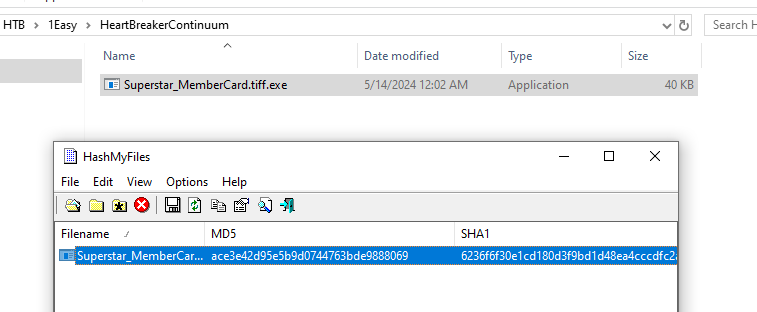

This can easily be obtained by several ways, I preferred HashMyFiles since it was already built-in within FlareVM

```
12daa34111bb54b3dcbad42305663e44e7e6c3842f015cccbbe6564d9dfd3ea3
```

>Task 2: When was the binary file originally created, according to its metadata (UTC)?

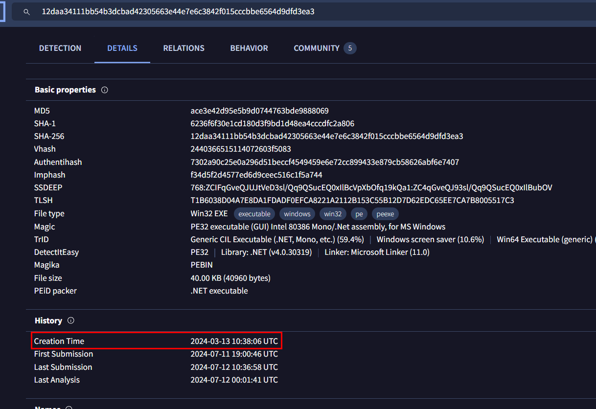

We can check metadata of this file to obtain an answer or we can just search filehash on VirusTotal and grab this "Creation Time" in "Details" tab

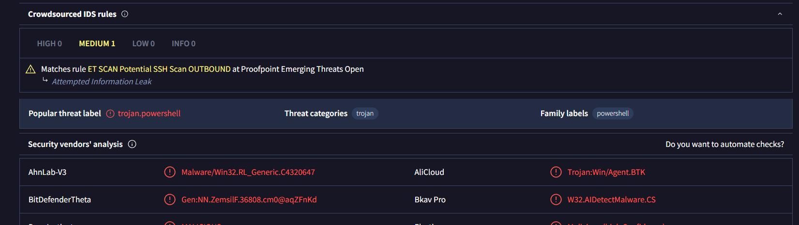

And from VirusTotal, we can see that its an executable file that was converted from PowerShell to PE32 executable

```
2024-03-13 10:38:06
```

>Task 3: Examining the code size in a binary file can give indications about its functionality. Could you specify the byte size of the code in this binary?

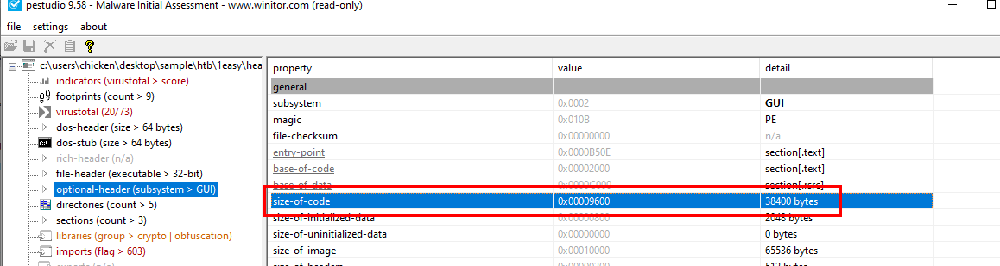

We can use pestudio for this one and after opened a file in pestudio, go to "optional header" then we can see "size of code" there

```
38400
```

>Task 4: It appears that the binary may have undergone a file conversion process. Could you determine its original filename?

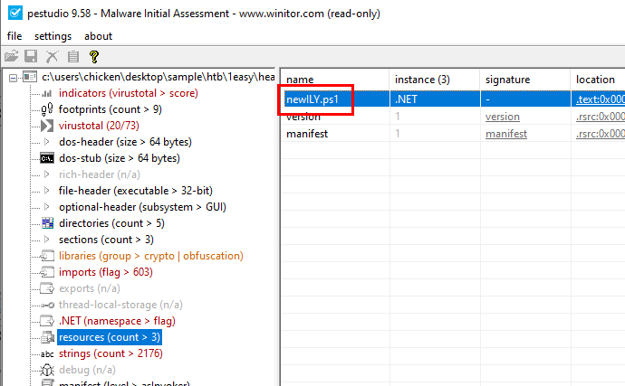

In pestudio, go to resources then we can see the name of an original powershell script that was converted to this PE32 executable file

```
newILY.ps1
```

>Task 5: Specify the hexadecimal offset where the obfuscated code of the identified original file begins in the binary.

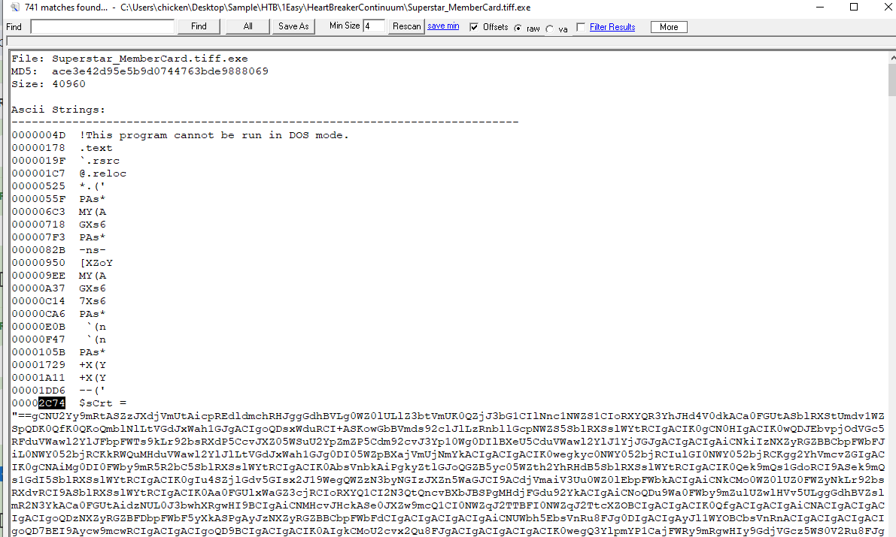

We can use "strings" (built-in tool in FlareVM) to find where the obfuscated code is located in this PE32 executable file

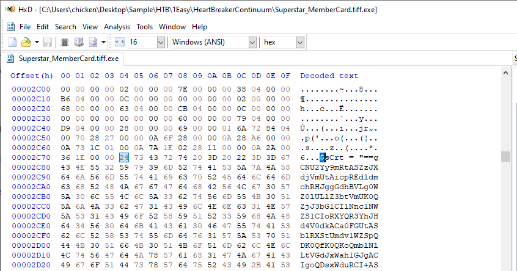

Alternatively, you can use any hex editor to locate this obfuscated code directly

```
2C74
```

>Task 6: The threat actor concealed the plaintext script within the binary. Can you provide the encoding method used for this obfuscation?

Obfuscated code started with "==" which is likely to be base64 string in reverse and to confirm this we need to scroll down a little bit more to find method that eventually execute this code

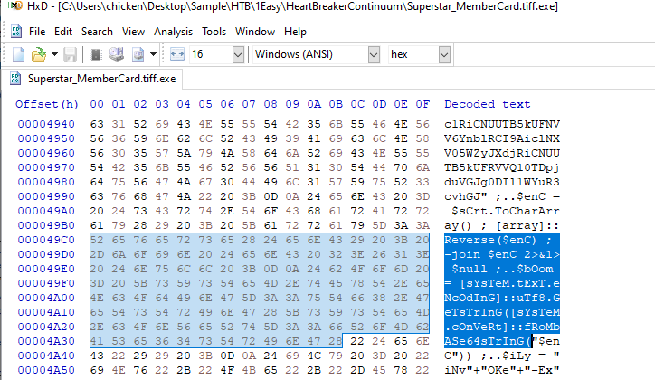

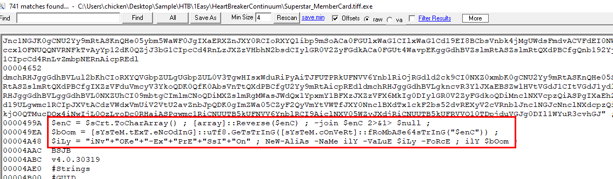

Then we can see that it is reverse base64 as expected

```
Base64
```

>Task 7: What is the specific cmdlet utilized that was used to initiate file downloads?

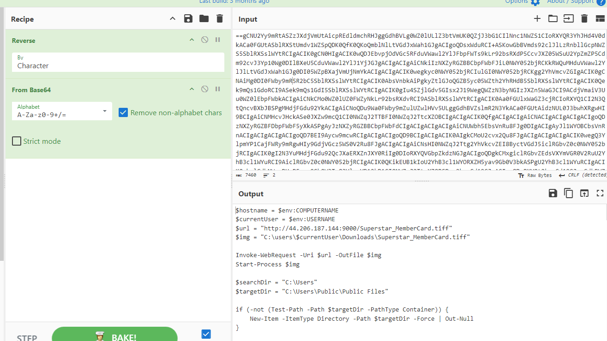

Go to Cyberchef to make it a little bit easier to decode then we can see that it will use `Invoke-WebRequest` to download "itself" from C2 server to current user's Downloads location before execute it

```
Invoke-WebRequest
```

>Task 8: Could you identify any possible network-related Indicators of Compromise (IoCs) after examining the code? Separate IPs by comma and in ascending order.

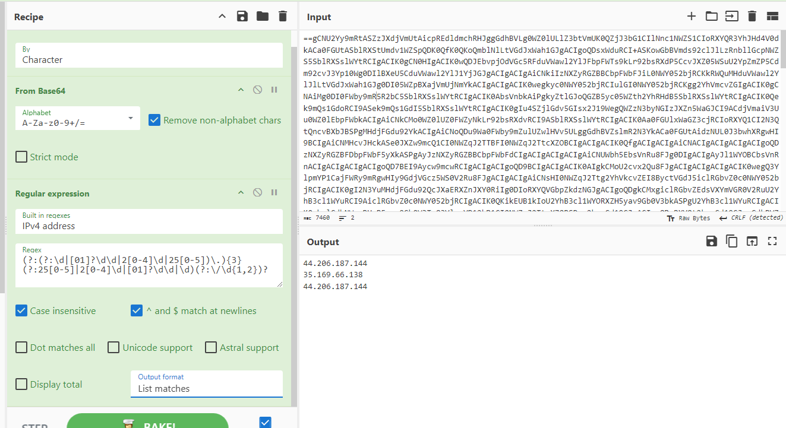

We can use "Regular expression" operation in Cyberchef with "IPv4 address" regex built-in to get all IPv4 addresses then we will see that there are only 2 uniques IPv4 addresses from this code

```
35.169.66.138,44.206.187.144
```

>Task 9: The binary created a staging directory. Can you specify the location of this directory where the harvested files are stored?

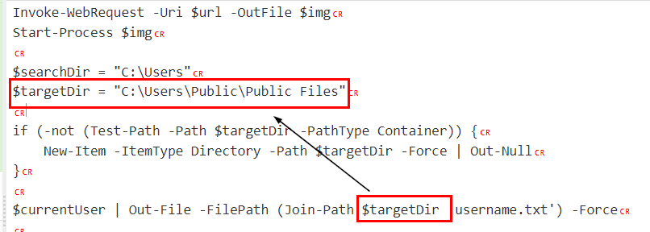

We can see that `targetDir` varible was assigned to this path to store all output files generated by this code

```
C:\Users\Public\Public Files
```

>Task 10: What MITRE ID corresponds to the technique used by the malicious binary to autonomously gather data?

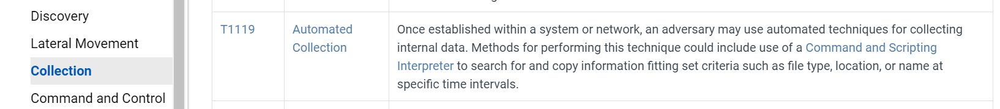

This is the technique that this task referring to

```
T1119
```

>Task 11: What is the password utilized to exfiltrate the collected files through the file transfer program within the binary?

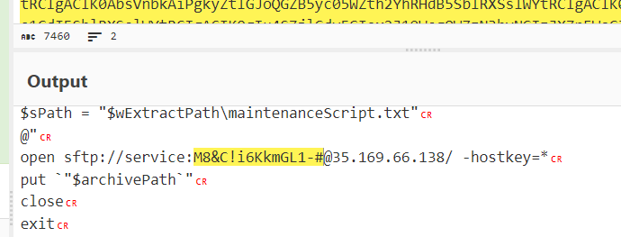

before exit program, it use "sftp" to send all harvested files to another C2 server that we found on task 8 which incluing user credentials for this service too

```
M8&C!i6KkmGL1-#
```


* * *
