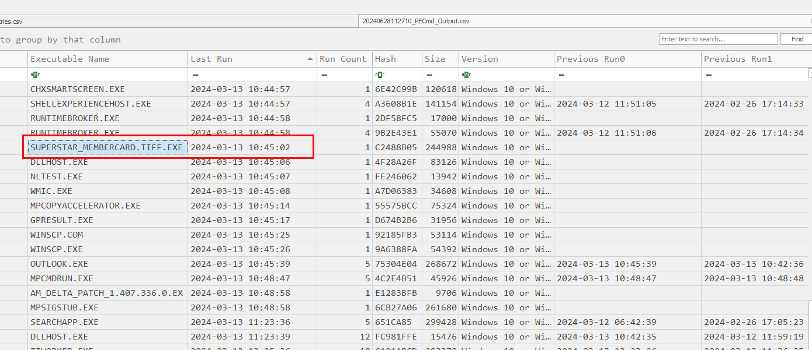
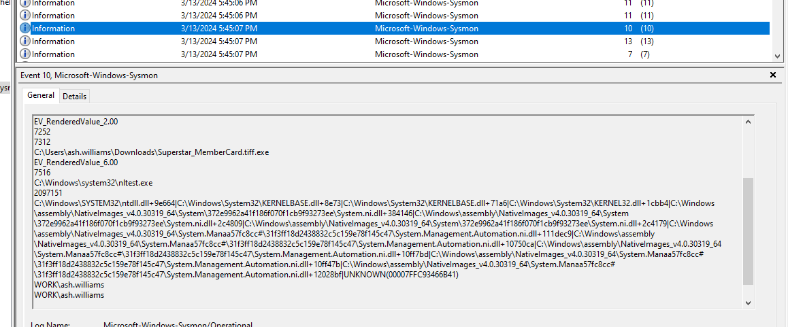
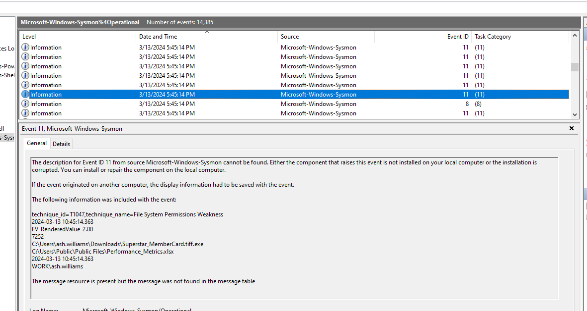

# [HackTheBox Sherlocks - Heartbreaker](https://app.hackthebox.com/sherlocks/Heartbreaker)
Created: 28/06/2024 17:46
Last Updated: 29/06/2024 10:35
* * *


**Scenario:**
Delicate situation alert! The customer has just been alerted about concerning reports indicating a potential breach of their database, with information allegedly being circulated on the darknet market. As the Incident Responder, it's your responsibility to get to the bottom of it. Your task is to conduct an investigation into an email received by one of their employees, comprehending the implications, and uncovering any possible connections to the data breach. Focus on examining the artifacts provided by the customer to identify significant events that have occurred on the victim's workstation.

* * *
>Task 1: The victim received an email from an unidentified sender. What email address was used for the suspicious email?


From the scenario, we got a clue that we need to investigate a user on this system and from the evidence we got, look like we got only 1 user to investigate which make our life a little easier


Fortunately that there is an ost file inside `\wb-ws-01\C\Users\ash.williams\AppData\Local\Microsoft\Outlook` folder


So we can use any OST file viewer to open this file and after you open it then you can see inside an inbox there is an email that shipped with an attachment we could view

Which we can see this is a phishing mail that was sent by the threat actor and even ensure that even user didn't download attachment file that was sent with this file then user still can downloaded the malicious attachment via "here" hyperlink

```
ImSecretlyYours@proton.me
```

>Task 2: It appears there's a link within the email. Can you provide the complete URL where the malicious binary file was hosted?


Inspect this hyperlink which we can see that its an website that hosted malicious executable file.

```
http://44.206.187.144:9000/Superstar_MemberCard.tiff.exe
```

>Task 3: The threat actor managed to identify the victim's AWS credentials. From which file type did the threat actor extract these credentials?


This question is a little bit tricky, I spent quite some time tried to find a file that could store this information but in the end it was in Draft email created by the victim so it is `.ost` file that stored this AWS credentails

```
.ost
```

>Task 4: Provide the actual IAM credentials of the victim found within the artifacts.


If you can't separate which one is Access Key ID and which one is Secret Access Key, here is an explaination from ChatGPT which already separated them for us

```

```

>Task 5: When (UTC) was the malicious binary activated on the victim's workstation?


Since we already determined that threat actor sent a malicious executable file for user to execute then we can use given prefetch to determine the timestamp when this executable was executed with PEcmd (EZ tools) -> `.\PECmd.lnk -d Z:\HTB\2Medium\wb-ws-01\C\Windows\prefetch\ --csv export`



Open exported CSV file with Timeline Explorer and find for the name of malicious executable file then we will get a timestamp when this file was executed along with other executable files that were executed after this file

```
2024-03-13 10:45:02
```

>Task 6: Following the download and execution of the binary file, the victim attempted to search for specific keywords on the internet. What were those keywords?


We will have to examine firefox history for this one since user used Microsoft Edge to download firefox and use it as a main browser (who would not?), Go to  `\wb-ws-01\C\Users\ash.williams\AppData\Roaming\Mozilla\Firefox\Profiles\hy42b1gc.default-release` and open `places.sqlite` with DB Browser for SQLite, go to `moz_places` table then we can see that after malicious executable file was downloaded, there are some google search related to malicious executable's file name 

```
Superstar cafe membership
```

>Task 7: At what time (UTC) did the binary successfully send an identical malicious email from the victim's machine to all the contacts?


Go back to OST viewer, you can see when it was sent here which is not enough to answer this task


So we will have to inspect email header to get sent date in details and dont forget to -8 to make it UTC

```
2024-03-13 10:47:51
```

>Task 8: How many recipients were targeted by the distribution of the said email excluding the victim's email account?


Go to Sent Mail which we can see identical email were sent to all the contact list of the victim


Which we can see that there are 58 of them in total

```
58
```

>Task 9: Which legitimate program was utilized to obtain details regarding the domain controller?


There are 2 ways I found that could answer this task, first is to find any executable that has capability from an output of PECmd


Here an explaination of this executable and this is the one we are looking for 



Another way is to find it on sysmon event log

```
nltest.exe
```

>Task 10: Specify the domain (including sub-domain if applicable) that was used to download the tool for exfiltration.


On sysmon event log, tries to find Event ID 22 (DNSEvent) after malicious executable file then we can see that there is one DNS event lead to free software download site


Softradar is a free software download site that this malicious file used to download exfiltration tool


Then after inspect some events that happened after that we can determine that WinSCP is the one that was downloaded 

```
us.softradar.com
```

>Task 11: The threat actor attempted to conceal the tool to elude suspicion. Can you specify the name of the folder used to store and hide the file transfer program?


We can obtain this answer by finding out where the data exfiltration tool executable file was executed and from previous task, we already know its WINSCP 


Inspect File Loaded then we can see the location of these executable files


Or we can go back to sysmon log again to get an answer

```
HelpDesk-Tools
```

>Task 12: Under which MITRE ATT&CK technique does the action described in question #11 fall?


Sysmon already specific which technique that was used to us so lets find out what is this technique and how it can be archive


According to [MITRE ATT&CK](https://attack.mitre.org/techniques/T1036/), its a technique from Defense Evasion tactic that attempt to make itself look legitimate 

```
Masquerading
```

>Task 13: Can you determine the minimum number of files that were compressed before they were extracted?

Another tricky question which I found there are 2 ways to solve this 


The first way is to inspect File Loaded field from all executables that related to malicious executable file within PECmd export file, here are all the text files that suspicious malicious file loaded (5 files)


Next is file loaded from `MPCOPYACCELERATOR.EXE`, we can see there are bunch of them


After some filtering, we can see there are 20 files in total


And lastly, file loaded from `WINSCP.EXE`, 1 text file in total

So to sum up, there are 26 files in total from these 3 executable files and this number is the correct answer of this task



Another way to solve this is to manually looking for each file in sysmon which is more painful than it look..

```
26
```

>Task 14: To exfiltrate data from the victim's workstation, the binary executed a command. Can you provide the complete command used for this action?


We have to filter for Sysmon Event ID 1 (Process Creation) which we can see that WinSCP was executed with this command argument

```
"C:\Users\Public\HelpDesk-Tools\WinSCP.com" /script="C:\Users\Public\HelpDesk-Tools\maintenanceScript.txt"
```


* * *
