# [HackTheBox Sherlocks - Hyperfiletable](https://app.hackthebox.com/sherlocks/Hyperfiletable)
Created: 29/09/2024 15:32
Last Updated: 30/09/2024 09:00
* * *

**Scenario:**
There has been a new joiner in Forela, they have downloaded their onboarding documentation, however someone has managed to phish the user with a malicious attachment. We have only managed to pull the MFT record for the new user, are you able to triage this information?

* * *
>Task 1: What is the MD5 hash of the MFT?

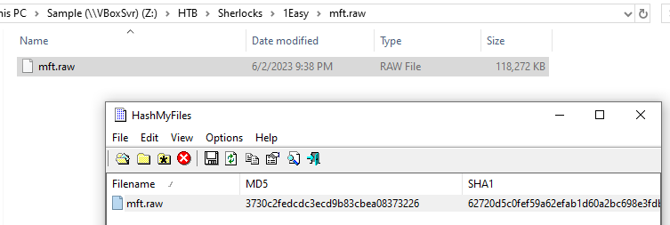
```
3730c2fedcdc3ecd9b83cbea08373226
```

>Task 2: What is the name of the only user on the system?

There are 2 tools from EZ tools that can be used to analyze Master File Table which are
- `MFTCmd.exe` which is a command-line executable program that will parse Master File Table record to CSV file 
- MFTExplorer which is a tool that will display files and folders as if we opened file system but we could not interact with those file since its just records of them 

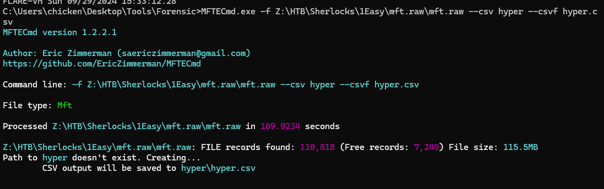

First, I used `MFTCmd.exe` to make my search easy with Timeline Explorer

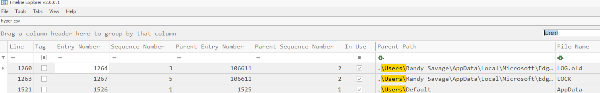

Search for `\Users\` directory then we will have all users on this system

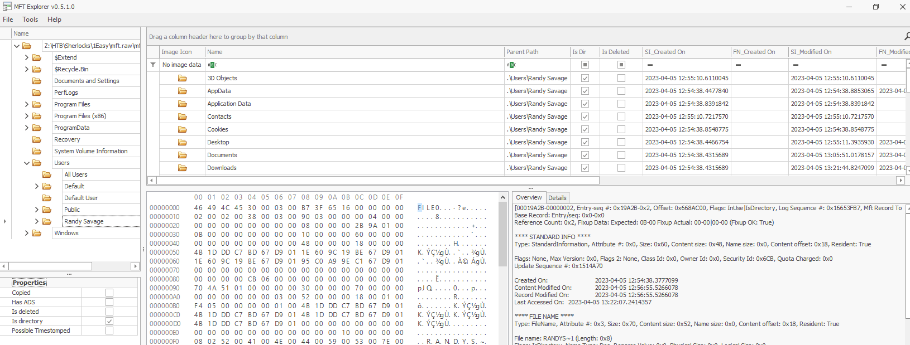

Easier than that? just use MFTExplorer and navigate to this path directly :D

```
Randy Savage
```

>Task 3: What is the name of the malicious HTA that was downloaded by that user?

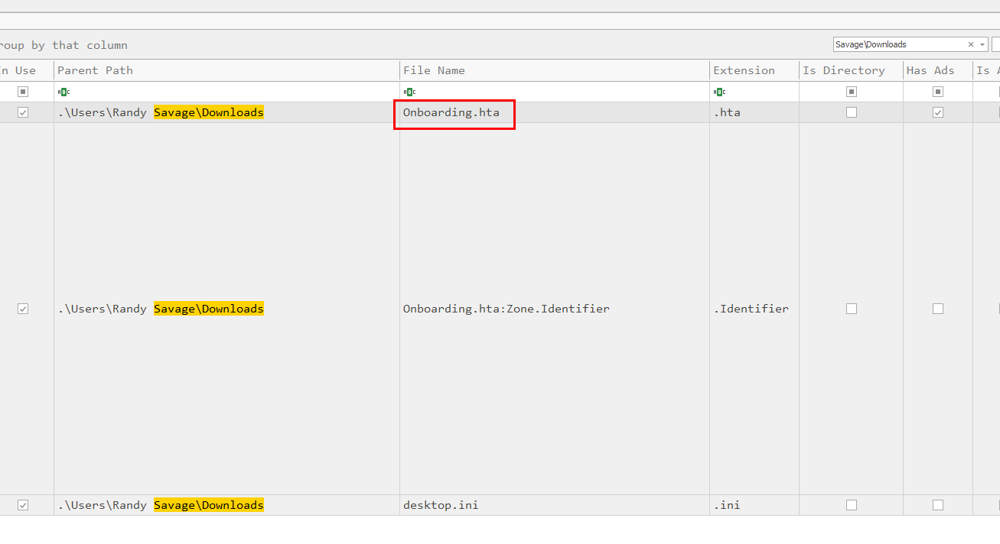

one way to find this is to search for `.hta` file within `Downloads` directory of this user

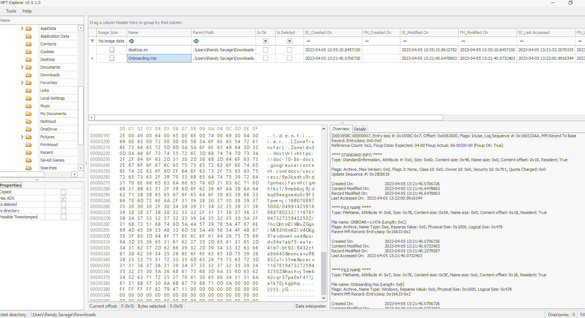

Another way... yep, that was easy

```
Onboarding.hta
```

>Task 4: What is the ZoneId of the download for the malicious HTA file?

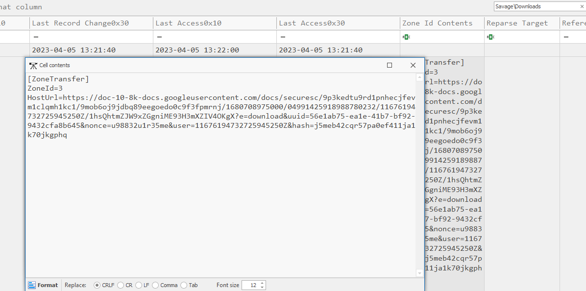

You can get ZoneId from ADS of this file, we can do this by getting Zone Id Contents from csv file or 

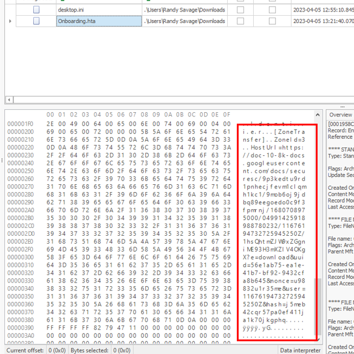

Look at these from hexdump in MFTExplorer

`ZoneId = 3` means that this file was downloaded from the internet and the url is stored in the following `HostUrl` variable 

```
3
```

>Task 5: What is the download URL for the malicious HTA?
```
https://doc-10-8k-docs.googleusercontent.com/docs/securesc/9p3kedtu9rd1pnhecjfevm1clqmh1kc1/9mob6oj9jdbq89eegoedo0c9f3fpmrnj/1680708975000/04991425918988780232/11676194732725945250Z/1hsQhtmZJW9xZGgniME93H3mXZIV4OKgX?e=download&uuid=56e1ab75-ea1e-41b7-bf92-9432cfa8b645&nonce=u98832u1r35me&user=11676194732725945250Z&hash=j5meb42cqr57pa0ef411ja1k70jkgphq
```

>Task 6: What is the allocated size for the HTA file? (bytes)

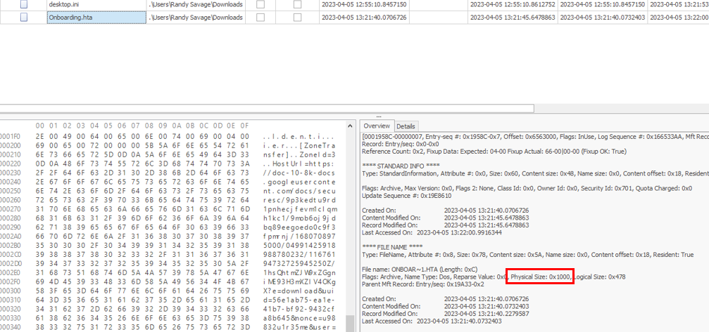
csv file could not answer us with this one, we need to use MFTExplorer and get physical size of this file from here. 

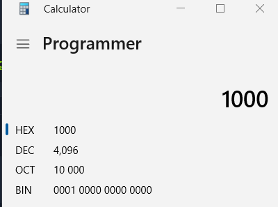
Convert it to demical then we will have allocated size of this file in bytes and demical

```
4096
```

>Task 7: What is the real size of the HTA file? (bytes)

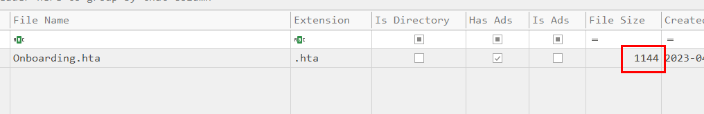
We can convert logical size to demical or just go to csv file for this one

```
1144
```

>Task 8: When was the powerpoint presentation downloaded by the user?

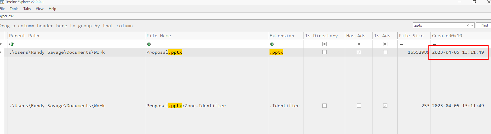

Search for powerpoint file extension `.pptx` with this one then we will have Created0x10 timestamp which is a time that this file was downloaded on this system

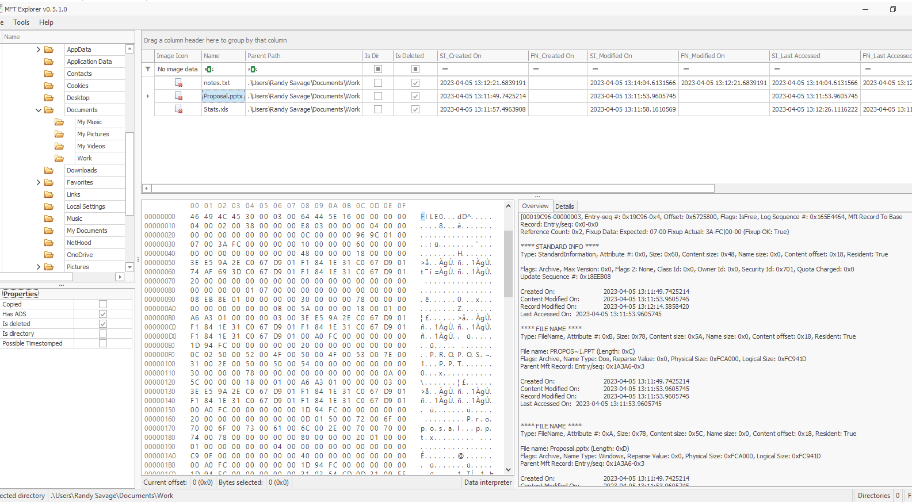

We can also find this one in MFTExplorer since it parsed the same data from MFT but not only that, we found other files resides on this directory as well which will be useful for next task

```
05/04/2023 13:11:49
```

>Task 9: The user has made notes of their work credentials, what is their password?

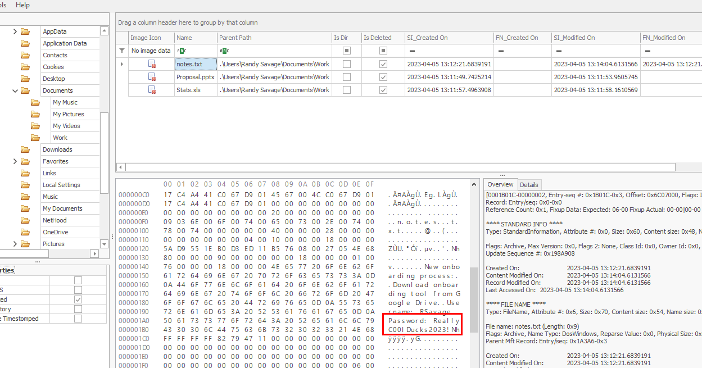

I suspected that `notes.txt` might store this work credentials so I inspected it then we can see that it really contains work credential right here.

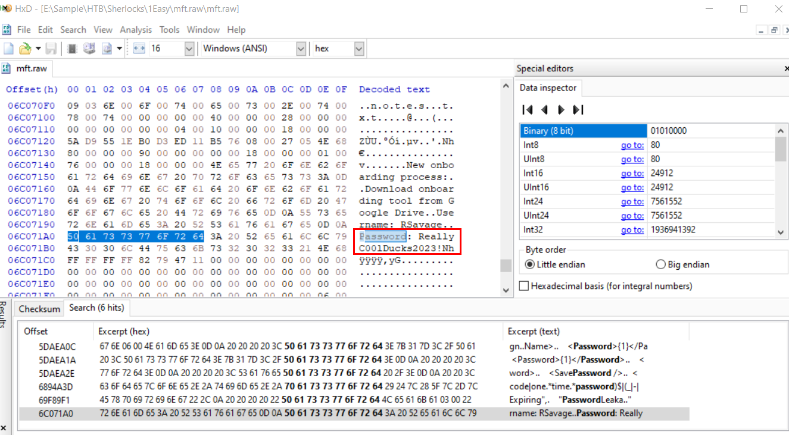

You can also search for password using your local hex editor tool like this

```
ReallyC00lDucks2023!
```

>Task 10: How many files remain under the C:\Users\ directory? (Recursively)

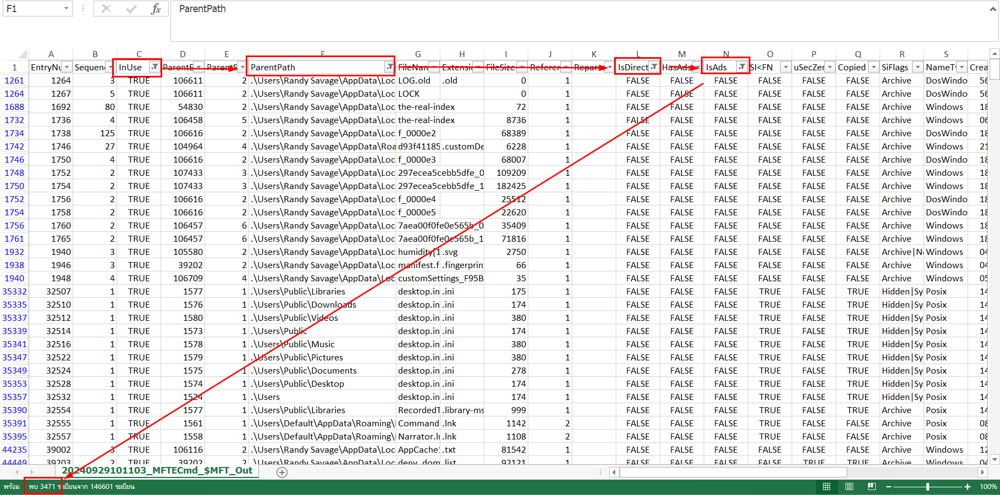

For this one, we need to filter for InUse = TRUE, ParentPath start with `.\Users`, IsDirectory = FALSE and lastly, IsAds = FALSE then we will have total of files on this directory recursively.

```
3471
```


* * *
