# [HackTheBox Sherlocks - Jingle Bell](https://app.hackthebox.com/sherlocks/Jingle%20Bell)
Created: 20/05/2024 18:43
Last Updated: 20/05/2024 19:49
* * *

**Scenario:**
Torrin is suspected to be an insider threat in Forela. He is believed to have leaked some data and removed certain applications from their workstation. They managed to bypass some controls and installed unauthorised software. Despite the forensic team's efforts, no evidence of data leakage was found. As a senior incident responder, you have been tasked with investigating the incident to determine the conversation between the two parties involved.

* * *
>Task 1: Which software/application did Torrin use to leak Forela's secrets?

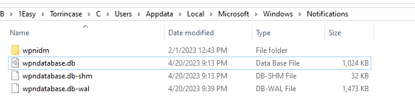
We only have 1 artifact avaliable here which is Windows Notifications database
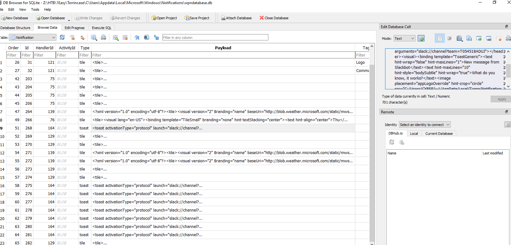
So after opened it with DB Browser for SQLite, go to Notification table and then you will see a lot of slack notification stored here.
```
slack
```

>Task 2: What's the name of the rival company to which Torrin leaked the data?

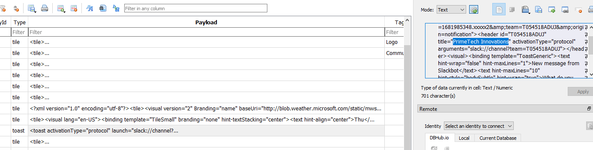
When inspect value inside we can see unfamiliar name which should be the rival company at this point
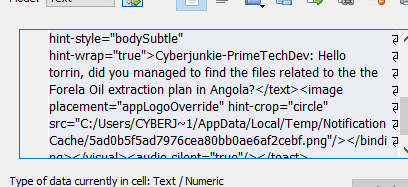
And the one we invited Torrin is Cyberjunkie, the creator of this sherlock
```
PrimeTech Innovations
```

>Task 3: What is the username of the person from the competitor organization whom Torrin shared information with?
```
Cyberjunkie-PrimeTechDev:
```

>Task 4: What's the channel name in which they conversed with each other?

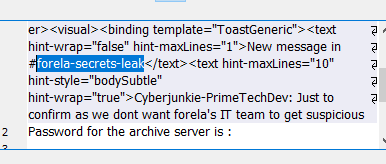
```
forela-secrets-leak
```

>Task 5: What was the password for the archive server?

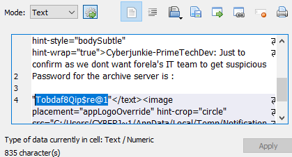
```
Tobdaf8Qip$re@1
```

>Task 6: What was the URL provided to Torrin to upload stolen data to?

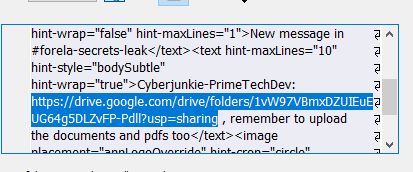
```
https://drive.google.com/drive/folders/1vW97VBmxDZUIEuEUG64g5DLZvFP-Pdll?usp=sharing
```

>Task 7: When was the above link shared with Torrin?

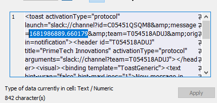
I was too swayed with arrival time in this table but the real one was this which is unix timestamp
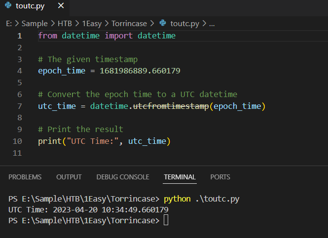
asked ChatGPT to write me a script then here we go
```
from datetime import datetime

# The given timestamp
epoch_time = 1681986889.660179

# Convert the epoch time to a UTC datetime
utc_time = datetime.utcfromtimestamp(epoch_time)

# Print the result
print("UTC Time:", utc_time)
```

```
2023-04-20 10:34:49
```

>Task 8: For how much money did Torrin leak Forela's secrets?

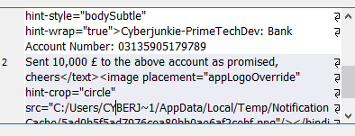
```
£10000
```

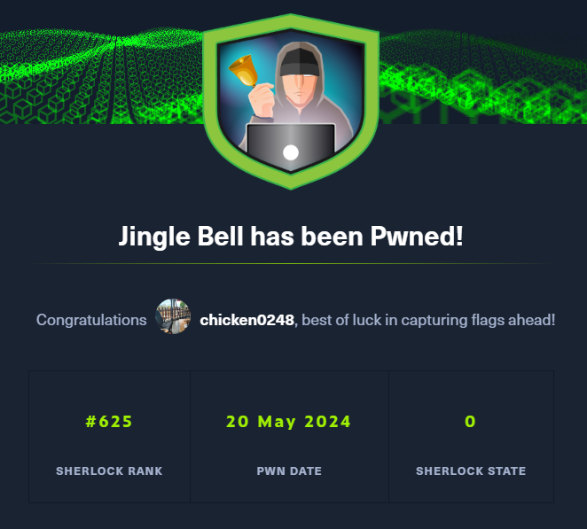
* * *
