# [HackTheBox Sherlocks - Jugglin](https://app.hackthebox.com/sherlocks/Jugglin)
Created: 24/05/2024 19:50
Last Updated: 30/05/2024 23:55
* * *

**Scenario:**
Forela Corporation heavily depends on the utilisation of the Windows Subsystem for Linux (WSL), and currently, threat actors are leveraging this feature, taking advantage of its elusive nature that makes it difficult for defenders to detect. In response, the red team at Forela has executed a range of commands using WSL2 and shared API logs for analysis.

* * *
>Task 1: What was the initial command executed by the insider?

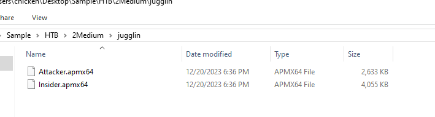
We got 2 apmx64 files, I've never seen this file before so Its time to do my research
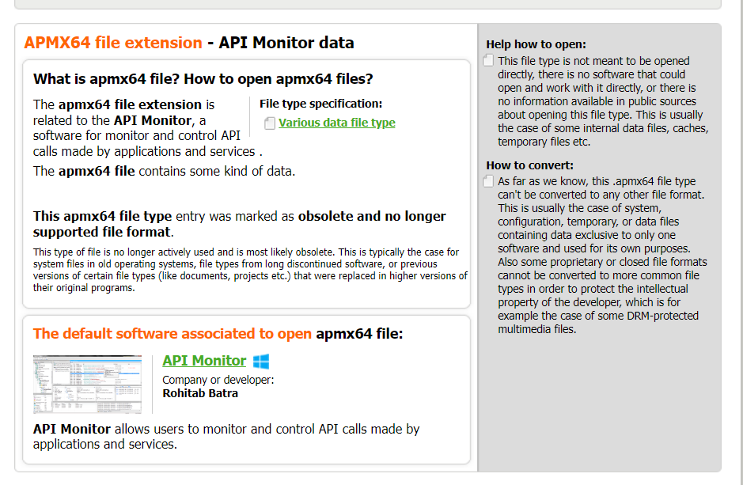
According to [file-extension.org](https://www.file-extensions.org/apmx64-file-extension), these files could be opened with API Monitor and look like we gonna have to investigate API calls

And lucky for us, HackTheBox already posted a blog about [Tracking WSL Activity with API Hooking](https://www.hackthebox.com/blog/tracking-wsl-activity-with-api-hooking) so now we know what and where to look for

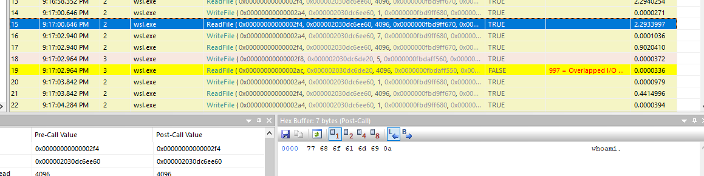
An answer of this question lied in `Attacker.apmx64`
```
whoami
```

>Task 2: Which string function can be intercepted to monitor keystrokes by an insider?

Read the blog the answer this question
```
RtlUnicodeToUTF8N, WideCharToMultiByte
```

>Task 3: Which Linux distribution the insider was interacting with?

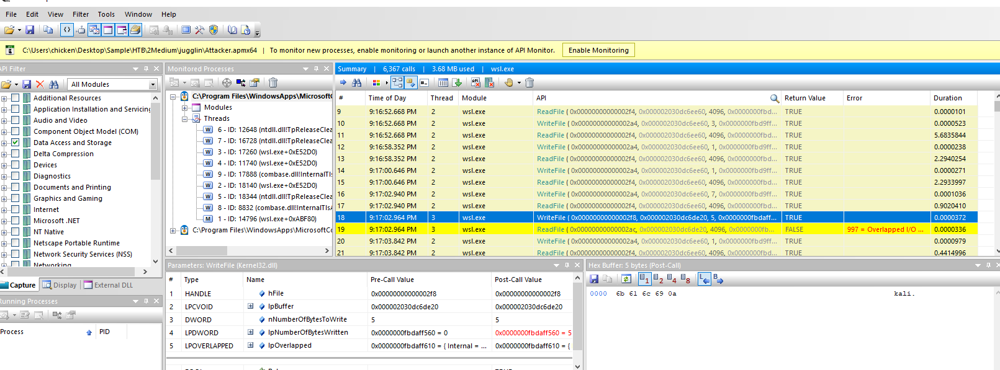
Its kali linux
```
kali
```

>Task 4: Which file did the insider access in order to read its contents?

To be honest, This question was merely a guess and it was correct
```
flag.txt
```

>Task 5: Submit the first flag.

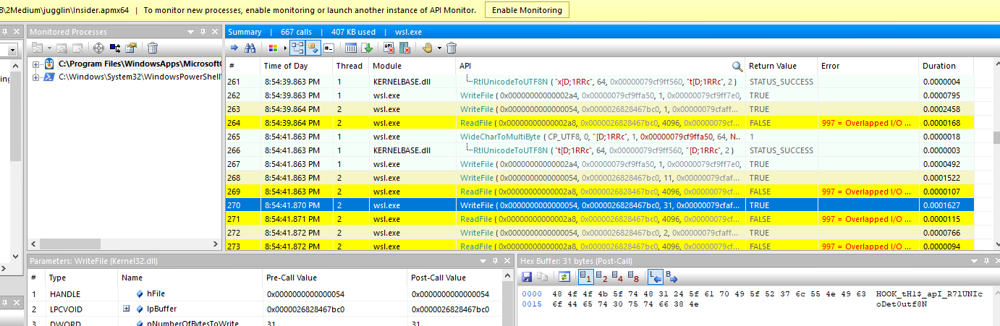
```
HOOK_tH1$_apI_R7lUNIcoDet0utf8N
```

>Task 6: Which PowerShell module did the insider utilize to extract data from their machine?

```
Invoke-WebRequest
```

>Task 7: Which string function can be intercepted to monitor the usage of Windows tools via WSL by an insider?

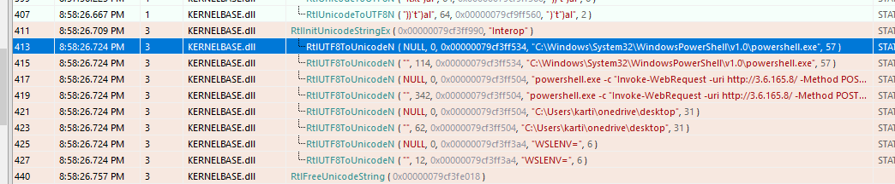
```
RtlUTF8ToUnicodeN
```

>Task 8: The insider has also accessed 'confidential.txt'. Please provide the second flag for submission.

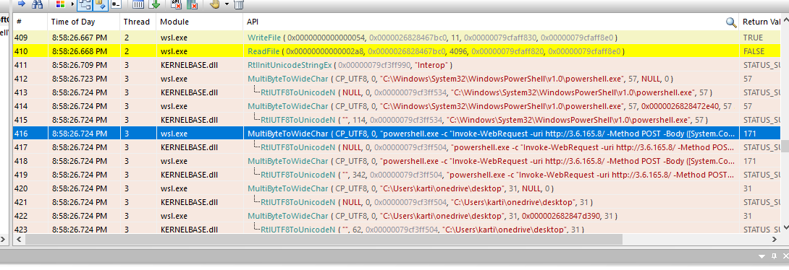
So now we know that an insider used powershell to upload confidential.txt to attacker's hosted website
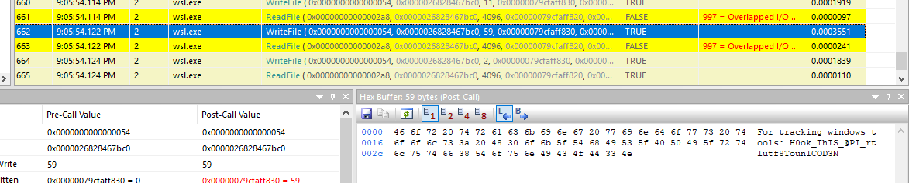
At the end of API events, we will eventually obtain this flag 
```
H0ok_ThIS_@PI_rtlutf8TounICOD3N
```

>Task 9: Which command executed by the attacker resulted in a 'not found' response?

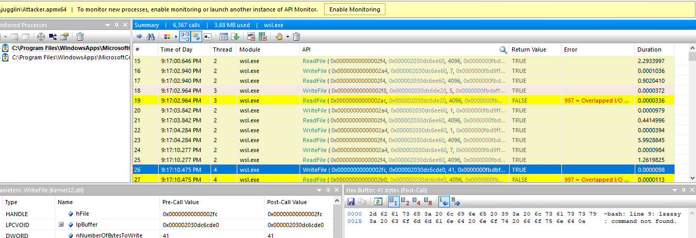
```
lsassy
```

>Task 10: Which link was utilized to download the 'lsassy' binary?

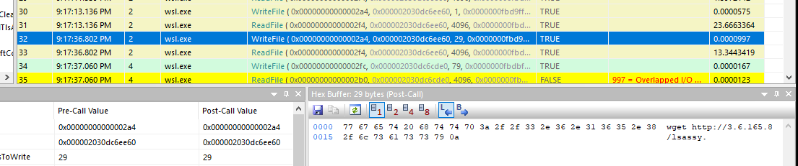
An attacker using wget to fetch this url
```
http://3.6.165.8/lsassy
```

>Task 11: What is the SHA1 hash of victim 'user' ?

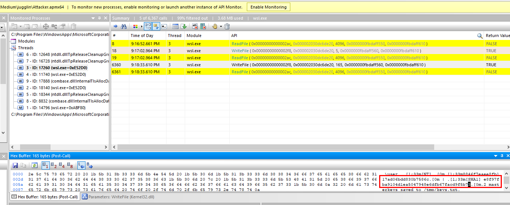
Find any WriteFile API then we finally see that user's masterkey was saved to keys.txt and his SHA1 was shown here too
```
e8f97fba9104d1ea5047948e6dfb67facd9f5b73
```

>Task 12: When an attacker utilizes WSL2, which WIN32 API would you intercept to monitor its behavior?
```
WriteFile
```

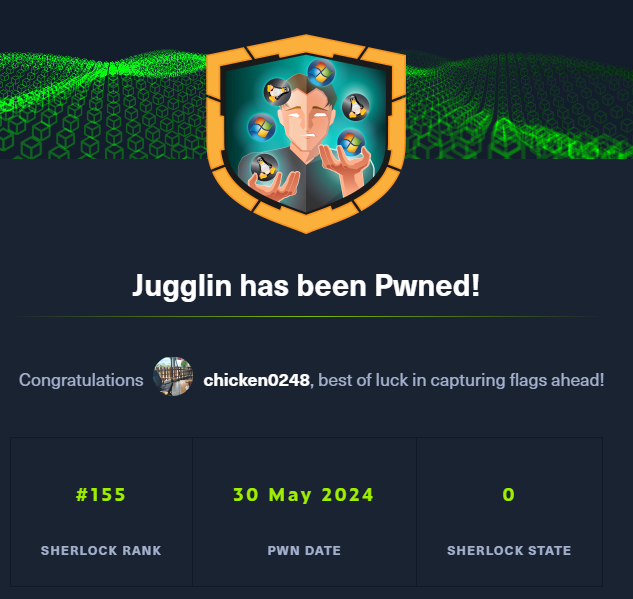
* * *
