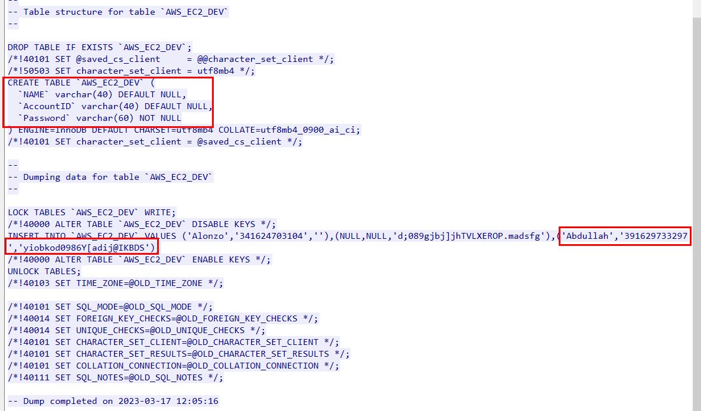
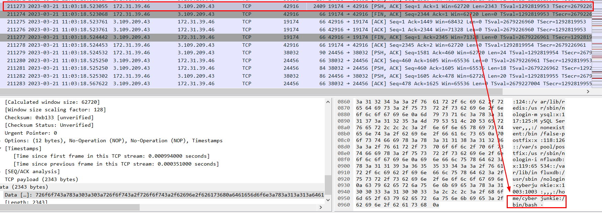
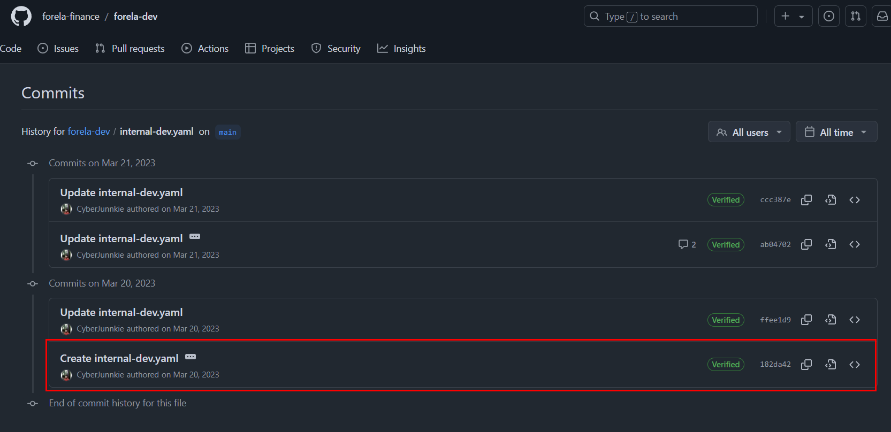

# [HackTheBox Sherlocks - Knock Knock](https://app.hackthebox.com/sherlocks/Knock%20Knock)

**Scenario:**
A critical Forela Dev server was targeted by a threat group. The Dev server was accidentally left open to the internet which it was not supposed to be. The senior dev Abdullah told the IT team that the server was fully hardened and it's still difficult to comprehend how the attack took place and how the attacker got access in the first place. Forela recently started its business expansion in Pakistan and Abdullah was the one IN charge of all infrastructure deployment and management. The Security Team need to contain and remediate the threat as soon as possible as any more damage can be devastating for the company, especially at the crucial stage of expanding in other region. Thankfully a packet capture tool was running in the subnet which was set up a few months ago. A packet capture is provided to you around the time of the incident (1-2) days margin because we don't know exactly when the attacker gained access. As our forensics analyst, you have been provided the packet capture to assess how the attacker gained access. Warning : This Sherlock will require an element of OSINT to complete fully.

* * *
>Task 1: Which ports did the attacker find open during their enumeration phase?


After opened pcap file on Wireshark, I reviewed question again and thought that it has to be port scanning so I started to find for an IP address that keep sending multiple SYN packets to different ports on the same IP address which we can see that `3.109.209.43` conducted port scanning on `172.31.39.46` (so this would be Forela Dev server)


If a port is opened then it would send SYN, ACK packet back so we could filter with `ip.addr == 172.31.39.46 && frame.number >= 76081 && frame.number <= 207174 && tcp.flags == 0x012` which will see that there are 5 opened ports on Forela Dev server.

```
21,22,3306,6379,8086
```

>Task 2: Whats the UTC time when attacker started their attack against the server?


Go back to where the attacker started sending SYN packet to port 1 on the server then we will have the answer of this question.
```
21/03/2023 10:42:23
```

>Task 3: What's the MITRE Technique ID of the technique attacker used to get initial access?


So we know that the port scan activity ended at packet 207174 so we could use `ip.addr == 3.109.209.43 && frame.number >= 207174` to find out what happened after that from the attacker IP address which we can see that there are multiple communication on port 21 (FTP)


After take a look at one of these stream, we could see that the attacker tried to authenticate with different username and password so... it is a password spray attack.

```
T1110.003
```

>Task 4: What are valid set of credentials used to get initial foothold?


We can search for FTP Status 230 Login Successful then we follow that stream to get valid credential used to get initial foothold.


```
tony.shephard:Summer2023!
```

>Task 5: What is the Malicious IP address utilized by the attacker for initial access?
```
3.109.209.43
```

>Task 6: What is name of the file which contained some config data and credentials?


Since the attacker gained access to FTP server so I suspected there should be a file transfer happened and I was right, `.backup` file was downloaded from FTP server. 


After carefully review the content of this file, I recognized that this is back up of `/etc/knockd.conf` file which used for port knocking service which reveals Internal FTP server that has to be knocked on port 29999, 50234, 45087 first then firewall will let that IP communicate to port 24456 that host internal FTP server and we can also see credential that can be used with this internal FTP server at the end of this file.

You can read more about Port Knocking [here](https://medium.com/@reotmani/port-knocking-dbe6d8aaeb9)

```
.backup
```

>Task 7: Which port was the critical service running?


```
24456
```

>Task 8: Whats the name of technique used to get to that critical service?


We can go back to Wireshark and we could see that the attacker knocked 29999, 50234, 45087 ports in order then finally established connection to internal FTP server on port 24456. 

```
Port Knocking
```

>Task 9: Which ports were required to interact with to reach the critical service?
```
29999,45087,50234
```

>Task 10: Whats the UTC time when interaction with previous question ports ended?

Enter the timestamp of last port that was knocked
```
21/03/2023 10:58:50
```

>Task 11: What are set of valid credentials for the critical service?

We already know that the attacker already obtained valid credential for internal FTP server but to confirm if this credential was actually used then we can use this filter `ip.addr == 3.109.209.43 && frame.number >= 207174 && tcp.port==24456` and follow TCP stream to find out what happened after the attacker established connection to port 24456


We can see that this credential was used to authenticate here as expected.

```
abdullah.yasin:XhlhGame_90HJLDASxfd&hoooad
```

>Task 12: At what UTC Time attacker got access to the critical server?


We have to find the packet that sent message "230 Login successful" to user which is frame 210799 so we could use this timestamp to answer this question.
```
21/03/2023 11:00:01
```

>Task 13: Whats the AWS AccountID and Password for the developer "Abdullah"?


After authenticated, the attacker downloaded several files from this FTP server, first one is this sql file


To get the content of this file, we need to go to frame 211114 and follow TCP stream



This sql file is used to create AWS_EC2_DEV table with name, accountID and password that will be inserted into after that and we could see AWS AccountID and Password of "Abdullah" right there.

```
391629733297:yiobkod0986Y[adij@IKBDS
```

>Task 14: Whats the deadline for hiring developers for forela?


Second file that was downloaded is `Tasks to get Done.docx` file.


Go to stream 211158 or 211159 then follow TCP stream.


Since we need to export this file so we have to click "Save as..." and name it as you want but it has to be open as docx file.


After exported this file out, opened it then we can see deadline of 4 activitities including hiring developers one.

```
30/08/2023
```

>Task 15: When did CEO of forela was scheduled to arrive in pakistan?


The third file that was downloaded is `reminder.txt`.


Go to frame 211188 to read the content of this text file.


We can see that CEO Happy will arrive in pakistan on 8 march 2023.

```
08/03/2023
```

>Task 16: The attacker was able to perform directory traversel and escape the chroot jail.This caused attacker to roam around the filesystem just like a normal user would. Whats the username of an account other than root having /bin/bash set as default shell?


To answer this question, we will have to inspect `/etc/passwd` file that was downloaded by the attacker.



Go to frame 211273 and follow the stream.


We can see that beside from root, cyberjunkie is the user that has /bin/bash as default shell.

```
cyberjunkie
```

>Task 17: Whats the full path of the file which lead to ssh access of the server by attacker?


The attacker navigated to `/opt/reminders` and then downloaded `.reminder` file so lets see whats inside this file that let attacker gain access server via SSH.


its on frame 211605 which we can see that there is a GitHub repo that might contain SSH credential that the attacker found out and used that credential to gain access to server.

```
/opt/reminders/.reminder
```

>Task 18: Whats the SSH password which attacker used to access the server and get full access?


Went to GitHub and search for folera repo then we will see that `folela-finance/forela-dev` might be the one we are looking for.


There is a yaml file for ansible playbook right here which will download key from url then use that key to authenticate to SSH and doing some operations after that but where is SSH password?.



Lets take a look at commit history when it created.


We can see that there is SSH password when this repo was created and the attacker used this to access server.

```
YHUIhnollouhdnoamjndlyvbl398782bapd
```

>Task 19: Whats the full url from where attacker downloaded ransomware?


Since we could not read SSH traffic so what left is to find any connection happened during these communication which indicated file downloading and there is one right there!


The attacker download zip file that might contain ransomware using wget 

```
้้http://13.233.179.35/PKCampaign/Targets/Forela/Ransomware2_server.zip
```

>Task 20: Whats the tool/util name and version which attacker used to download ransomware?
```
Wget/1.21.2
```

>Task 21: Whats the ransomware name?


I almost exported this file out but then I keep scrolling to the bottom and found that there is a "GonnaCry" directory so the ransomware that was downloaded is GonnaCry ransomware 

```
GonnaCry
```


* * *
