# [HackTheBox Sherlocks - Litter](https://app.hackthebox.com/sherlocks/Litter)
Created: 29/09/2024 10:26
Last Updated: 29/09/2024 18:03
* * *

**Scenario:**
Khalid has just logged onto a host that he and his team use as a testing host for many different purposes. It’s off their corporate network but has access to lots of resources on the network. The host is used as a dumping ground for a lot of people at the company, but it’s very useful, so no one has raised any issues. Little does Khalid know; the machine has been compromised and company information that should not have been on there has now been stolen – it’s up to you to figure out what has happened and what data has been taken.

* * *
>Task 1: At a glance, what protocol seems to be suspect in this attack?

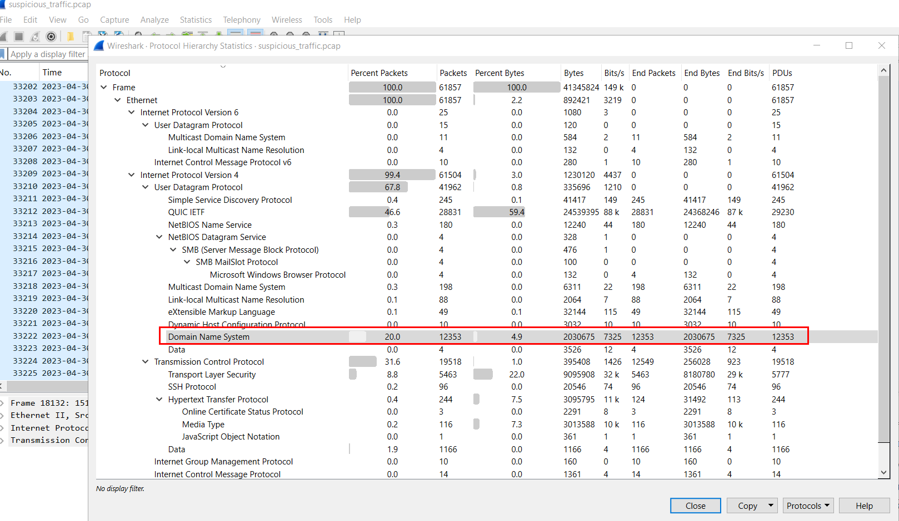
So after opened provided network pcap file, first thing I noticed is the suspicious high DNS traffic since you will not see these much since its just for DOMAIN NAME RESOLUTION so DNS exfiltration or DNS tunneling could happened during this capture.
```
DNS
```

>Task 2: There seems to be a lot of traffic between our host and another, what is the IP address of the suspect host?

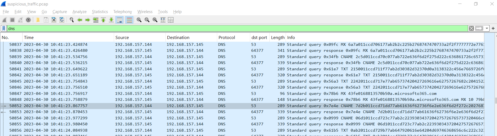

Now lets filter for DNS protocol to confirm our suspicion which we will see that 192.168.157.144 kept query with weird subdomain to 192.168.157.155 on port 53 so we could say that suspect host is C2 server of the threat actor that will receive encoded data via DNS query.

```
192.168.157.145
```

>Task 3: What is the first command the attacker sends to the client?

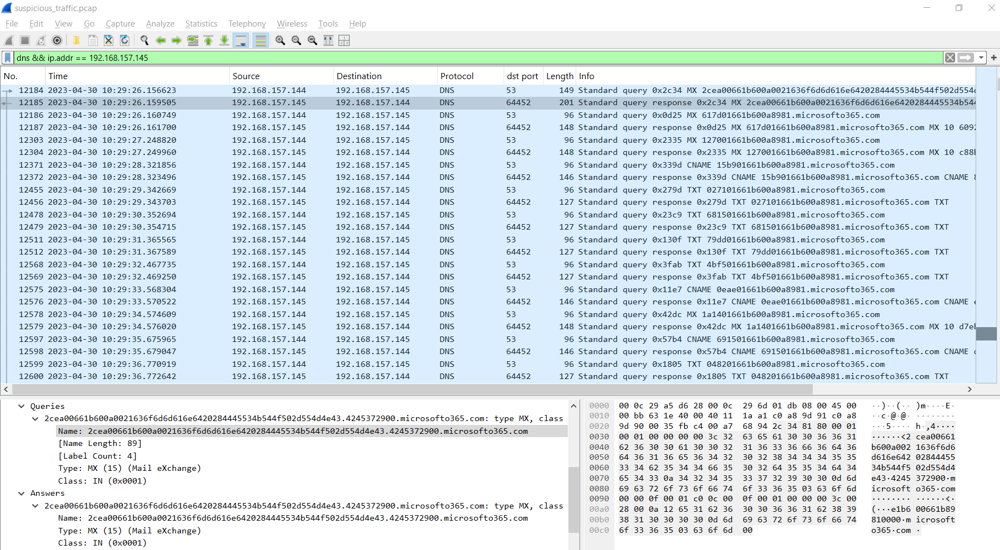

So lets pick one of these weird DNS query and decode it using CyberChef

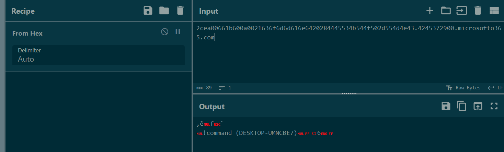

Put name query into Input field and use "From Hex" recipe then we can see content that was sent to threat actor C2 server.

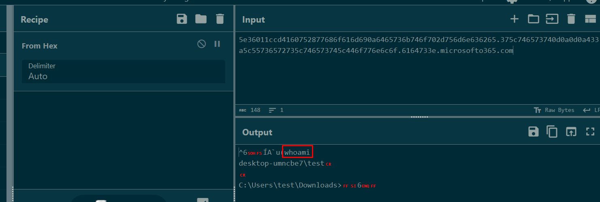

Then we will have the first command used by threat actor from packet 14757 that is `whoami` 

```
whoami
```

>Task 4: What is the version of the DNS tunneling tool the attacker is using?

Since there are a lot of DNS queries so go through each one of them with Wireshark could be a pain in the ass but luckily for us that TSHARK got us back.

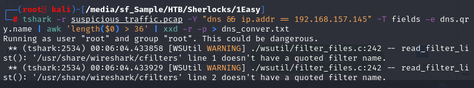

Since we already know that we need to get DNS query name sent to 192.168.157.145 and we need to filter out some noises then after that we need to decode them from hex to ASCII which I will pipe it to text file

here is the command I used for this 
`tshark -r suspicious_traffic.pcap -Y "dns && ip.addr == 192.168.157.145" -T fields -e dns.qry.name | awk 'length($0) > 36' | xxd -r -p > dns_conver.txt`

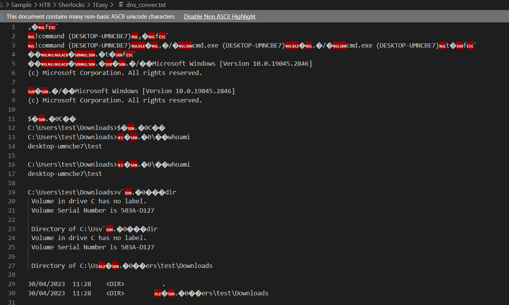

Now its a lot better then manually pick each standing out dns query name and put them in CyberChef, we can see the entire terminal when threat actor interacted with victim host

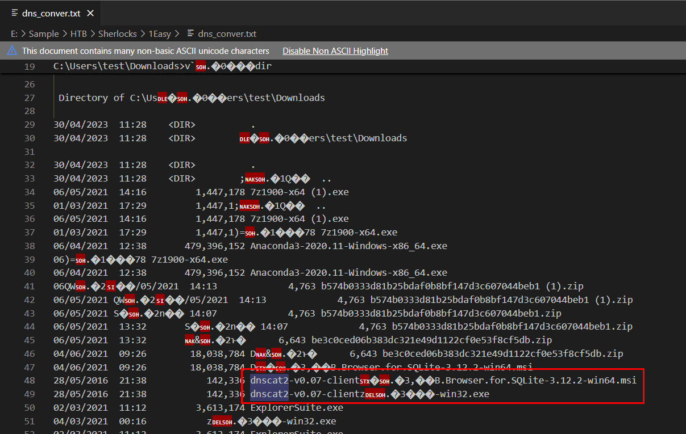

Now after we carefully reviewed files in test's user download directory, we will see [dnscat2](https://github.com/iagox86/dnscat2) tool were there as well

**What is dnscat2?**
Its a tool that will make DNS tunneling which will create encrypted channel for C2 communication which was designed to run on client machine so thats why we can see it here.

```
0.07
```

>Task 5: The attackers attempts to rename the tool they accidentally left on the clients host. What do they name it to?

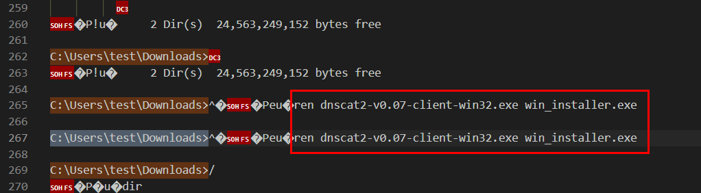

Scrolling down for a bit then we will see that the threat actor renamed dnscat2 executable file to other name that look legitimate.

```
win_installer.exe
```

>Task 6: The attacker attempts to enumerate the users cloud storage. How many files do they locate in their cloud storage directory?

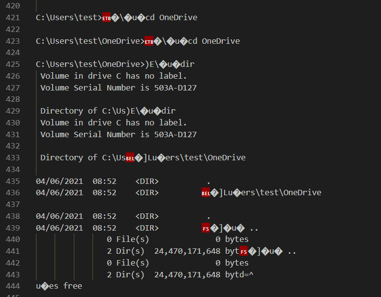

After that threat actor explored many directories on infected machine including OneDrive which is cloud storage service of Microsoft which there is no file located in this directory at all.
```
0
```

>Task 7: What is the full location of the PII file that was stolen?

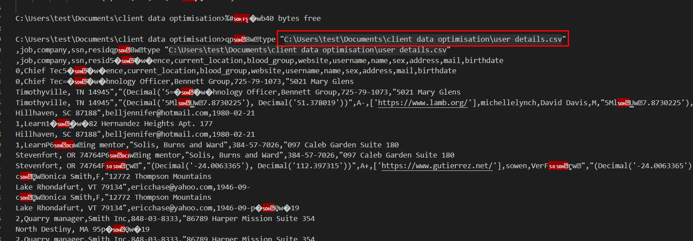

Scrolling down for a bit, We can see a lot of struggling to read confidential file from the threat actor because Windows need absolute path inside a quote to access any files and folders with space in it names

But the threat actor eventually got it and it shows PII of user from this csv file

```
C:\Users\test\Documents\client data optimisation\user details.csv
```

>Task 8: Exactly how many customer PII records were stolen?


We know that it has index start from 0 so we will have to scroll to the bottom of this and find the last number and add 1 and that will be the number of user details stores on that csv file.

```
721
```

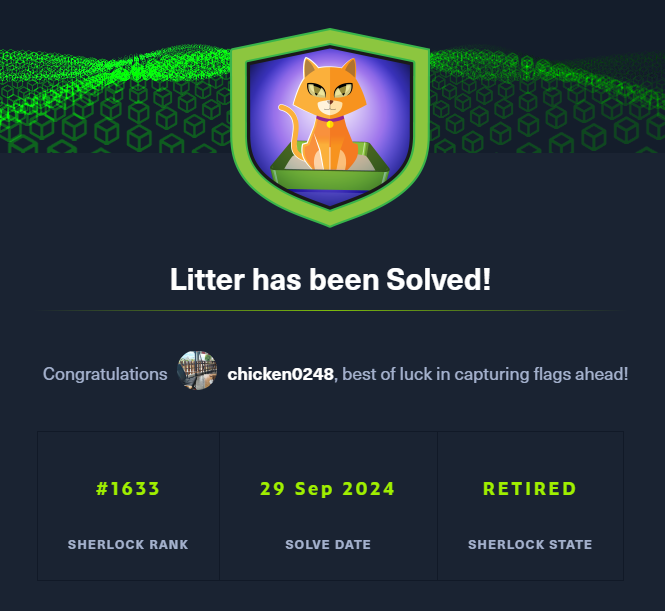
* * *
