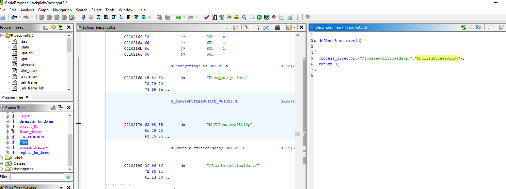

# [HackTheBox Sherlocks - Lockpick](https://app.hackthebox.com/sherlocks/Lockpick)
Created: 21/05/2024 18:08
Last Updated: 21/05/2024 20:53
* * *

**Scenario:**
Forela needs your help! A whole portion of our UNIX servers have been hit with what we think is ransomware. We are refusing to pay the attackers and need you to find a way to recover the files provided. Warning This is a warning that this Sherlock includes software that is going to interact with your computer and files. This software has been intentionally included for educational purposes and is NOT intended to be executed or used otherwise. Always handle such files in isolated, controlled, and secure environments. Once the Sherlock zip has been unzipped, you will find a DANGER.txt file. Please read this to proceed.

* * *
>Task 1: Please confirm the encryption key string utilised for the encryption of the files provided?


We got a ransomware and its casualties inside "forela-criticaldata" folder so I did some research about it and found [this encyclopedia from Trend Micro](https://www.trendmicro.com/vinfo/us/threat-encyclopedia/malware/Ransom.Linux.BESTWOFOUR.A)

Well it still couldn't tell us how to decrypt those files and find a key so we will have to decompile it

I checked the complier with Detect It Easy first and since it was compiled using GCC then I can use Ghidra

There is one function calls inside main() which pass 2 arguments, first argument look like an output of files that will be encrypted and second argument does look like an encryption key

Inside process_directory(), there is other one function calls to encrypt file and it also pass second argument to this function which mean we're correct about the key
```
bhUlIshutrea98liOp
```

>Task 2: We have recently recieved an email from wbevansn1@cocolog-nifty.com demanding to know the first and last name we have him registered as. They believe they made a mistake in the application process. Please confirm the first and last name of this applicant.


We got a key and algorithm then its time for ChatGPT to write decryption script for us which it gave me c script so I asked it to convert to python (its easier for me) then we have this script
```
import os

def decrypt_file(encrypted_file):
    key = "bhUlIshutrea98liOp"  # The provided encryption key

    try:
        # Open the encrypted file in binary read mode
        with open(encrypted_file, 'rb') as f:
            file_data = f.read()
        
        # Decrypt the file data using XOR with the key
        key_length = len(key)
        decrypted_data = bytearray()
        for i in range(len(file_data)):
            decrypted_data.append(file_data[i] ^ ord(key[i % key_length]))
        
        # Create the original file name by removing the .24bes extension
        original_file = encrypted_file[:-6]  # Remove the last 6 characters (.24bes)
        
        # Write the decrypted data back to the original file
        with open(original_file, 'wb') as f:
            f.write(decrypted_data)
        
        # Delete the encrypted file and the note file
        os.remove(encrypted_file)
        note_file = f"{encrypted_file}_note.txt"
        if os.path.exists(note_file):
            os.remove(note_file)
        
        print(f"Decryption successful. Original file restored: {original_file}")

    except Exception as e:
        print(f"An error occurred: {e}")

if __name__ == "__main__":
    import sys
    if len(sys.argv) != 2:
        print(f"Usage: {sys.argv[0]} <encrypted_file>")
    else:
        decrypt_file(sys.argv[1])
```

Everything is already explained by comments so lets use this script to test first file and look like it worked without a bug

Its flawless, After confirmed how successful this script is then I made ChatGPT edit decryption script one last time which make it decrypt all files by default 

now all files are decrypted

Next I used `grep -r "wbevansn1@cocolog-nifty.com" .` to find this particular mail and look like it stores in sql file
```
Walden Bevans
```

>Task 3: What is the MAC address and serial number of the laptop assigned to Hart Manifould?


It has to be in `it_assets.xml` but.. it does look messy so once again I asked ChatGPT to wrtie a beautify XML script for me
```
import xml.dom.minidom
import argparse

def beautify_xml(input_file, output_file=None):
    try:
        # Read the XML file
        with open(input_file, 'r') as f:
            xml_content = f.read()

        # Parse the XML content
        dom = xml.dom.minidom.parseString(xml_content)

        # Beautify the XML content
        pretty_xml_as_string = dom.toprettyxml()

        # Write the beautified XML content to the output file
        if output_file is None:
            output_file = input_file

        with open(output_file, 'w') as f:
            f.write(pretty_xml_as_string)

        print(f"Beautified XML content has been written to {output_file}")

    except Exception as e:
        print(f"An error occurred: {e}")

if __name__ == "__main__":
    parser = argparse.ArgumentParser(description='Beautify XML content in a file.')
    parser.add_argument('input_file', help='Path to the input XML file')
    parser.add_argument('-o', '--output', dest='output_file', help='Path to the output XML file (optional)')
    
    args = parser.parse_args()
    
    beautify_xml(args.input_file, args.output_file)
```

Now we can search thing with less much brain hurt


```
E8-16-DF-E7-52-48, 1316262
```

>Task 4: What is the email address of the attacker?


an answer lies in ransomnote
```
bes24@protonmail.com
```

>Task 5: City of London Police have suspiciouns of some insider trading taking part within our trading organisation. Please confirm the email address of the person with the highest profit percentage in a single trade alongside the profit percentage.


Once i opened this file, its time for ChatGPT again i guess?
```
import json
import argparse
from decimal import Decimal

def find_highest_profit(json_file):
    try:
        # Read the JSON file
        with open(json_file, 'r') as f:
            data = json.load(f, parse_float=Decimal)

        # Check if data is a dictionary
        if not isinstance(data, dict):
            print("The JSON file should contain a dictionary of records.")
            return

        # Find the record with the highest profit_percentage
        highest_profit_key = max(data, key=lambda k: data[k].get('profit_percentage', Decimal('-inf')))
        highest_profit_record = data[highest_profit_key]

        # Print the record with the highest profit percentage
        print("Record with the highest profit percentage:")
        print(json.dumps(highest_profit_record, indent=4, default=str))

    except FileNotFoundError:
        print(f"The file {json_file} does not exist.")
    except json.JSONDecodeError:
        print(f"The file {json_file} is not a valid JSON file.")
    except Exception as e:
        print(f"An error occurred: {e}")

if __name__ == "__main__":
    parser = argparse.ArgumentParser(description='Find the record with the highest profit percentage in a JSON file.')
    parser.add_argument('json_file', help='Path to the JSON file')
    
    args = parser.parse_args()
    
    find_highest_profit(args.json_file)
```

I asked it to write me finding the highest profile percent in JSON with pretty accurate demical point then after i executed, it worked  
```
fmosedale17a@bizjournals.com, 142303.1996053929628411706675436
```

>Task 6: Our E-Discovery team would like to confirm the IP address detailed in the Sales Forecast log for a user who is suspected of sharing their account with a colleague. Please confirm the IP address for Karylin O'Hederscoll.


We need to search just Firstname or Surname then we will have her IP address
```
8.254.104.208
```

>Task 7: Which of the following file extensions is not targeted by the malware? `.txt, .sql,.ppt, .pdf, .docx, .xlsx, .csv, .json, .xml`

I suddenly thought of [trend micro encyclopedia](https://www.trendmicro.com/vinfo/us/threat-encyclopedia/malware/Ransom.Linux.BESTWOFOUR.A)

it does not encrypt PowerPoint file 

or we can go back to Ghidra, in process_directory()
```
.ppt
```

>Task 8: We need to confirm the integrity of the files once decrypted. Please confirm the MD5 hash of the applicants DB.


Put everything in HashMyFiles from Nirsoft then you got all the answer from this task to task 10
```
f3894af4f1ffa42b3a379dddba384405
```

>Task 9: We need to confirm the integrity of the files once decrypted. Please confirm the MD5 hash of the trading backup.
```
87baa3a12068c471c3320b7f41235669
```

>Task 10: We need to confirm the integrity of the files once decrypted. Please confirm the MD5 hash of the complaints file.
```
c3f05980d9bd945446f8a21bafdbf4e7
```


* * *
