# [HackTheBox Sherlocks - Logjammer](https://app.hackthebox.com/sherlocks/Logjammer)
Created: 22/05/2024 10:47
Last Updated: 22/05/2024 13:03
* * *
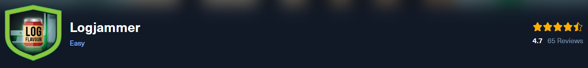
**Scenario:**
You have been presented with the opportunity to work as a junior DFIR consultant for a big consultancy. However, they have provided a technical assessment for you to complete. The consultancy Forela-Security would like to gauge your Windows Event Log Analysis knowledge. We believe the Cyberjunkie user logged in to his computer and may have taken malicious actions. Please analyze the given event logs and report back.

* * *
>Task 1: When did the cyberjunkie user first successfully log into his computer? (UTC)

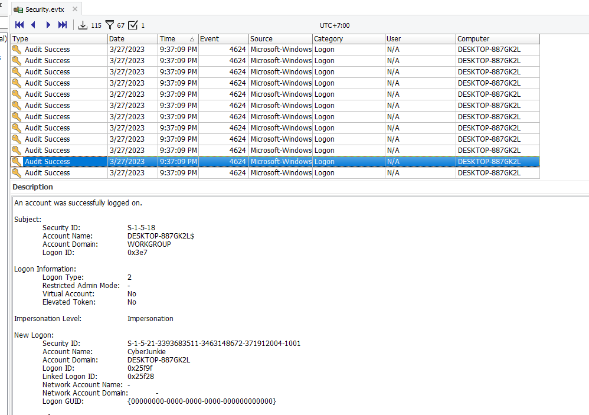
To find an event log about login, we will need to filter with Event ID 4624 ([An account was successfully logged on](https://www.ultimatewindowssecurity.com/securitylog/encyclopedia/event.aspx?eventid=4624)) on Security log then sort by Date and Time and find the first logged in successful of this user

Its 09:37:09 PM (21:37:09) on my PC which is UTC +7 if we convert back we would be 02:37:09 PM (14:37:09)
```
27/03/2023 14:37:09
```

>Task 2: The user tampered with firewall settings on the system. Analyze the firewall event logs to find out the Name of the firewall rule added?

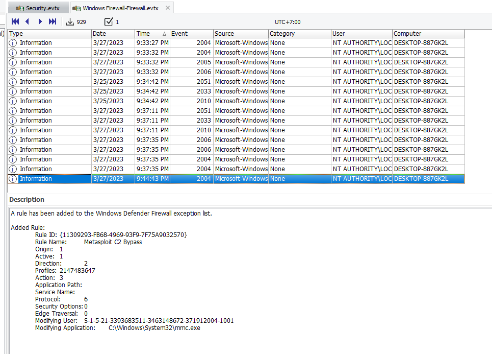
We need to opened Firewall log and go to the time that User was logged on 

You can see that this rule clearly stated what the intention of it which is a rule for metasploit to accept receive a connection from infected PC
```
Metasploit C2 Bypass
```

>Task 3: Whats the direction of the firewall rule?

Rule was for C2 bypass mean an internal network needed to be interact with external network so it is outbound traffic
```
Outbound
```

>Task 4: The user changed audit policy of the computer. Whats the Subcategory of this changed policy?

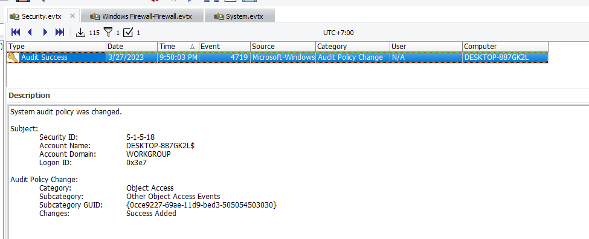
Filter Event ID 4719 ([System audit policy was changed](https://www.ultimatewindowssecurity.com/securitylog/encyclopedia/event.aspx?eventid=4719)) on Security log

There is only 1 record of this Event ID so we don't need to look that far 
```
Other Object Access Events
```

>Task 5: The user "cyberjunkie" created a scheduled task. Whats the name of this task?

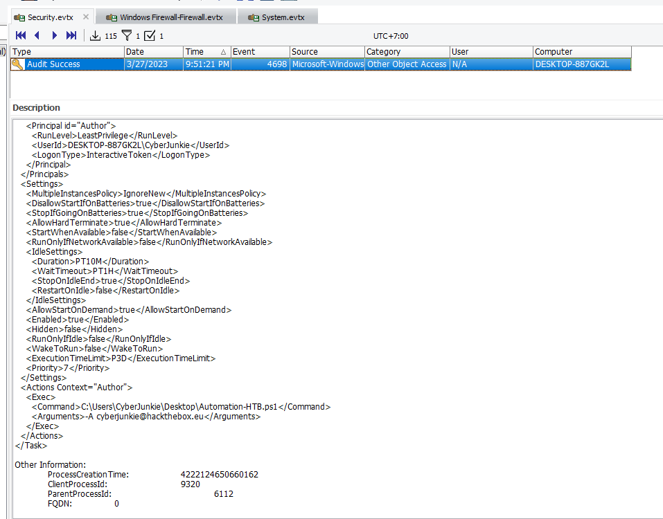
Filter Event ID 4698 ([A scheduled task was created](https://www.ultimatewindowssecurity.com/securitylog/encyclopedia/event.aspx?eventid=4698)) on Security log

You can see that this "user" created a schedule task to execute powershell script with specific argument
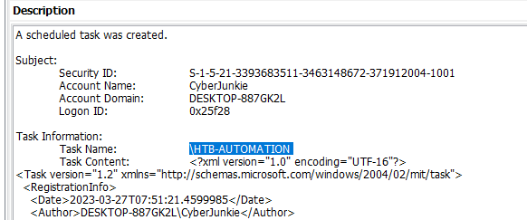
```
HTB-AUTOMATION
```

>Task 6: Whats the full path of the file which was scheduled for the task?
```
C:\Users\CyberJunkie\Desktop\Automation-HTB.ps1
```

>Task 7: What are the arguments of the command?
```
-A cyberjunkie@hackthebox.eu
```

>Task 8: The antivirus running on the system identified a threat and performed actions on it. Which tool was identified as malware by antivirus?

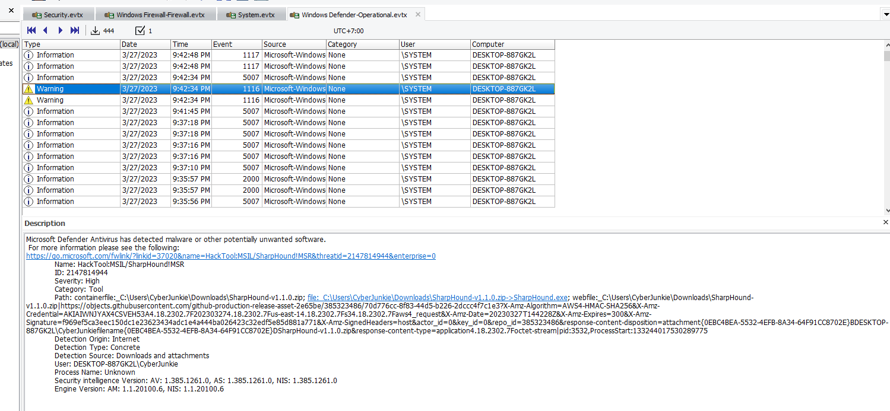
Go to Windows Defender log, Warning type log totally caught my eyes and it caught Sharphound (a tool for collecting information from domain controllers, used for AD pentesting and AD attacks)
```
Sharphound
```

>Task 9: Whats the full path of the malware which raised the alert?
```
C:\Users\CyberJunkie\Downloads\SharpHound-v1.1.0.zip
```

>Task 10: What action was taken by the antivirus?

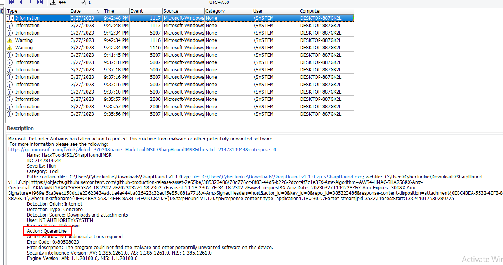
```
Quarantine
```

>Task 11: The user used Powershell to execute commands. What command was executed by the user?

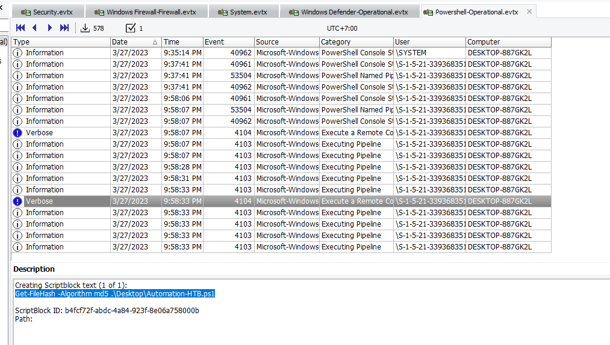
Opened Powershell log then find Verbose type log which will log what commands that executed by user and look like user was trying to identify integrity of a powershell script here
```
Get-FileHash -Algorithm md5 .\Desktop\Automation-HTB.ps1
```

>Task 12: We suspect the user deleted some event logs. Which Event log file was cleared?

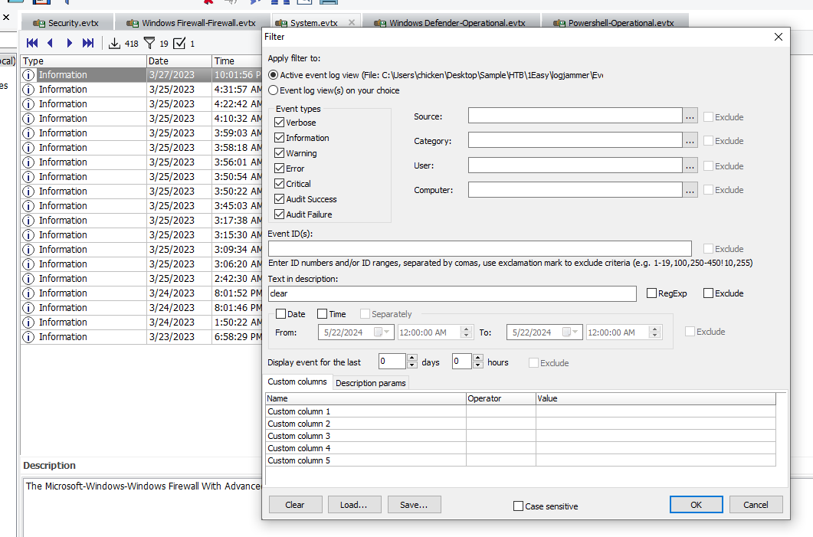
I used description search for this one and I looked up for any "clear" event which we can see that Firewall log was cleared
```
Microsoft-Windows-Windows Firewall With Advanced Security/Firewall
```

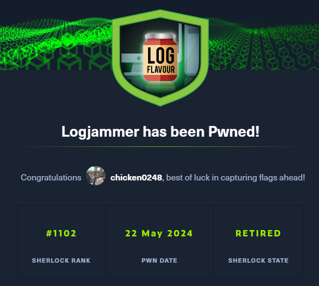
* * *
