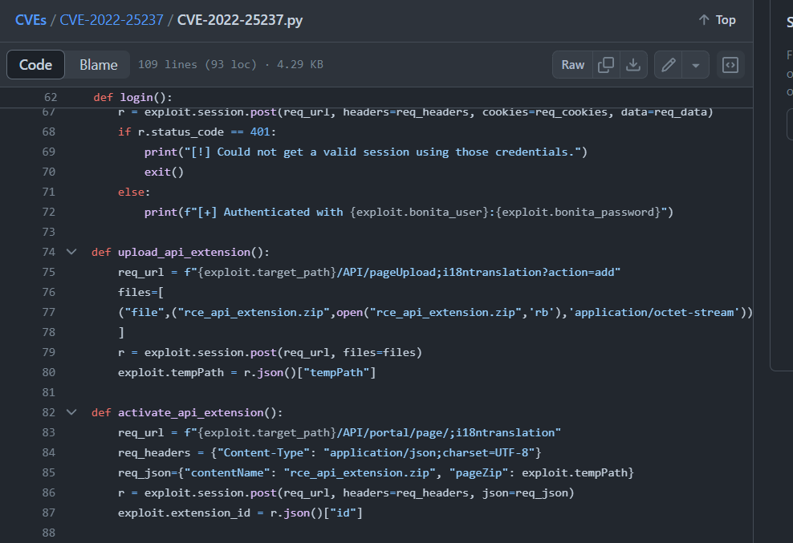

# [HackTheBox Sherlocks - Meerkat](https://app.hackthebox.com/sherlocks/Meerkat)
Created: 01/06/2024 12:50
Last Updated: 01/06/2024 16:11
* * *

**Scenario:**
As a fast-growing startup, Forela has been utilising a business management platform. Unfortunately, our documentation is scarce, and our administrators aren't the most security aware. As our new security provider we'd like you to have a look at some PCAP and log data we have exported to confirm if we have (or have not) been compromised.

* * *
>Task 1: We believe our Business Management Platform server has been compromised. Please can you confirm the name of the application running?


After open pcap file, we can see that there were port scanning activity being conducted on `171.31.6.44` from `156.146.62.213`

Look like port 8080 were hosting webserver

Follow TCP stream then we will see the full path along with domain name

By searching on the Internet, we finally obtained the name of this application which [Bonitasoft](https://www.bonitasoft.com/) is Open Source BPM (Business Process Management) Platform
```
BonitaSoft
```

>Task 2: We believe the attacker may have used a subset of the brute forcing attack category - what is the name of the attack carried out?


By filtering for only HTTP protocol, we can see that after an attacker found port 8080 and login page then he/she started sending POST request to login page indicating bruteforce attack


And after take a look at those HTML form that stored username and password, we can see there are different username and password were sent to authenticate 

This is a credential stuffing attack that an attacker obtained leaked credential then use it to authenticate 
```
Credential Stuffing
```

>Task 3: Does the vulnerability exploited have a CVE assigned - and if so, which one?


After bruteforcing out, an attacker successfully in the API directory

somehow exploited RCE vulnerability by using `whoami` command which server response back with `root`

Based on all the context we have so far, it is authorized rce so I did google search for this

And found [CVE number](https://rhinosecuritylabs.com/application-security/cve-2022-25237-bonitasoft-authorization-bypass/) right away
```
CVE-2022-25237
```

>Task 4: Which string was appended to the API URL path to bypass the authorization filter by the attacker's exploit?


This CVE was found to the the fact that sessionIsNotNeeded function checks for excludePatterns in URLs which is "i18ntranslation" and if it found then it will allow authorization to be bypassed for the API endpoints

And [here](https://github.com/RhinoSecurityLabs/CVEs/blob/master/CVE-2022-25237/CVE-2022-25237.py) is the script that was designed to exploit this vulnerability 

Which we can see that an attacker successfully exploited this vulnerability by follow TCP stream of this HTTP request
```
i18ntranslation 
```

>Task 5: How many combinations of usernames and passwords were used in the credential stuffing attack?


If we filtered with url form and filter out "install" user then we will have all credentials that are not default bonita credential but 59 is not the right answer because an attacker will use the right credential to exploited after verify the right credential  


From the same TCP Stream that an attacker successfully exploited Authenticated RCE, we can see which credential were used to authenticate

Then we will filter for the user credentials that an attacker successfully authenticated, and we will have to deduct 59 with 3 so an attacker used combination of 56 credentials for credential stuffing attack
```
56
```

>Task 6: Which username and password combination was successful?
```
seb.broom@forela.co.uk:g0vernm3nt
```

>Task 7: If any, which text sharing site did the attacker utilise?


After credential stuffing attack was completed, an attacker changed his/her IP address to manual exploit RCE started with read content of `/etc/passwd` and then using wget to download `bx5gcr0et8` from `pastes.io`
```
pastes.io
```

And lastly using bash to execute that file

>Task 8: Please provide the filename of the public key used by the attacker to gain persistence on our host.

Lets understand which file that was downloaded first, this is [my public report on anyrun](https://app.any.run/tasks/644240fb-b9d8-49f3-844e-b02d02f6dba9)

You can see that first file is a bash script to download a file to ssh authorized_keys directory which mean this new file is ssh public key for an attacker to gain access to infected server

There it is
```
hffgra4unv
```

>Task 9: Can you confirmed the file modified by the attacker to gain persistence?
```
/home/ubuntu/.ssh/authorized_keys
```

>Task 10: Can you confirm the MITRE technique ID of this type of persistence mechanism?


Search on MITRE ATT&CK website then you can see its technique ID
```
T1098.004
```


The other way for us to solve this challenge is to use Splunk or other SIEM by import `meerkat-alerts.json` that was beautify by jq which will make this sherlock a little more interesting for those who want to practice with SIEM


* * *
