# [HackTheBox Sherlocks - Noted](https://app.hackthebox.com/sherlocks/Noted)
Created: 20/05/2024 22:41
Last Updated: 20/05/2024 23:48
* * *

**Scenario:**
Simon, a developer working at Forela, notified the CERT team about a note that appeared on his desktop. The note claimed that his system had been compromised and that sensitive data from Simon's workstation had been collected. The perpetrators performed data extortion on his workstation and are now threatening to release the data on the dark web unless their demands are met. Simon's workstation contained multiple sensitive files, including planned software projects, internal development plans, and application codebases. The threat intelligence team believes that the threat actor made some mistakes, but they have not found any way to contact the threat actors. The company's stakeholders are insisting that this incident be resolved and all sensitive data be recovered. They demand that under no circumstances should the data be leaked. As our junior security analyst, you have been assigned a specific type of DFIR (Digital Forensics and Incident Response) investigation in this case. The CERT lead, after triaging the workstation, has provided you with only the Notepad++ artifacts, suspecting that the attacker created the extortion note and conducted other activities with hands-on keyboard access. Your duty is to determine how the attack occurred and find a way to contact the threat actors, as they accidentally locked out their own contact information.

* * *
>Task 1: What is the full path of the script used by Simon for AWS operations?

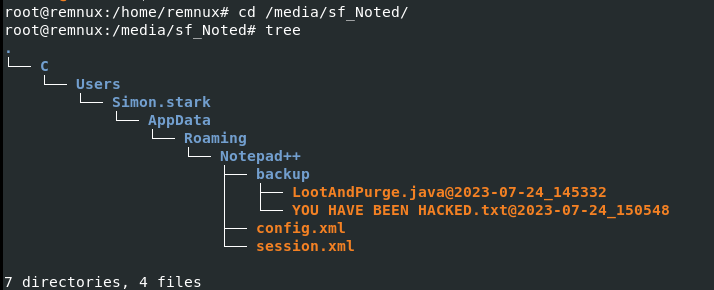
As the scenario tell us, we only have notepad++ artifacts 
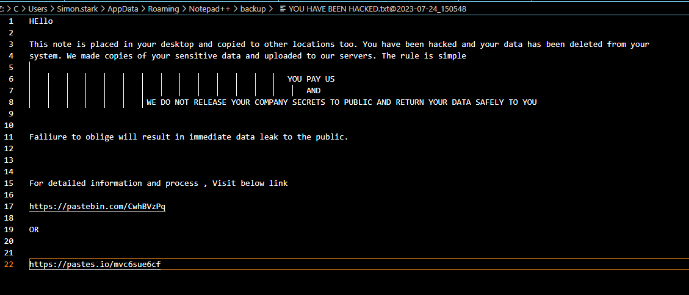
We got back up file of ransomnote
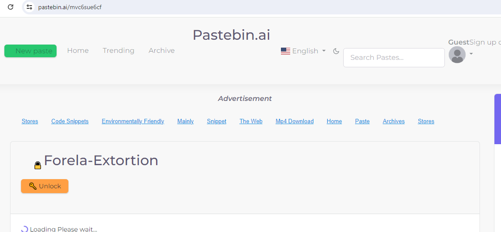
Which lead to this password required pastebin.ai
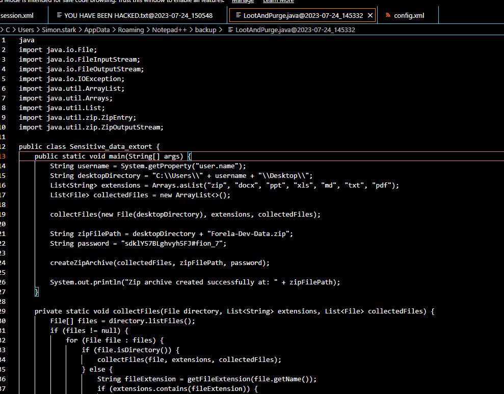
The other file we got it the problematic script written in Java, you can see that it collect sensitive files and compress it with specific password 
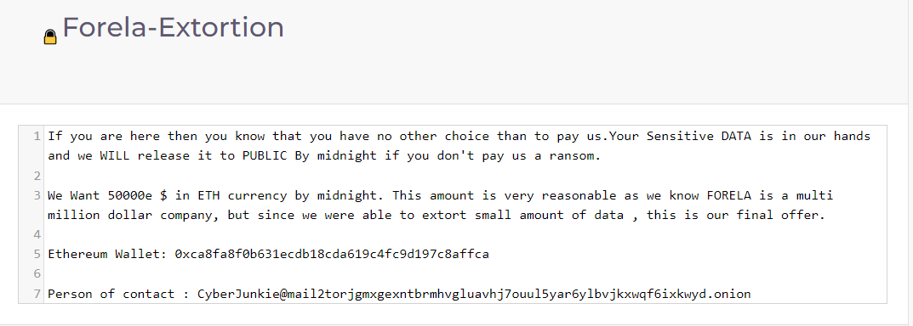
Using that password, we got crypto wallet and contact of an attacker (task 5 and 6)
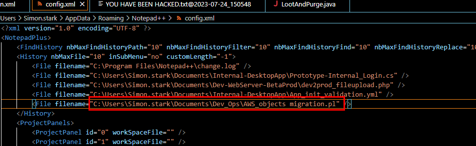
But the answer of this task lie in config.xml file
```
C:\Users\Simon.stark\Documents\Dev_Ops\AWS_objects migration.pl
```

>Task 2: The attacker duplicated some program code and compiled it on the system, knowing that the victim was a software engineer and had all the necessary utilities. They did this to blend into the environment and didn't bring any of their tools. This code gathered sensitive data and prepared it for exfiltration. What is the full path of the program's source file?

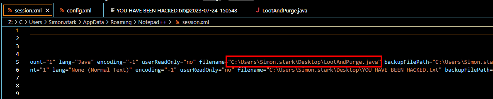
You can see its original path from sessions.xml 
```
C:\Users\Simon.stark\Desktop\LootAndPurge.java
```

>Task 3: What's the name of the final archive file containing all the data to be exfiltrated?

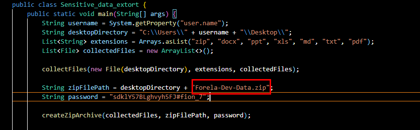
Read Java script again then you will find a name
```
Forela-Dev-Data.zip
```

>Task 4: What's the timestamp in UTC when attacker last modified the program source file?

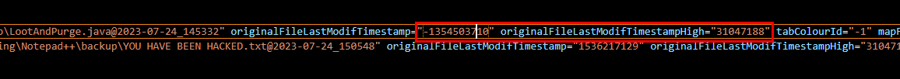
Go to sessions.xml again to grab File timestamp both Low and High
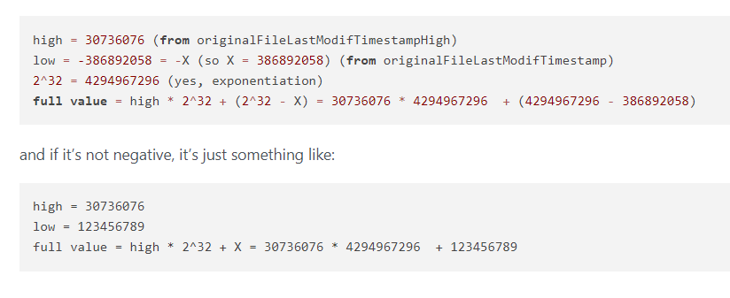
I did some research on how to convert them to FILETIME and found this [post](https://community.notepad-plus-plus.org/topic/22662/need-explanation-of-a-few-session-xml-parameters-values/5) on Notepad++ communuity that taught us how to do it

in our case `full value = 31047188 * 4294967296 + (4294967296-1354503710)` 
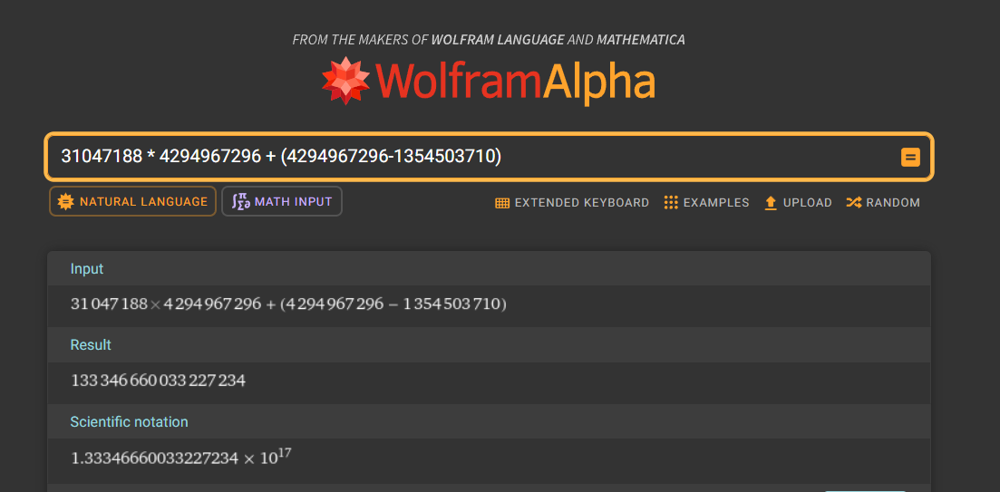
I let WolframAlpha does it thing and we finally got LDAP filetime (133346660033227234)
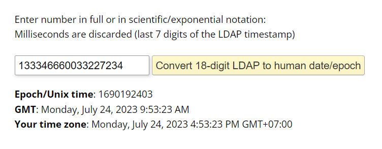
Lastly we will use [epoch converter](https://www.epochconverter.com/ldap) to convert to UTC 
```
2023-07-24 09:53:23
```

>Task 5: The attacker wrote a data extortion note after exfiltrating data. What is the crypto wallet address to which attackers demanded payment?
```
0xca8fa8f0b631ecdb18cda619c4fc9d197c8affca
```

>Task 6: What's the email address of the person to contact for support?
```
CyberJunkie@mail2torjgmxgexntbrmhvgluavhj7ouul5yar6ylbvjkxwqf6ixkwyd.onion
```

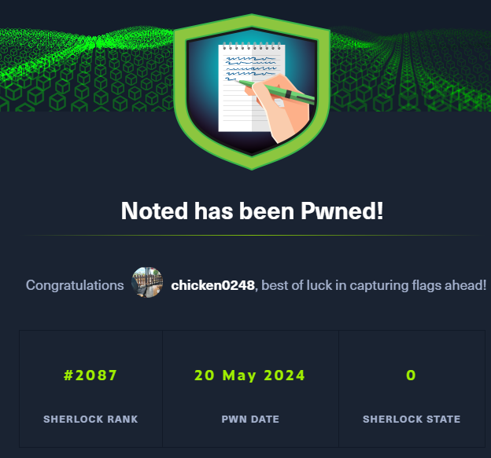
* * *
