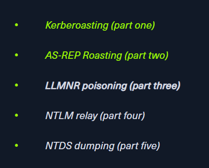

# [HackTheBox Sherlocks - Noxious](https://app.hackthebox.com/sherlocks/Noxious)
Created: 03/08/2024 14:00
Last Updated: 03/08/2024 03/08/2024 15:38
* * *

**Scenario:**
The IDS device alerted us to a possible rogue device in the internal Active Directory network. The Intrusion Detection System also indicated signs of LLMNR traffic, which is unusual. It is suspected that an LLMNR poisoning attack occurred. The LLMNR traffic was directed towards Forela-WKstn002, which has the IP address 172.17.79.136. A limited packet capture from the surrounding time is provided to you, our Network Forensics expert. Since this occurred in the Active Directory VLAN, it is suggested that we perform network threat hunting with the Active Directory attack vector in mind, specifically focusing on LLMNR poisoning.

* * *
This sherlock was launched with a new [blog](https://www.hackthebox.com/blog/llmnr-poisoning-attack-detection) to teach us about LLMNR poisoning attack and how to investigate it with Wireshark, treat it like a walkthrough then you can solve this sherlock easily


*This challenge is the 3rd AD investigation sherlock after Campfire-1 and 2 so there will be more 2 of them about NTLM relay and NTDS dumping in the futre

>Task 1: Its suspected by the security team that there was a rogue device in Forela's internal network running responder tool to perform an LLMNR Poisoning attack. Please find the malicious IP Address of the machine.


We can filter for LLMNR query and response using `udp.port == 5355` which we can see that `172.17.79.136` made queries for `DCC01` (its a typo since it should be `DC01`) then `172.17.79.135` response back hence LLMNR posioning attack took place here

```
172.17.79.135
```

>Task 2: What is the hostname of the rogue machine?


We got an IP address of an attacker then can find hostname of this IP address from DHCP Request like this
```
kali
```

>Task 3: Now we need to confirm whether the attacker captured the user's hash and it is crackable!! What is the username whose hash was captured?


Filter for SMB2 then we can see that at the same time when LLMNR queries were made, NTLM authentication negotiations were also happened right there
```
john.deacon
```

>Task 4: In NTLM traffic we can see that the victim credentials were relayed multiple times to the attacker's machine. When were the hashes captured the First time?
```
2024-06-24 11:18:30
```

>Task 5: What was the typo made by the victim when navigating to the file share that caused his credentials to be leaked?
```
DCC01
```

>Task 6: To get the actual credentials of the victim user we need to stitch together multiple values from the ntlm negotiation packets. What is the NTLM server challenge value?


We will use this first set of NTLM Authentication Negotiation to get all values necessary for password cracking


You can see server challenge value from NTLMSSP_CHALLENGE packet right here

```
601019d191f054f1
```

>Task 7: Now doing something similar find the NTProofStr value.


This value can be obtained by inspecting NTLMSSP_AUTH
```
c0cc803a6d9fb5a9082253a04dbd4cd4
```

>Task 8: To test the password complexity, try recovering the password from the information found from packet capture. This is a crucial step as this way we can find whether the attacker was able to crack this and how quickly.


From the blog, here is the hash format that can be crack with hashcat and we got most of them already and will only need for NTLMv2Response 


Copy NTLMv2Response right here


Then use "Find / Replace" on any text editor you prefered to delete first 16 bytes from this response and now we should have this hash ready for crack

`john.deacon::FORELA:601019d191f054f1:c0cc803a6d9fb5a9082253a04dbd4cd4:010100000000000080e4d59406c6da01cc3dcfc0de9b5f2600000000020008004e0042004600590001001e00570049004e002d00360036004100530035004c003100470052005700540004003400570049004e002d00360036004100530035004c00310047005200570054002e004e004200460059002e004c004f00430041004c00030014004e004200460059002e004c004f00430041004c00050014004e004200460059002e004c004f00430041004c000700080080e4d59406c6da0106000400020000000800300030000000000000000000000000200000eb2ecbc5200a40b89ad5831abf821f4f20a2c7f352283a35600377e1f294f1c90a001000000000000000000000000000000000000900140063006900660073002f00440043004300300031000000000000000000`


Lets use `hashcat -a0 -m5600 hashfile.txt /usr/share/wordlists/rockyou.txt` to crack then we will finally have a password for this user which an attacker successfully cracked

```
NotMyPassword0k?
```

>Task 9: Just to get more context surrounding the incident, what is the actual file share that the victim was trying to navigate to?


```
\\DC01\DC-Confidential
```


* * *
