# [HackTheBox Sherlocks - Nubilum-2](https://app.hackthebox.com/sherlocks/Nubilum-2)
Created: 16/06/2024 20:02
Last Updated: 16/06/2024 23:18
* * *
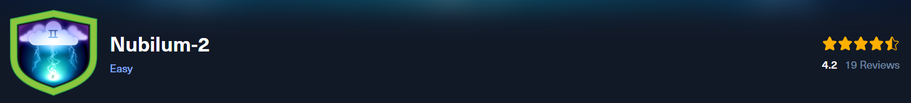
**Scenario:**
Leading telecoms provider Forela uses AWS S3 as an essential part of their infrastructure. They can deploy applications quickly and do effective analytics on their sizable dataset thanks to it acting as both an application storage and a data lake storage. Recently, a user reported an urgent issue to the helpdesk: an inability to access files within a designated S3 directory. This disruption has not only impeded critical operations but has also raised immediate security concerns. The urgency of this situation demands a security-focused approach. Reports of a misconfigured S3 Bucket policy for the forela-fileshare bucket, resulting in unintended public access, highlight a potential security vulnerability that calls for immediate corrective measures. Consequently, a thorough investigation is paramount.

* * *
>Task 1: What was the originating IP address the Threat Actor (TA) used to infiltrate the Forela’s AWS account?

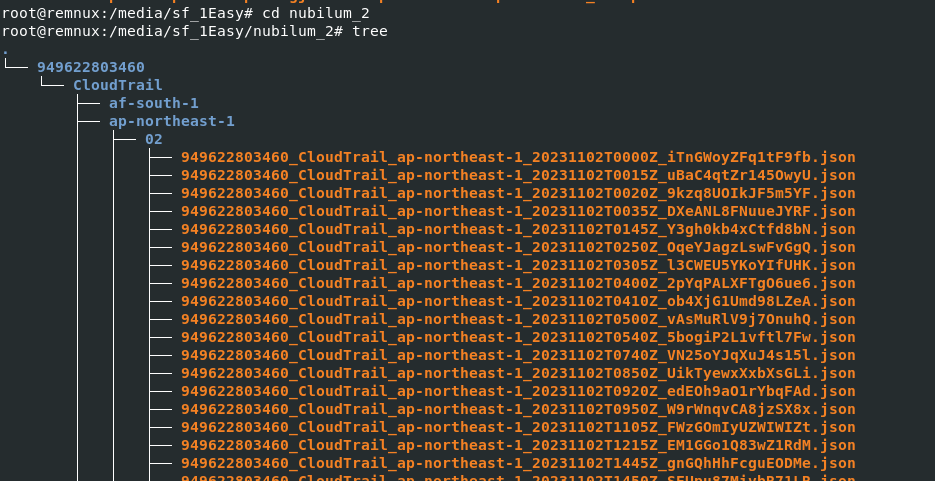
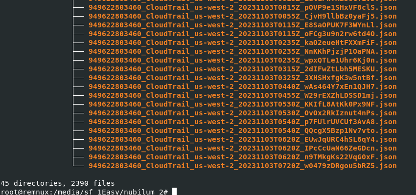

It appears that there is a substantial amount of AWS CloudTrail logging activity to review.

This challenge was designed to solve with SIEM so I'll use Splunk for this

Initial step is to formatting the logs to suit SIEM requirements. To facilitate this process, tools like [sof-elk]([sof-elk](https://github.com/philhagen/sof-elk/blob/main/supporting-scripts/aws-cloudtrail2sof-elk.py)) or jq are essentials

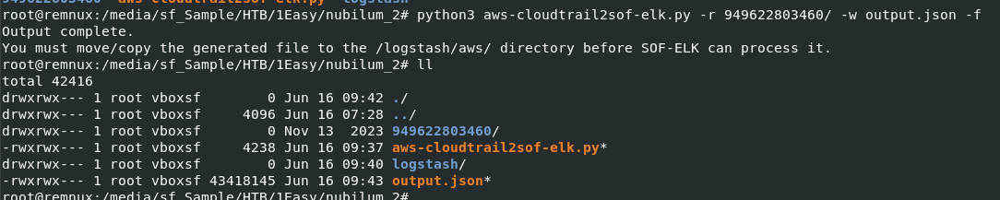

I will proceed with `python3 aws-cloudtrail2sof-elk.py -r 949622803460/ -w output.json -f` which will process all logs inside cloudtrail directory and save it as a single json file

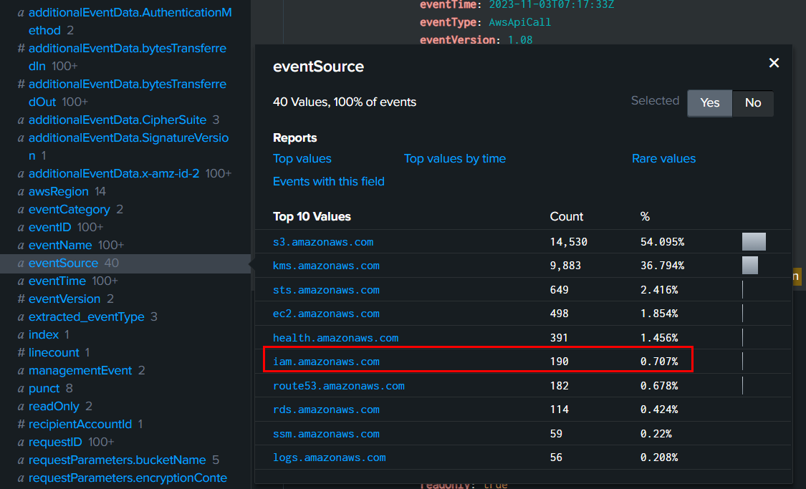

After import output file to Splunk, then we will filter for  `eventSource="iam.amazonaws.com"`

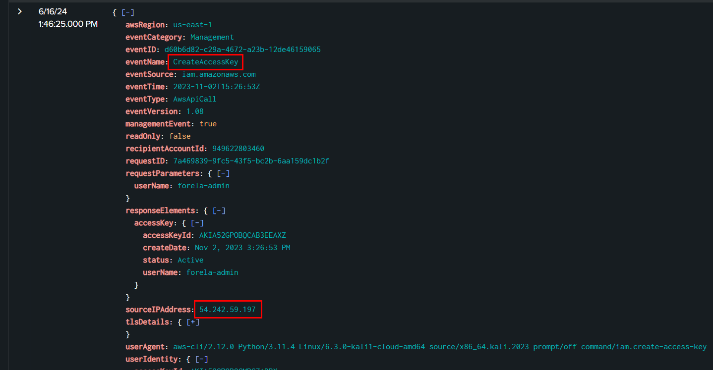

Then we can see that TA created Access key for "forela-admin" user, now we have TA's IP address to proceed further

```
54.242.59.197
```

>Task 2: What was the time, filename, and Account ID of the first recorded s3 object accessed by the TA?

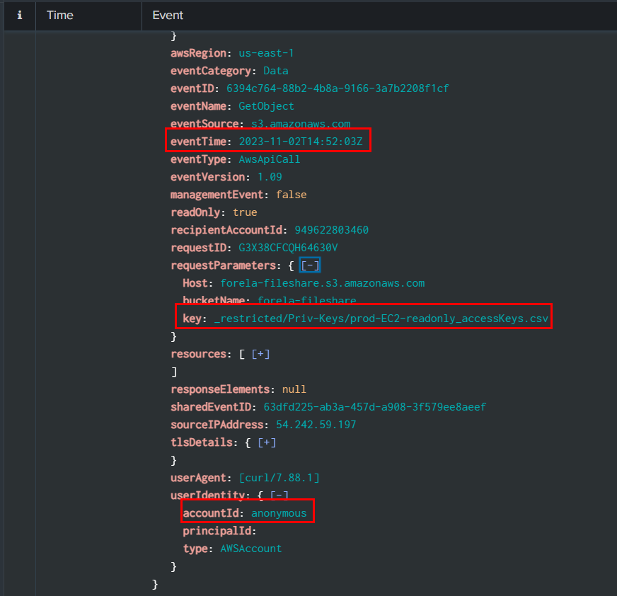

By using `source="output.json" host="ffbc19d3eef9" sourcetype="new_json" 54.242.59.197 eventSource="s3.amazonaws.com" eventName=GetObject | sort eventTime`, we can search for event within s3.amazonaws and GetObject event sorted by eventTime

```
2023-11-02T14:52:03Z,prod-EC2-readonly_accessKeys.csv,anonymous
```

>Task 3: How many Access Keys were compromised, at a minimum?

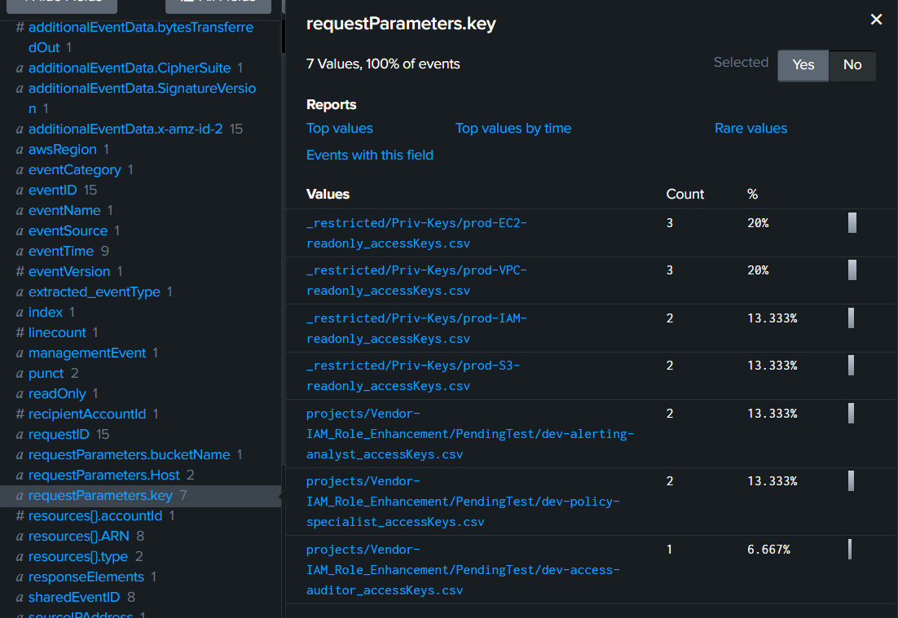

After using this `source="output.json" host="ffbc19d3eef9" sourcetype="new_json"  54.242.59.197 eventSource="s3.amazonaws.com" eventName=GetObject  "requestParameters.key"="*accesskey*"` query, then go to right bar which we can see that there are 7 different access keys were compromised

```
7
```

>Task 4: The TA executed a command to filter EC2 instances. What were the name and value used for filtering?

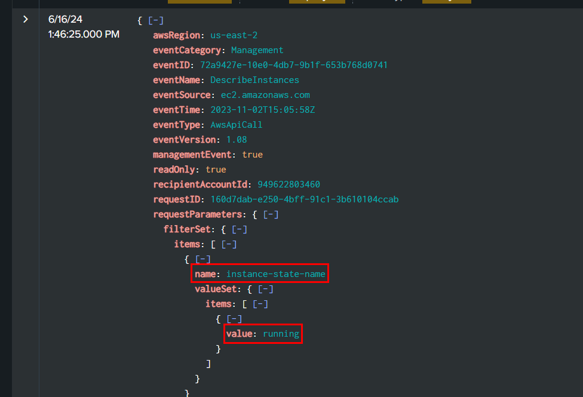

Use `source="output.json" host="ffbc19d3eef9" sourcetype="new_json"  54.242.59.197 eventSource="ec2.amazonaws.com"` then find for filterSet that have both name and value

```
instance-state-name:running
```

>Task 5: Can you provide the count of unsuccessful discovery and privilege escalation attempts made by the TA before gaining elevated access with the compromised keys?

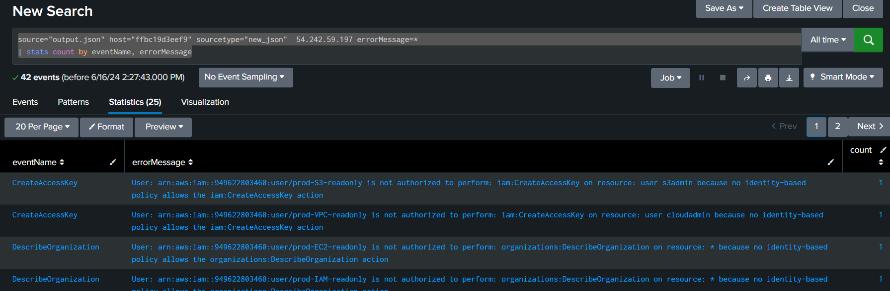

By using `source="output.json" host="ffbc19d3eef9" sourcetype="new_json"  54.242.59.197 errorMessage=*
| stats count by eventName, errorMessage`, we can see that there are 42 events that return with error 

```
42
```

>Task 6: Which IAM user successfully gained elevated privileges in this incident?

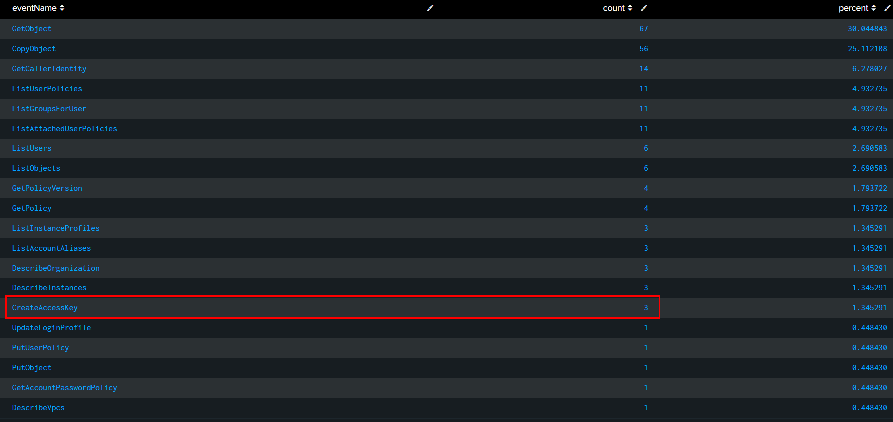

Remember CreateAccessKey event that created for forela?, we will go back to it for userName that triggered this event (`source="output.json" host="ffbc19d3eef9" sourcetype="new_json"  54.242.59.197 eventName=CreateAccessKey`)

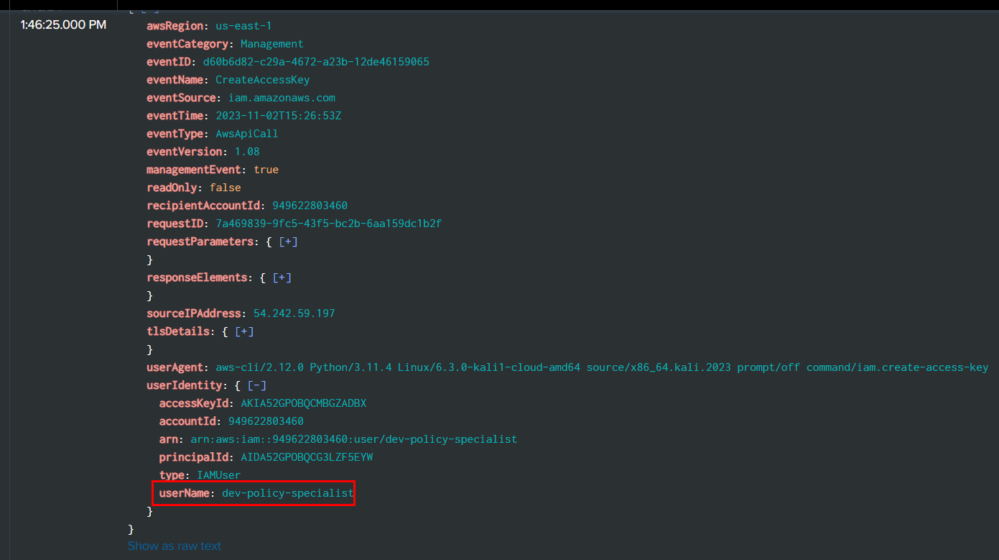

```
dev-policy-specialist
```

>Task 7: Which event name permitted the threat actor to generate an admin-level policy?

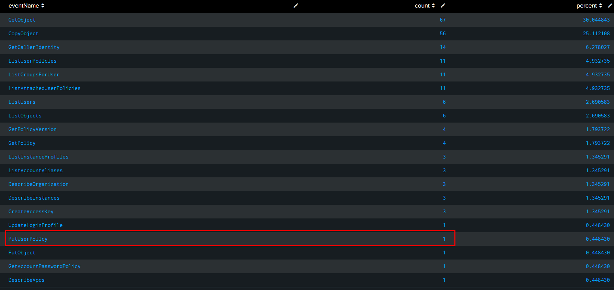

Go back to table that listed all eventName, there is a PutUserPolicy event that triggered once which is the answer of this task

```
PutUserPolicy
```

>Task 8: What is the name and statement of the policy that was created that gave a standard user account elevated privileges?

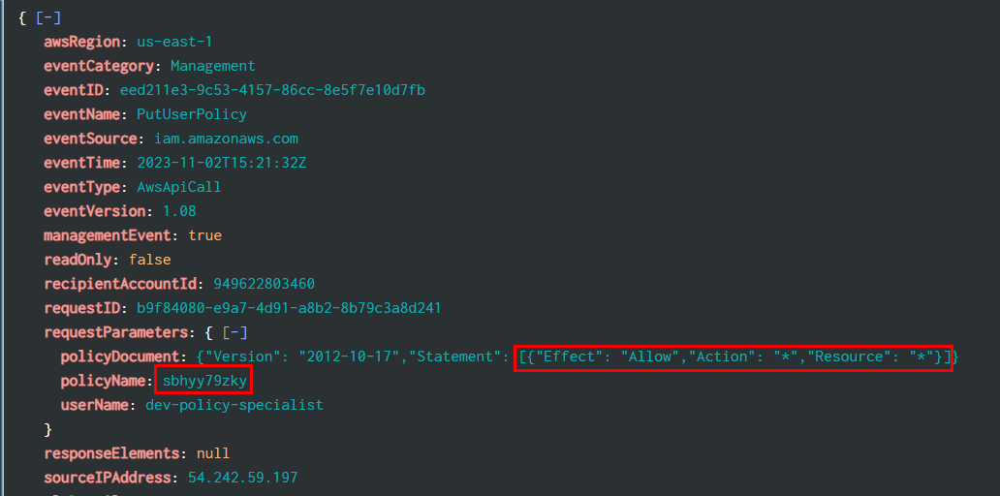

Display full requestParameters that we can see both policyName and Statement of this policy 

```
sbhyy79zky,[{"Effect": "Allow","Action": "*","Resource": "*"}]
```

>Task 9: What was the ARN (Amazon Resource Name) used to encrypt the files?

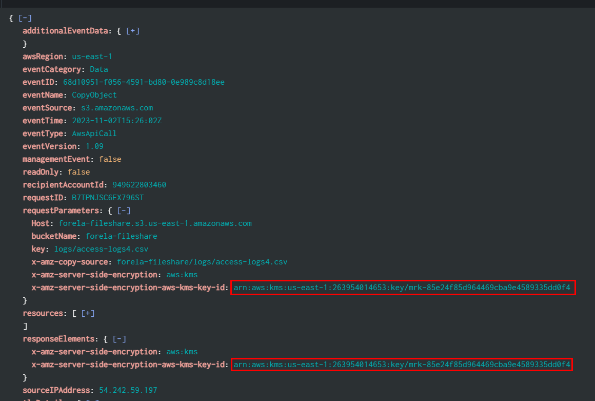

We will use `source="output.json" host="ffbc19d3eef9" sourcetype="new_json" 54.242.59.197 encryption` to display everything related to the TA and also has encryption within event then we will eventually find this ARN on one of CopyObject events 

```
arn:aws:kms:us-east-1:263954014653:key/mrk-85e24f85d964469cba9e4589335dd0f4
```

>Task 10: What was the name of the file that the TA uploaded to the S3 bucket?

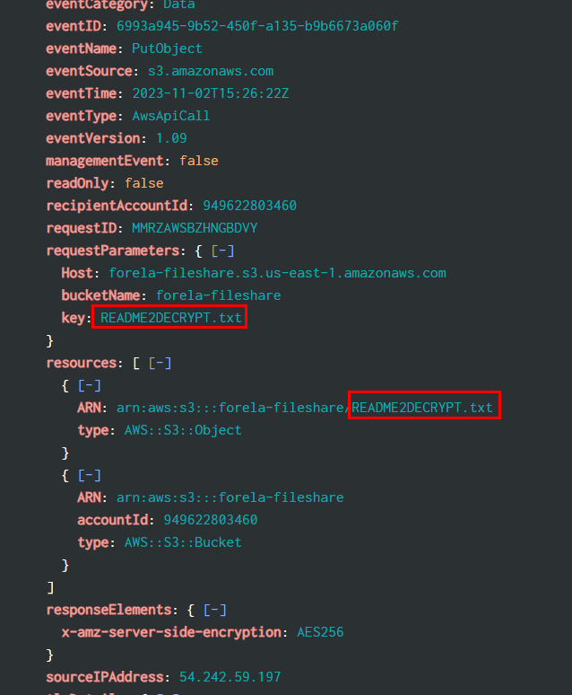

There is one PutObject event from the TA so we will use `source="output.json" host="ffbc19d3eef9" sourcetype="new_json"  54.242.59.197 eventName=PutObject` to find out which file the TA uploaded to S3 bucket

```
README2DECRYPT.txt
```

>Task 11: Which IAM user account did the TA modify in order to gain additional persistent access?

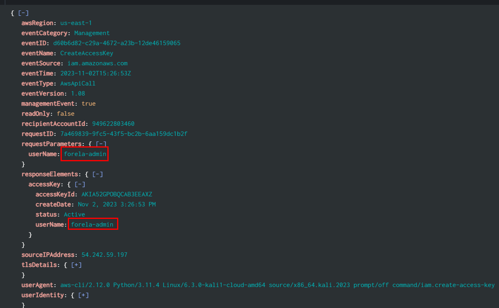

remembered CreateAccessKey event? its the same event but different answer

```
forela-admin
```

>Task 12: What action was the user not authorized to perform to view or download the file in the S3 bucket?

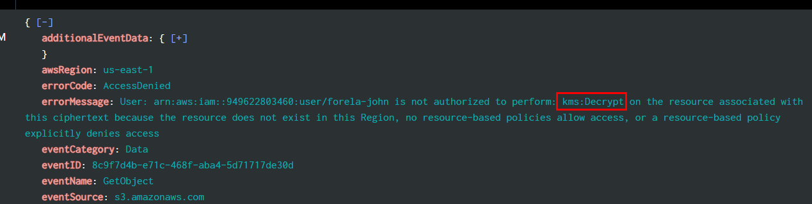

We will use `source="output.json" host="ffbc19d3eef9" eventSource="s3.amazonaws.com" accessdenied` to filter for all accessdenied within s3 buckets then you will see specific user can't perform specific action for some reason

```
kms:Decrypt
```

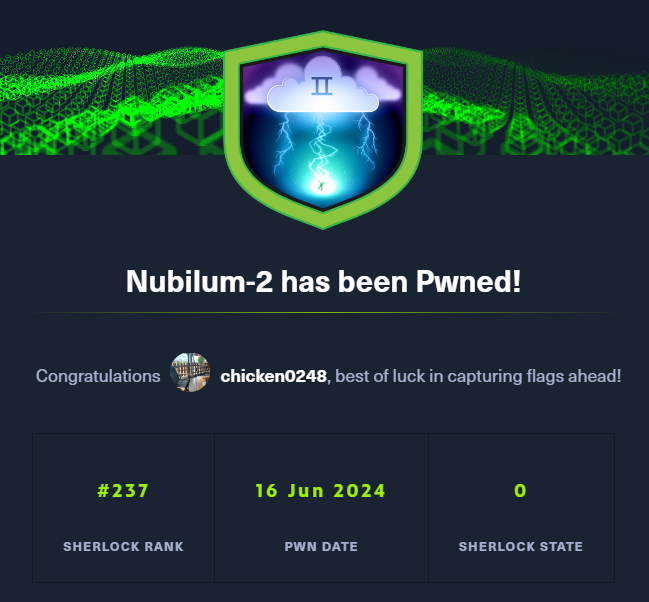
* * *
