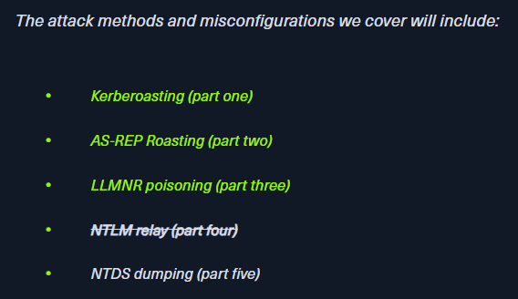
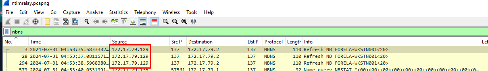
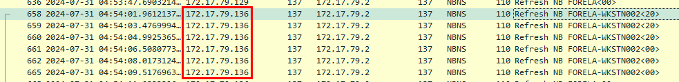
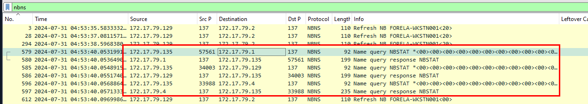
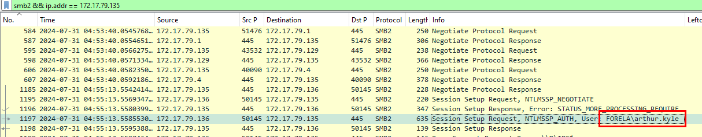
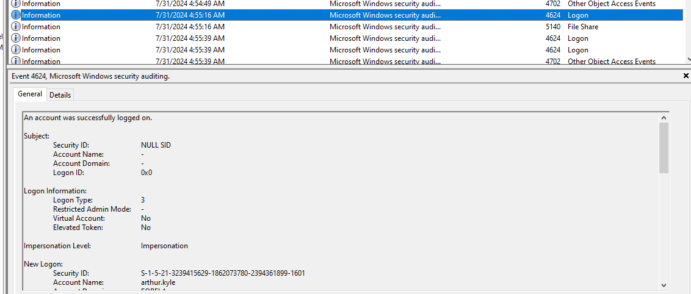
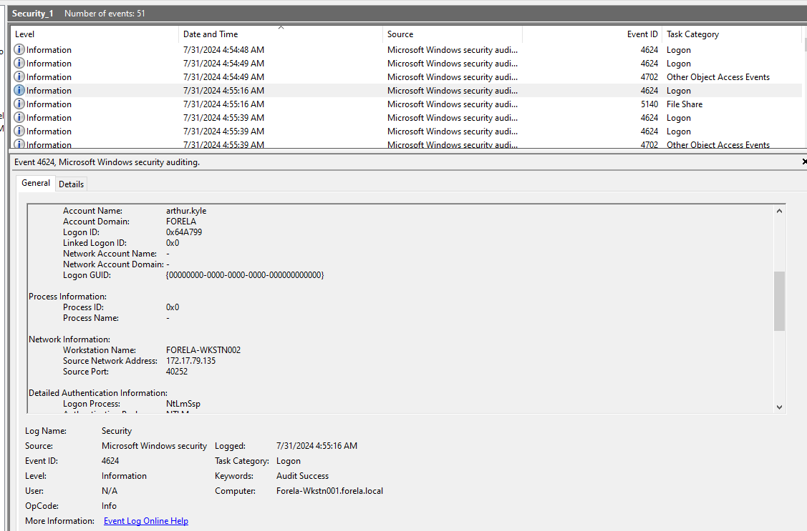
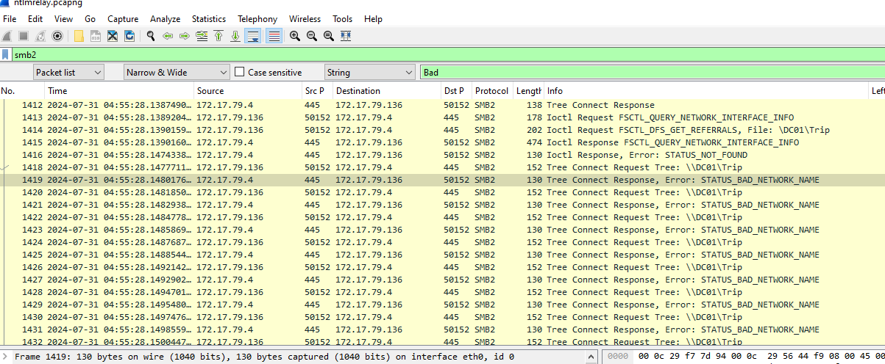
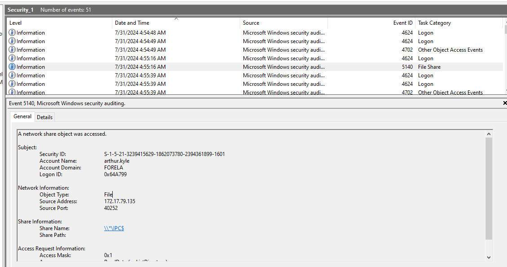
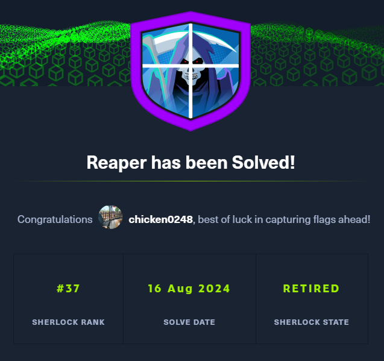

# [HackTheBox Sherlocks - Reaper](https://app.hackthebox.com/sherlocks/Reaper)
Created: 16/08/2024 16:44
Last Updated: 16/08/2024 18:19
* * *


**Scenario:**
Our SIEM alerted us to a suspicious logon event which needs to be looked at immediately . The alert details were that the IP Address and the Source Workstation name were a mismatch .You are provided a network capture and event logs from the surrounding time around the incident timeframe. Corelate the given evidence and report back to your SOC Manager.

* * *
This sherlock was launched with a new [blog](https://www.hackthebox.com/blog/ntlm-relay-attack-detection) to teach us about NTLM Relay attack and how to investigate it with Wireshark and logon audit log, treat it like a walkthrough then you can solve this sherlock easily



*This sherlock is also the 4th AD investigation sherlock after Campfire-1 and 2 and Noxious so the last part of this series, NTDS dumping will be coming soon in the future ([CrownJewel-1](https://app.hackthebox.com/sherlocks/CrownJewel-1) and [CrownJewel-2](https://app.hackthebox.com/sherlocks/CrownJewel-2))

>Task 1: What is the IP Address for Forela-Wkstn001?



We can filter for `nbns` for NetBIOS Name Service (NBNS) Refresh packet which allows a device to refresh its NetBIOS name registration on the network. and as you can see that this IP address is refreshing its NetBIOS name that is Folera-Wkstn001

```
172.17.79.129
```

>Task 2: What is the IP Address for Forela-Wkstn002?



We could do the same as previous task on this task to get an IP address of Forela-Wkstn002.

```
172.17.79.136
```

>Task 3: Which user account's hash was stolen by attacker?



We can also see other IP address jumped in on NBNS protocol to query status of a NetBIOS name or machine, including a list of all NetBIOS names from `172.17.79.1` and as the blog says that the IP address that sent this request could be an unknown device / threat actor device so we can use this IP address to filter for SMB traffic and see if the threat actor has accessed to any file share.



After filtered with `smb2 && ip.addr == 172.17.79.135`, we can see that this unknown device successfully authenticated as `arthur.kyle` and tried to access other file shares.




Its time to open audit log to see that there is one login event that look very suspicious since there is no Logon ID (NULL SID) and it was authenticated via NTLM and the source IP address is the suspicious device we are after.

```
arthur kyle
```

>Task 4: What is the IP Address of Unknown Device used by the attacker to intercept credentials?
```
172.17.79.135
```

>Task 5: What was the fileshare navigated by the victim user account?



For this one, we have to find for Tree Connect that response with Error like this which mean file share could not be found or was not recognized by the server. This could happen if the share doesn't exist, is offline, or the client doesn't have access rights.

```
\\DC01\Trip
```

>Task 6: What is the source port used to logon to target workstation using the compromised account?


```
40252
```

>Task 7: What is the Logon ID for the malicious session?
```
0x64A799
```

>Task 8: The detection was based on the mismatch of hostname and the assigned IP Address.What is the workstation name and the source IP Address from which the malicious logon occur?

```
FORELA-WKSTN002, 172.17.79.135
```

>Task 9: When did the malicious logon happened. Please make sure the timestamp is in UTC?
```
2024-07-31 04:55:16
```

>Task 10: What is the share Name accessed as part of the authentication process by the malicious tool used by the attacker?



For this, we have to inspect EventID 5140 (network share accessed) that happened after the threat actor authenticated as arthur

```
\\*\IPC$
```


* * *
