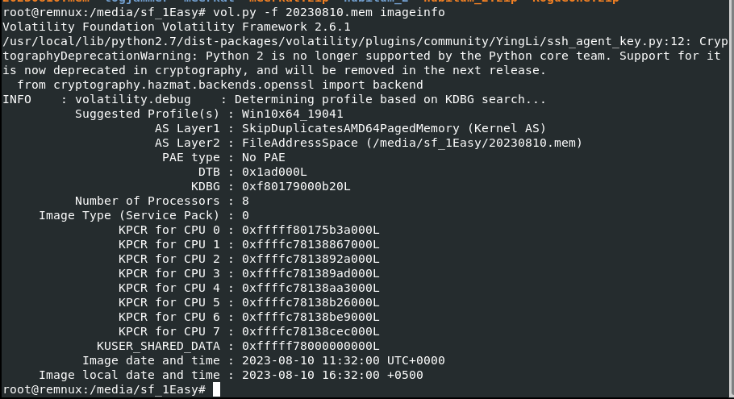
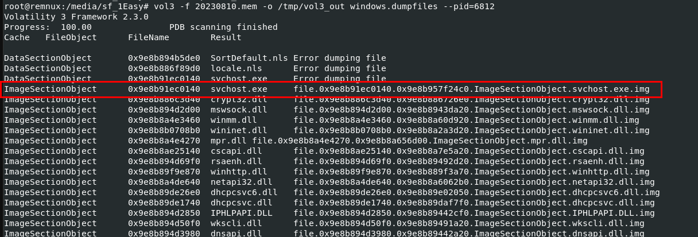

# [HackTheBox Sherlocks - RogueOne](https://app.hackthebox.com/sherlocks/RogueOne)
Created: 22/05/2024 15:48
Last Updated: 22/05/2024 18:26
* * *

**Scenario:**
Your SIEM system generated multiple alerts in less than a minute, indicating potential C2 communication from Simon Stark's workstation. Despite Simon not noticing anything unusual, the IT team had him share screenshots of his task manager to check for any unusual processes. No suspicious processes were found, yet alerts about C2 communications persisted. The SOC manager then directed the immediate containment of the workstation and a memory dump for analysis. As a memory forensics expert, you are tasked with assisting the SOC team at Forela to investigate and resolve this urgent incident.

* * *
>Task 1: Please identify the malicious process and confirm process id of malicious process.


i started by using Volatility 2 imageinfo plugin to determine the profile of this memory file (`vol.py -f 20230810.mem imageinfo`)


After determined which profile to use, I used `vol.py -f 20230810.mem --profile=Win10x64_19041 malfind` hoping to find suspicious process that normally wouldn't be seen using this plugin which I was lucky that there is one which was named after a legitimate process on any Windows system

```
6812
```

>Task 2: The SOC team believe the malicious process may spawned another process which enabled threat actor to execute commands. What is the process ID of that child process?


Now Its time to use pstree plugin and grep command to find a child process of this malicious process with this command `vol.py -f 20230810.mem --profile=Win10x64_19041 pstree | grep "6812"` and look like this process spawned cmd (unfortunately cmdline plugin caught nothing from this process)
```
4364
```

>Task 3: The reverse engineering team need the malicious file sample to analyze. Your SOC manager instructed you to find the hash of the file and then forward the sample to reverse engineering team. Whats the md5 hash of the malicious file?


Dump files from a process with dumpfiles plugin with this command `vol.py -f 20230810.mem --profile=Win10x64_19041 dumpfiles --pid=6812 --dump-dir /tmp/output/`, Welp look like we got a lot of files and... Volatility 2 not named those files nicely that I could identify them 


so I changed to Volatility 3 with `vol3 -f 20230810.mem -o /tmp/vol3_out windows.dumpfiles --pid=6812` and I could identify which find should I look into instantly 

then we can proceed with `md5sum /tmp/vol3_out/file.0x9e8b91ec0140.0x9e8b957f24c0.ImageSectionObject.svchost.exe.img` for MD5 hash
```
5bd547c6f5bfc4858fe62c8867acfbb5
```

>Task 4: In order to find the scope of the incident, the SOC manager has deployed a threat hunting team to sweep across the environment for any indicator of compromise. It would be a great help to the team if you are able to confirm the C2 IP address and ports so our team can utilise these in their sweep.

You can decomplie an exe file we got from previous task but I think netscan plugin is enough for this 

Process with `vol3 -f 20230810.mem windows.netscan | grep "6812"` then you have a connection made from PID 6812
```
13.127.155.166:8888
```

>Task 5: We need a timeline to help us scope out the incident and help the wider DFIR team to perform root cause analysis. Can you confirm time the process was executed and C2 channel was established?

Answer was already obtained from netscan plugin but need a little bit of format change to submit
```
10/08/2023 11:30:03
```

>Task 6: What is the memory offset of the malicious process?


I used pstree scan with grep for this task (`vol3 -f 20230810.mem windows.pstree | grep "6812"`)
```
0x9e8b87762080
```

>Task 7: You successfully analyzed a memory dump and received praise from your manager. The following day, your manager requests an update on the malicious file. You check VirusTotal and find that the file has already been uploaded, likely by the reverse engineering team. Your task is to determine when the sample was first submitted to VirusTotal.


[Here](https://www.virustotal.com/gui/file/eaf09578d6eca82501aa2b3fcef473c3795ea365a9b33a252e5dc712c62981ea/detection) is the link of this file 

Go to Details and History for this answer, don't forget to change format
```
10/08/2023 11:58:10
```


* * *
