# [HackTheBox Sherlocks - TickTock](https://app.hackthebox.com/sherlocks/TickTock)
Created: 10/10/2024 09:30
Last Updated: 10/10/2024 13:53
* * *


**Scenario:**
Gladys is a new joiner in the company, she has recieved an email informing her that the IT department is due to do some work on her PC, she is guided to call the IT team where they will inform her on how to allow them remote access. The IT team however are actually a group of hackers that are attempting to attack Forela.

* * *
>Task 1: What was the name of the executable that was uploaded as a C2 Agent?

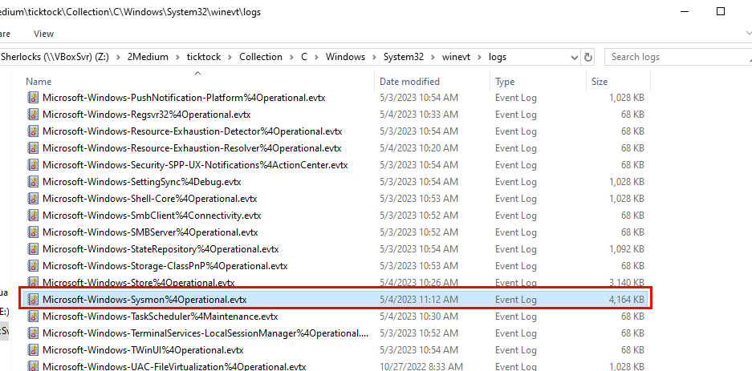

This lab provided us with artefacts collected with KAPE and the first thing I want from every system is "SYSMON" and fortunately, we have one right here!

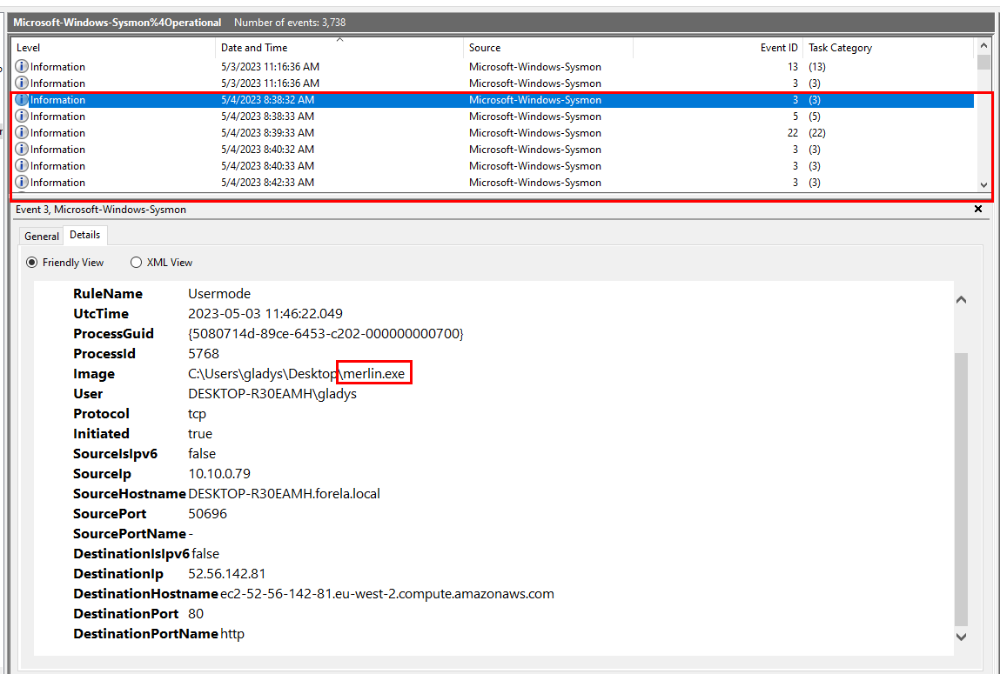

Since its C2 agent then we could expect it to make connection to C2 so we need to find Sysmon Event ID 3 : Network connection detected and we can see that there is one suspicious exe file that keep contacting with ec2 instance so this has to be the one we are looking for.

```
merlin.exe
```

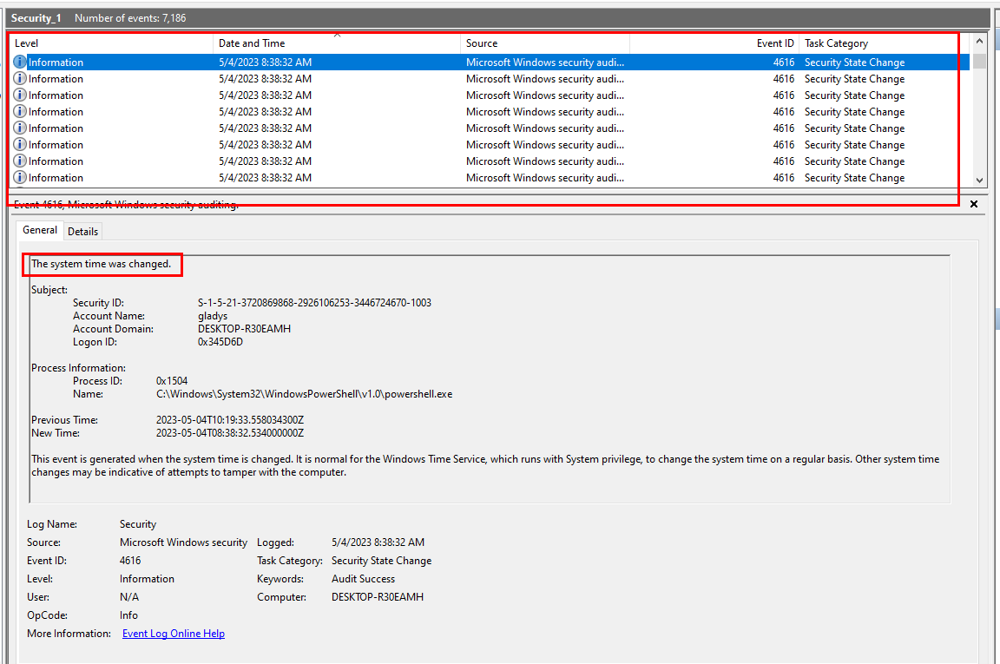

I also noticed that UTC time did not match "Date and Time" field on my event log viewer even if my VM is using UTC time so I opened Security event log and found that there is a PowerShell process that keep changing system time which make our timeline crafting a nightmare.

>Task 2: What was the session id for in the initial access?

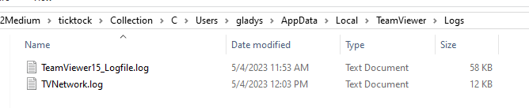

From the scenario, we know that hackers gained access via remote access so I explored for a bit and found TeamViewer log that could be used to retrieve crucial information to complete this lab.

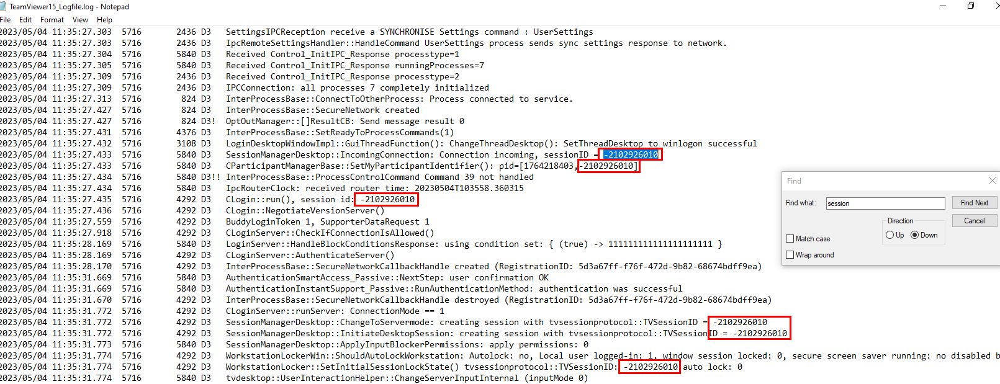

After opened `TeamViewer15_Logfile.log`, we can see that hackers connected to Gladys's computer with this session id.

```
-2102926010
```

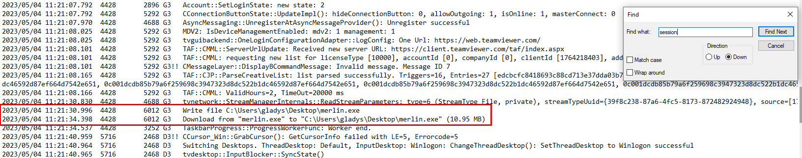

>Task 3: The attacker attempted to set a bitlocker password on the C: drive what was the password?

We know that PowerShell process kept changing system time so we might find another commands that being logged in PowerShell event log.

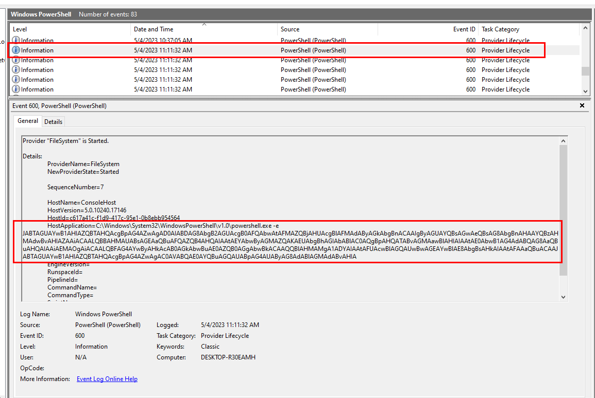

After opened PowerShell event log, we will find this powershell command that executed commands that encoded with base64.

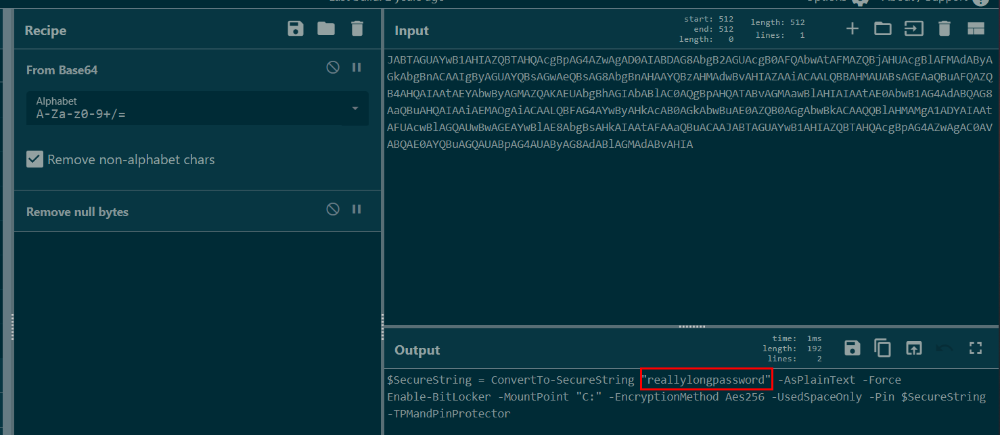

Then we can see that its command to set bitlocker password on C: drive and it will encrypt with AES256 algorithm.

```
reallylongpassword
```

>Task 4: What name was used by the attacker?

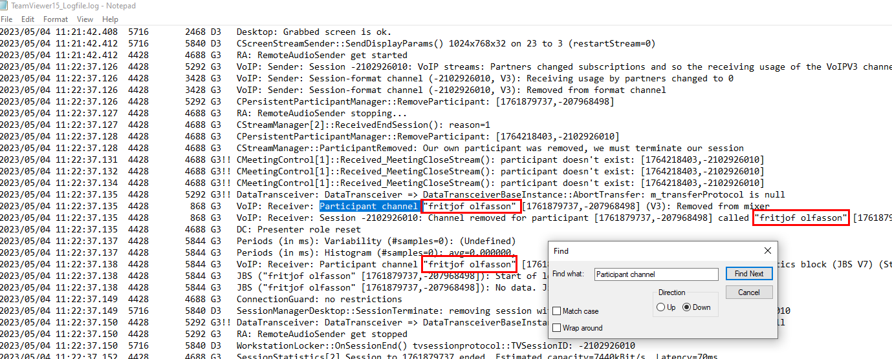

TeamViewer always logged name of the host that connected to the system with their program so if we search for 'Participant channel ' then we will have a name used by the attacker as you can see from image above.

```
fritjof olfasson
```

>Task 5: What IP address did the C2 connect back to?

Its an IP address that `merlin.exe` made connection to
```
52.56.142.81
```

>Task 6: What category did Windows Defender give to the C2 binary file?

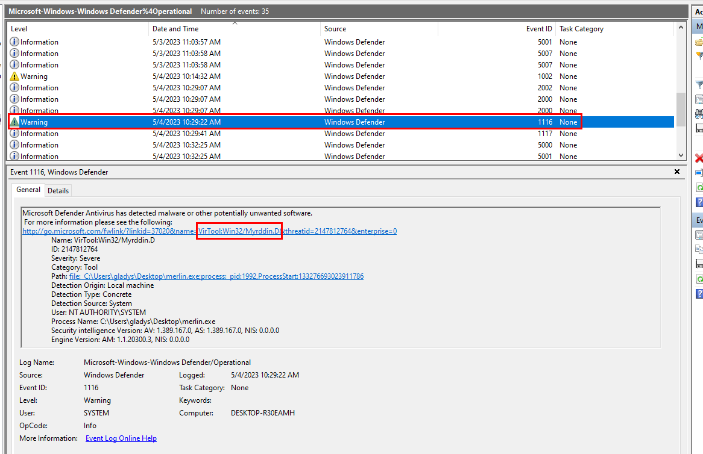

We can open Windows Defender Operation log and find 'Warning' event which we can see that it detected `merlin.exe` as malware and if we inspected next event then we could see that this file was sent to Quarantine too.
```
VirTool:Win32/Myrddin.D
```

>Task 7: What was the filename of the powershell script the attackers used to manipulate time?

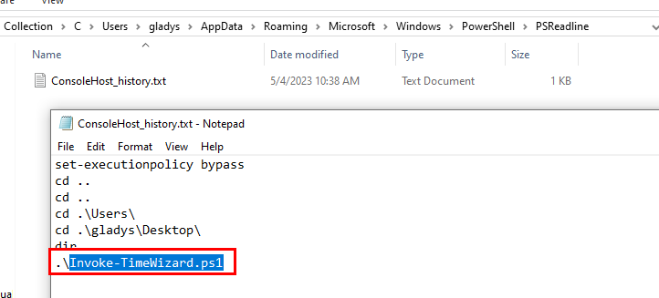

I did not find the name of the script from PowerShell log but luckily for me, User's PowerShell history still caught the name of this script as we can see right here.
```
Invoke-TimeWizard.ps1
```

>Task 8: What time did the initial access connection start?

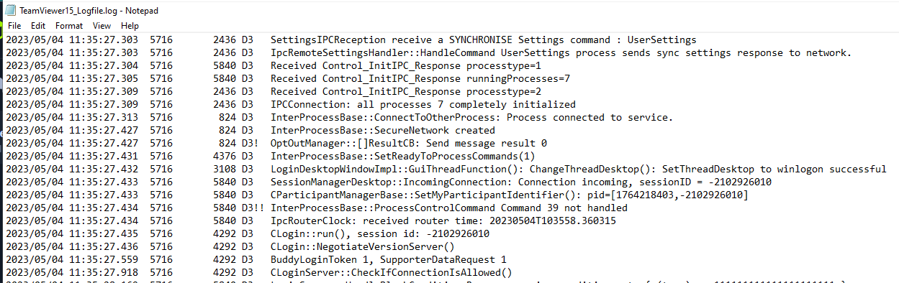
Grab the timestamp of first log since there is no other connection to other host via TeamViewer on this system.
```
2023/05/04 11:35:27
```

>Task 9: What is the SHA1 and SHA2 sum of the malicious binary?

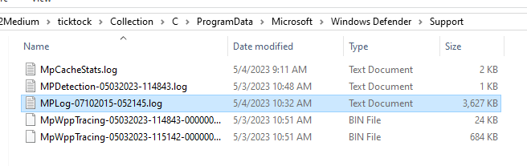

We already know that Microsoft Defender detected and quarantined this file before so we could get its hash from MPLog inside ProgramData folder right here.

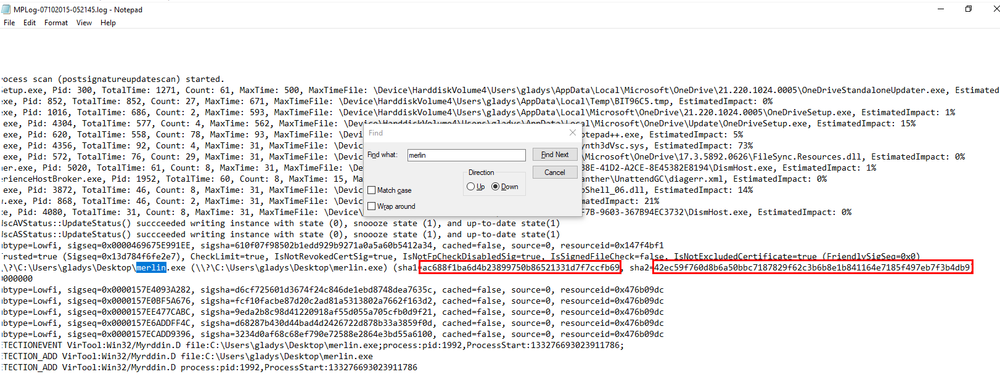

Search for the name then we will have both hashes ready to answer.

```
ac688f1ba6d4b23899750b86521331d7f7ccfb69:42ec59f760d8b6a50bbc7187829f62c3b6b8e1b841164e7185f497eb7f3b4db9
```

>Task 10: How many times did the powershell script change the time on the machine?


Go back to Security log then we can see that we have to filter for EventID 4616 that triggered by PowerShell.

We can use xml query to craft our query like this
```
<QueryList>
  <Query Id="0" Path="file://Z:\2Medium\ticktock\Collection\C\Windows\System32\winevt\logs\Security.evtx">
    <Select Path="file://Z:\2Medium\ticktock\Collection\C\Windows\System32\winevt\logs\Security.evtx">
      *[System[(EventID=4616)]]
      and
      *[EventData[Data[@Name='ProcessName'] and (Data='C:\Windows\System32\WindowsPowerShell\v1.0\powershell.exe')]]
    </Select>
  </Query>
</QueryList>
```

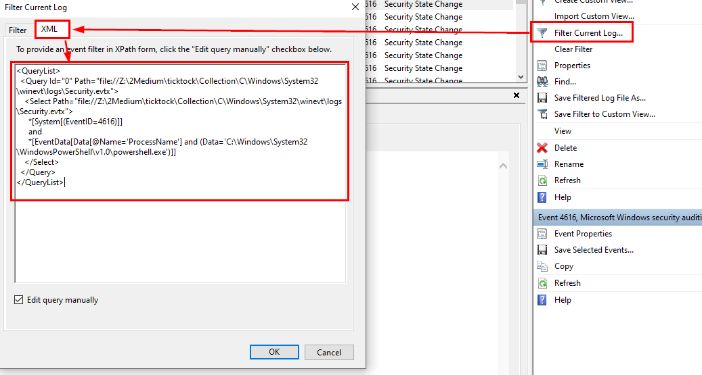

Go to "Filter Current Log..." then "XML" -> "Edit query manually" and pass the query as you see fit then finally click "OK"

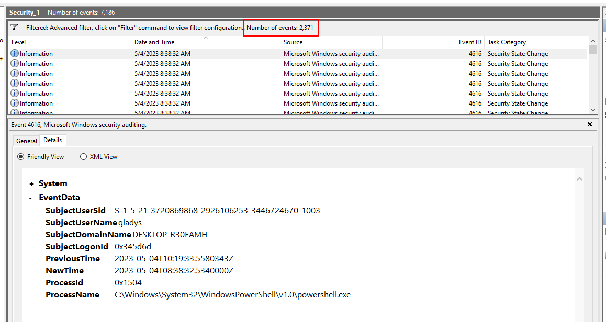

In the end, we should have 2371 events from this filter.

```
2371
```

>Task 11: What is the SID of the victim user?

Get SID from Security log then we should be able to complete this lab easily!
```
S-1-5-21-3720869868-2926106253-3446724670-1003
```


* * *
