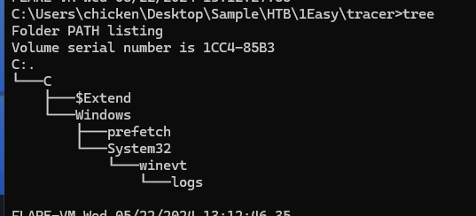
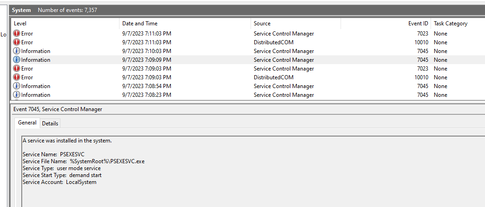
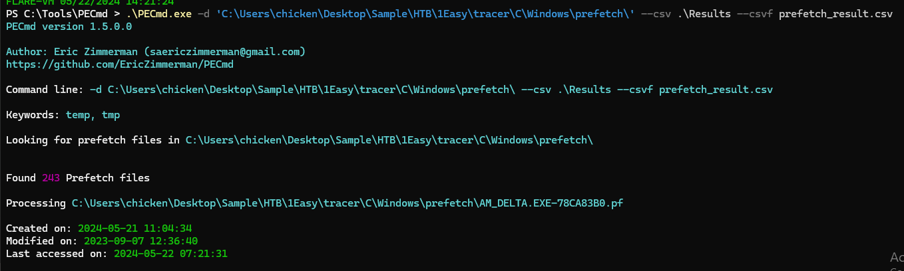
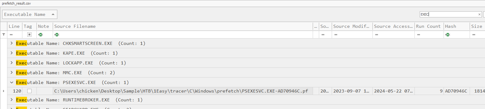
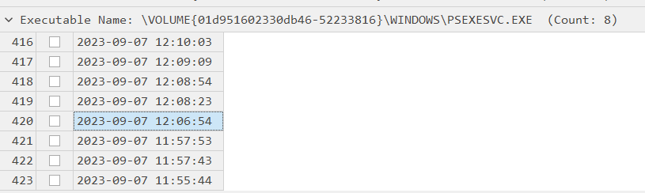
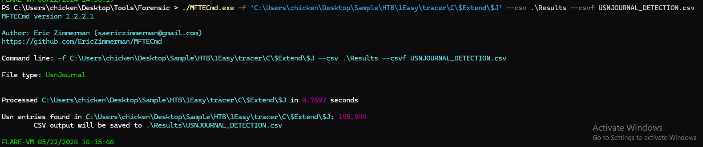
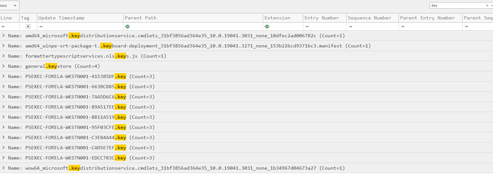
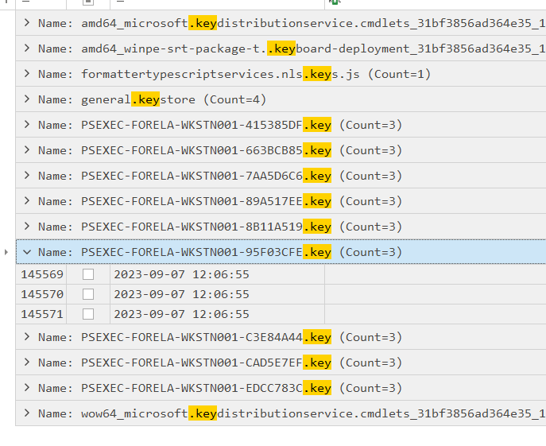
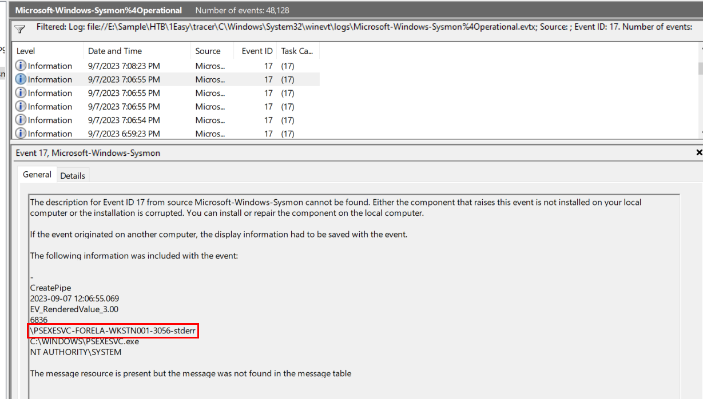

# [HackTheBox Sherlocks - Tracer](https://app.hackthebox.com/sherlocks/Tracer)
Created: 22/05/2024 13:14
Last Updated: 22/05/2024 15:36
* * *

**Scenario:**
A junior SOC analyst on duty has reported multiple alerts indicating the presence of PsExec on a workstation. They verified the alerts and escalated the alerts to tier II. As an Incident responder you triaged the endpoint for artefacts of interest. Now please answer the questions regarding this security event so you can report it to your incident manager.

* * *
>Task 1: The SOC Team suspects that an adversary is lurking in their environment and are using PsExec to move laterally. A junior SOC Analyst specifically reported the usage of PsExec on a WorkStation. How many times was PsExec executed by the attacker on the system?


We got 3 major artifacts that could be used, 
- Usr Journal
- Prefetch
- Event Log

And the one that can tell us how many times things were used it Prefetch 

First I need to know a name of PSExec as an executable and as soon as I opened System log, I obtained that information

Then its time for PECmd from EZ Tools to parse and process prefetch folder and files (`.\PECmd.exe -d 'C:\Users\chicken\Desktop\Sample\HTB\1Easy\tracer\C\Windows\prefetch\' --csv .\Results --csvf prefetch_result.csv`)

I did input a whole prefetch folder here ...actually only psexc executable is already enough

Open result file in Timeline Explorer and search for this executable, you can see it was executed 9 times
```
9
```

>Task 2: What is the name of the service binary dropped by PsExec tool allowing attacker to execute remote commands?
```
psexesvc.exe
```

>Task 3: Now we have confirmed that PsExec ran multiple times, we are particularly interested in the 5th Last instance of the PsExec. What is the timestamp when the PsExec Service binary ran?


This answer could be obtained from timeline file that was created along with result file by PECmd
```
07/09/2023 12:06:54
```

>Task 4: Can you confirm the hostname of the workstation from which attacker moved laterally?

I did some research on how to detect psexec and found this blog posted by [HackTheBox](https://www.hackthebox.com/blog/how-to-detect-psexec-and-lateral-movements) themselves (everything about this sherlock can be solve if you read this blog which make it look like they provided us a solution)


From the blog, we know that after PSEXEC was executed, it will generated `.key` file that named after hostname so we will use Usr Journal artifact to solve this (`./MFTECmd.exe -f 'C:\Users\chicken\Desktop\Sample\HTB\1Easy\tracer\C\$Extend\$J' --csv .\Results --csvf USNJOURNAL_DETECTION.csv`)

```
FORELA-WKSTN001
```

>Task 5: What is full name of the Key File dropped by 5th last instance of the Psexec?


We already obtained the 5th last instance time from task 3 so we can correlated timeline and obtained the right key here
```
PSEXEC-FORELA-WKSTN001-95F03CFE.key
```

>Task 6: Can you confirm the timestamp when this key file was created on disk?

It was created after PSExec was executed for a sec
```
07/09/2023 12:06:55
```

>Task 7: What is the full name of the Named Pipe ending with the "stderr" keyword for the 5th last instance of the PsExec?
 

We will use sysmon Event ID 17 ([Pipe created](https://www.ultimatewindowssecurity.com/securitylog/encyclopedia/event.aspx?eventid=90017)) and find an event that happened around 5th PSExec execution
```
\PSEXESVC-FORELA-WKSTN001-3056-stderr
```


* * *
