# [HackTheBox Sherlocks - Ultimatum](https://app.hackthebox.com/sherlocks/Ultimatum)
Created: 19/05/2024 17:51
Last Updated: 19/05/2024 21:16
* * *
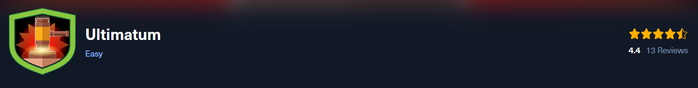
**Scenario:**
One of the Forela WordPress servers was a target of notorious Threat Actors (TA). The website was running a blog dedicated to the Forela Social Club, where Forela employees can chat and discuss random topics. Unfortunately, it became a target of a threat group. The SOC team believe this was due to the blog running a vulnerable plugin. The IT admin already followed the acquisition playbook and triaged the server for the security team. Ultimately (no pun intended) it is your responsibility to investigate the incident. Step in and confirm the culprits behind the attack and restore this important service within the Forela environment.

* * *
>Task 1: Which security scanning tool was utilized by the attacker to fingerprint the blog website?

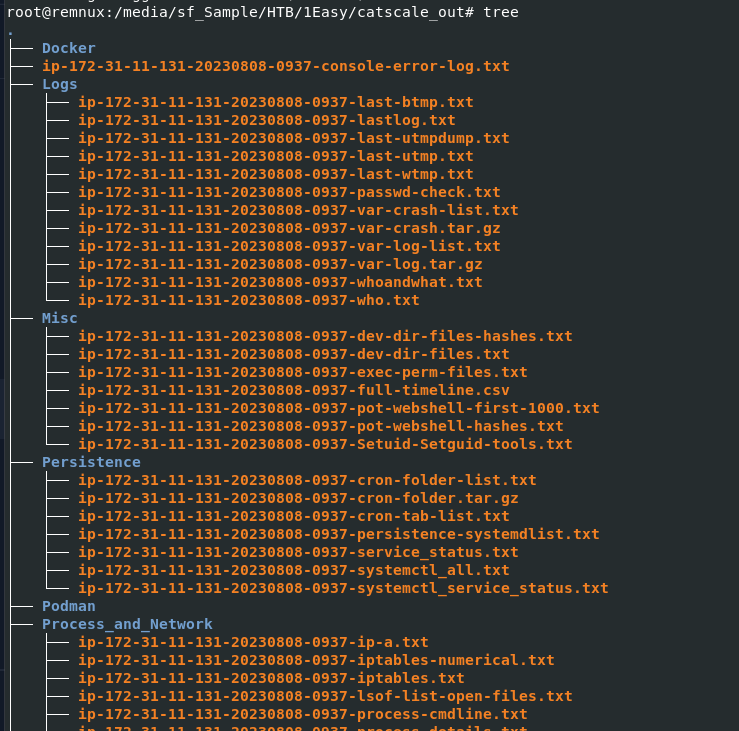
We were given with a lot of these files
To be fair, i was pretty intimiated by just looking at this tree 

But if you know that these log were collected using [Linux-CatScale](https://github.com/WithSecureLabs/LinuxCatScale) then it will be a little bit easier for you

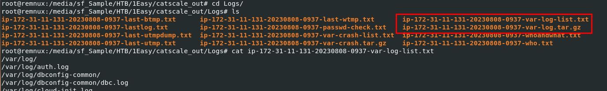
Since its about web server was attacked then we will need to investigate server log which is store in `ip-172-31-11-131-20230808-0937-var-log.tar.gz`
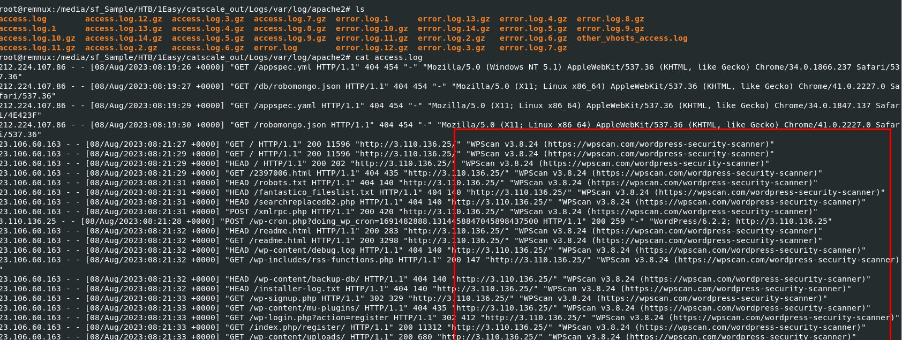
Use tar to unzip it and investigate `access.log`, we can see that user-agent that interacted with this website was WPScan v3.8.24 so it was under wordpress scanner
```
wpscan/3.8.24
```

>Task 2: Which CVE was exploited by the attacker?


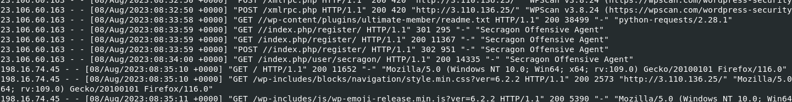
wpscan ended here but ultimate member plugin was accessed next with python user-agent which mean it could be exploited by public exploit script 
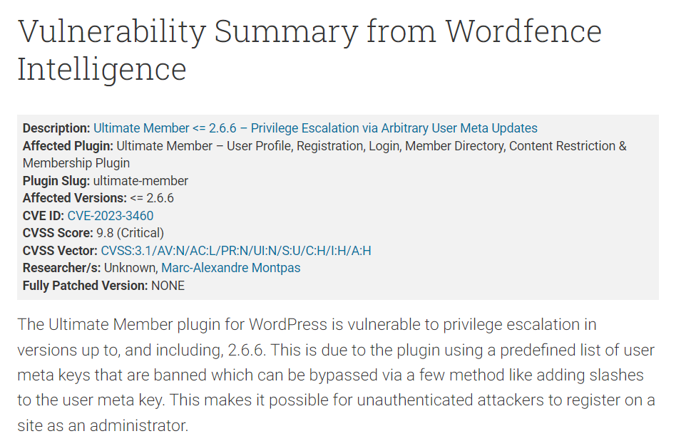
I did some research about this plugin and found [this blog](https://www.wordfence.com/blog/2023/06/psa-unpatched-critical-privilege-escalation-vulnerability-in-ultimate-member-plugin-being-actively-exploited/) which explain everything about this vulnerability
```
CVE-2023-3460
```

>Task 3: What was the IP Address utilized by the attacker to exploit the CVE?
```
23.106.60.163
```

>Task 4: What is the name of the backdoor user added to the blog as part of the exploitation process?


We know that this CVE was used to create user and it was redirected to user page that was registered with this vulnerability
```
Secragon
```

>Task 5: After the exploit, the SOC team observed that the attacker's IP address changed and from the logs, it seems that the attacker manually explored the website after logging in. The SOC team believes that the previous IP seen during exploitation was a public cloud IP. What is the IP Address the attacker used after logging in to the site?

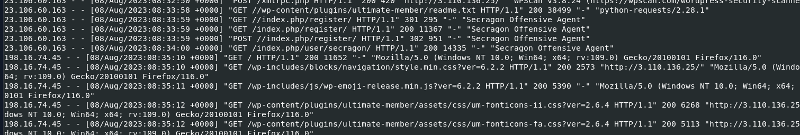
```
198.16.74.45
```

>Task 6: The SOC team has suspicions that the attacker added a web shell for persistent access. Confirm the full path of the web shell on the server.

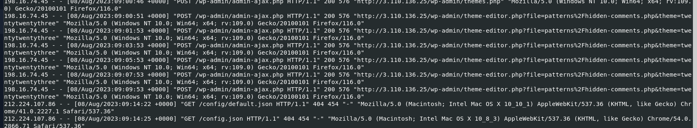
this php script was constantly requested by an attacker 
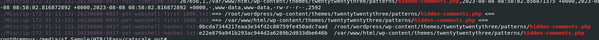
So I searched this script to all files inside a folder we were given with `grep -r "hidden-comments.php" .` and I found where to look out for next
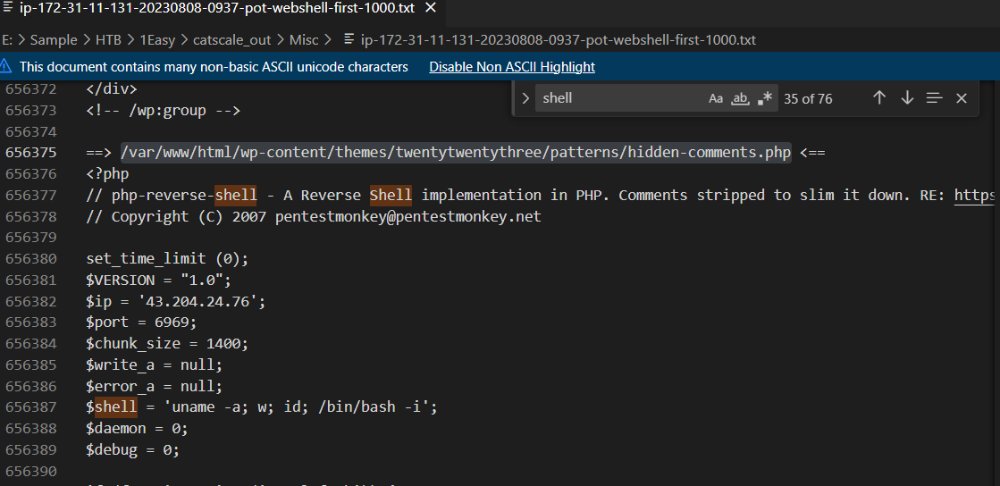
I opened this file and search for "shell" which lands me with php reverse shell script as I expected
```
/var/www/html/wp-content/themes/twentytwentythree/patterns/hidden-comments.php
```

>Task 7: What was the value of the $shell variable in the web shell?

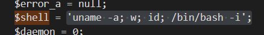 
```
'uname -a; w; id; /bin/bash -i';
```

>Task 8: What is the size of the webshell in bytes?

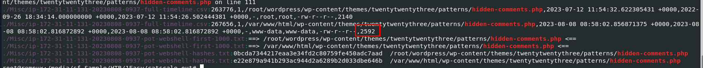
Result from `grep -r "hidden-comments.php ."` also show us the size of the webshell from timeline.csv
```
2592
```

>Task 9: The SOC team believes that the attacker utilized the webshell to get RCE on the server. Can you confirm the C2 IP and Port?

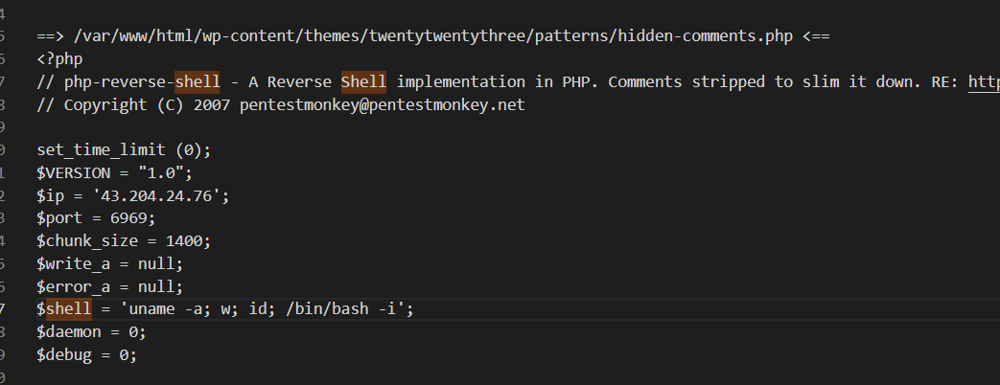
It was written there
```
43.204.24.76:6969
```

>Task 10: What is the process ID of the process which enabled the Threat Actor (TA) to gain hands-on access to the server?

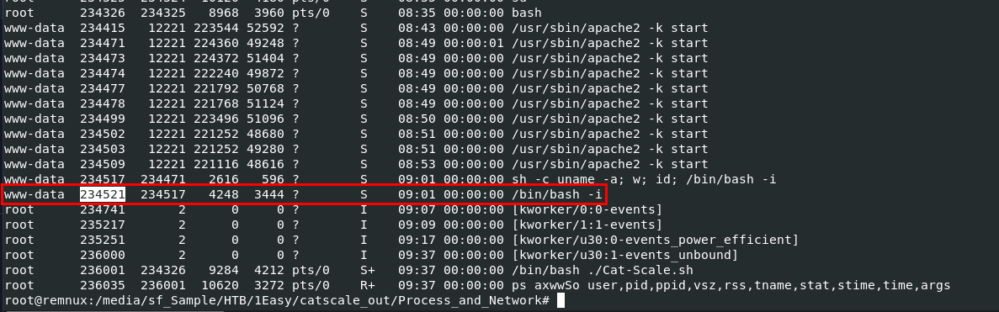
This time I searched through every file in "Process and Network" directory which landed me with this file `ip-172-31-11-131-20230808-0937-processes-axwwSo.txt`
We know that the above one that I marked is the value in $shell variable that being executed first so it has to be the one after it 
```
234521
```

>Task 11: What is the name of the script/tool utilized as part of internal enumeration and finding privilege escalation paths on the server?

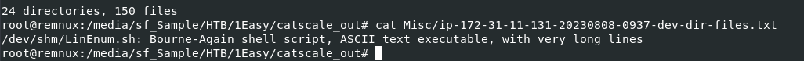
I accidently found this from "Misc" folder which was the correct answer too
```
LinEnum.sh
```

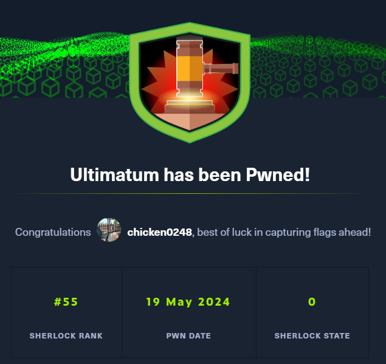
* * *
