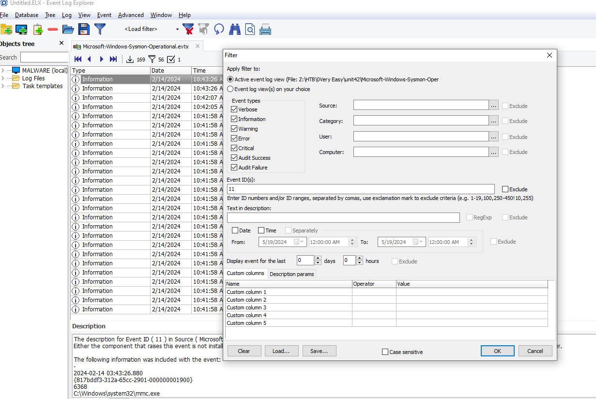
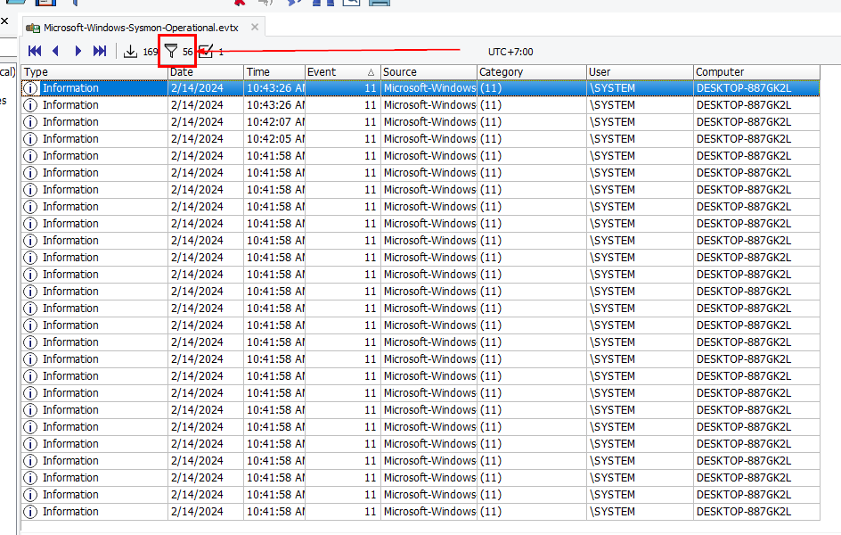
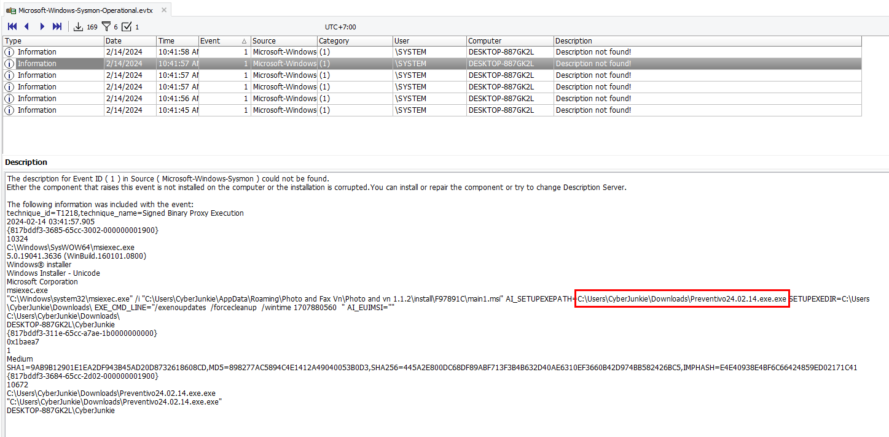
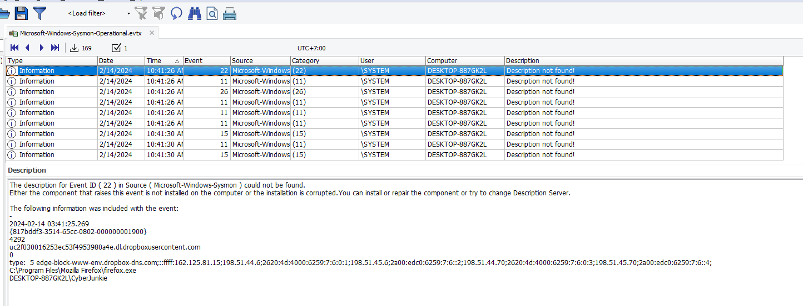
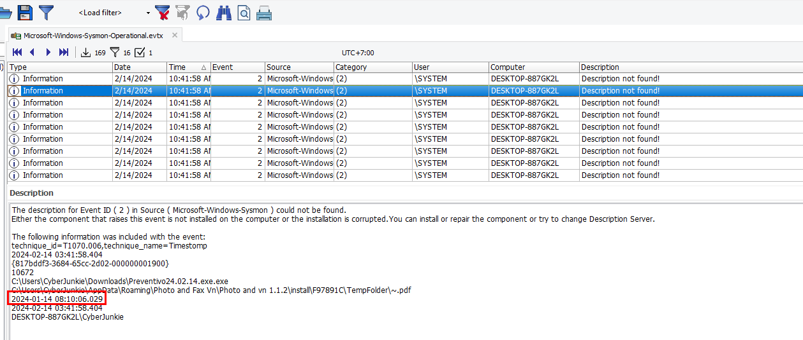
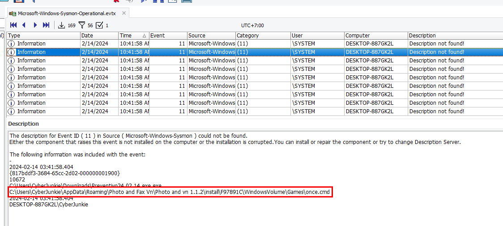
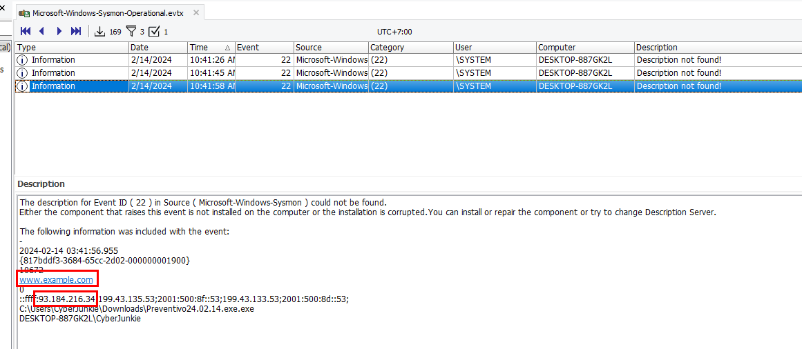
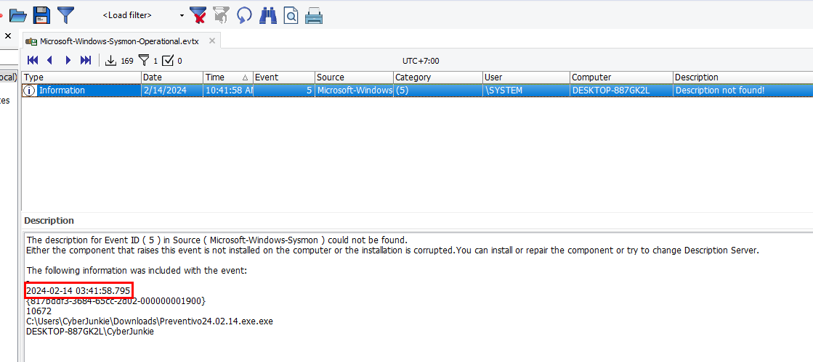
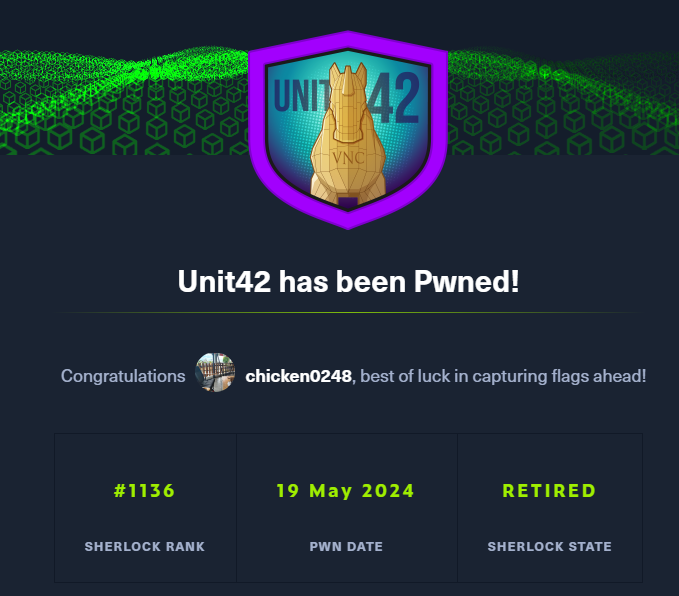

# [HackTheBox Sherlocks - Unit42](https://app.hackthebox.com/sherlocks/Unit42)
Created: 19/05/2024 16:16
Last Updated: 19/05/2024 16:32
* * *


**Scenario:**
In this Sherlock, you will familiarize yourself with Sysmon logs and various useful EventIDs for identifying and analyzing malicious activities on a Windows system. Palo Alto's Unit42 recently conducted research on an UltraVNC campaign, wherein attackers utilized a backdoored version of UltraVNC to maintain access to systems. This lab is inspired by that campaign and guides participants through the initial access stage of the campaign.

* * *
>Task 1: How many Event logs are there with Event ID 11?


Open log file with Event Log Explorer or you can use Windows built-in event log viewer and filter for Event ID 11 ([FileCreate](https://www.ultimatewindowssecurity.com/securitylog/encyclopedia/event.aspx?eventid=90011))

```
56
```

>Task 2: Whenever a process is created in memory, an event with Event ID 1 is recorded with details such as command line, hashes, process path, parent process path, etc. This information is very useful for an analyst because it allows us to see all programs executed on a system, which means we can spot any malicious processes being executed. What is the malicious process that infected the victim's system?

EventID 1 is [Process creation](https://www.ultimatewindowssecurity.com/securitylog/encyclopedia/event.aspx?eventid=90001) so lets filter this Event ID on our event log explorer

You can see that msiexec was used to install `main1.msi` but the custom change was made to set the path to an another exe file inside CyberJunkie's Downloads folder.
```
C:\Users\CyberJunkie\Downloads\Preventivo24.02.14.exe.exe
```

>Task 3: Which Cloud drive was used to distribute the malware?


I reset filter and sort by time to correlate event and timeline which lead to downloaded malicious exe file and I found this
```
dropbox
```

>Task 4: The initial malicious file time-stamped (a defense evasion technique, where the file creation date is changed to make it appear old) many files it created on disk. What was the timestamp changed to for a PDF file?

We need to filter out for EventID 2 ([A process changed a file creation time](https://www.ultimatewindowssecurity.com/securitylog/encyclopedia/event.aspx?eventid=90002)) 

Scrolling down to find for any file end with .pdf then we got this record that was change timestamp from "2024-02-14 03:41:58.404" to "2024-01-14 08:10:06.029"
```
2024-01-14 08:10:06
```

>Task 5: The malicious file dropped a few files on disk. Where was "once.cmd" created on disk? Please answer with the full path along with the filename.

Back to Event ID 11 ([FileCreate](https://www.ultimatewindowssecurity.com/securitylog/encyclopedia/event.aspx?eventid=90011)) again

Narrow down to the time after malicious exe was installed, a few files were dropped including this file here
```
C:\Users\CyberJunkie\AppData\Roaming\Photo and Fax Vn\Photo and vn 1.1.2\install\F97891C\WindowsVolume\Games\once.cmd
```

>Task 6: The malicious file attempted to reach a dummy domain, most likely to check the internet connection status. What domain name did it try to connect to?

We will use Event ID 22 ([DNSEvent](https://www.ultimatewindowssecurity.com/securitylog/encyclopedia/event.aspx?eventid=90022)) for this task

first 2 records are about dropbox (initial acces) and the last record is the one we're looking for, we even got an IP address to answer the next task.
```
www.example.com
```

>Task 7: Which IP address did the malicious process try to reach out to?
```
93.184.216.34
```

>Task 8: The malicious process terminated itself after infecting the PC with a backdoored variant of UltraVNC. When did the process terminate itself?

We will have to filter for Event ID 5 ([Process terminated](https://www.ultimatewindowssecurity.com/securitylog/encyclopedia/event.aspx?eventid=90005))

Luckily we didn't have to go through much finding since it only has 1 record
```
2024-02-14 03:41:58
```


* * *
