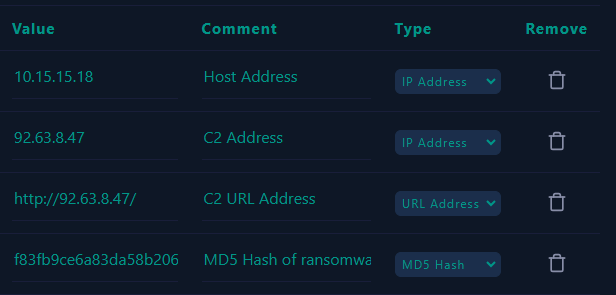
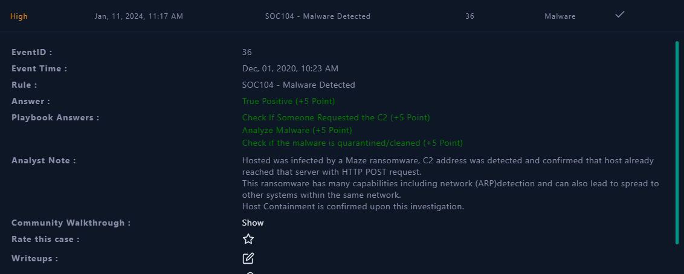

# LetsDefend - EventID 36 - SOC 104 - Malware Detected
Created: 10/01/2024 13:58
Last Updated: 05/03/2024 10:57
* * *
> 	**EventID :** 36
**Event Time :** Dec, 01, 2020, 10:23 AM
**Rule :** SOC104 - Malware Detected
**Level :** Security Analyst
**Source Address :** 10.15.15.18
**Source Hostname :** AdamPRD
**File Name :** Invoice.exe
**File Hash :** f83fb9ce6a83da58b20685c1d7e1e546
**File Size :** 473.00 KB
**Device Action :** Allowed
**File (Password:infected) :** [Download](https://files-ld.s3.us-east-2.amazonaws.com/f83fb9ce6a83da58b20685c1d7e1e546.zip)

* * *
[toc]
* * *
## Start Playbook!
### Define Threat Indicator 
```
Other
```

### Check if the malware is quarantined/cleaned

Look at the alert details, it clearly says Device Action is allowed so it still there on the endpoint even if I didn't see any process running
<div align=center>


</div>

```
Not Quarantined
```

### Analyze Malware

Let's start by searching with hash in [VirusTotal](https://www.virustotal.com/gui/file/e8a091a84dd2ea7ee429135ff48e9f48f7787637ccb79f6c3eb42f34588bc684/detection)
<div align=center>


**61** vendors flagged this file as malicious

Popular threat label: `ransomware.maze/deepscan`
</div>

Now this is a hugh red flag right here, most of security vendors flagged this file as malware and it's kind of ransomware called [Maze](https://www.pcrisk.com/removal-guides/15133-maze-ransomware) ransomware and by knowing what kind of malware it is, it make an investigation a lot easier 

In **Behavior** tab, we can see how this ransomware doing it jobs with MITRE ATT&CK Tactics and Techniques
<div align=center>


</div>

We can see that this ransomware can
1. Checks if any antivirus program is installed.
2. Enumerates the file system. 
3. Encrypt data.
4. Stores files to the Windows startup directory.
5. Tries to harvest and steal browser information.
6. Creates a DirectInput object. (often for capturing ketstrokes)
7. Opens, set and deletes some registry keys.
8. Queries a list of all running processes.
9. Queries the cryptographic machine GUID.
10. Posts data to webserver.
11. Download files.
12. Write ransom notes to many directories.

And there are a bunch of **HTTP POST requests** it tries to communicate to probably C2 servers
<div align=center>


</div>

Now let's investigate with [hybrid analysis](https://www.hybrid-analysis.com/sample/e8a091a84dd2ea7ee429135ff48e9f48f7787637ccb79f6c3eb42f34588bc684) and compare the result to VirusTotal so after that we can form a conclusion.

<div align=center>


This file also flagged with Malicious with `Threat Score 100:100` but labeled as **Trojan.Generic**
</div>

In the **Incident Response** section, We can see additional information that we missed from VirusTotal result
<div align=center>


</div>
This file also deletes volumn snapshots, read active computer name and broadcast ARP request so it can spread to other system as well. 

So this is indeed
```
Malicious
```

### Check If Someone Requested the C2

<div align=center>


</div>

In **Log Management**, We found that there is a communication between host and C2 server so i answered this question as 
```
Accessed
```
* * *
### Containment

<div align=center>


</div>

** *
### Add Artifacts

<div align=center>


</div>

```
10.15.15.18 : Host Address
http://92.63.8.47/ : C2 Address
http://92.63.8.47/ : C2 URL Address
f83fb9ce6a83da58b20685c1d7e1e546 : MD5 hash of ransomware
```
* * *
### Analyst Note
```
Hosted was infected by a Maze ransomware, C2 address was detected and confirmed that host has already reached that server with HTTP POST request.
This ransomware has many capabilities including network (ARP) detection and can also lead to spread to other systems within the same network. 
Host Containment is confirmed upon this investigation.
```
* * *
## Close Alert
<div align=center>



</div>

* * *