# [LetsDefend - Agniane Stealer](https://app.letsdefend.io/challenge/agniane-stealer)
Created: 19/06/2024 12:04
Last Updated: 19/06/2024 15:16
* * *
<div align=center>

**Agniane Stealer**
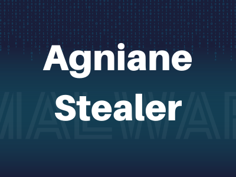
</div>
SecureTech Solutions recently detected unusual activity on its employee workstations. Upon investigation, they found that sensitive customer information, including email addresses and passwords, has been compromised. The company suspects that a stealer malware might be responsible for the breach.

**File location**: /Desktop/ChallengeFile/stealer.7z/
**File Password**: infected
* * *
## Start Investigation
>What is the decode hostname that is used by the stealer?

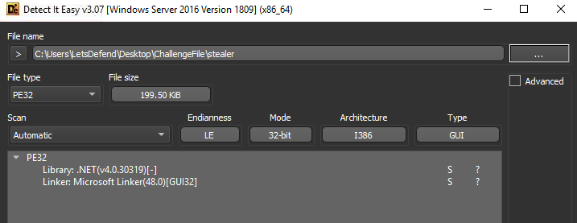

First, we need to determine which debugger/decomplier we can use on this sample and as you can see that this sample is .NET based which mean we can use either Jetbrains dotPeek or ILSpy

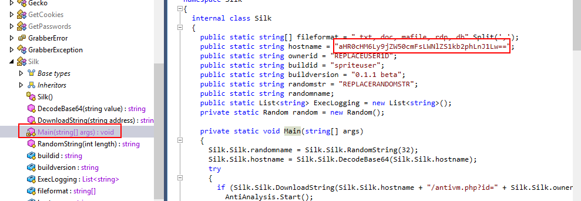

When it comes to analyze code, we often start from Main() function and luckily for us that many variables incluing hostname are declared inside this function

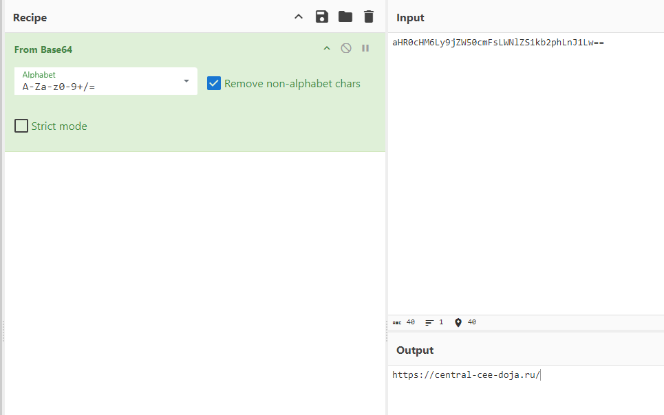

It's base64 encoded, so we will have to decode it first

```
https://central-cee-doja.ru/
```

>What is the API used by the stealer to detect debuggers?

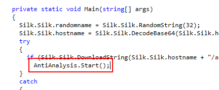

There is a function calls to `AntiAnalysis.Start()` inside `Main()` function which will lead us to `Start()` function within `AntiAnalysis` class

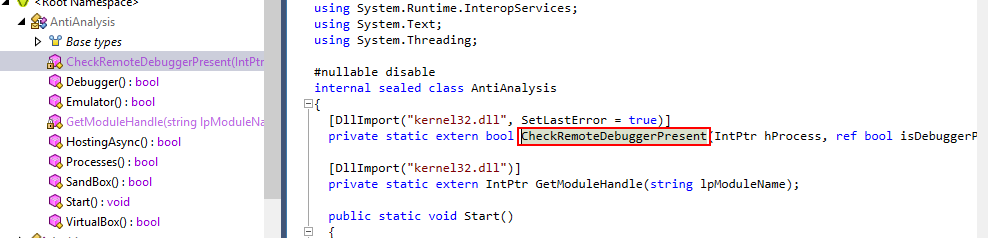

Then when we read this function, we can see that there is a method imported from `kernel32.dll` that used to determine if a debugger is presented or not

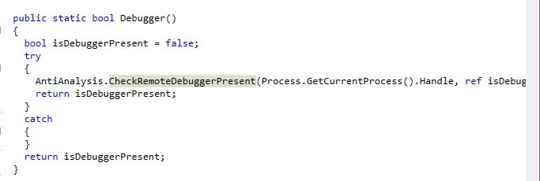

And here is an example on how this method is used inside of `Debugger()` function 

```
CheckRemoteDebuggerPresent
```

>What is the number of the process names that are used by stealer to detect 
malware analysts?

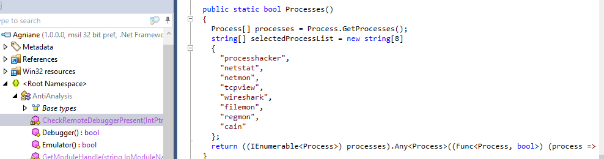

Following `Debugger()` function then we can see a list is declared and it consists of processes that are known for debugging and doing digital forensics

```
8
```

>What is the number of the functions that are used by the stealer as anti-analysis?

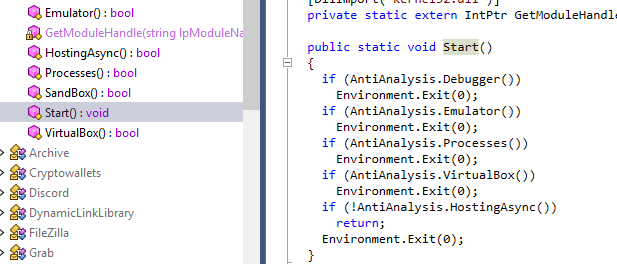

Inside `Start()` function, we can see that 5 functions are used to determine if this malware should exit or not 

```
5
```

>What is the first DLL name that was downloaded by the malware?

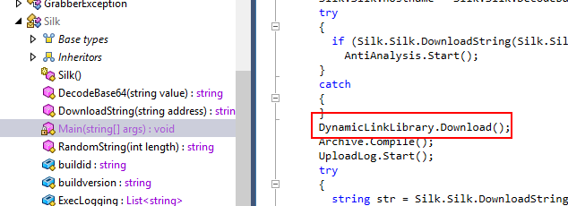

Go back to `Main()` function then you can see there is a function calls to `Downloads()` function within `DynamicLinkLibrary` class

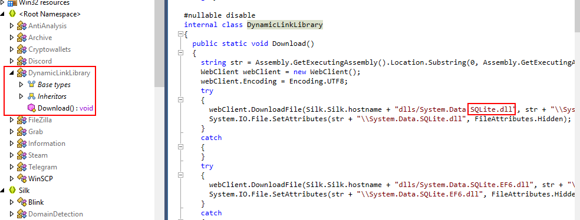

Upon following to `DynamicLinkLibrary` then we can see all dlls that going to be downloaded by `Download()` function

```
SQLite.dll
```

>What is the name of the project advertised by the malware?

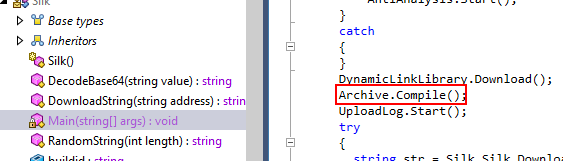

Agniane is known to be a made by Cinoshi project but if we want to find an answer by reading through code, we need to dig into `Archive.Compile()`

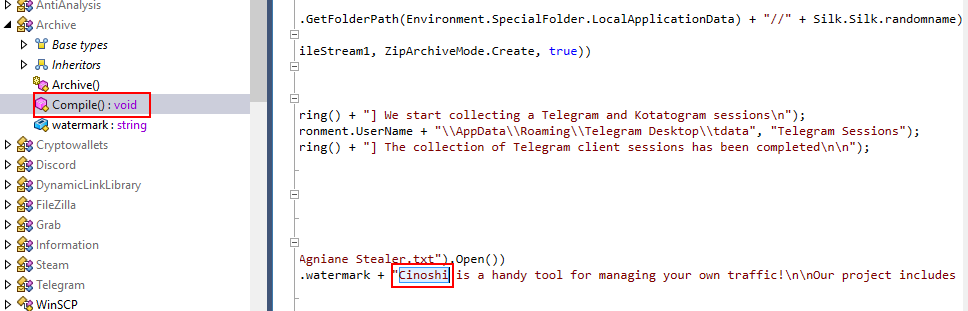

Here is where Cinoshi project was mentioned

```
Cinoshi
```

>What is the user of the bot in Telegram?

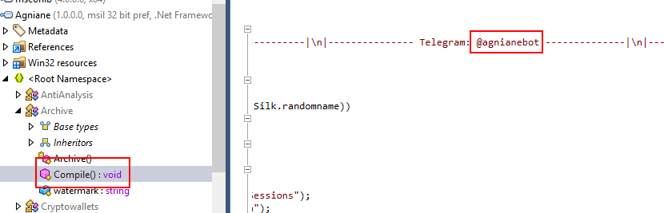

This telegram bot is used to receive all informations that collect by this malware

```
@agnianebot
```

>What is the first regex that is used by the malware to find tokens?

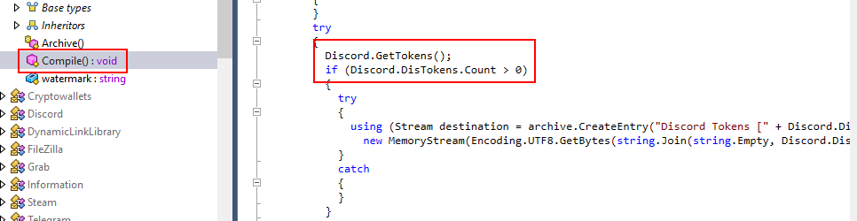

Inside `Compile()` function there is another function calls related to token which is `Discord.GetTokens()`

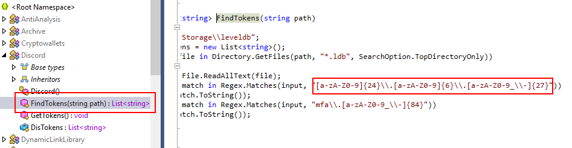

Follow it to the bottom of this code then we can see Regex that used to find tokens

```
[a-zA-Z0-9]{24}\\.[a-zA-Z0-9]{6}\\.[a-zA-Z0-9_\\-]{27}
```

>What is the build version?

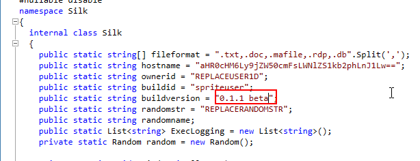

Go back to `Main()` function for this one
 
```
0.1.1 beta
```

>How many domains are targeted by the Stealer to collect passwords and login credentials?

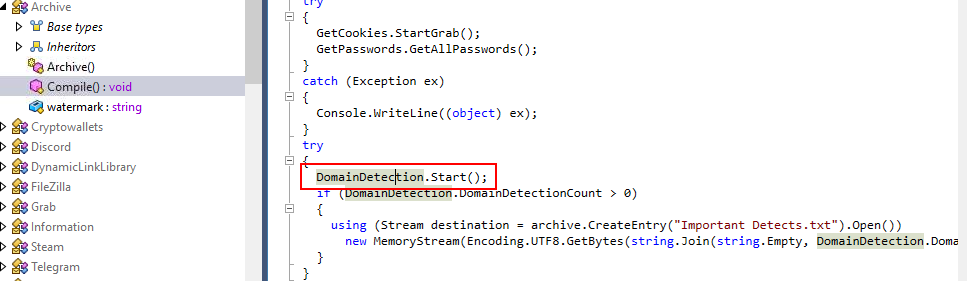

Go back to `Compile()` function again then we can see there is a function calls related to domain here 

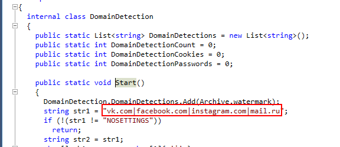

there are 4 domains that this malware tries to harvest credentials

```
4
```

>Which specific registry key is targeted by the malware to collect Hostname, username, and password information from all sessions of WinSCP?

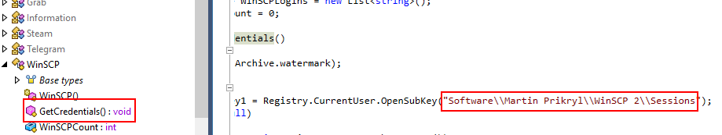

Go to `WinSCP` class then you can see `GetCredentials()` function responsible for harvesting all sessions of WinSCP

```
Software\\Martin Prikryl\\WinSCP 2\\Sessions
```

>What is the file name that is used by the stealer to save the information about the system?

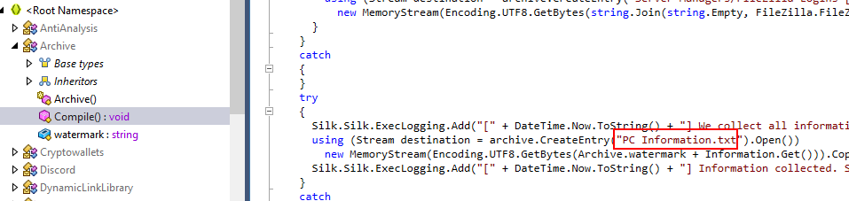

Inside `Compile()` function, there is a text file that was created to save all information about system here.

```
PC Information.txt
```

* * *
## Summary

On this challenge, we analyzed Agniane stealer which is an .NET infostealer malware based that has many capabilities including 
- Anti-debugging
- Harvesting browser cookies, telegram/steam/discord sessions, login credentials, WinSCP sessions, FileZilla credentials, Capturing screenshots, computer information, Cryptocurrency wallets/extensions and so on...
- Send data back to telegram bot 

Zscaler made very information blog about this malware [here](https://www.zscaler.com/blogs/security-research/agniane-stealer-dark-web-s-crypto-threat) 

<div align=center>

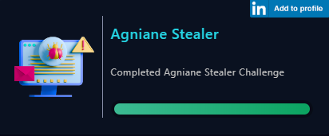
</div>

* * *
