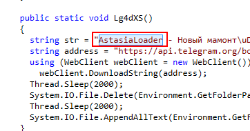

# [LetsDefend - AstasiaLoader](https://app.letsdefend.io/challenge/astasialoader)
Created: 19/06/2024 10:45
Last Updated: 19/06/2024 11:46
* * *
<div align=center>

**AstasiaLoader**

</div>

In this challenge, participants will play the role of security analysts tasked with investigating a potential malware incident involving an employee who has encountered suspicious activity. The challenge focuses on analyzing the suspected malware and identifying its behavior, potential payload, and mitigation strategies.

**File Location**: C:\Users\LetsDefend\Desktop\ChallengeFile\sample.7z

**File Password**: infected

* * *
## Start Investigation
>What is the base address of the sample?
Answer Format: 0x000000


Open sample file on Detect It Easy then you will have both Base address and Entry point, and do not that this sample is .NET base so we will have to use JetBrains dotPeek or ILSpy

```
0x400000
```

>What is the entry point of the sample?
Answer Format: 0x000000


```
0x4aab56
```

>What is the sha256 hash of the sample?


Using HashCalc to calculate filehash of this sample file

```
9d1ba303d691bee165c66a698adba44419bc772182fb80c927ee1df3464f40f9
```

>What is the directory name that was created by malware?


Inside Form1 function, there is an attempt to create directory and then if a specific file in that folder exists then it will return indicating that it won't affect the same host twice.

```
Astasia
```

>What is the URL that is encoded by the malware?


There is an url belonged to github that will be encoded and decoded inside `VcSR9o` class 


Upon researching about this malware, I've learned that this `README.md` was used to store url that hosted for redline steader

```
https://raw.githubusercontent.com/newuploaders/newuploaders/main/README.md
```

>Using Thread.Sleep, how long does the code pause execution of the current thread? (in milliseconds)


There is a `Lg4dXD` function inside `VcSR9o` class that will send information collects by redline stealer to telegram bot then sleep for 2000 milliseconds before deleting redline stealer then sleep again and then append number `1` to a file created by this malware

```
2000
```

>What is the name of the malware?


```
AstasiaLoader
```

>What is the username of the attacker on Telegram?


```
@SkalaMmmvkusno
```

>What is the name of the file that is deleted by the malware?


```
infected.exe
```

>What is the name of the file that was checked by malware or not?


```
currentscript.txt
```

* * *
## Summary

On this challenge, We analyzed AstasiaLoader which is .NET based malware that will read URL from `README.md` hosted on github and will download redline stealer to exfiltrate sensitive data and send them to Telegram bot then it also will also delete redline stealer from your system after data exfiltration process is completed 

<div align=center>


</div>

* * *