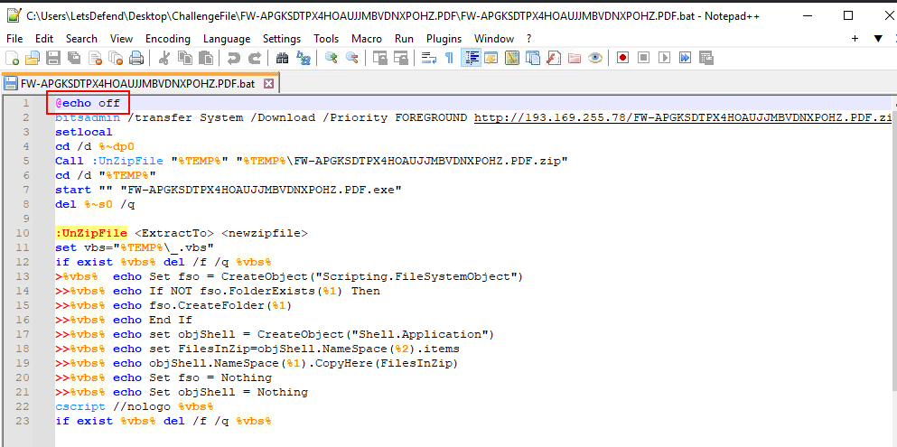
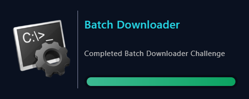

# [LetsDefend - Batch Downloader](https://app.letsdefend.io/challenge/batch-downloader)
Created: 16/07/2024 08:00
Last Updated: 26/07/2024 07:20
* * *
<div align=center>

**Batch Downloader**

</div>
A malicious batch file has been discovered that downloads and executes files associated with the Laplas Clipper malware. Analyze this batch file to understand its behavior and help us investigate its activities.

* * *
## Start Investigation
>What command is used to prevent the command echoing in the console?



We got windows batch script that will start by not output anything to the console with `@echo off` then 
- it begins to use [bitsadmin](https://lolbas-project.github.io/lolbas/Binaries/Bitsadmin/) (LOLBIN) to download zip file from C2 server to Temp folder
- it create local scope of this script with `setlocal` so global environment variables will not be affect by this script 
- It uses `UnZipFile` function (which utilized VBScript) to extract content of downloaded zip file 
- It runs malicious exe file that extracted from zip file and eventually delete this batch script from system

```
@echo off
```

>Which tool is used to download a file from a specified URL in the script?
```
bitsadmin
```

>What is the priority set for the download operation in the script?
```
FOREGROUND
```

>Which command is used to start localization of environment changes in the script?
```
setlocal
```

>Which IP address is used by malicious code?
```
193.169.255.78
```

>What is the name of the subroutine called to extract the contents of the zip file?
```
UnZipFile
```

>Which command attempts to start an executable file extracted from the zip file?
```
start "" "FW-APGKSDTPX4HOAUJJMBVDNXPOHZ.PDF.exe"
```

>Which scripting language is used to extract the contents of the zip file?
```
VBScript
```

* * *
## Summary
On this challenge, we got a malicious Windows batch script to analyze and when it got executed then it will use LOLBIN to download a file from C2 server, unzip it and execute extracted file.

<div align=center>


</div>

* * *
