# [LetsDefend - Brute Force Attacks](https://app.letsdefend.io/challenge/brute-force-attacks)
Created: 24/07/2024 09:11
Last Updated: 24/07/2024 11:11
* * *
<div align=center>

**Brute Force Attacks**
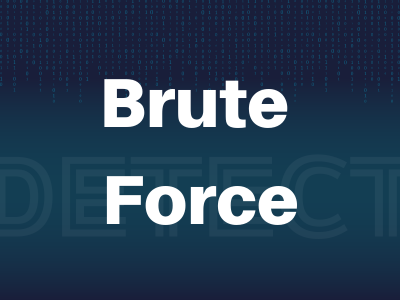
</div>
Our web server has been compromised, and it's up to you to investigate the breach. Dive into the system, analyze logs, dissect network traffic, and uncover clues to identify the attacker and determine the extent of the damage. Are you up for the challenge?

**File Location**: /root/Desktop/ChallengeFile/BruteForce.7z
**File Password**: infected
* * *
## Start Investigation
>What is the IP address of the server targeted by the attacker's brute-force attack?

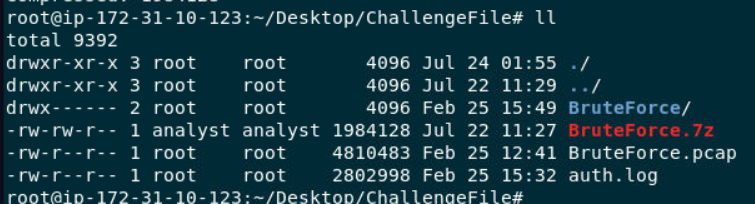

We got 2 artifacts that could be used which are pcap file and authentication log

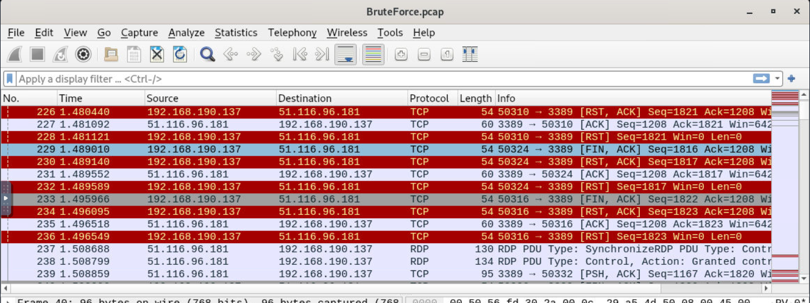

First thing that we could notice is that there are multiple RDP connection from this specific IP address to private IP address which should be the webserver that we got this network capture file from

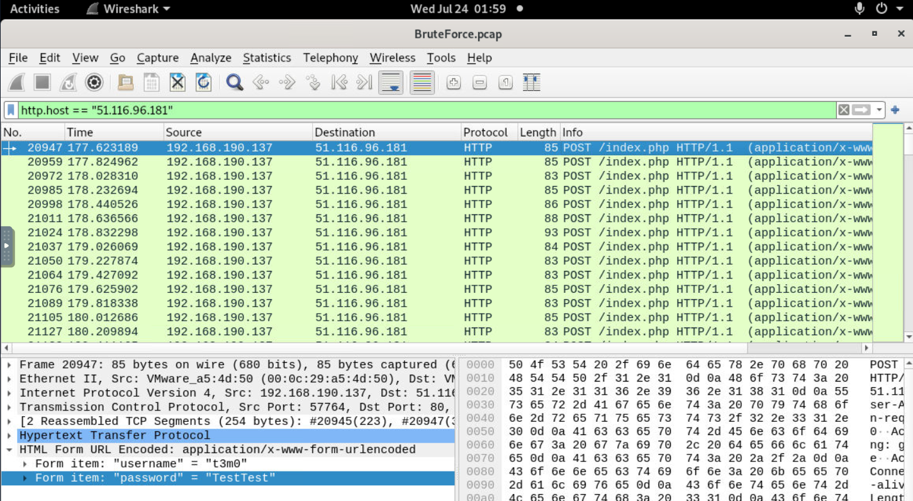

When filtered for the external IP address which revealing another story, turns out that this external IP address is a webserver and it was also bruteforced to get access via login page 

```
51.116.96.181
```

>Which directory was targeted by the attacker's brute-force attempt?
```
index.php
```

>Identify the correct username and password combination used for login. <br>
**Answer Format**: username:password

I tried to filter for HTTP response code 302 (Redirected) which most of website will be redirected to dashboard or another webpage after successfully logged on but there is no HTTP 302 here so I tried to identify which would be the different between successful logged on attempt and failed logon attempt 

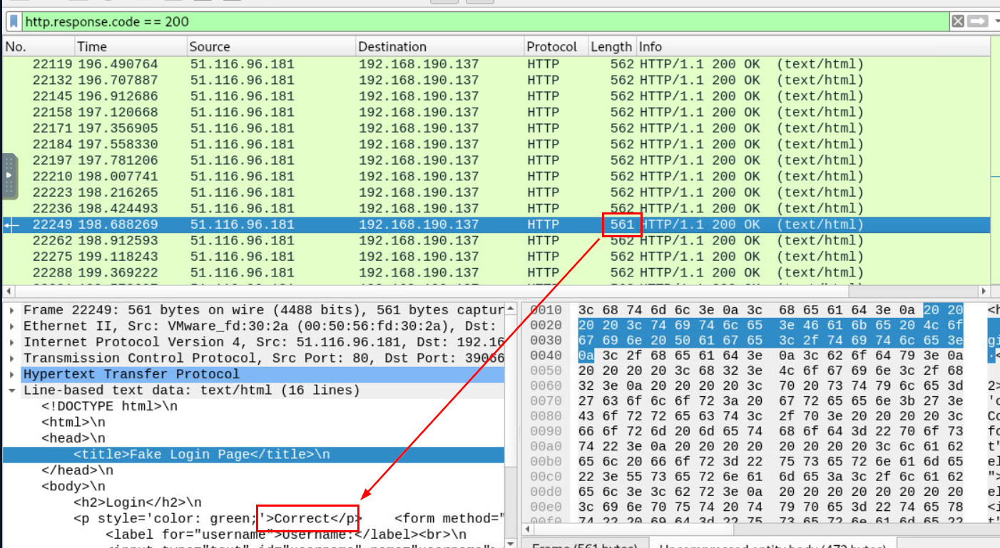

And I finally found one right there, we can see that this HTTP response got 1 less bytes than the rest and when we inspected it then we could it that this attempt was successful

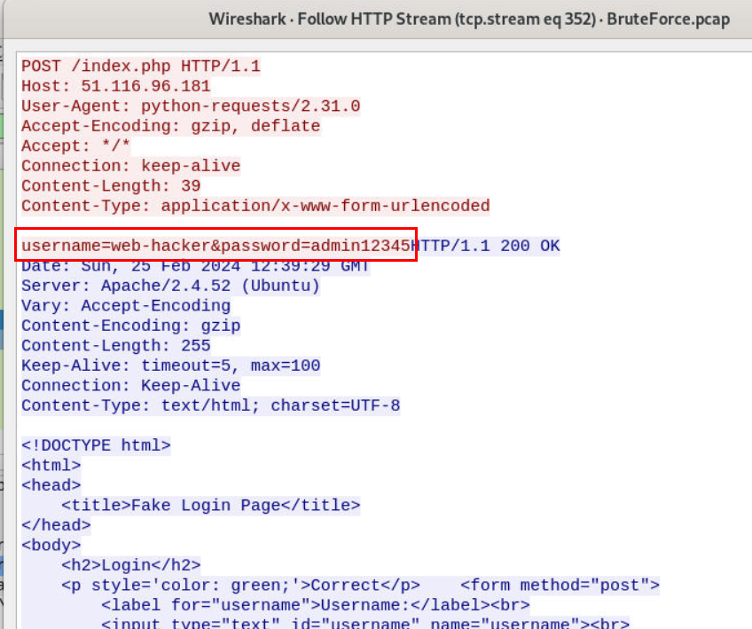

And here is the valid credentials that was accepted on this webserver

```
web-hacker:admin12345
```

>How many user accounts did the attacker attempt to compromise via RDP brute-force?

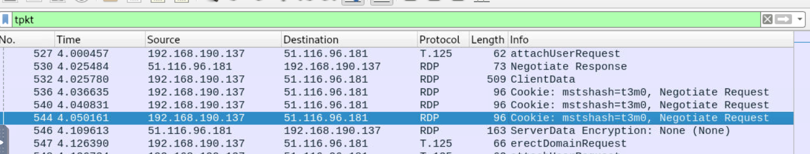

After filtered for `rdp`, we can see that there is user account name on Negotiation Request so we can use this information to get all users that was requested from this IP address

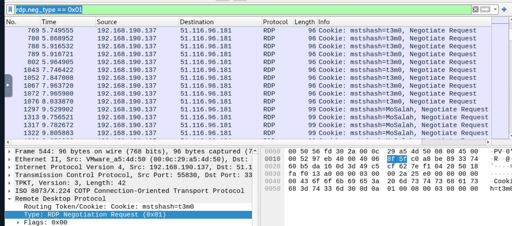

By using `rdp.neg_type == 0x01`, we can determine 10 unique users that sent negotiation request which are
- `t3m0` 
- `Mosalah` 
- `Messi` 
- `web-hacker`
- `Kareem`
- `Mostafa`
- `mmox`
- `Mohamed`
- `Ali`
- `Mohsen`

But there are only 7 that got bruteforced

```
7
```

>What is the “clientName” of the attacker's machine?

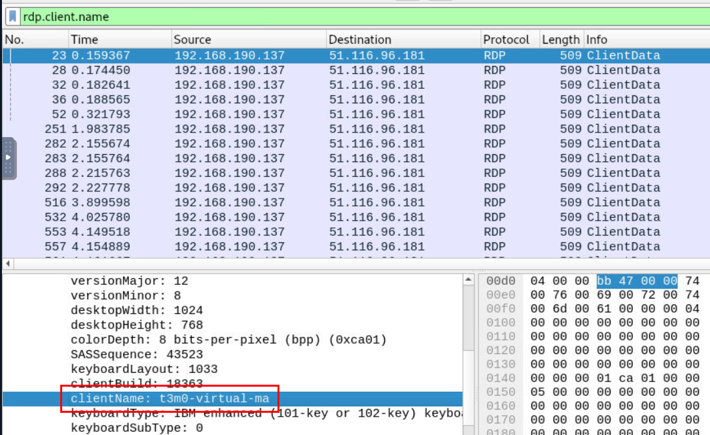

We can use `rdp.client.name` filter to get clientName of an attacker machine

```
t3m0-virtual-ma
```

>When did the user last successfully log in via SSH, and who was it? <br>
**Answer Format**: username:time (HH:MM:SS)

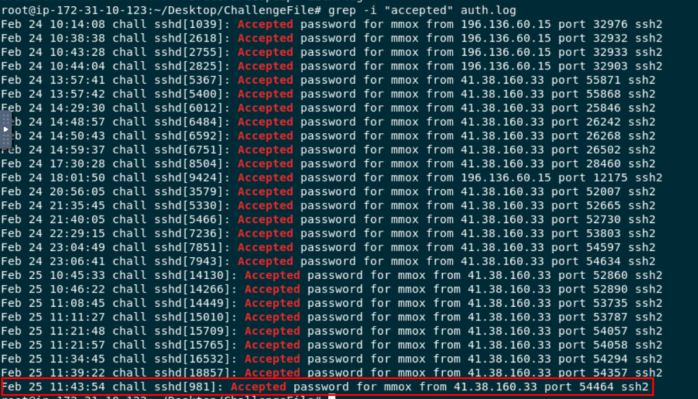

By using `grep -i "accepted" auth.log` to filter for all successful authentication then take a look at the last record from the result, this is the one we are looking for

```
mmox:11:43:54
```

>How many unsuccessful SSH connection attempts were made by the attacker?

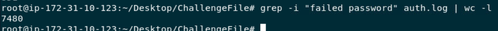

At first I thought we have to identify an attacker IP address first before filter for unsuccessful attempt but its simpler than expected, we can just use `grep -i "failed password" auth.log | wc -l` for this one

```
7480
```

>What technique is used to gain access? <br>
**Answer Format**: MitreID

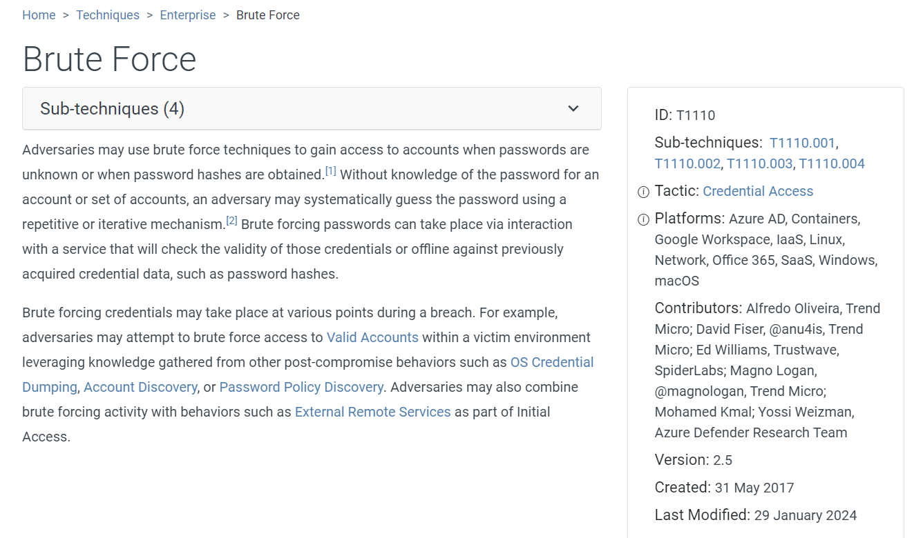

We already know its a brute force attack and [here](https://attack.mitre.org/techniques/T1110/) is the MITRE ATT&CK ID for this technique
```
T1110
```

* * *
## Summary
On this challenge, we investigated network traffic with wireshark to determine Threat Actor IP address and detect bruteforce attack to webserver and RDP

Lastly, we also investigated authentication log to determine threat actor last successful logged in attempts along with how many failed login attempt it took before gaining foothold on webserver
<div align=center>

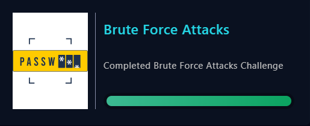
</div>

* * *
