# [LetsDefend - Compromised Chat Server](https://app.letsdefend.io/challenge/compromised-chat-server)
Created: 17/09/2024 11:02
Last Updated: 17/09/2024 14:02
* * *
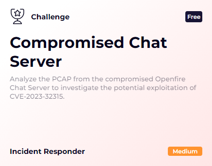
In the company, one of our teams uses Openfire, an XMPP-based chat server for their communications. Recently, the L1 analyst detected suspicious activity on the server, including abnormal login attempts and traffic spikes. Further investigation suggests a potential exploitation of CVE-2023-32315, a critical vulnerability in Openfire allowing remote code execution. To confirm this, the L1 analyst captured a packet capture (PCAP) of the server's network traffic. As an investigator, your task is to analyze the PCAP, identify any signs of compromise, and trace the attacker's actions.

File location: /root/Desktop/ChallengeFile/Challenge-File.zip
File Password: infected

* * *
## Understand the exploit
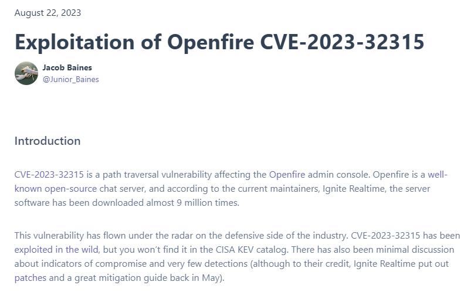
Before we start investigate this case, we might need to understand what CVE-2023-32315 really is so here is a [blog wrote by Jacob Baines](https://vulncheck.com/blog/openfire-cve-2023-32315) that would help us learn what happened when we exploited this CVE.

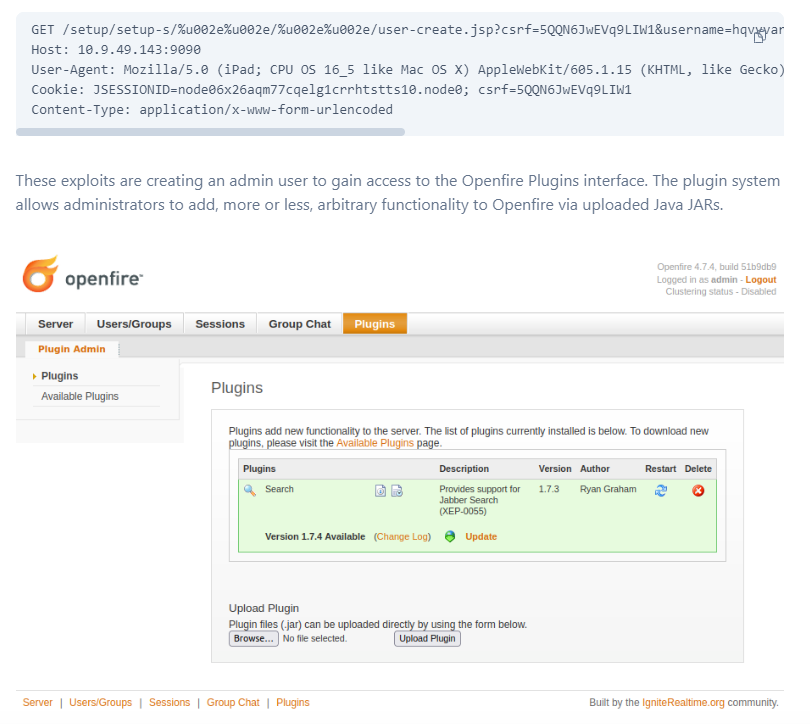
To put it simply, it start from a path traversal that will access `user-create.jsp` endpoint which responsible for user creation then create admin user and login as admin user to upload openfire plugin file (.jar file) that is actually a webshell which will allow threat actor to execute any arbitrary commands as desired.

Now we know what to look for then we can start our investigation.

## Start Investigation
>How many GET requests are there in total?

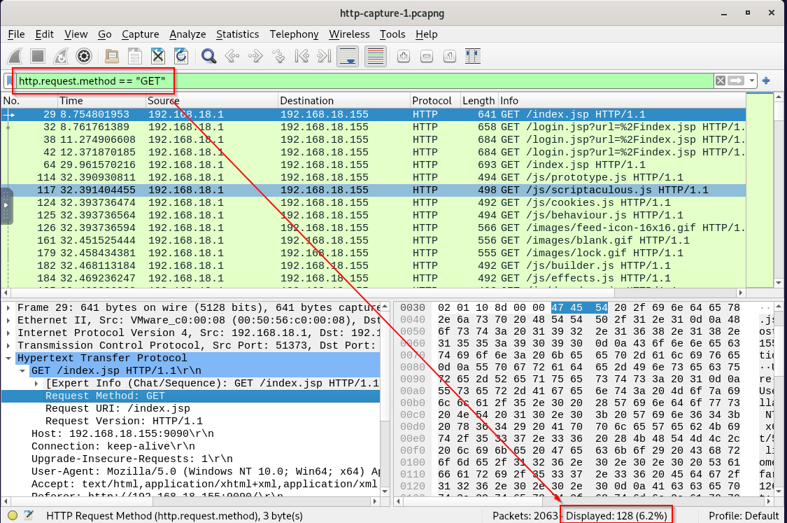

Since we were provided with pcap file then we can open it in Wireshark and use `http.request.method == "GET"` filter to display all HTTP GET request like this.

```
128
```

>What is the host value in the first HTTP packet?

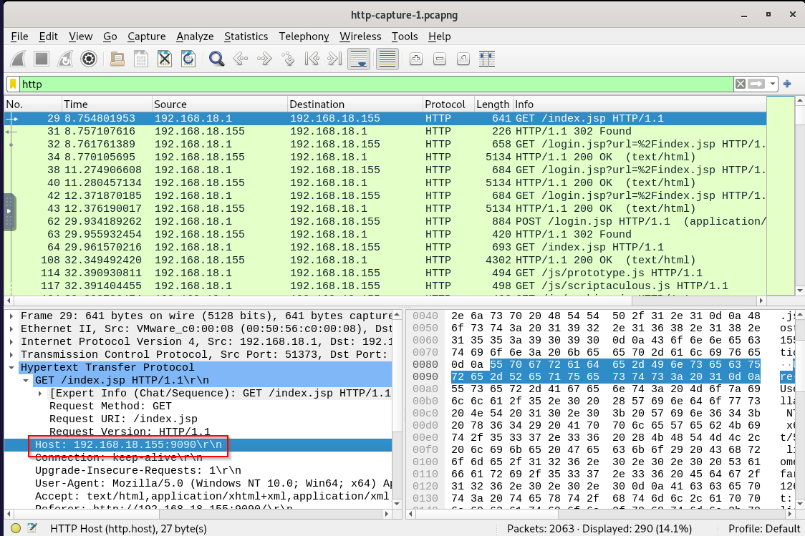

Reduce our filter to `http` then inspect first HTTP request (packet number 29) to get Host value, we can see that vulnerable openfire was running on port 9090 of 192.168.18.155

```
192.168.18.155:9090
```

>What is the CSRF token value for the first login request?

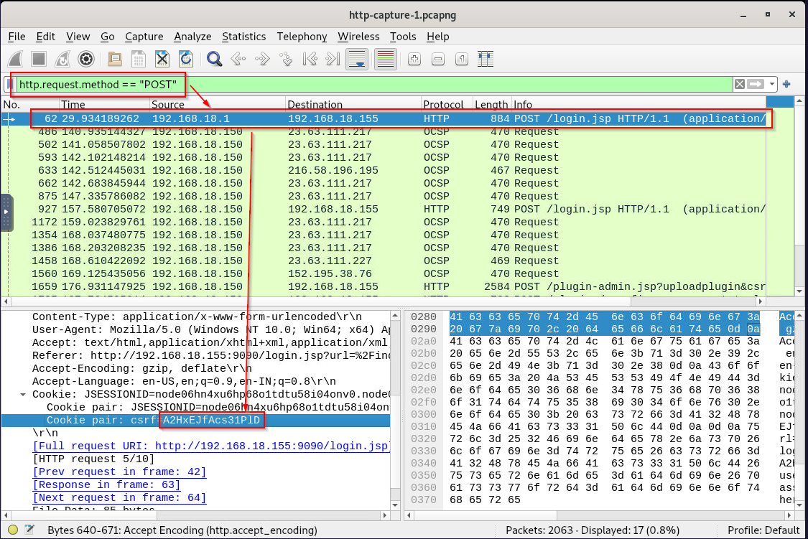

This CSRF token will differentiate legitimate user from the threat actor so we can see that after filtered by HTTP POST request, IP 192.168.18.1 sent POST request to vulnerable openfire server which likely to be the legitimate user that set this server up.   

```
A2HxEJfAcs31PlD
```

>What is the password of the first user who logged in?

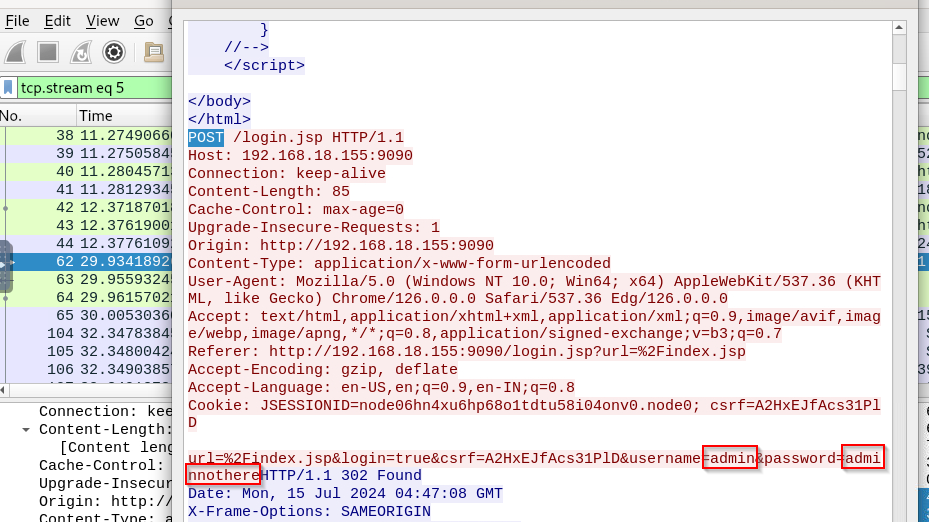

Inspect HTTP Form then we will have credential of legitimate admin of this openfire server.

```
adminnothere
```

>What is the first username that was created by the attacker?

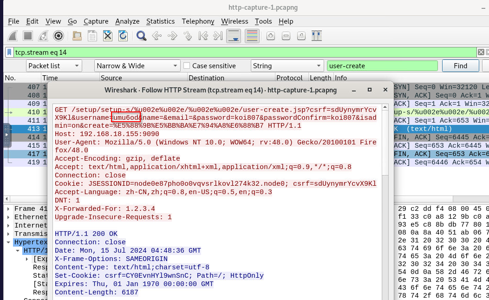

We know that the threat actor has to create user with `user-create.jsp` so we can just search for that and the result shown 4 HTTP GET request to this endpoint and this is the first one request that was successfuly, here is the user that was created. 

```
umu6od
```

>How many user accounts did the attacker create?

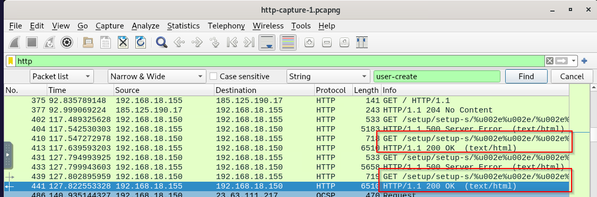

There are 4 HTTP GET requests to this endpoint but not all of them are successful, as we can see that only 2 users were successfully created. 

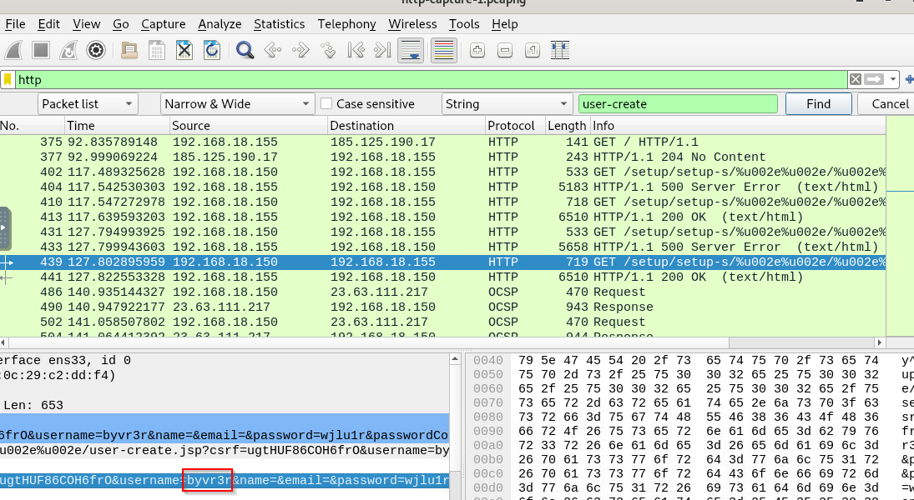

Here is the second user that was created.

```
2
```

>What is the username that the attacker used to log in to the admin panel?

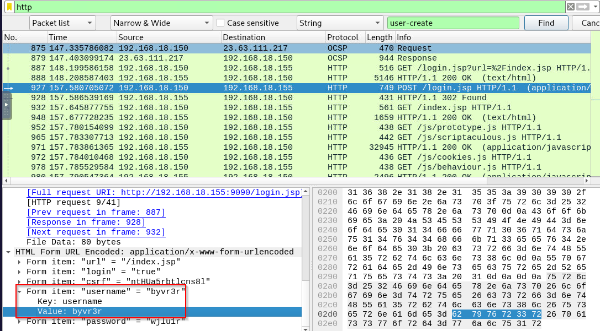

Scroll down for a bit from user account creation then we will see that second user that was created is the one that threat actor authenticated to openfire dashboard.

```
byvr3r
```

>What is the name of the plugin that the attacker uploaded?

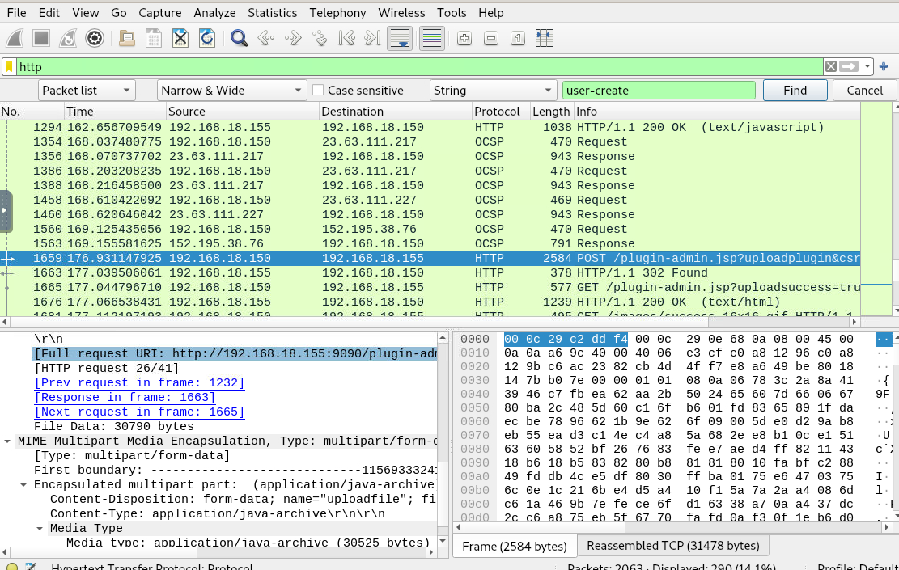

We know that threat actor had to upload webshell in admin panel so we can inspect traffic to admin panel like this then we can see "application/java-archive" being uploaded.

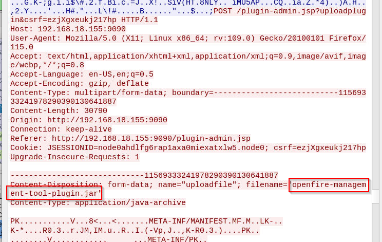

```
openfire-management-tool-plugin.jar
```

>What is the first command executed by the user?

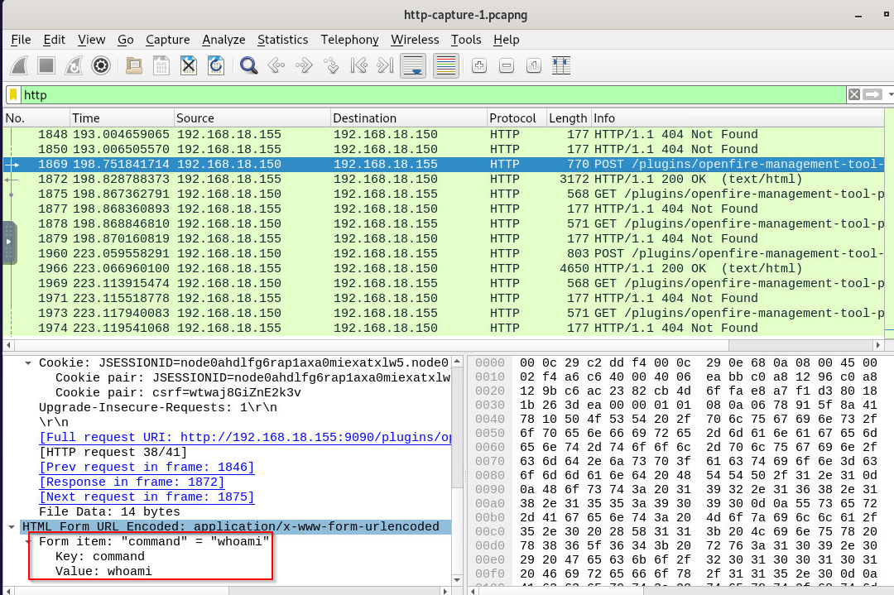

We know that it has to be a webshell so we have to find HTTP POST request sent to plugin path, which we can see that the threat actor successfully executed 2 commands and first command is `whoami`.

```
whoami
```

>What is the last command that the attacker used on the server?

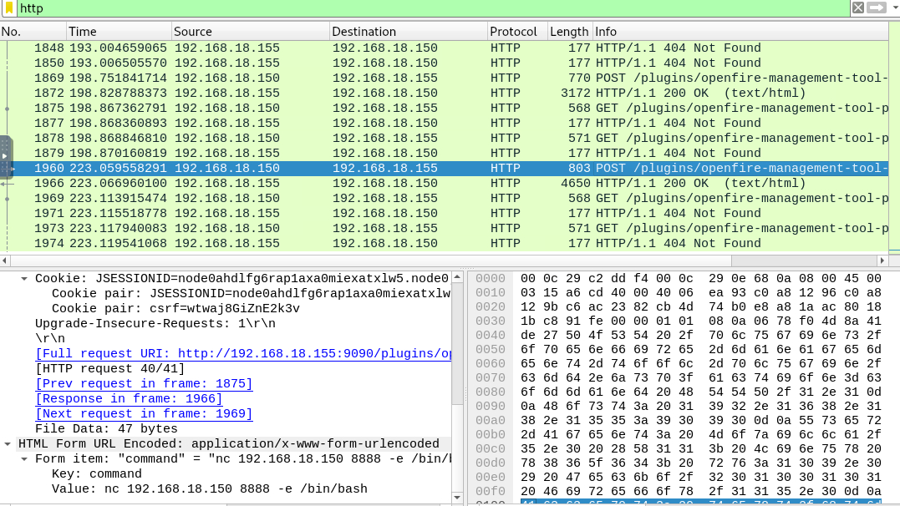

The second command that was successfully executed is this netcat reverse shell command that will connect to the threat actor on port 8888 so our next step is to find that connection and find out which command is the latest command.

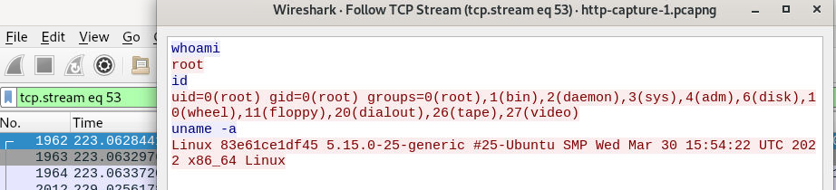

we can see that after the threat actor received reverse shell connection, the threat actor executed 3 commands and the last one is `uname -a` that will display OS name.

```
uname -a
```

* * *
## Summary
On this challenge, we learned about CVE-2023-32315 which is Openfire Path Traversal that can be escalated to RCE and by analyzing provided pcap file, we can see how it worked in practical.

<div align=center>


</div>

* * *
