# [LetsDefend - Compromised ICS Device](https://app.letsdefend.io/challenge/compromised-ics-device)
Created: 06/09/2024 18:11
Last Updated: 06/09/2024 22:49
* * *
<div align=center>

**Compromised ICS Device**

</div>
A critical water treatment plant has recently experienced unusual behavior in its control systems. The plant’s PLC, responsible for managing the water pumps and filtration systems, is suspected of being compromised. Your team has been called in to investigate and identify the root cause of the anomaly. Investigate the logs and identify the sequence of events that led to the system's compromise. Determine the type of attack and the attacker's actions.

**File Location**: /root/Desktop/ChallangeFile/ICS-Artifacts.7z

* * *
## Start Investigation
>While investigating the logs, you notice an unusual access pattern. What is the “table_id” value of the program that was running when the attacker gained access to the system?

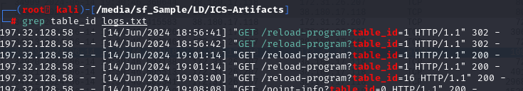

We were provided with 2 files, 1 pcap and 1 log file so lets I started with log file first which we can see that there are 2 `table_id` was called with `reload-program` endpoint and look like 16 is the lastest one we could see from this log?

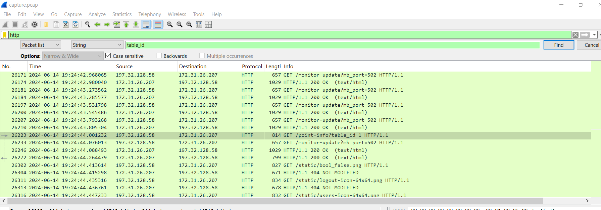

But when I opened pcap file with Wireshark and tried to find for `table_id` variable, there is only 1 `tables_id` on this pcap so this one should be the one that was running during the incident.

```
1
```

>You need to determine the entry point of the attack. What is the public IP address and port number of the service running the PLC?
Answer Format: IP:Port

PLC (Programmable Logic Controller) is specialized industrial computer used to automate and control manufacturing processes, machinery, or robotic devices in industrial environments and most of PLCs come with built-in web interface as we already noticed on previous question that it uses `reload_program` to reload program running on a PLC.

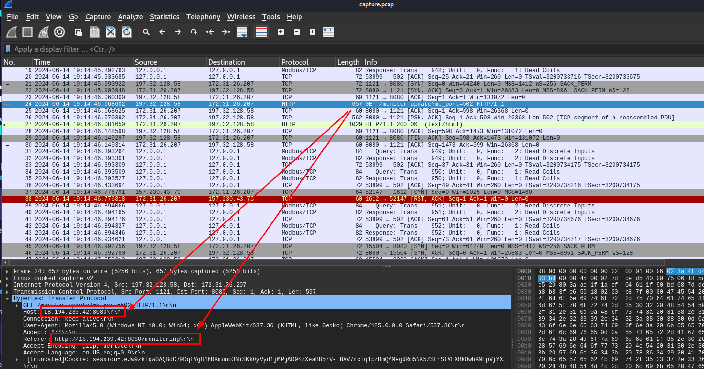

So to find an answer of this question, we can just take a look at one of these HTTP traffic which we can see that PLC was running on this `Host`.

```
18.194.239.42:8080
```

>What is the IP address of the attacker?

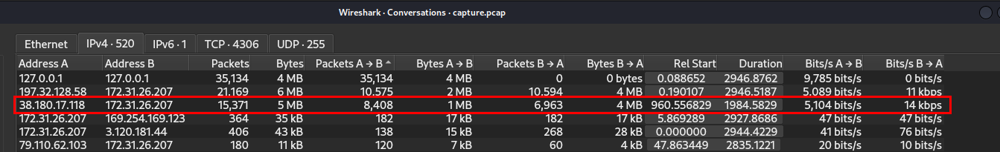

We know an internal IP address of the service running the PLC, so I checked Conversation statistics with packets count sorted which we could see that aside from `197.32.128.58` (which most likely to be normal operation), there is one more IP address that sent so many packets to service running PLC and we might want to take a look.

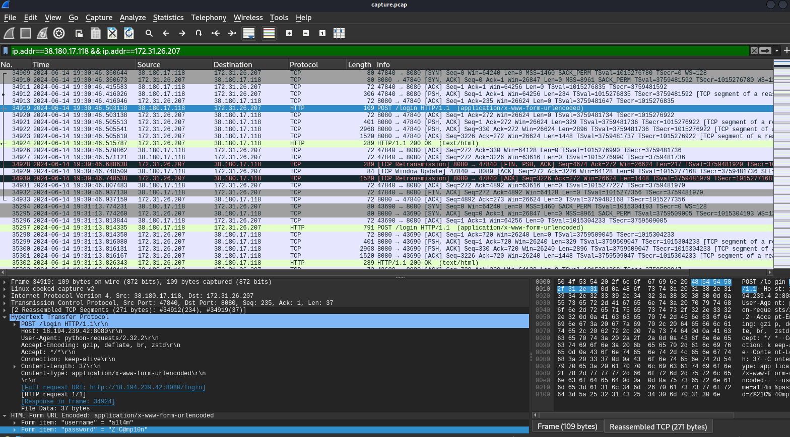

Then after filtered for conversation between these 2 IP addresses, we could see that this specific IP address tried to access PLC by resorting bruteforce attack. 

```
38.180.17.118
```

>The logs reveal several failed login attempts. What username and password did the attacker use to finally gain access to the account controlling the PLC?
Answer Format: username:password

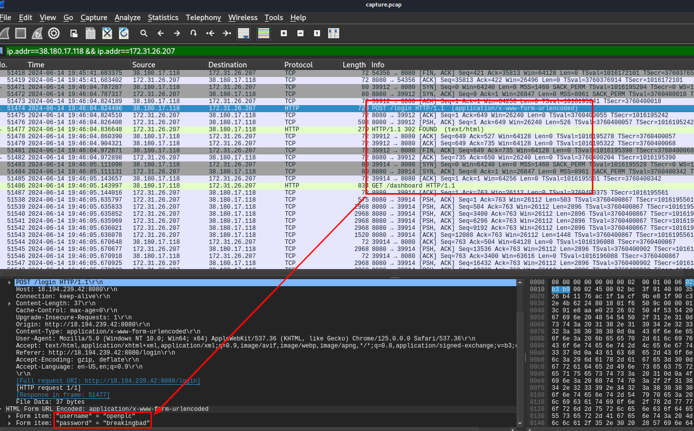

Now we only need to find for 302 HTTP status code which will redirect the attacker to PLC's dashboard, then we will see credentials that was used to gain access to it. 

```
openplc:breakingbad
```

>What was the “User-Agent” used by the attacker when they were attempting a brute force attack?

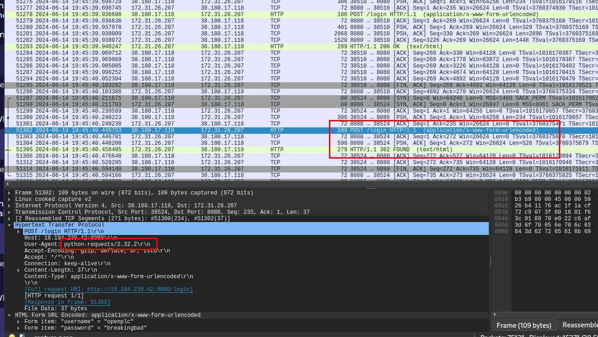

Just pick any HTTP request with HTML Form URL Encoded then we could see User-Agent used by the attacker.

```
python-requests/2.32.2
```

>The attacker manipulated an industrial protocol to control the pumps and switches. What is this industrial protocol called?

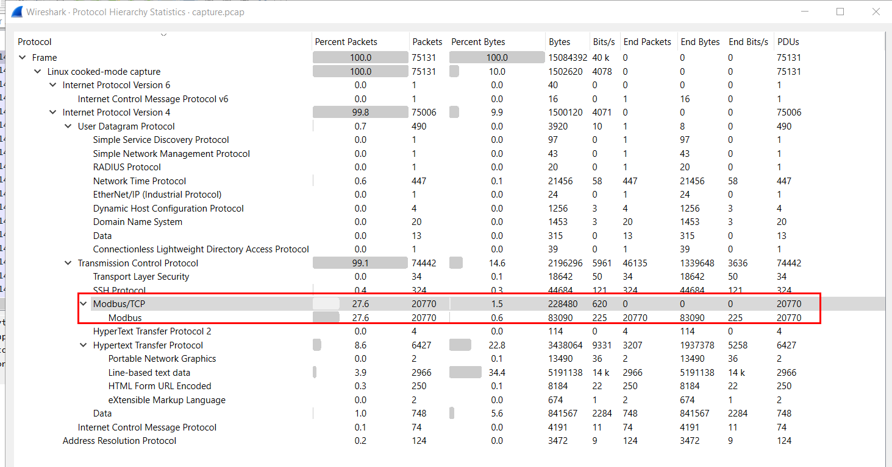

We can open Protocol Hierarchy statistic and skim for any protocol that widely used for ICS system, on this case its Modbus protocol.

```
modbus
```

>What port number does this protocol typically use?

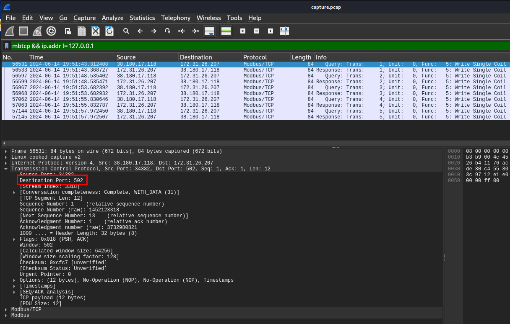

Modbus protocol typically operates on port 502 which you can see that after I filtered for modbus protocol, destination port of PLC is 502

```
502
```

>After gaining access, the attacker targeted a specific URL to manipulate the running program. What is the full URL they used?

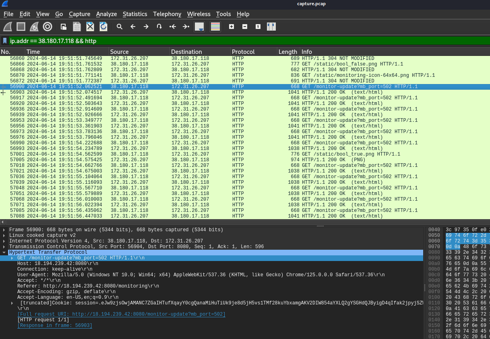

We knew that the attacker successfully accessed to PLC so he could use it to manipulate running process and after successfully logged in, the attacker constantly access this URL so we might want to take a look at the HTTP stream of these requests to see what happened

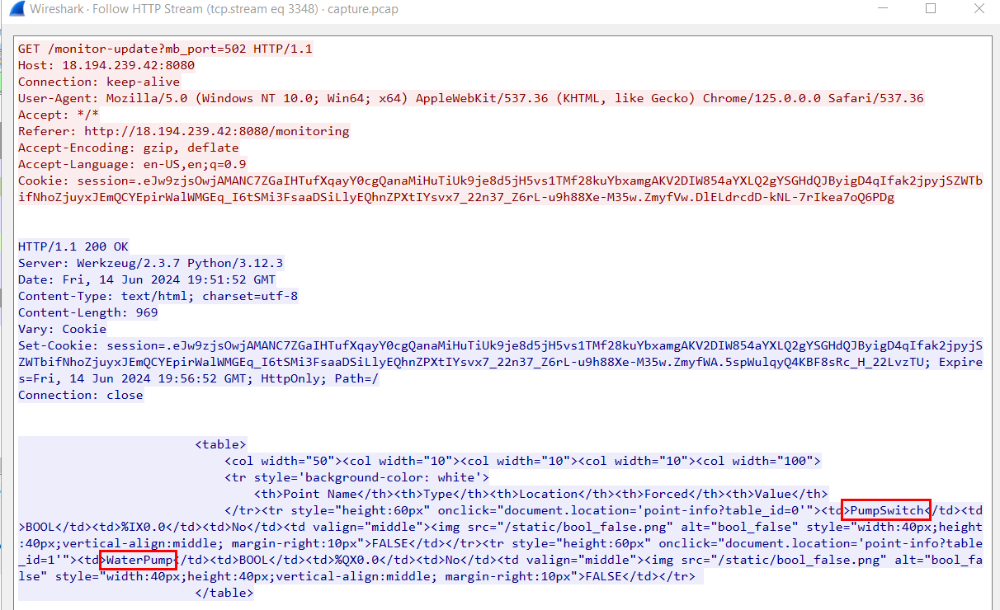

Which we can see that this is URL that the attacker could see status of PLC control variable and in this case, its `PumpSwitch` and `WaterPump` 

```
http://18.194.239.42:8080/monitor-update?mb_port=502
```

>During the attack, the intruder turned the “WaterPump” on and off multiple times before leaving it on. When did they first turn the pump on?
Answer Format: 2023-02-21 23:11:27.142513

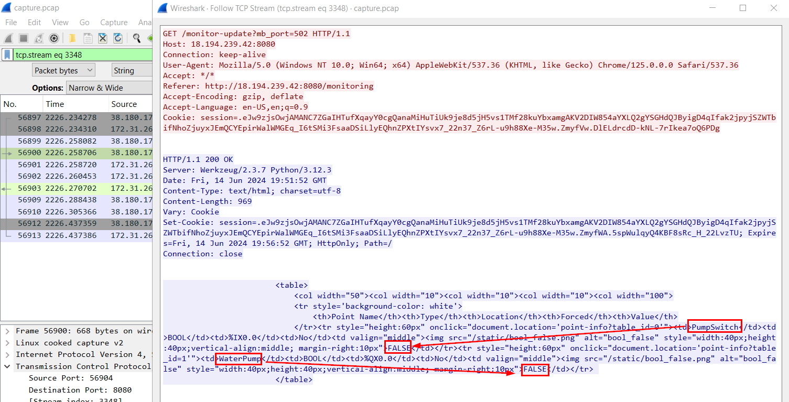

We can see that both `PumpSwitch` and `WaterPump` have their each boolean variable to display state of system so we might want to take a look at the first time that boolean variable of `WaterPump` became `TRUE`

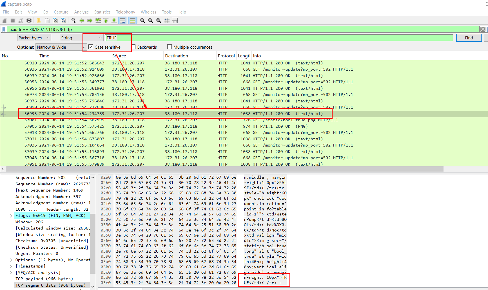

We could do that by using "Find Packet" and we will have packet number 56993 is first response that `WaterPump` boolean variable became `True`

```
2024-06-14 19:51:54.234789
```

>What was the final state of PumpSwitch and WaterPump in the system after the attacker left?
Answer Format: pumpswitch-state_waterpump-state
Sample Answer: 1_0
**Note**: True/On=1 , False/Off=0

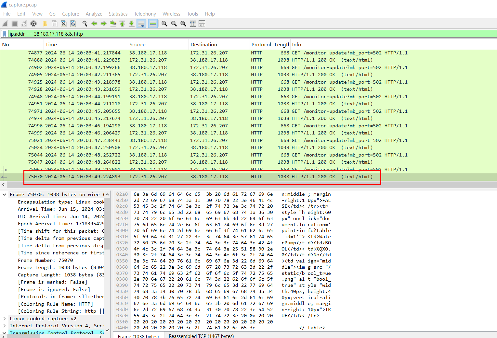

First, we will need to go to the last request/response from the attacker and take a look at the content of HTTP response.

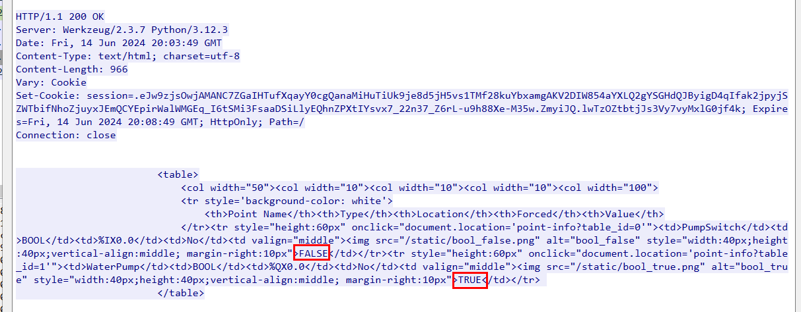

As we can see that `PumpSwitch` was set to `FALSE` and `WaterPump` was set to `TRUE`

```
0_1
```

* * *
## Summary
On this challenge, we used log file and pcap file to investigate compromised ICS devide that started with the attacker gained access to PCL via bruteforcing then messing with PLC control variables which leaves WaterPump on and PumpSwitch off (which might not end well in the real world scenario).

<div align=center>

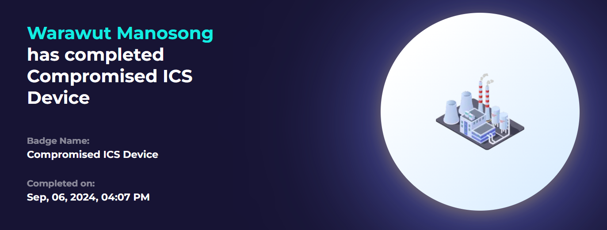
</div>

* * *
