# [LetsDefend - Compromised Network Printer](https://app.letsdefend.io/challenge/compromised-network-printer)
Created: 29/08/2024 22:23
Last Updated: 29/08/2024 23:43
* * *
<div align=center>

**Compromised Network Printer**
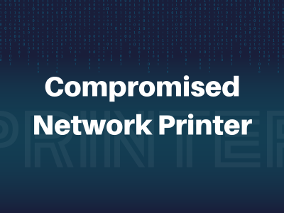
</div>
You are a DFIR Analyst for a corporation. A network printer running in the internal network has been compromised as it was alerted by our IDS. You have been provided a packet capture to trace the attacker’s action and what data was stolen from the printer server.

* * *
## Start Investigation
>Identify the port scan activity performed by the attacker on the network. What was the NAT IP Address(Internal IP Address) assigned to the machine being used by the attacker on the internal network?

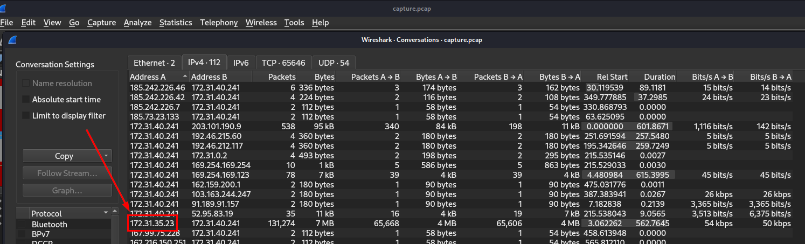

After we opened sample pcap file on Wireshark then go to "Statistics" -> "
Conversations" to display conversation statistics of this pcap file then sort IP address (either Address A or B is fine), remember that NAT IP Address could start with 10.xx.xx.xx, 172.xx.xx.xx or 192.168.xx.xx and we need only 1 IP address in that stand out from the rest and match the answer format which will eventually landed us with this one 

```
172.31.35.23 
```

One more thing, you might also notice which is this IP address sent so much packets (over 100k) to `172.31.40.241` so I guessed that attacker probably conducted bruteforce attack on this IP address.

>Which ports were open on the network printer? Identify the port used for printer exploitation.

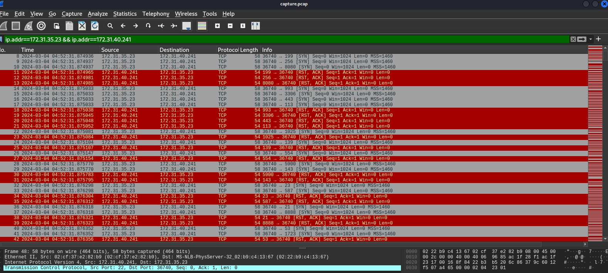

Filtered conversation found on previous question then we could see that there are a lot of SYN packets to `172.31.40.241` (so we can determine that this target IP is network printer) and as you might already notice, these SYN packets were sent to many different ports so the attacker conducted port scanning here to identify printer opened port.

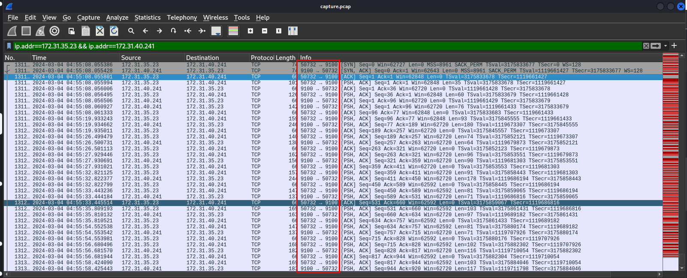

For a connection to fully established, 3-way handshake must be completed (SYN -> SYN-ACK -> ACK) which we could see that port 9001 is the one that the attacker found.

```
9100
```

>Based on the abused port number, which printer language/method was being abused by the attacker for unattended malicious activity on the network printer?

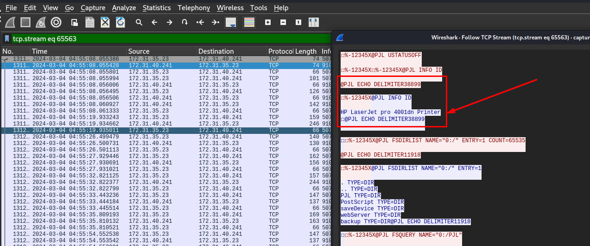

Follow TCP stream then we can see that this printer is "HP LaserJet pro 4001dn" which is a printer manufactured by HP and "PJL" is the language designed for all HPs printers


You can do a little more research on this one to learn more about syntax and common commands

```
PJL
```

>Which Printer Name/Model was attacked?
```
HP LaserJet pro 4001dn
```

>The attacker has discovered a scheduled print job that is associated with an employee who is suspected of being an insider threat. What is the full path of the print job file?

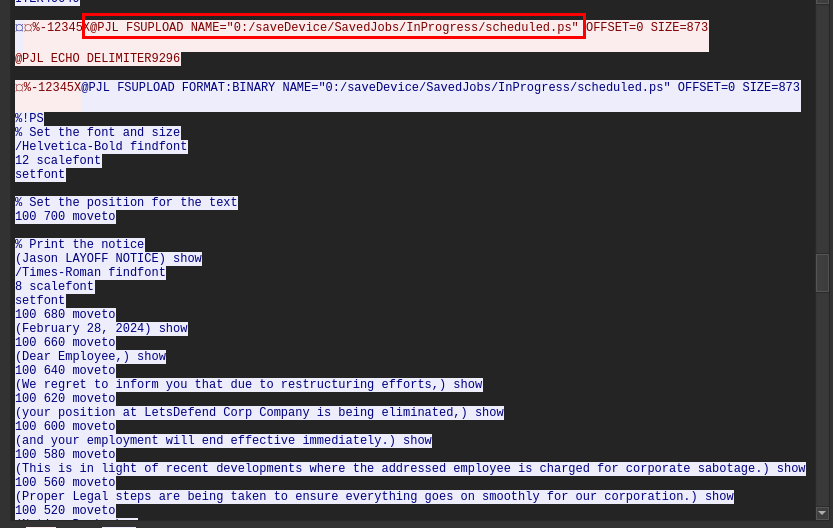

Now after understand the context and language used by this printer, we can keep digging into this conversation then we will eventually find this "FSUPLOAD" command which will upload file on a printer to an external source and we can see that an attacker uploaded this ps (PostScript file) which is a type of file that printer might store for scheduled print or repeated jobs.

```
0:/saveDevice/SavedJobs/InProgress/scheduled.ps
```

>What is the name of the targeted organization?

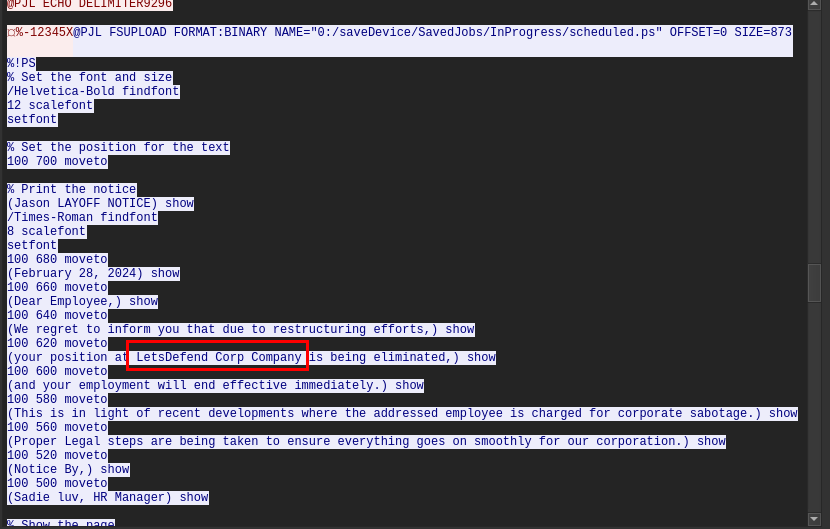

We can get an answer of this question by inspecting PostScript file content uploaded.

```
LetsDefend Corp Company
```

>The attacker found information about RDP within the internal network. What is the directory path where this sensitive information was located?

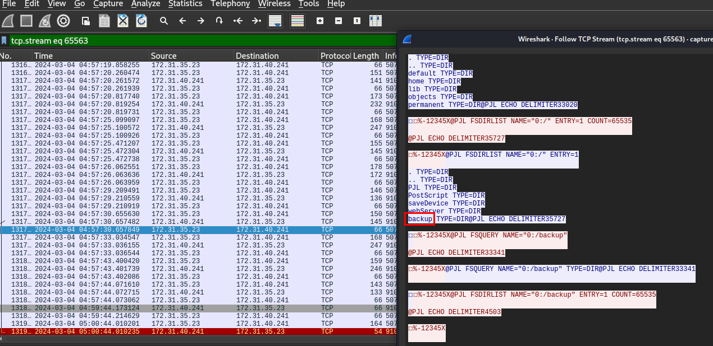

After scrolling almost the end of this conversation, we could see that the attacker found "backup" directory before attempted to list all files inside that directory but the conversation ended here, we need to find next conversation.

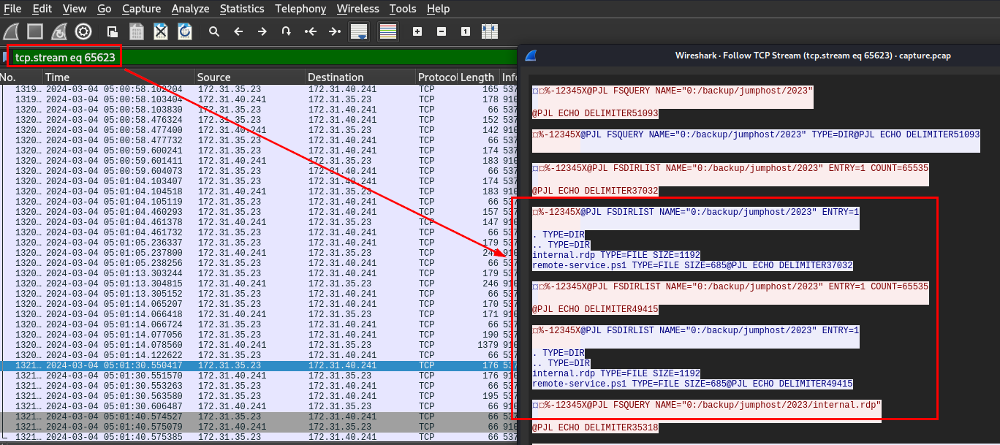

And here is that conversation, the attacker found `internal.rdp` (a file used to store rdp configuration and setting) and `remote_service.ps1` on this directory.

```
/backup/jumphost/2023
```

>What is the IP address of the Jumphost?

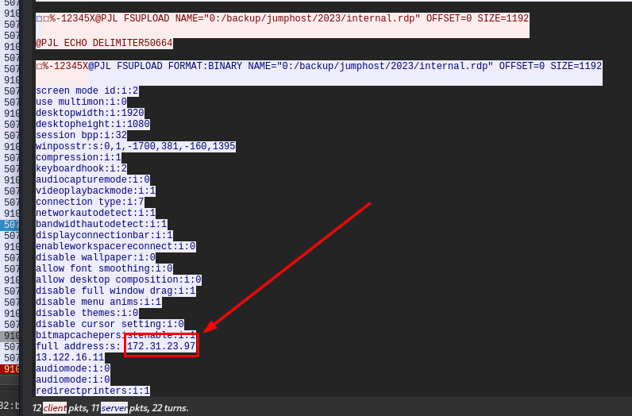

By reviewing content of `interal.rdp` file, we could see full IP address that will be connected to when open this file on Windows machine.

```
172.31.23.97
```

>What is the filename of the PowerShell script used by admins which was also found by the attacker?
```
remote-service.ps1
```

* * *
## Summary
On this challenge, we learned about Printer network traffic analysis and PJL which can be used to retrieve content of files store on printer. 

<div align=center>

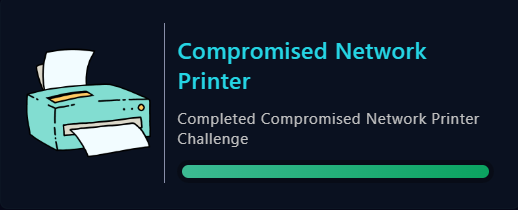
</div>

* * *
