# [LetsDefend - DLL Stealer](https://app.letsdefend.io/challenge/dll-stealer)
Created: 30/04/2024 15:55
Last Updated: 30/04/2024 18:07
* * *
<div align=center>

**DLL Stealer**

</div>
You work as a cybersecurity analyst for a major corporation. Recently, your company's security team detected some suspicious activity on the network. It appears that a new DLL Stealer malware has infiltrated your system, and it's causing concern due to its ability to exfiltrate critical DLL files from your system.

**File Location**: C:\Users\LetsDefend\Desktop\ChallengeFile\sample.zip

**File Password**: infected

* * *
## Start Investigation
> What is the DLL that has the stealer code?

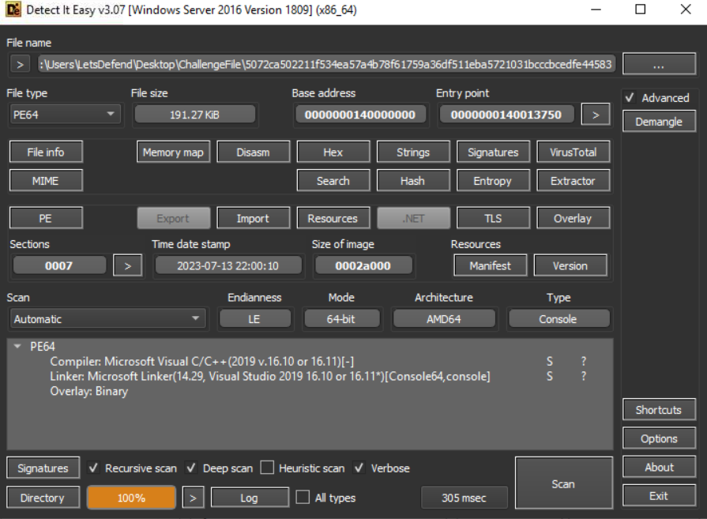
We got a file without an extension to work with so I used Detect It Easy to find out more about this file and results show that this file is Portable Executable for x64 system which was complied by Microsoft Visual Studio
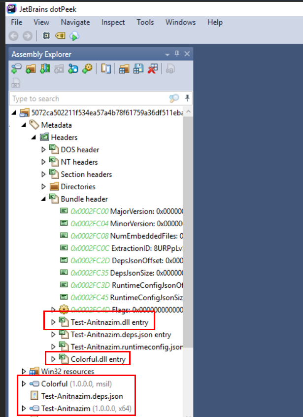
An executabile file which compiled by Visual Studio couldn't be decompile using Ghidra or IDA Free but we still have dotPeek which is a perfect tool for this file, you can see that there are 2 dll files were bundled with this PE.
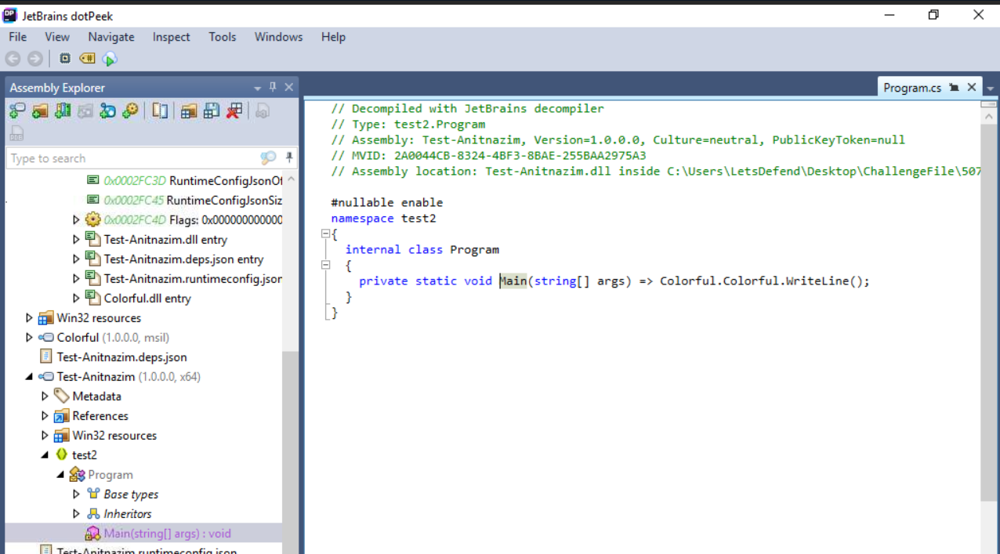
`Test-Anitnazim.dll` holds `main` function which call Colorful that held in `Colorful.dll`
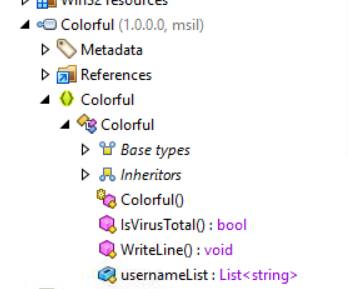
You can see that this dll is very suspicious due to `IsVirusTotal` function inside of it
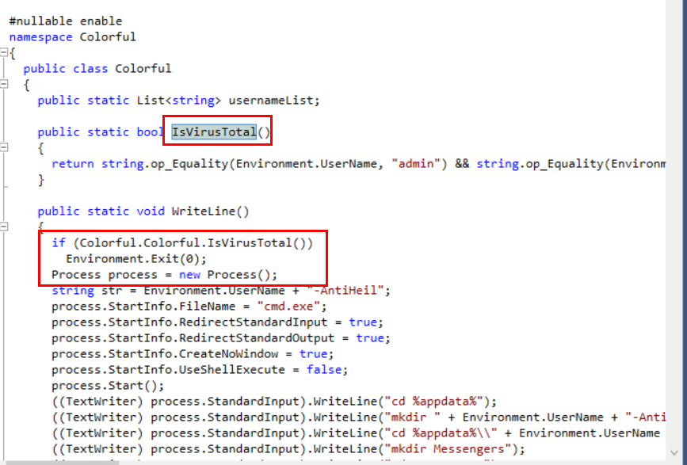
It does check for VirusTotal by comparing infected hostname to `usernameList` which is a list that stores VirusTotal's hostnames.
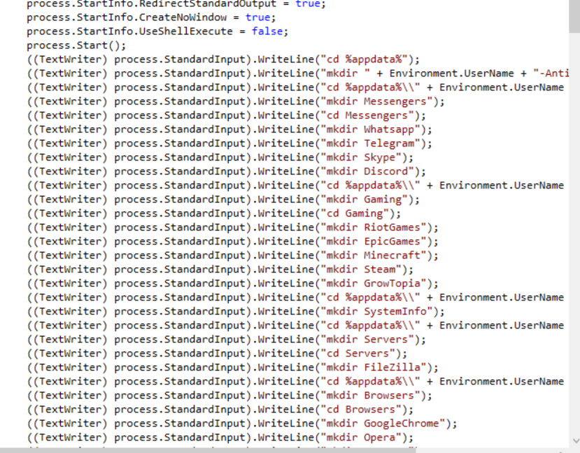
Then this PE will check and mass create directories. 
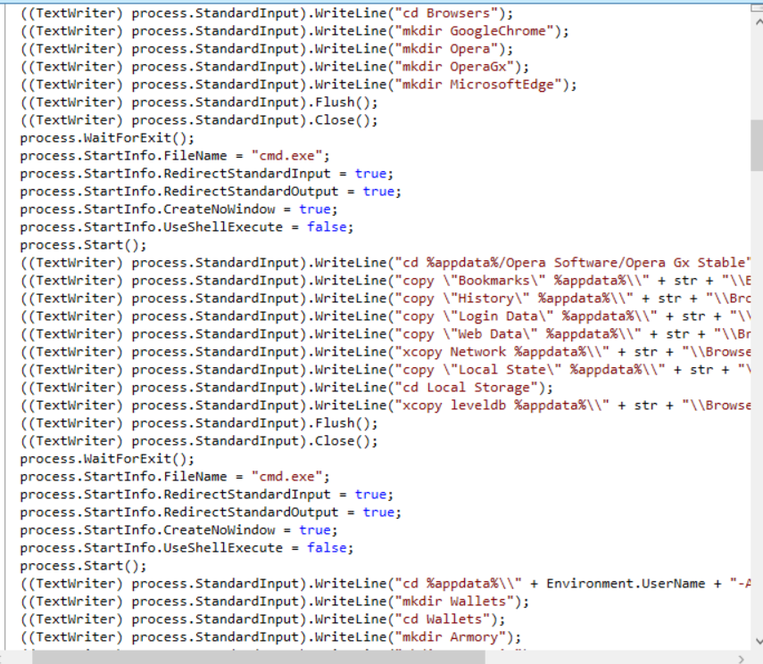
Which will be used to store data that will be copied to, which mean this PE is an infostealer malware.
```
Colorful.dll
```

> What is the anti-analysis method used by the malware?


```
IsVirusTotal
```

> What is the full command used to gather information from the system into the “productkey.txt” file?

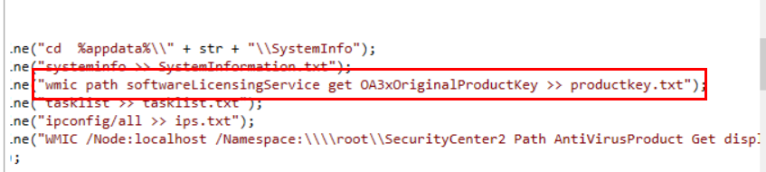
You can find for specific string which is productkey then I found this snippet, this malware used wmic to query for product key then save to a text file
```
wmic path softwareLicensingService get OA3xOriginalProductKey >> productkey.txt
```

> What is the full command used to gather information through the "ips.txt" file?

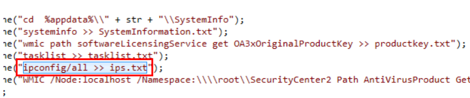
Malware used `ipconfig/all` to display all IP configuration of infected system then save to text file
```
ipconfig/all >> ips.txt
```

> What is the webhook used by the malware?

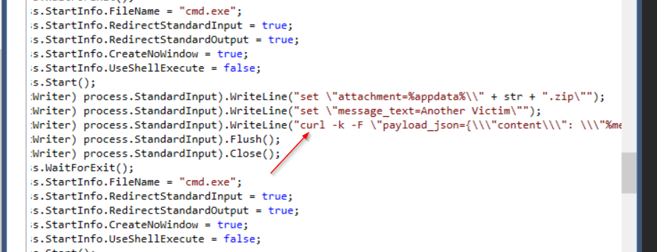
An infostealer malware need to send information that was gathered to C2 server which can commonly be found on bottom part of the code by using compression to make it more transferable so I scrolled at the bottom then I saw `curl` then which confirmed that this malware compressed all information to zip file then using curl to send it somewhere

and that is a discord webhook
```
https://discord.com/api/webhooks/1165744386949271723/kFr6Cc0DSTK1jB8aV3820mBxji06gF2KorUuO2Rd2ckLkhUEHxdi6kv6UHwgJ_W82fgZ
```

* * *
## Summary

On this challenge we got a PE64 file complied by Visual Studio to investigate which could only be decompiled using JetBrains dotPeek or .NET decomplier and after analyzed decompiled code, It is confirmed that this PE64 file is an infostealer malware that using VirusTotal's hostnames to evade debugging.

What we're learned
- How to analyze a file compiled by Visual Studio
- Anti-Debugger method specific for VirusTotal
- How an infostealer malware collect sensitive information on infected host
- A way to send sensitive information back to a webhook or C2

<div align=center>

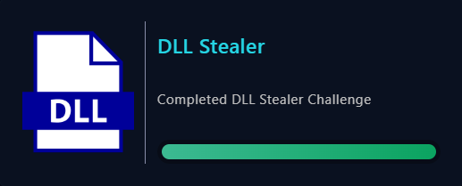
</div>

* * *
