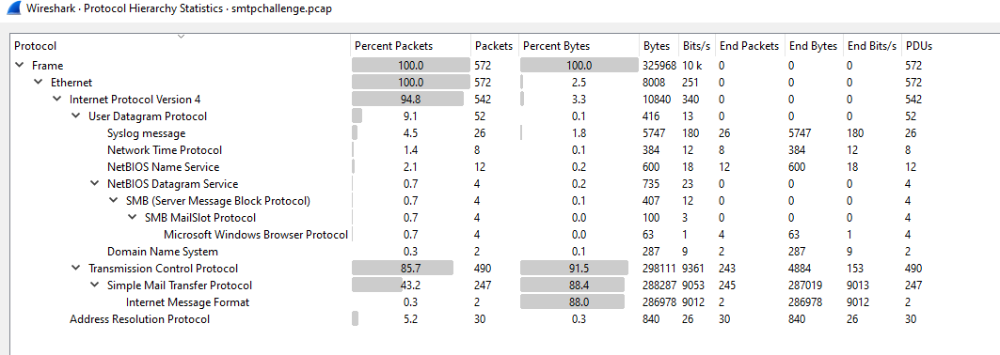
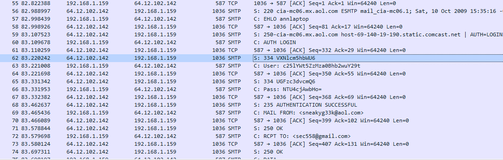
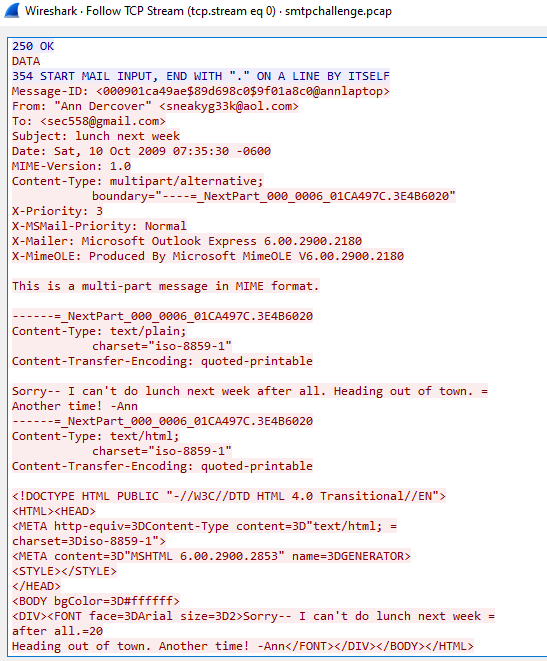
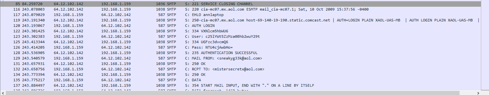
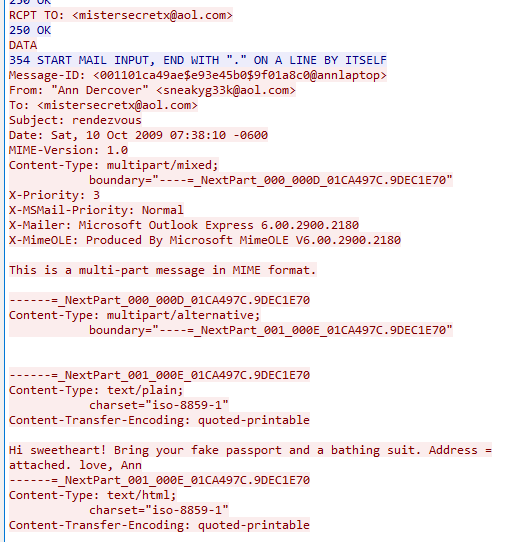
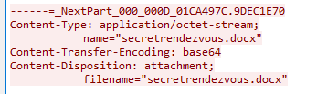
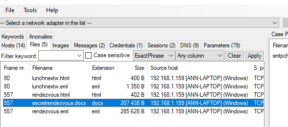
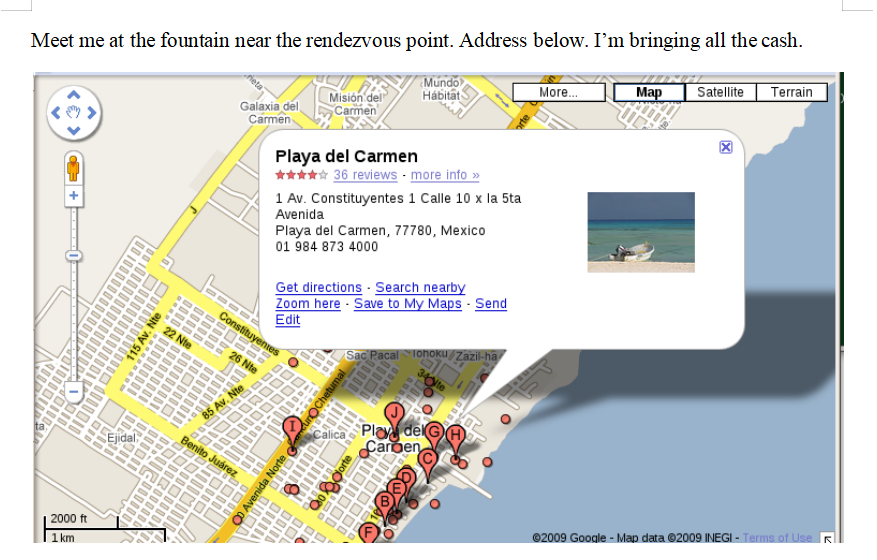
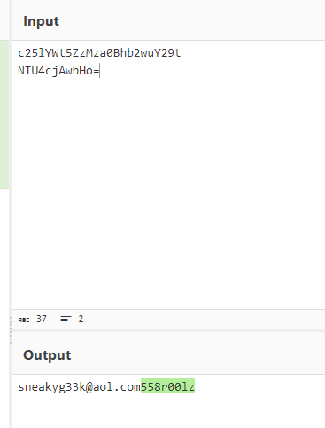
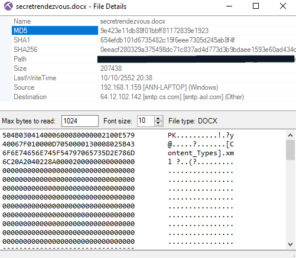

# [LetsDefend - Disclose The Agent](https://app.letsdefend.io/challenge/disclose-the-agent)
Created: 16/01/2024 09:34
Last Updated: 25/01/2024 13:07
* * *
<div align=center>

**Disclose The Agent**

</div>

We reached the data of an agent leaking information. You have to disclose the agent.

Log file: https://files-ld.s3.us-east-2.amazonaws.com/smtpchallenge.zip Pass: 321

Note: pcap file found public resources.
* * *
## Start Investigation
We got a pcap file to work with so let's roll!
<div align=center>


First thing I checked is the Protocol Hierarchy Statistics and there are a lot of SMTP packets were captured and there are some of Syslog, NetBIOS, SMB, and ARP Protocol as well.


SMTP conversation caught my eyes right away when I examined this pcap file, I saw login credential and some emails.


Follow the TCP stream we can see the message of the email.
</div>

Look like Ann wrote this email as we seen in From: `"Ann Dercover" <sneakyg33k@aol.com>`

And the recipient is `sec558@gmail.com`

She's talking about Lunch, let's find out if there is another email were captured
<div align=center>


There it is an email from Ann to `mistersecretx@aol.com`


Look like they're planning to go to a date, so this mistersecretx is the Ann's secret boyfriend.


An attachment was also sent with this email.


I used NetworkMiner to extract the attachment


An attachment is a picture of location they decided to meet up, It's in Mexico
</div>

There are nothing more to be dig up so let's answer the questions

* * *
> What is the email address of Ann's secret boyfriend?
```
mistersecretx@aol.com
```

> What is Ann's email password?

<div align=center>


</div>

```
558r00lz
```


> What is the name of the file that Ann sent to his secret lover?
```
secretrendezvous.docx
```

> In what country will Ann meet with her secret lover?
```
Mexico
```

> What is the MD5 value of the attachment Ann sent?
```
9e423e11db88f01bbff81172839e1923
```
<div align=center>


</div>

* * *
## Summary
2 emails was captured in SMTP communication, first email content is about telling a friend that Ann can't do lunch next week because She was heading out of towns and the second email told us that out of town Ann was heading to is in Mexico and Ann was going there with her secret boyfriend that she sent out a location with an email attachment.

* No Badge for this challenge
* * *