# [LetsDefend - Discord Forensics](https://app.letsdefend.io/challenge/discord-forensics)
Created: 07/06/2024 11:47
Last Updated: 20/07/2024 12:43
* * *
<div align=center>

**Discord Forensics**

</div>
Our SIEM alerted that AV blocked malware from running on an employee's machine. For further investigation, the incident response team quickly acquired an image of that machine. To find out how this malware got on the machine, their task is to find the entry point of the attack and trace the attacker.

**File Location:** C:\Users\LetsDefend\Desktop\ChallengeFile\Discord.7z
* * *
## Start Investigation
>What is the name of the attacker?

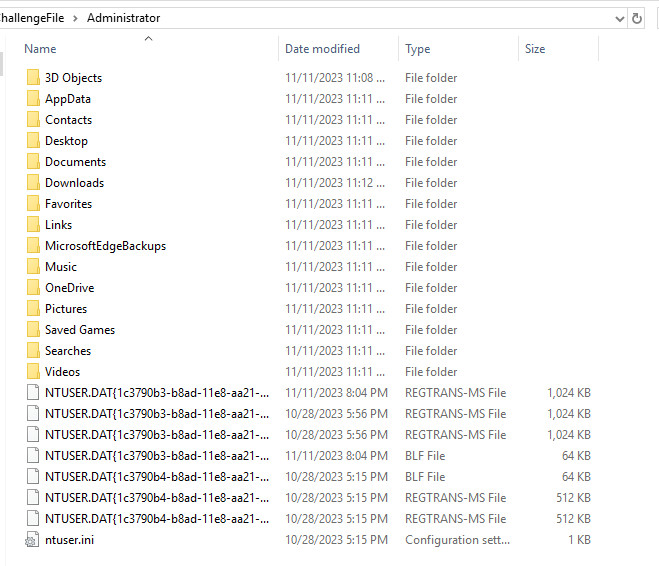
After navigating Challenge Files, lt seems like these artifacts was collected with KAPE since I found kape on Downloads folder

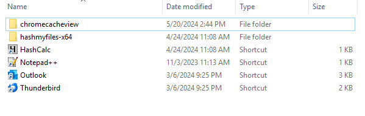
Then lets check for tools, we have tools related to email, hash, chromecache and lastly notepad++ for editing?

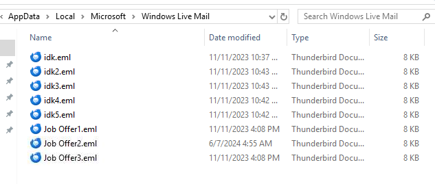
First I started with emails that stored in `\AppData\Local\Microsoft\Windows Live Mail`

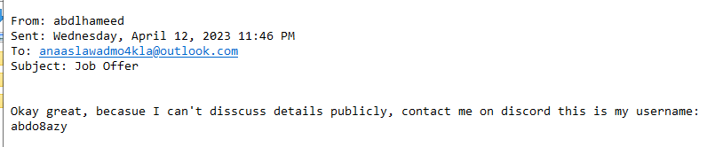
All of these mails only contains 2 characters, one is victim and this one is an attacker

```
abdlhameed
```

>What application is used for messaging?

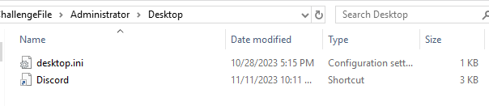
An attacker suggested to contact him with discord and I found discord shortcut on Desktop folder, it seem like user agreed to contact an attacker with discord

```
discord
```

>What is the attacker's username on the application?
```
abdo8azy
```

>When did an attacker send the first message to the victim on this application?
Answer Format: YYYY-MM-DDTHH:MM:SS

There are a few discord forensic resources that I found and suggested you to read them, there are
- [Finding Discord app chats in Windows](https://abrignoni.blogspot.com/2018/03/finding-discord-app-chats-in-windows.html?source=post_page-----b32cb632312a--------------------------------)
- [Digital Forensic Acquisition and Analysis of Discord Applications paper](https://www.researchgate.net/publication/347044759_Digital_Forensic_Acquisition_and_Analysis_of_Discord_Applications)

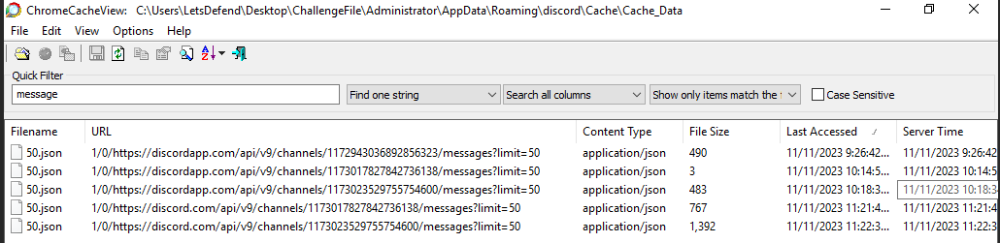

From these resources, I finally figured it out that we can use chromecacheview to parse discord cache then I used "message" keyword to search for chat history then we will have these url from the same json fie and it seems like we have to go through each one of them 

Lucky for us that we already know username of an attacker so upon open each file, we can search for this username and if it weren't present then we can close it and go to another one

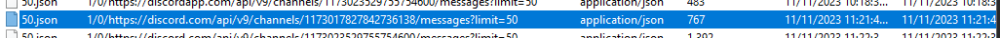

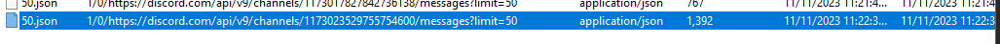

Then we will have 2 urls that contains an attacker username, one is private chat and another one with larger size is group chat 

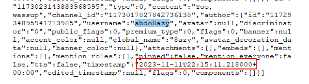

On private chat, search for timestamp and go the the bottom because the bottom timestamp will be the first message that was cached on this file

```
2023-11-11T22:15:11
```

>The attacker has sent a server invitation URL to the victim, what is the full URL?

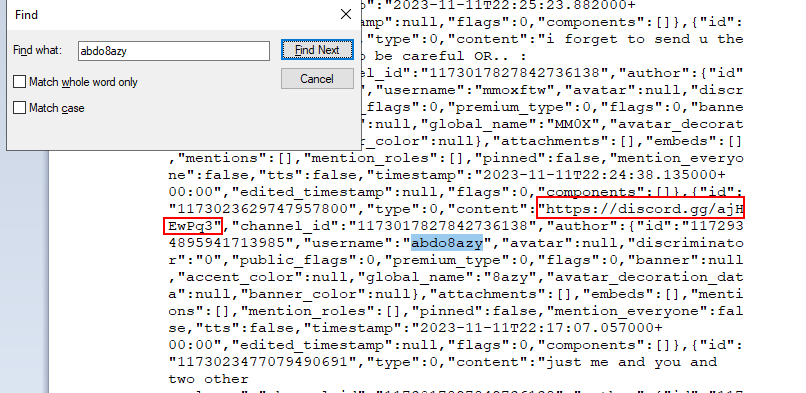
We will focus on content or url field of an attacker then we will have this discord group url which lead us to discord group that we found earlier

```
https://discord.gg/ajHEwPq3
```

>How many people were on the Discord server?

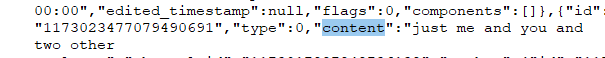

An attacker did mention how many people where there, do the math

```
4
```

>What is the MD5 hash of the attachment file that the victim sent to the attacker?

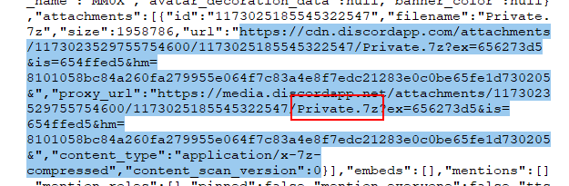

After searching for url, we will found this discord cdn that host an attachment file and we will also obtain a filename here too, and after take a look at user who uploaded this 

It mean user sent this file to this server

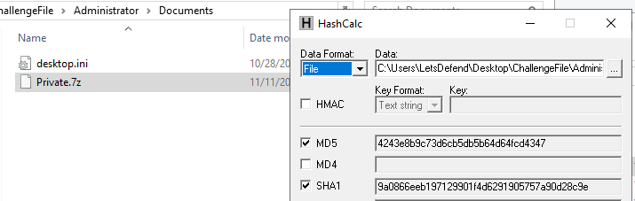

I found this file on Documents folder, with tool provided we can easily get MD5 hash

```
4243e8b9c73d6cb5db5b64d64fcd4347
```

>What is the victim’s country?

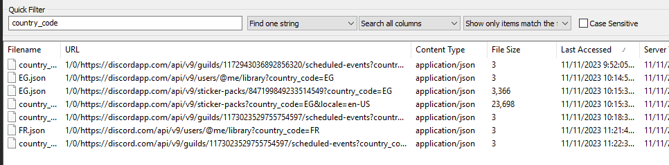

First I searched for location which indicate that this user was from Egypt but that not the right answer so another idea is to find a country_code and it tells us a different country 

```
France
```

>What is the URL of the attachment that the attacker sent to the victim?

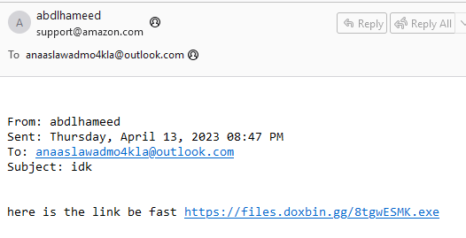

An attacker sent another mails  (`idk*.eml`) to an employee for blackmailing to download this suspicious url which likely to be a malware that was detected according to scenario

```
https://files.doxbin.gg/8tgwESMK.exe
```

* * *
## Summary

On this challenge, we will use Thunderbird or Outlook to investigate an eml file that was stored on the system which lead us to 
- an attacker approached target employee with amazon job offer 
- an attacker tricked user to join discord server
- employee met with other 2 peoples 
- an attacker group tells user to prove that a research is actually his works
- employee uploaded a research details in 7z file from discord server
- an attacker blackmailing employee via an email to download a malware and execute

<div align=center>

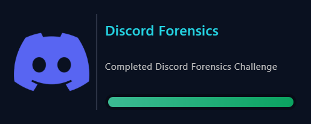
</div>

* * *
