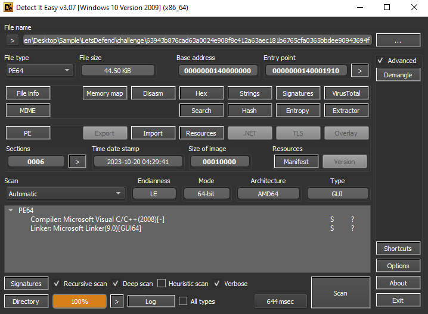
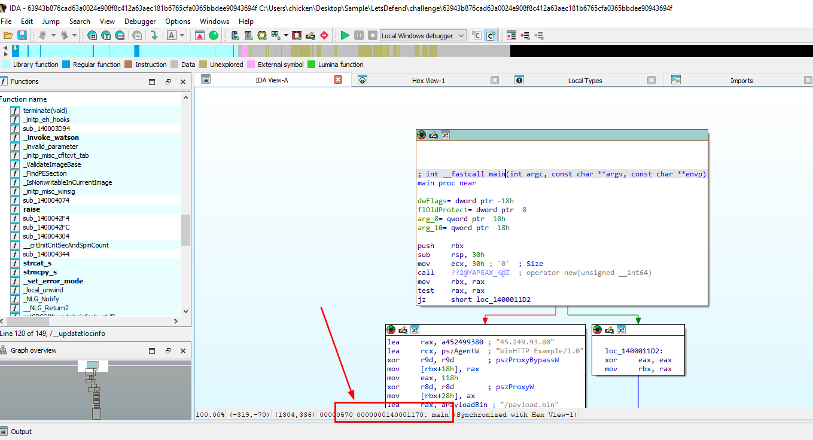
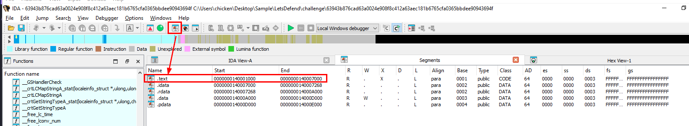
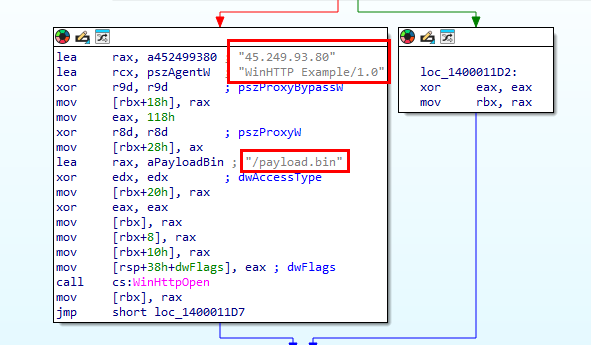
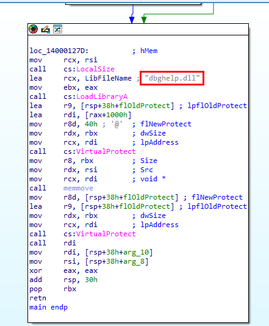
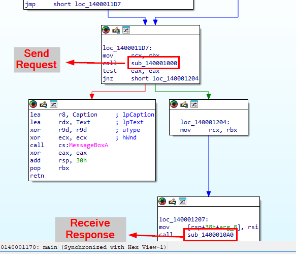
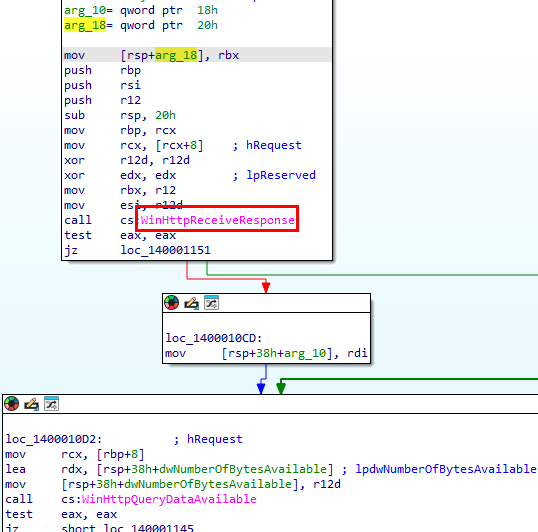
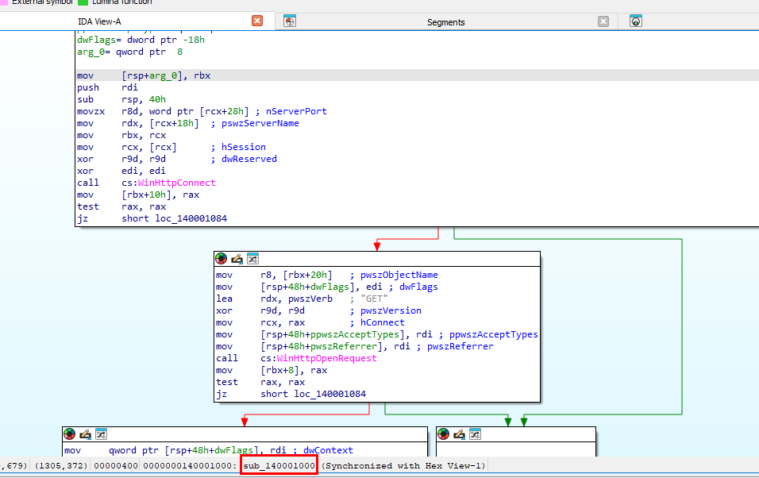

# [LetsDefend - Downloader](https://app.letsdefend.io/challenge/downloader)
Created: 19/08/2024 23:21
Last Updated: 20/08/2024 01:23
* * *
<div align=center>

**Downloader**

</div>

Our organization's Security Operations Center (SOC) has detected suspicious activity related to downloader malware. The malware is designed to retrieve and execute additional payloads from remote servers, potentially leading to further compromise of the network. Please help us answer these questions.

* * *
## Start Investigation
>What is the address of the function “main”?
Answer Format: 0x000000000



First, I used DIE to detect which compiler was used to make this malware which is Microsoft Visual C/C++ which mean we might need to use Ghidra or IDA to conduct malware analysis of this binary file.



To make life easier, disassembly this binary in IDA and it will automatically detect `main` function for us and here is where we get an address of all functions in IDA.

```
0x140001170
```

>What is the end address of the .text section?
Answer Format: 0x000000000



Go to "View" -> "Toolbars" -> "Segments" which will display segments button in toolbars then after press it, it will display all segments of this binary including start and end offset of each section.

```
0x140007000
```

>What is the IP address used to download the payload?



As you might noticed, there are some function declaration in `main` which are
- C2 IP address 
- User-agent
- filename that will be downloaded

And we also see **WinHTTPOpen** will be called so this binary will connect to C2 address on port 80 with defined User-agent to download defined filename from that server.

```
45.249.93.80
```

>What is the name of the payload downloaded?
```
payload.bin
```

>What is the name of the user agent used by the downloader?
```
WinHTTP Example/1.0
```

>What is the name of the DLL loaded by the downloader?



We can also see that after downloaded a file from C2 server, this dll was loaded then `VirtualProtect` was called to change memory protection of specific region of memory probably to allow writing file.

```
dbghelp.dll
```

>What is the first API used during the function that retrieves data from the HTTP response?



After reversing these 2 functions, here are the result



And the first API that was used in a function that retrieves data from the HTTP response is this API

```
WinHttpReceiveResponse
```

>What is the name of the function that establishes the HTTP request?



Here is a function responsible for HTTP request, you can see `WinHTTPConnect` and `WinHTTPOpenRequest` being called here.

```
sub_140001000
```

* * *
## Summary
On this challenge, we investigated windows binary file with IDA freeware to uncover C2 server and a payload that will be downloaded to infected system.

<div align=center>


</div>

* * *
