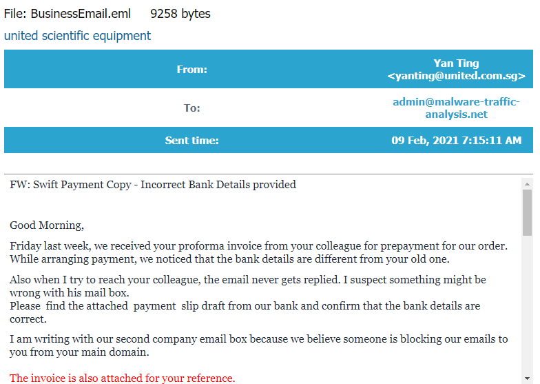
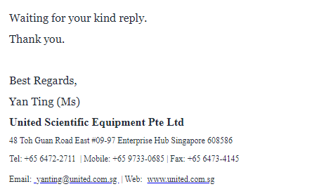
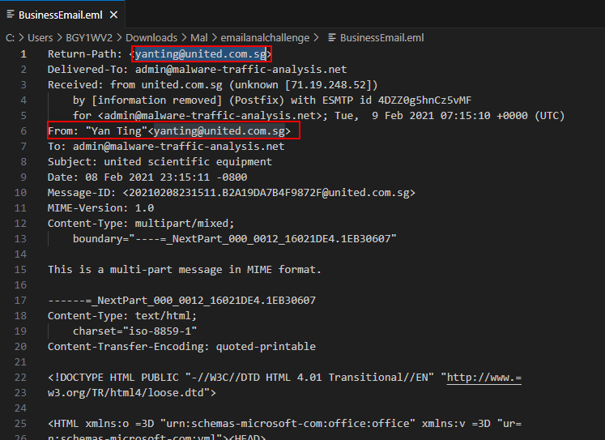
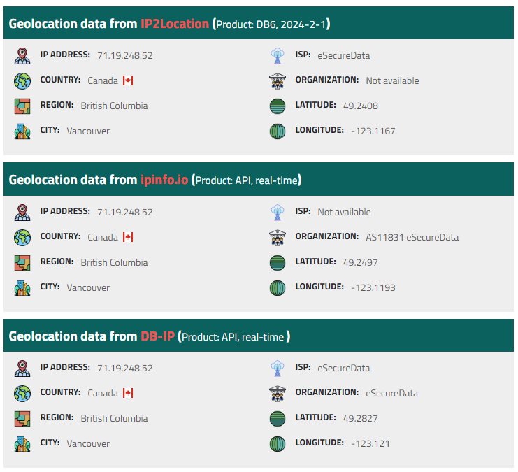
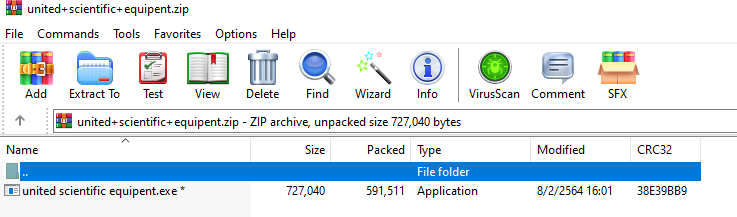
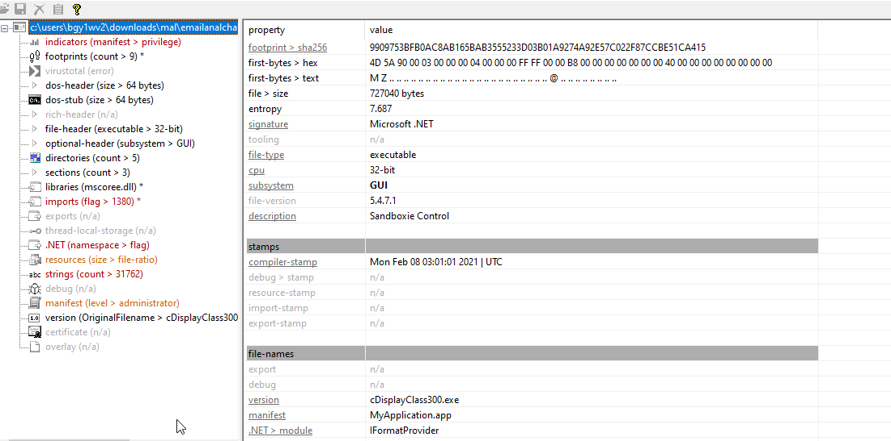
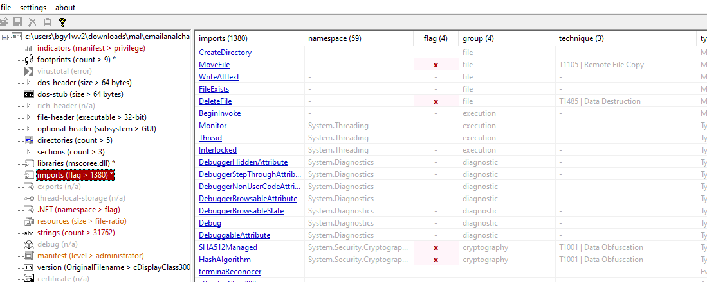
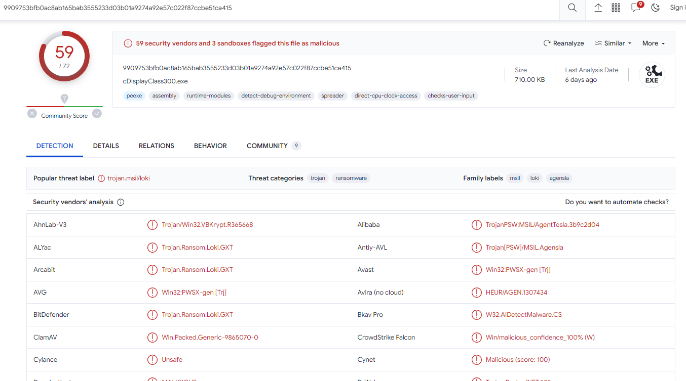

# [LetsDefend - Email Analysis](https://app.letsdefend.io/challenge/email-analysis)
Created: 23/02/2024 11:00
Last Updated: 05/06/2024 20:52
* * *
<div align=center>

**Email Analysis**

</div>
You recently received an email from someone trying to impersonate a company, your job is to analyze the email to see if it is suspicious.

**Email Link:** [~~Download~~](https://letsdefend-images.s3.us-east-2.amazonaws.com/Challenge/Email-Analysis/BusinessEmail.zip) C:\Users\LetsDefend\Desktop\Files\BusinessEmail.zip
Password: infected

**Attachment:** [~~Download~~](https://letsdefend-images.s3.us-east-2.amazonaws.com/Challenge/Email-Analysis/united+scientific+equipent.zip) C:\Users\LetsDefend\Desktop\Files\united_scientific_equipent.zip
Password: infected

This challenge prepared by [ZaadoOfc](https://www.linkedin.com/in/zaid-shah-05527a22b/)
* * *
## Start Investigation
After downloaded both file, I started by parsing the eml file on Email Viewer and opened it on vscode at the same time
<div align=center>



Online Email Reader works as a charm, this is what it should look like

Looking at the header it seems like the sender was not hide the actual email
</div>

Looking at the contents it says that there is an attachment came with it and the sender told the recipient to confirm it

<div align=center>


Since the sender IP address could be seen on the email header, I searched this IP for the location and this IP address located in the Vancouver from Canada. 
</div>

Now it's time to analyze the email attachment
<div align=center>


Just at first gland, it's obviously a hugh red flag right there, it's not an image file or document file but an exe file


I threw it to pestudio and found that this file does 3 MITRE techniques


Then I searched the hash on [VirusTotal](https://www.virustotal.com/gui/file/9909753bfb0ac8ab165bab3555233d03b01a9274a92e57c022f87ccbe51ca415), Sure enough that this file is malicious and these vendors labels it as [Loki](https://success.trendmicro.com/dcx/s/solution/1117830-loki-malware-information?language=en_US) 
</div>

So our investigation concluded here

* * *
> What is the sending email address?
```
yanting@united.com.sg
```

> What is the email address of the recipient?
```
admin@malware-traffic-analysis.net
```

> What is the subject line of the email?
```
united scientific equipment
```

> What date was the Email sent? Date format: MM/DD/YYYY
```
02/08/2021
```

> What is the originating IP?
```
71.19.248.52
```

> What country is the ip address from?
```
Canada
```

> What is the name of the attachment when you unzip it? (with extension)
```
united scientific equipent.exe
```

> What is the sha256 hash of the File?
```
9909753BFB0AC8AB165BAB3555233D03B01A9274A92E57C022F87CCBE51CA415
```

> Is the email attachment malicious? Yes/No
```
Yes
```

* * *
## Summary
The phishing email was sent to admin which the sender was from Canada and doesn't hide the actual mail, but the attachment that shipped with it is a malicious PE file labeled as LOKI, the infamous info-stealer some various also act as a ransomware

<div align=center>


</div>

* * *
