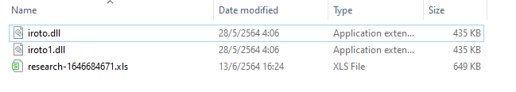
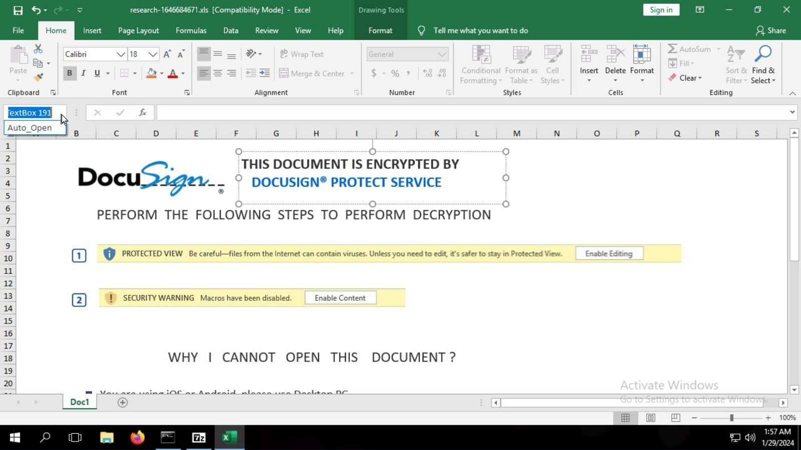
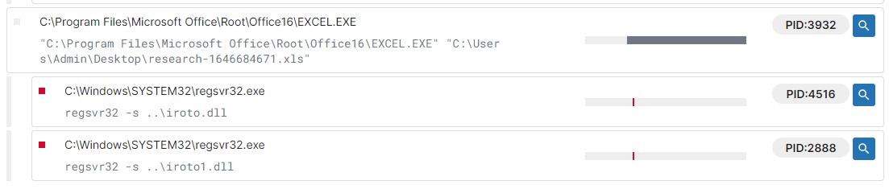
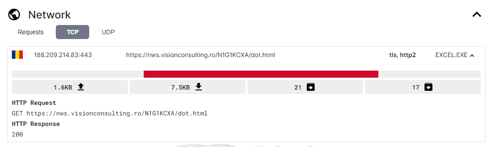
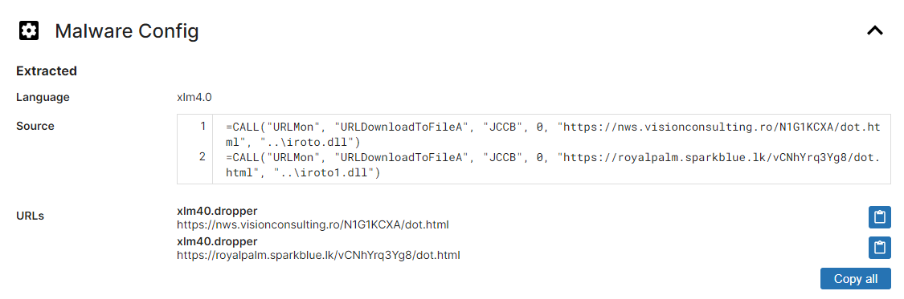
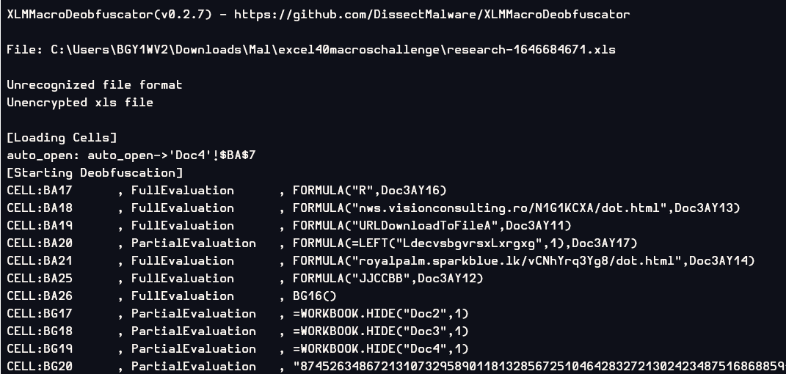
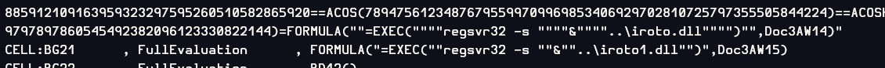
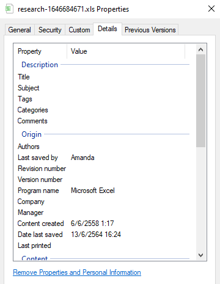

# [LetsDefend - Excel 4.0 Macros](https://app.letsdefend.io/challenge/Excel-40-Macros)
Created: 29/01/2024 09:03
Last Updated: 05/06/2024 20:42
* * *
<div align=center>

**Excel 4.0 Macros**

</div>
One of the employees has received a suspicious document attached in the email. When the e-mail flow is examined, it is seen that there is a suspicious Office file. Employees forward the email to the security team for analysis.

When L1 analysts scan the suspicious file with several different scanning tools, they see that it does not contain VBA macros. Since the file format is similar to phishing, they forwarded the suspicious Office file to you for detailed analysis.

** Since the 2nd payload download addresses are closed, the 2nd payload is in the zip. Please start your analysis from the Office file.

Files in the zip archive are malicious, analyze **malicious** files on isolated devices.

Malicious Office Document (Zip password: **infected**): [~~Download~~](https://files-ld.s3.us-east-2.amazonaws.com/11f44531fb088d31307d87b01e8eabff.rar) /root/Desktop/ChallengeFiles/11f44531fb088d31307d87b01e8eabff.rar
* * *
* Note : These files were used in [EventID 93 - SOC146 - Phishing Mail Detected - Excel 4.0 Macros](../../undefined), so you can use the analysis result from that alert on this challenge.
## Start Investigation
There are 3 files that was extracted for this challenge.


Before getting into an investigation, we need to know what is Excel 4.0 Macro first, here i quoted from this [MalwareBytes Labs Blog](https://www.malwarebytes.com/blog/news/2022/01/microsoft-is-now-disabling-excel-4-0-macros-by-default)

> Excel 4.0 macros, aka XLM macros, were first added to Excel in 1992. They allowed users to add commands into spreadsheet cells that were then executed to perform a task. Unfortunately, we soon learned that (like any code) macros could be made to perform malicious tasks. Office documents have been a favorite hiding place of malicious code ever since.

So oletools won't work here since this kind of macro doesn't like the VBA one.

But luckily I found this [blog](https://sneakymonkey.net/excel-4-0-macros-so-hot-right-now/) post that tell us how to do with this macro.

First I used [Future Record Triage](https://tria.ge/240129-e973taabe9/behavioral1) to examine the file directly and I found this.
<div align=center>


`Auto_Open` was used here.


[regsvr32](https://lolbas-project.github.io/lolbas/Binaries/Regsvr32/) process were spawned to execute `iroto.dll` file


It contacted C2 server.


That C2 was to download these dll to use regsvr32 to execute as second payload.
</div>

but for further analysis to answer all the questions, I need to use [XLMMacroDeobfuscator](https://github.com/DissectMalware/XLMMacroDeobfuscator) if those we cannot use this tool because of this error
```
[Loading Cells] 
Error [deobfuscator.py:3195 process_file(**vars(args))]
```
([XLMMacroDeobfuscator - Solving Error \[deobfuscator.py:3195 process_file(**vars(args))](../../undefined)) here how to fix it

<div align=center>


The function that used at the start was auto_open and it was linked by absolute reference to `'Doc4'!$BA$7`
</div>

And you can see those URLs to download dlls, and it was hidden so we can't see them directly when we opened it

<div align=center>


Here the EXEC formula to execute LOLBAS
</div>

Now we can solve this challenge.
Congrats!

* * *
> Attackers use a function to make the malicious VBA macros they have prepared run when the document is opened. What do attackers change the cell name to to make Excel 4.0 macros work to provide the same functionality?
```
Auto_Open
```

> What is the address of the first cell where Excel 4.0 macros will run in the malicious Office document you are analyzing? (Example: {doc1!ab3})
```
Doc4!BA7
```

> Which function is used to start a process in the operating system in the document you are analyzing?
```
exec
```

> Which LOLBAS tool was used in the Excel 4.0 macros you analyzed? (Format: {xxxx.exe})
```
regsvr32.exe
```

> What is the name of the registered DLL?
```
iroto.dll
```

> What is the username that made the last change to the malicious document?
```
Amanda
```


* * *
## Summary
An XLS file was using Excel 4.0 Macro to download malicous dlls and executed them, It was set to execute when user open this file with macro turn off and even hide worksheets that have these formulas.

*For me figuring out how to use/fix XLMMacroDeobfuscator is the best reward from this challenge.

<div align=center>


Badge Acquired
</div>

* * *