# [LetsDefend - Golang Ransomware](https://app.letsdefend.io/challenge/golang-ransomware)
Created: 07/09/2024 11:50
Last Updated: 07/09/2024 17:43
* * *
<div align=center>

**Golang Ransomware**

</div>
Over the past few years, malware researchers have noticed a worrying trend: malicious groups are increasingly using Go, a powerful, easy-to-use, and platform-independent programming language, to create stealthy and resilient malware.

Unfortunately, a new strain of Golang malware has been detected on your organization's network. Initial reports indicate that traditional antivirus solutions are struggling to detect this malware, which uses sophisticated evasion techniques. Upon further investigation, it becomes clear that you need to understand Golang's subtleties.

You need to dissect the inner workings of this Golang malware, identify its capabilities, uncover its propagation methods, and analyze its functions.

**File Location**: C:\Users\LetsDefend\Desktop\ChallengeFile\challenge.7z
**File Password**: infected
* * *
## Start Investigation
>What is the MD5 hash value of the malware detected?

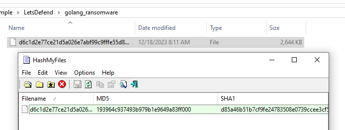

Easily done after extracted file, use whatever tool we want to calculate MD5 hash of this file.

```
193964c937493b979b1e9649a83ff000
```

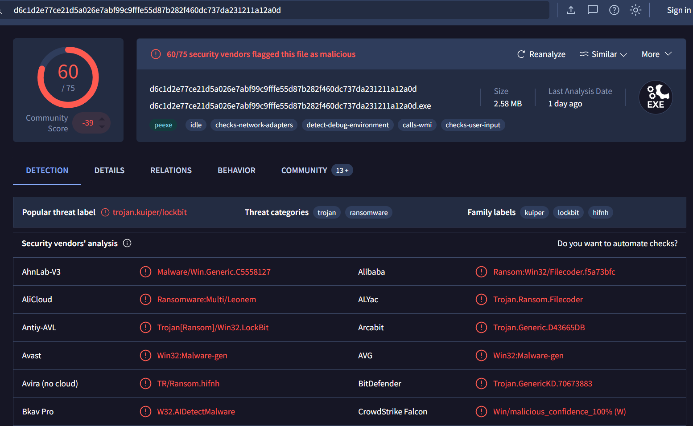

I also searched for this hash on VirusTotal which telling me that this golang malware is Kulper ransomware which I also searched for more details about this and found 1 [blog post](https://infosecwriteups.com/unfolding-kuiper-ransomware-07b88087caab) dedicated to this ransomware capabilities.

>How many sections are present in this sample?

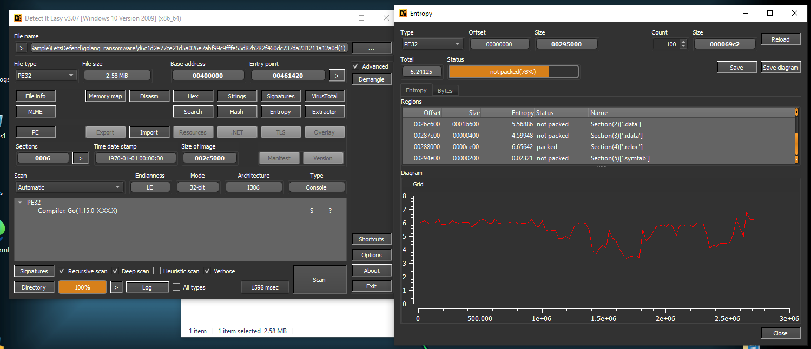

After I threw this ransomware to Detect It Easy then check for its entropy, we can see that there are 5 sections + PE header section so we have 6 sections in total.

```
6
```

>What code does the malware execute to kill the processes?

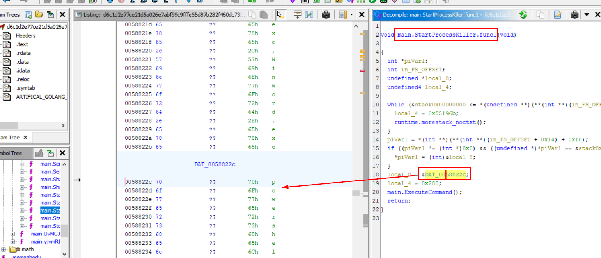

First I imported this file to Ghidra to decompile it which we can see that there are so many functions that responsible for Killing processes but I found that the function that responsible for the execution is `main.StartProcessKiller.func1()` with by passing that parameter to  `main.ExecuteCommand()` which we could see that it stores powershell command.

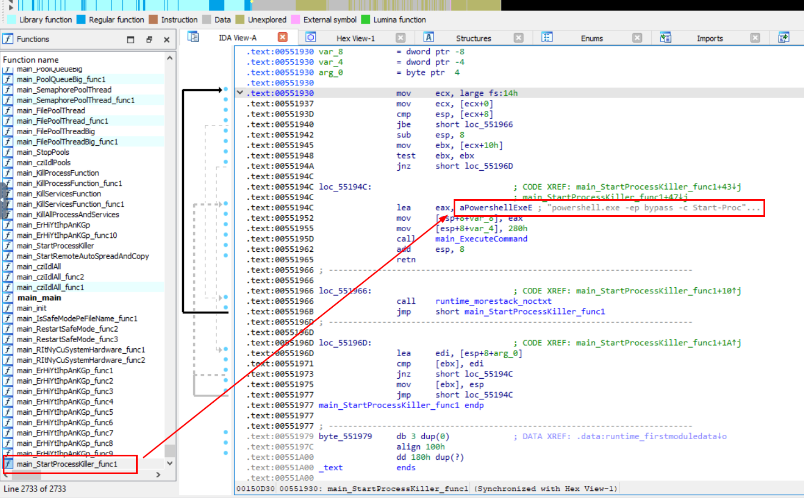

I shifted to IDA Freeware and go to the exact function for easier copy and replace, which we can see it in the same context that this function is loaded `aPowershellExeE` then execute it.

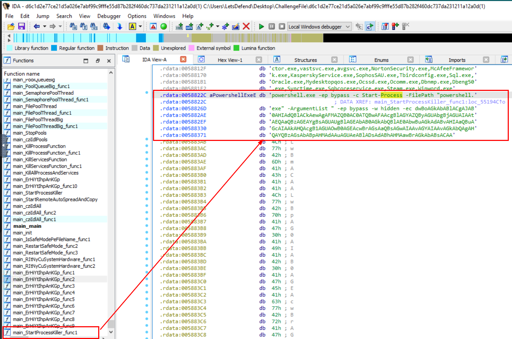

Double click that variable which will redirect us to `.rdata` (read-only data) section that stores full command that will be executed and look like its encoded with base64 so we will need one step to complete this question.

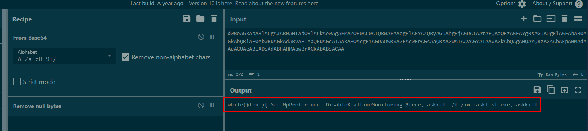

Decode base64 (if you're doing it in CyberChef then do not forget to remove null bytes) then we will have a code that will constantly looping to disable Windows Defender and kill `tasklist.exe` which is cmd utility to monitor process just like task explorer but without GUI.

```
while($true){ Set-MpPreference -DisableRealtimeMonitoring $true;taskkill /f /im tasklist.exe;taskkill 
```

>What is the first parameter of the OpenFile function in the function that grants the malware high privileges?

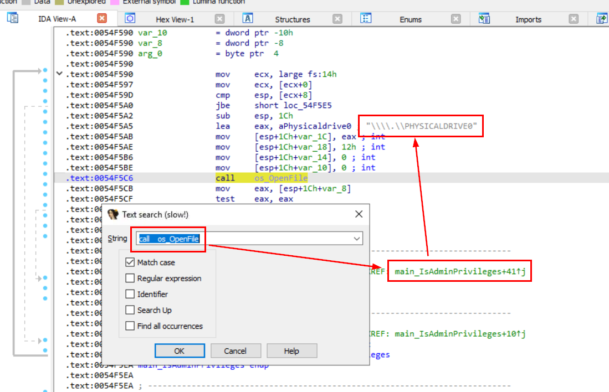

`OpenFile` is a Windows API function used to open files. Similarly, `call os_OpenFile` refers to a system call that interacts with the operating system to open files, which is commonly used in different contexts or environments for file access operations. so I searched for that and found `main_IsAdminPrivileges` function that responsible for this ransomware to obtain high privilege and the first parameter that was loaded is from `aPhysicaldrive0` variable.

```
\\\\.\\PHYSICALDRIVE0
```

>What is the name of the DLL used by the malware to disable Windows Defender?

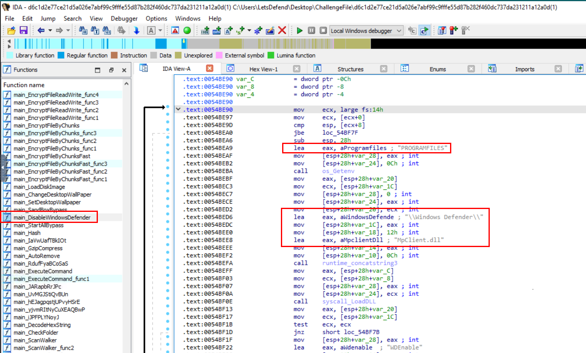

There is one function that was named dedicating to disable Windows Defender which is `main_DisableWindowsDefender` which we can see that it loaded Microsoft Defender DLL from known location to disable it.

```
MpClient.dll
```

>What is the decryption flag used by the malware?

This ransomware was known to use CHACHA20 algorithm to encrypt / decrypt file and its a symmetric key algorithm so we just need to find a key used for encryption.

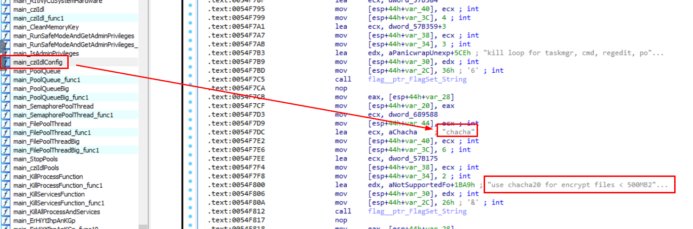

And as you can see that there is a function named `main_cziIdlConfig` that stores config / setting of this malware including encryption key right here. 

```
chacha
```

>What is the file name of the ransomware note?

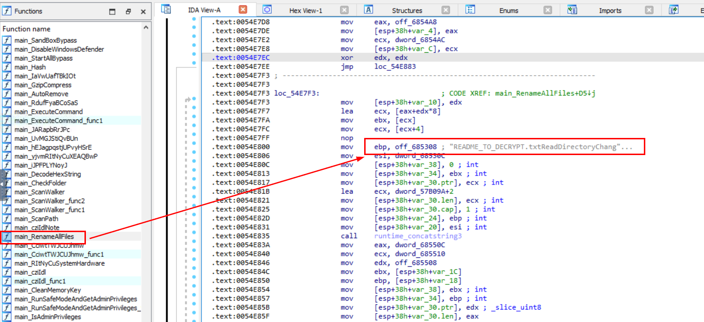

We can try search for string like `README` or an `.txt` extension since most ransomware shared the same name conversion when it comes to ransomnote. In my case, I found `main_RenameAFiles` function look very endearing so I inspected it and found ransomnote right here. 

```
README_TO_DECRYPT.txt
```

>What command can be executed by the "main_ErHiYtIhpAnKGp_func8" function?

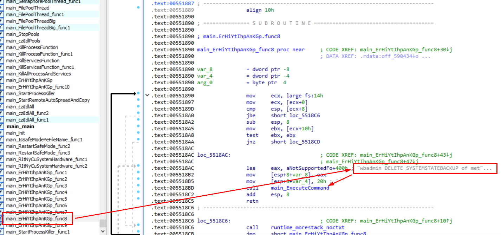

Go straight to this function which we will see a command that will be executed from this function right away right here, its a command to delete system state backup. (typical behavior of every new-gen ransomware) 

```
wbadmin DELETE SYSTEMSTATEBACKUP
```

***
## Summary
On this challenge, we investigated a Kulper ransomware which is written in golang and uncovered capabilities of this ransomware by go through some functions and take note of each commands, configurations and so on.

Read more about this ransomware here -> https://infosecwriteups.com/unfolding-kuiper-ransomware-07b88087caab
<div align=center>

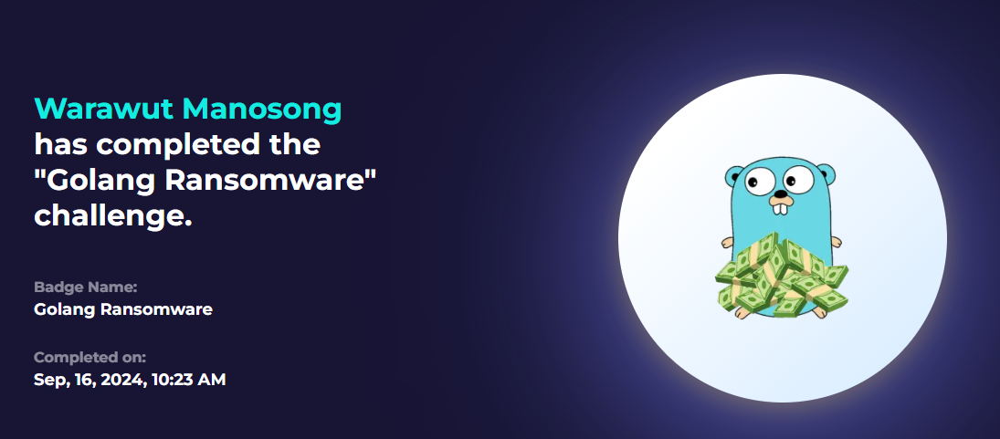
</div>

* * *
