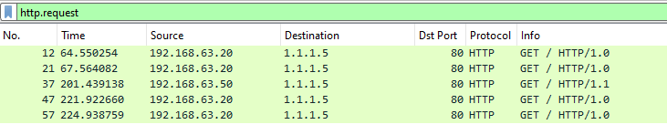
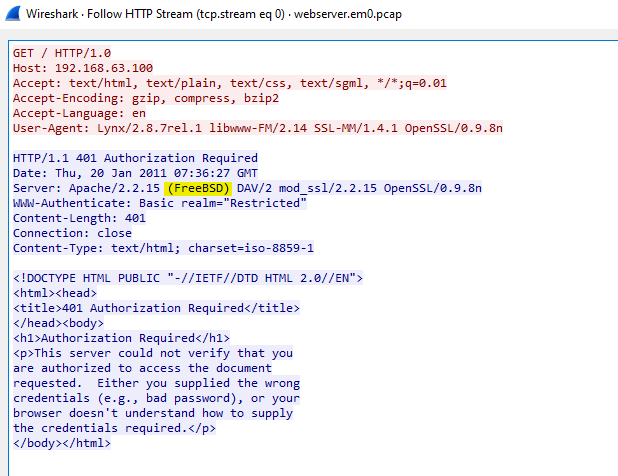
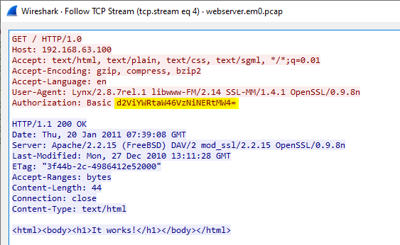
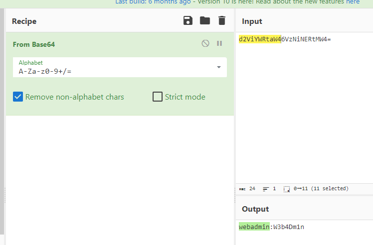
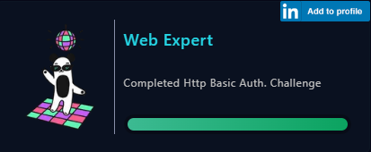

# [LetsDefend - Http Basic Auth](https://app.letsdefend.io/challenge/http-basic-auth)
Created: 26/01/2024 13:30
Last Updated: 05/06/2024 20:40
* * *
<div align=center>

**Http Basic Auth**

</div>
We receive a log indicating a possible attack, can you gather information from the .pcap file?

Log file: ~~.https://files-ld.s3.us-east-2.amazonaws.com/webserver.em0.zip Pass: 321~~ /root/Desktop/ChallengeFile/webserver.em0.pcap

Note: pcap file found public resources.
* * *
## Start Investigation
> How many HTTP GET requests are in pcap?
```
5
```
<div align=center>


</div>

> What is the server operating system?
```
FreeBSD
```
<div align=center>


</div>


> What is the name and version of the web server software?
```
Apache/2.2.15
```

> What is the version of OpenSSL running on the server?
```
OpenSSL/0.9.8n
```

> What is the client's user-agent information?
```
Lynx/2.8.7rel.1 libwww-FM/2.14 SSL-MM/1.4.1 OpenSSL/0.9.8n
```

> What is the username used for Basic Authentication?
```

```
<div align=center>



</div>

> What is the user password used for Basic Authentication?
```
W3b4Dm1n
```


* * *
## Summary
There is a basic authentication happened during in this pcap file.

<div align=center>


Badge Acquired
</div>

* * *